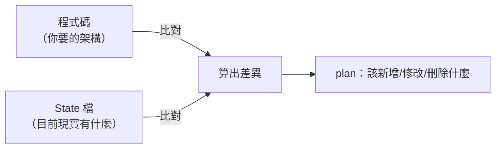
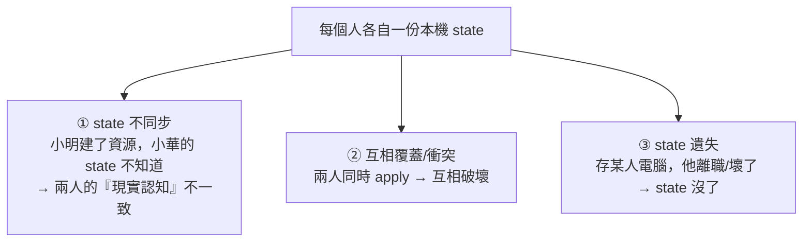
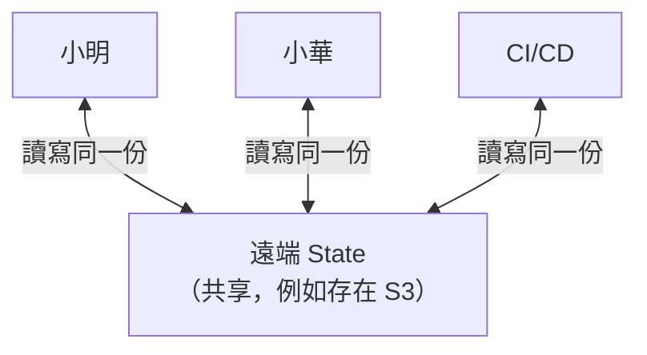

# [aws-9-4] Terraform State：多人協作時誰的狀態才對

> **本章目標**：理解 Terraform State 這個常被忽略卻至關重要的概念——它怎麼記錄「現實狀態」，以及多人協作時為什麼要用「遠端 state」。

## 你會學到

- Terraform State 是什麼、為什麼需要它
- 為什麼「本機 state」在多人協作時會出大問題
- 遠端 state（Remote State）的解法
- State Locking（狀態鎖定）防止衝突

## 概念說明

### Terraform 怎麼知道「現實是什麼」

aws-9-3 你用 Terraform 建了 VPC。但想一個問題：當你改程式碼、再 `terraform plan` 時，Terraform 怎麼知道「現實中已經有什麼、該改什麼」？

答案是 **State（狀態檔）**：

> **Terraform 用一個「state 檔」記錄「我建過哪些資源、它們現在的狀態」。每次 plan/apply，它比對「程式碼描述的（期望）」和「state 記錄的（現實）」，算出差異。**



State 是 Terraform 的「**記憶**」——沒有它，Terraform 不知道現實狀態，就無法正確算出該做什麼改動。

> 預設 `apply` 後，state 存在本機一個檔案 `terraform.tfstate`。

---

### 問題：本機 state 在多人協作時會爆炸

一個人玩、state 存本機，沒問題。但**團隊協作**時，本機 state 會出大問題：



具體說：

1. **不同步**：小明 apply 建了資源，他的本機 state 更新了；但小華的本機 state 還是舊的——小華 plan 時會以為「那些資源不存在」，可能重複建或誤刪。
2. **衝突**：兩人同時操作，state 互相覆蓋，現實和記錄對不上，一團亂。
3. **遺失風險**：state 只存某人電腦，那台壞了或人離職，state 就沒了——Terraform 失去「記憶」，後果嚴重。

而且 state 檔裡可能含**敏感資訊**（如資料庫密碼），存本機、進 Git 都不安全。

---

### 解法：遠端 State（Remote State）

解法是把 state 從「本機」搬到「**共享的遠端位置**」，讓團隊**共用同一份 state**：



最常見的做法：**把 state 存在 S3**（aws-5-1）。好處：

- **共享**：團隊（和 CI/CD，aws-9-1）都讀寫「同一份」state → 大家的「現實認知」一致。
- **安全**：存在受控的 S3（私有、加密），不會散落各電腦、不進 Git。
- **不遺失**：S3 耐用（11 個 9）、可開 versioning（aws-5-3）保留歷史。

這呼應 SRE/aws-3-4 的「無狀態」思維——把重要狀態存在「外部的、可靠的、共享的地方」，而不是綁在某個人的機器上。

---

### State Locking：防止同時操作衝突

光共享還不夠——如果小明和小華**同時** apply，還是會衝突（兩人同時改同一份 state）。解法是 **State Locking（狀態鎖定）**：

> **當有人在 apply 時，Terraform「鎖住」state，其他人要 apply 會被擋住、等他做完——確保「同一時間只有一個人在改」。**

用類比：像廁所的門鎖——有人在用就鎖上，別人得等。避免兩人同時進去。

實作上，用 S3 存 state，搭配 **DynamoDB**（AWS 的 NoSQL 資料庫）做鎖定——這是業界標準組合。設定好後，Terraform 自動處理鎖定，團隊就能安全協作。

---

### 完整的團隊 Terraform 設定

把這些串起來，一個專業團隊的 Terraform state 設定：

```hcl
# 設定遠端 state（存 S3 + DynamoDB 鎖定）
terraform {
  backend "s3" {
    bucket         = "my-terraform-state"      # state 存這個 S3 bucket
    key            = "prod/vpc.tfstate"        # state 檔的路徑
    region         = "ap-northeast-1"
    dynamodb_table = "terraform-locks"         # 用這個表做鎖定
    encrypt        = true                       # 加密（安全）
  }
}
```

設定這個「backend」後：

- state 存在 S3（共享、安全、不遺失）。
- 用 DynamoDB 鎖定（防止同時操作衝突）。
- 整個團隊 + CI/CD 共用同一份 state，安全協作。

這就是把 aws-9-3 的「一個人玩」升級成「**團隊專業協作**」的關鍵設定。

## 範例：本機 state vs 遠端 state

```
情境：3 人團隊一起管理正式環境的 Terraform

❌ 本機 state（各自一份）：
   - 小明 apply 建了新資源 → 只有他的 state 知道
   - 小華 plan → 他的舊 state 不知道那些資源
     → 可能想重複建、或誤判要刪除
   - 兩人同時 apply → state 互相覆蓋 → 現實大亂
   - 小明電腦壞了 → state 沒了 → 災難

✅ 遠端 state（S3 + DynamoDB 鎖定）：
   - 大家讀寫同一份 S3 上的 state → 認知一致
   - 小明在 apply → state 被鎖 → 小華要 apply 會被擋、等他做完
   - state 存 S3（加密、versioning）→ 不遺失、可回溯
   - CI/CD（aws-9-1）也用同一份 → 自動部署和人手動的一致
   → 安全、可靠的團隊協作
```

## 小練習

### 練習 1：State 是什麼

回答：Terraform 的 state 檔記錄什麼？為什麼 Terraform 需要它才能正確運作？

---

### 練習 2：本機 state 的問題

回答：團隊協作時，「每人一份本機 state」會造成哪些問題？（至少兩個）

---

### 練習 3：遠端 state 的解法

回答：

1. 把 state 存在 S3 解決了什麼問題？
2. State Locking（用 DynamoDB）又解決了什麼？用「廁所門鎖」比喻說明。

## 課外讀物

> 「把重要狀態存外部共享處」的思維，呼應 SRE 的無狀態設計 → 參見 **SRE 課程** Part 7-3；state 存 S3 用到 S3 versioning → 見同課程 `aws-5-3`
