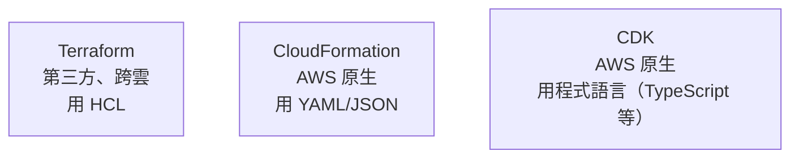
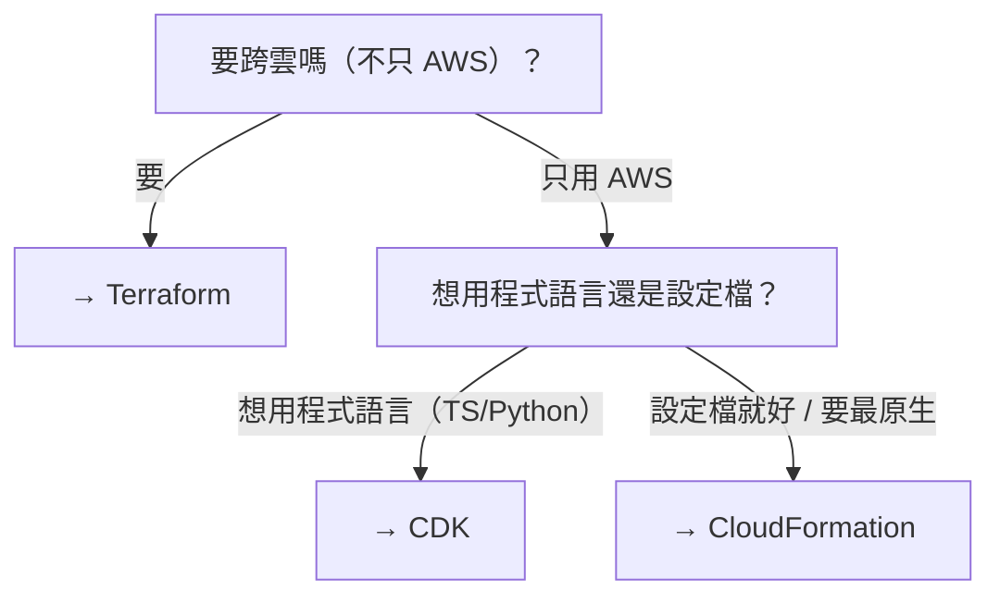

# [aws-9-5] CloudFormation 與 CDK：AWS 原生的 IaC

> **本章目標**：認識 AWS 原生的 IaC 工具——CloudFormation 和 CDK，知道它們和 Terraform 的差別，能依情況選擇。

## 你會學到

- CloudFormation 是什麼（AWS 原生 IaC）
- CDK 是什麼（用程式語言寫基礎設施）
- 它們和 Terraform 的差別
- 怎麼在這些 IaC 工具間選擇

## 概念說明

### AWS 自己的 IaC 工具

aws-9-3 你學了 Terraform。但 Terraform 是第三方（HashiCorp）的。AWS 自己也有 IaC 工具——**CloudFormation** 和 **CDK**。這章認識它們，並學會「該選哪個」。

三者都做同一件事（把基礎設施寫成程式碼，aws-9-2），但風格不同：



---

### CloudFormation：AWS 原生的 IaC

**CloudFormation** 是 **AWS 自己的 IaC 服務**——你寫 YAML（或 JSON）描述架構，CloudFormation 幫你建出來。

特點：

- **AWS 原生**：和 AWS 深度整合、AWS 官方支援、新服務通常第一時間支援。
- **用 YAML/JSON**：你已經很熟 YAML 了（Part 5/7/9）。
- **綁 AWS**：只能用在 AWS（不像 Terraform 跨雲）。

CloudFormation 的概念：

| 概念 | 是什麼 |
|------|--------|
| **Template（範本）** | 描述架構的 YAML/JSON 檔 |
| **Stack（堆疊）** | 用範本建出的一組資源（一起建、一起管、一起刪）|

一個 CloudFormation 範本片段（對比 aws-9-3 的 Terraform）：

```yaml
Resources:
  MyVPC:
    Type: AWS::EC2::VPC
    Properties:
      CidrBlock: 10.0.0.0/16
      Tags:
        - Key: Name
          Value: my-vpc
```

和 Terraform 一樣是「描述一個 VPC」，只是語法是 YAML。

---

### CDK：用「程式語言」寫基礎設施

**CDK（Cloud Development Kit）** 是更現代的選擇——它讓你**用真正的程式語言（TypeScript、Python、Java…）寫基礎設施**，背後再轉成 CloudFormation。

為什麼這很吸引人？因為——**你可以用熟悉的程式語言的全部能力**（迴圈、函式、條件、套件）來描述基礎設施，而不是寫靜態的 YAML/HCL：

```typescript
// CDK 用 TypeScript（你 basic 課程學過！）描述 VPC
const vpc = new ec2.Vpc(this, 'MyVPC', {
  cidr: '10.0.0.0/16',
  maxAzs: 2,                    // 跨 2 個 AZ（aws-4-7）
  subnetConfiguration: [
    { name: 'public', subnetType: ec2.SubnetType.PUBLIC },
    { name: 'private', subnetType: ec2.SubnetType.PRIVATE_WITH_EGRESS },
  ],
});
```

看——這是 **TypeScript**（你 basic Part 2 學過）！對會寫程式的人（像你），用熟悉的語言寫基礎設施，可以：

- 用迴圈建很多個類似的資源（不用複製貼上）。
- 用函式封裝、重用架構模式。
- 享受 IDE 自動完成、型別檢查。

而且 CDK 還幫你「**用較少的程式碼，做較多的事**」——上面那段 CDK，會自動幫你建好 VPC + 公開/私有子網路 + IGW + NAT + 路由表（aws-4 那一整套），比手寫 Terraform/CloudFormation 簡潔很多。

---

### 三者怎麼選



| 工具 | 選它的時機 |
|------|-----------|
| **Terraform** | 要跨雲、不綁 AWS、生態最大、業界最通用 |
| **CloudFormation** | 只用 AWS、要最原生、團隊偏好設定檔 |
| **CDK** | 只用 AWS、想用熟悉的程式語言、要程式邏輯的彈性 |

實務上：

- **Terraform** 最通用、最多公司用（尤其多雲或想保持彈性）。
- **CDK** 對「會寫程式、只用 AWS」的團隊很有吸引力（像你這種有程式基礎的）。
- **CloudFormation** 是 AWS 最底層的（CDK 也是轉成它），純用它的人相對少，但它是 AWS 原生的基礎。

> 又是個取捨（呼應整個課程的取捨思維）——沒有絕對的對錯，依「是否跨雲、團隊偏好、是否想用程式語言」選。重點是「**用某種 IaC**」（aws-9-2），而不是手動點 Console。

---

### 它們的共通點才是重點

雖然三者語法/風格不同，但**核心理念完全一致**（aws-9-2、infra Part 6）：

- 把基礎設施寫成**程式碼**（不手動點 Console）。
- **宣告式**——描述要什麼，工具算出怎麼做。
- 可**版本控制**、可**重現**、可**多環境**、可**災難復原**。
- 都有「**先預覽再執行**」的安全機制（Terraform 的 plan、CloudFormation 的 change set）。

所以你 aws-9-3 學的 Terraform 概念（plan/apply、宣告式、state），換到 CloudFormation/CDK 也通用——**學會一個，其他很快上手**。重點是掌握「IaC 的思維」，工具只是載體。

## 小練習

### 練習 1：三者的差別

用一句話分別說明 Terraform、CloudFormation、CDK 的特點（跨雲？原生？用什麼寫？）。

---

### 練習 2：CDK 的吸引力

回答：CDK 讓你「用程式語言寫基礎設施」，這對會寫程式的人有什麼好處？（至少兩個，提示：迴圈、函式、型別…）

---

### 練習 3：選工具

下面的團隊該選哪個 IaC 工具？說明理由：

1. 一個用多家雲（AWS + GCP）的公司
2. 一個只用 AWS、團隊都熟 TypeScript、想要程式邏輯彈性的團隊
3. 任何「不想手動點 Console」的團隊——它們的共通目標是什麼？

## 課外讀物

> CDK 用 TypeScript 寫基礎設施，正好用上你 basic 課程的 TypeScript 能力 → 參見 **basic 課程** Part 2（TypeScript 核心）
