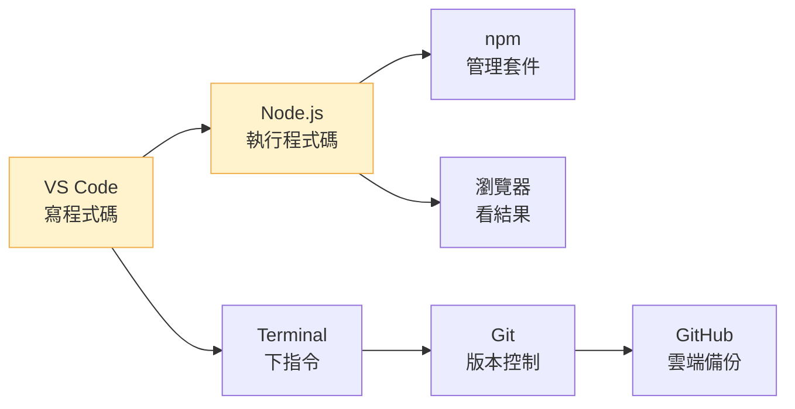

# [0-1] 開發環境全景圖

> **本章目標**：用最快的速度讓你的電腦可以寫程式，在這章結束前你會執行第一行程式碼。

## 你會學到

- 開發網站需要哪些工具，以及安裝順序
- 安裝 VS Code 與 Node.js
- 執行你人生第一行程式碼

---

## 概念說明

### 你只需要兩個東西就能開始

```
VS Code    → 寫程式碼的地方（像 Word，但專門給程式用）
Node.js    → 執行程式碼的引擎（讓你的電腦看得懂 JavaScript）
```

其他工具（Git、GitHub、npm 的細節）之後會一一介紹。先讓你動起來。

---

### 工具全景（先有個印象就好）



黃色的兩個是今天要裝的。其他的後面幾章再處理。

---

## 安裝步驟

### 第一步：安裝 VS Code

前往 [https://code.visualstudio.com](https://code.visualstudio.com) 下載並安裝。

安裝完成後打開，你會看到這個畫面：

```
Welcome
  Start
    New File...
    Open Folder...
```

先不用管其他設定，下一章 (0-2) 會帶你把 VS Code 調整到最適合寫程式的狀態。

---

### 第二步：安裝 Node.js

前往 [https://nodejs.org](https://nodejs.org)，下載 **LTS 版本**（左邊那個，標示「Recommended For Most Users」）。

安裝完成後，打開 Terminal 驗證是否成功：

```bash
node --version
```

如果看到版本號（例如 `v22.0.0`），代表安裝成功。

> 不知道怎麼開 Terminal？按 `Cmd + Space`，輸入 `Terminal`，按 Enter。
> 想深入了解 Terminal 是什麼 → [課外讀物 E-1-1：Terminal 是什麼？](../../../課外讀物/E-1-terminal/E-1-1-what-is-terminal.md)

---

## 你的第一行程式碼

### 建立第一個檔案

1. 打開 VS Code
2. 按 `Cmd + N` 建立新檔案
3. 按 `Cmd + S` 儲存，檔名取為 `hello.js`
4. 輸入以下程式碼：

```javascript
console.log("Hello, World!")
```

### 執行它

打開 Terminal，輸入：

```bash
node hello.js
```

你應該會看到：

```
Hello, World!
```

**恭喜。你剛才執行了第一行程式碼。**

---

### 發生了什麼？

```
你寫的文字（hello.js）
        ↓
  node 指令讀取它
        ↓
  Node.js 執行它
        ↓
  印出 "Hello, World!"
```

`console.log()` 是「把東西印出來」的指令。這是每個工程師第一個學的東西，也是除錯時最常用的工具之一。

---

## 小練習

1. 把 `"Hello, World!"` 改成你自己的名字，再執行一次
2. 試著在第二行加上 `console.log("我開始學程式了")`，看看會發生什麼事
3. 故意把 `console.log` 拼錯成 `consle.log`，看看錯誤訊息長什麼樣子——習慣看錯誤訊息很重要

---

## 接下來

你現在有了 VS Code 和 Node.js，可以執行程式碼了。

接下來幾章會陸續補齊其他工具：
- **0-2**：把 VS Code 設定成最順手的狀態
- **0-3**：深入了解 Node.js 與 npm
- **0-4 ~ 0-6**：Git 與 GitHub，讓你的程式碼有備份、有歷史
