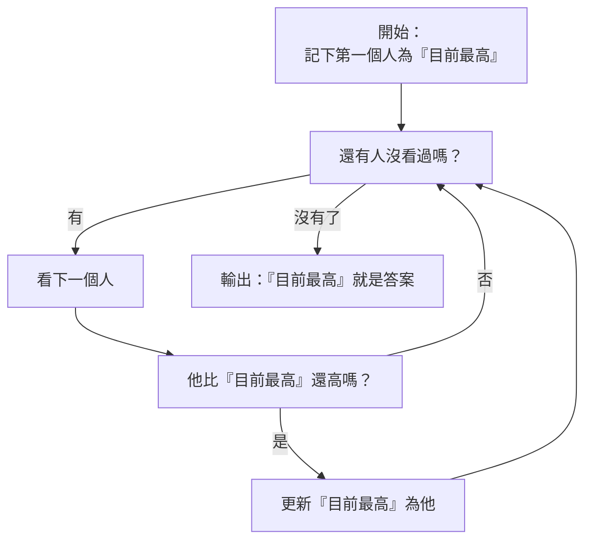

# [1-2] 什麼是演算法？用生活例子理解

> **本章目標**：理解演算法的本質，學會在寫程式碼之前先用 pseudo code 設計解題步驟。

## 你會學到

- 演算法（Algorithm）的定義和四個關鍵特性
- 用泡麵說明書理解「演算法就在生活中」
- 如何用 pseudo code 設計解題步驟
- 為什麼「先想清楚，再寫程式碼」比直接開始打字更重要

## 概念說明

### 演算法聽起來很難，其實你每天都在用

「演算法」這個詞聽起來很學術、很高深，好像是數學家才會討論的東西。

但其實你家裡一定有演算法——就貼在泡麵的包裝上。

```
【泡麵說明書】
1. 把 500ml 的水倒入鍋中，加熱至沸騰
2. 將麵餅放入滾水中，煮 3 分鐘
3. 加入醬包，攪拌均勻
4. 盛入碗中，即可食用
```

這就是一個演算法。它告訴你「如何把生麵條變成一碗熱騰騰的泡麵」的步驟。

**演算法（Algorithm）的正式定義：解決某個問題的一組明確、有限、可執行的步驟。**

---

### 一個好的演算法有四個特性

用泡麵說明書來對照：

| 特性 | 說明 | 泡麵例子 |
|------|------|---------|
| **有明確的開始和結束** | 不能是無限流程，要知道從哪裡開始、到哪裡算完 | 從「倒水」開始，到「盛入碗中」結束 |
| **每個步驟都很清楚** | 不能有模糊地帶，不能讓人猜 | "煮 3 分鐘"很清楚，而不是"煮到差不多" |
| **一定會結束** | 不會跑到天荒地老 | 照著步驟做完就結束了 |
| **有輸入，有輸出** | 從某個東西出發，得到某個結果 | 輸入：生麵條和水；輸出：一碗泡麵 |

如果說明書寫著「煮到你覺得熟了為止」——這就是一個**糟糕的演算法**，因為步驟不夠明確。

---

### 另一個例子：找出一群人中最高的人

假設你去參加一個派對，要找出在場最高的人。你的大腦其實在執行這個演算法：

```
// 輸入：一群人
// 輸出：其中最高的那個人

暫時記住第一個人，稱他為「目前最高的人」
對剩下的每一個人：
    比較他和「目前最高的人」
    如果他比「目前最高的人」高：
        更新「目前最高的人」為他
最後，「目前最高的人」就是答案
```

這個過程你可能從來沒意識到，但你的眼睛和大腦就是這樣在執行的。

---

### 用流程圖看清楚這個演算法



這張圖讀起來和上面的 pseudo code 是一模一樣的邏輯——只是換了一種視覺化方式。

注意圖裡有一個往回走的箭頭，那代表**重複**。演算法經常需要重複一段步驟，直到達成某個條件。

---

### 演算法和程式碼的關係

很多人學程式碼的方式是：看到題目 → 直接開始打程式碼 → 打到一半發現思路不對 → 刪掉重來。

更好的方式是：**先設計演算法，再翻譯成程式碼**。

```
問題（需要解決的事）
    ↓
演算法（用人類語言設計步驟）
    ↓
程式碼（把演算法翻譯成電腦聽得懂的語言）
```

程式碼只是「翻譯」。演算法才是靈魂。

---

### 演算法的效率也有好壞之分

同一個問題，可以有很多種演算法解法。

比如「找出最高的人」，還有另一種做法：

```
把所有人從高到矮排好
第一個就是最高的
```

兩種方法都能找到答案，但效率不同。把人排好序需要更多時間，而直接掃一遍反而更快。

這就是「演算法複雜度」的概念——你以後學到搜尋、排序演算法時會深入研究這件事。現在只需要知道：**同樣的問題，好的演算法比壞的演算法快很多很多倍**。

## 程式碼範例

### 「找最高的人」演算法，用 JavaScript 實作

這段程式碼直接把上面的 pseudo code 翻譯成 JavaScript。你會發現它們的結構幾乎一樣。

```javascript
// 輸入：一個存有身高資料的陣列
const heights = [172, 165, 180, 158, 175, 183, 169];

// 步驟 1：先記住第一個，假設他是「目前最高」
let tallestHeight = heights[0];

// 步驟 2：從第二個開始，逐一比較
for (let i = 1; i < heights.length; i++) {
  const currentHeight = heights[i];

  // 步驟 3：如果找到更高的，就更新紀錄
  if (currentHeight > tallestHeight) {
    tallestHeight = currentHeight;
  }
}

// 步驟 4：迴圈結束，tallestHeight 就是答案
console.log(`最高的身高是：${tallestHeight}cm`);
// 輸出：最高的身高是：183cm
```

對照 pseudo code 看這段程式碼：
- `let tallestHeight = heights[0]` → 「記住第一個人為目前最高」
- `for (let i = 1; ...)` → 「對剩下的每一個人」
- `if (currentHeight > tallestHeight)` → 「如果他比目前最高還高」
- `tallestHeight = currentHeight` → 「更新目前最高為他」

每一行都有對應，不是魔法，只是翻譯。

## 小練習

### 練習 1：電話簿搜尋演算法

一本已經按照姓名排好序的電話簿（A、B、C……Z 排列），你要找「王小明」。

試著用 pseudo code 寫出你的搜尋步驟。

> 提示：你真的會從第一頁開始翻嗎？還是有更聰明的做法？（想想你實際上會怎麼翻電話簿）

---

### 練習 2：猜數字遊戲演算法

電腦在 1 到 100 之間想了一個數字，你要猜是哪個。每次猜完，電腦會告訴你「猜太大」、「猜太小」或「猜對了」。

用 pseudo code 寫出你的猜法策略。

問題一：如果你每次都從 1 開始猜，最糟的情況要猜幾次？

問題二：有沒有更聰明的策略，讓你最多只需要猜 7 次？（提示：每次猜中間值會發生什麼事？）

---

### 練習 3：分析你的早晨例行公事

想想你今天早上出門前做了什麼事，把它寫成演算法（pseudo code）。

重點：找出其中的**判斷**和**重複**。

> 例如：「如果外面下雨 → 帶雨傘」是判斷；「刷牙直到刷滿兩分鐘」是重複。

你的早晨演算法可能比你想像的複雜許多！
