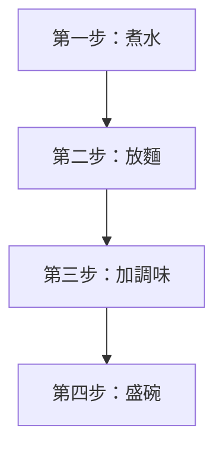
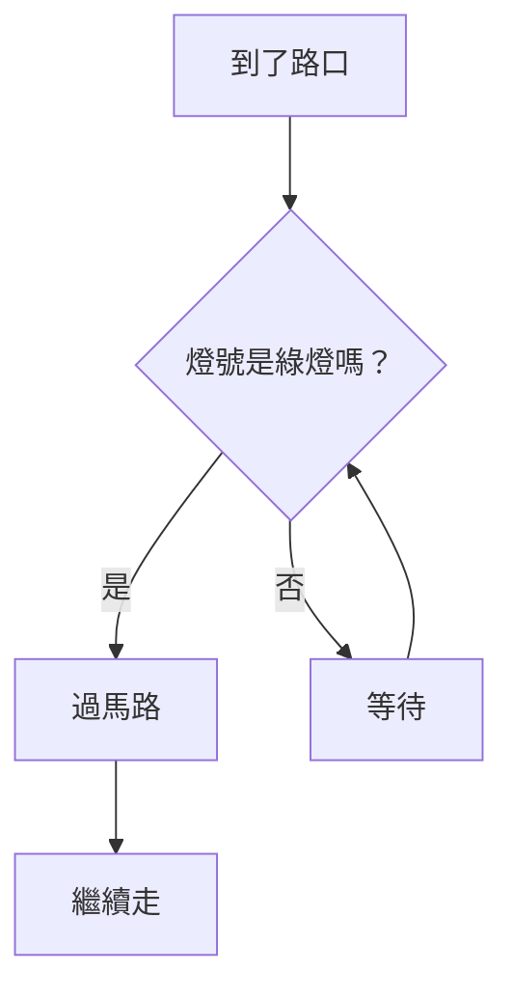
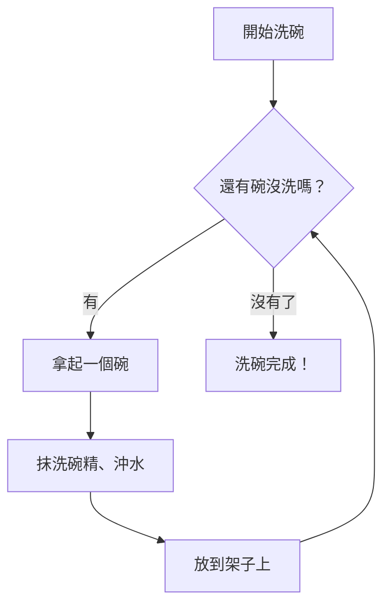

# [1-3] 程式的三種基本結構：循序、判斷、迴圈

> **本章目標**：理解所有程式都是由「循序、判斷、迴圈」三種結構組成，並能在生活中找到它們的影子。

## 你會學到

- 循序（Sequence）：電腦一行一行往下執行的基本方式
- 判斷（Selection）：根據條件決定走哪條路
- 迴圈（Iteration）：重複做同一件事，直到條件滿足
- 三種結構如何組合使用，解決更複雜的問題

## 概念說明

### 一個讓人震驚的事實

1966 年，兩位電腦科學家 Böhm 和 Jacopini 在數學上證明了一件事：

**所有電腦程式，不管多複雜，都可以只用三種結構寫出來。**

這三種結構就是：循序、判斷、迴圈。

Google 的搜尋引擎、Netflix 的推薦系統、LINE 的訊息傳送，底層都是這三件事的排列組合。這不是誇張，是數學上的事實。

---

### 第一種：循序（Sequence）

**循序**就是最自然的執行方式：從上到下，一行一行執行，沒有分岔。

生活類比：跟著食譜做菜。

```
第一步：把水煮開
第二步：放入麵
第三步：加入調味包
第四步：盛入碗中
```

沒有判斷，沒有重複，就是一步接著一步。



這張圖表達的就是純粹的循序：箭頭一路往下，沒有分叉。

---

### 第二種：判斷（Selection）

**判斷**讓程式可以根據不同的條件，走不同的路。

生活類比：站在路口看紅綠燈。

```
如果 燈號是綠燈：
    過馬路
否則：
    等待
```

判斷的核心是「**如果……就……否則……**」這個句型。在程式碼裡，這就是 `if / else`。



注意菱形（◇）代表的是**判斷點**，箭頭從菱形出來有兩條路：條件成立走一邊，不成立走另一邊。

---

### 第三種：迴圈（Iteration）

**迴圈**讓程式可以重複執行同一段步驟，直到某個條件滿足為止。

生活類比：洗碗。

```
只要 還有碗沒洗：
    拿起一個碗
    抹洗碗精
    用水沖乾淨
    放到架子上
```

不管有幾個碗，你都用同樣的步驟處理，直到全部洗完。



注意這張圖有個往回走的箭頭——這就是迴圈的關鍵，它讓程式「轉回去重做」。

---

### 三種結構的比較

| 結構 | 何時使用 | 生活類比 | 程式碼關鍵字 |
|------|---------|---------|------------|
| 循序 | 步驟有先後順序，一個接一個 | 照食譜做菜 | 直接寫 |
| 判斷 | 根據條件決定要不要做 | 紅綠燈 | `if` / `else` |
| 迴圈 | 要重複做某件事 | 洗碗 | `for` / `while` |

---

### 三種結構可以組合

真實的程式通常三種結構混在一起用。

舉個例子：「從一串數字中，找出所有偶數」

```
// 輸入：一串數字
// 輸出：只有偶數的那些

對 每一個數字 做：               ← 迴圈
    如果 這個數字能被 2 整除：   ← 判斷
        把它印出來               ← 循序
```

這個小小的例子就用了三種結構。

## 程式碼範例

### 循序：最基本的執行方式

這段程式碼展示純粹的循序結構——電腦從第一行執行到最後一行，不跳過、不重複。

```javascript
// 純粹的循序結構
console.log("步驟一：起床");
console.log("步驟二：刷牙");
console.log("步驟三：吃早餐");
console.log("步驟四：出門");
```

輸出：
```
步驟一：起床
步驟二：刷牙
步驟三：吃早餐
步驟四：出門
```

---

### 判斷：if / else

這段程式碼根據天氣決定要不要帶雨傘——如果條件成立走一條路，不成立走另一條。

```javascript
const isRaining = true; // 資料：現在下雨嗎？

// 判斷結構：根據條件決定做什麼
if (isRaining) {
  console.log("帶雨傘！");
} else {
  console.log("不用帶傘，今天放晴。");
}
```

把 `isRaining` 改成 `false` 再跑看看，輸出會不一樣。

---

### 迴圈：for loop

這段程式碼從 1 數到 5——不需要寫 5 行 `console.log`，一個迴圈就搞定。

```javascript
// 迴圈結構：重複執行 5 次
for (let count = 1; count <= 5; count++) {
  console.log(`現在數到：${count}`);
}
```

輸出：
```
現在數到：1
現在數到：2
現在數到：3
現在數到：4
現在數到：5
```

`for` 迴圈有三個部分：
- `let count = 1`：從哪裡開始
- `count <= 5`：什麼時候停
- `count++`：每次怎麼往前進

---

### 組合使用：找出陣列中所有偶數

這段程式碼組合了迴圈和判斷，完成「找出所有偶數」這個任務。

```javascript
const numbers = [1, 2, 3, 4, 5, 6, 7, 8, 9, 10];
const evenNumbers = [];

// 迴圈：對每個數字都做一次檢查
for (let i = 0; i < numbers.length; i++) {
  const currentNumber = numbers[i];

  // 判斷：如果是偶數（除以 2 餘數為 0）
  if (currentNumber % 2 === 0) {
    // 循序：加入結果清單
    evenNumbers.push(currentNumber);
  }
}

console.log("偶數有：", evenNumbers);
// 輸出：偶數有：[2, 4, 6, 8, 10]
```

對照 pseudo code 看這段程式碼，結構完全一致。這就是「先設計，再翻譯」的威力。

## 小練習

### 練習 1：在生活中找三種結構

從你今天做過的事情裡，各舉一個例子：

1. **循序**：哪件事是一步接一步，中間不需要做任何判斷或重複？
2. **判斷**：哪件事是根據某個條件決定要怎麼做？
3. **迴圈**：哪件事是重複做同樣的動作，直到某個條件滿足？

> 提示：煮咖啡？搭捷運？挑衣服？都可以分析。

---

### 練習 2：分析 ATM 提款流程

把 ATM 提款的完整流程用 pseudo code 寫出來，並且標出哪些地方用了「循序」、「判斷」、「迴圈」。

開頭可以這樣寫：

```
插入金融卡               ← 循序
輸入密碼
如果 密碼正確：          ← 判斷
    繼續操作
否則：
    如果 已輸入錯誤 3 次： ← 判斷
        鎖卡
    否則：
        重新輸入密碼      ← 迴圈（再試一次）
...
```

試著把後面的流程補完整。

---

### 練習 3（挑戰）：自動販賣機邏輯

用 pseudo code 寫出一台自動販賣機的完整邏輯，包含：

- 顯示商品和價格
- 使用者投入硬幣
- 使用者選擇商品
- 判斷錢夠不夠
- 找零
- 退出商品

提示：這個問題會用到很多「判斷」，也會有「重複投幣」的迴圈。別擔心寫得不夠完美，重點是試著把邏輯想清楚。
