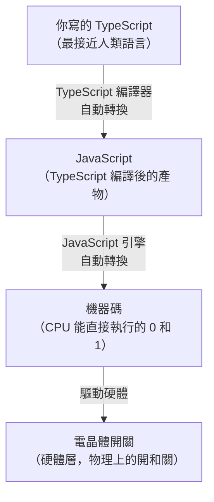
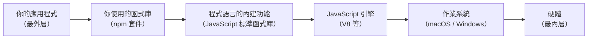

# [1-4] 什麼是「抽象化」？為什麼工程師一直在做這件事

> **本章目標**：理解抽象化的概念，以及為什麼它是管理程式複雜度最重要的工具。

## 你會學到

- 什麼是抽象化（Abstraction），用生活例子說明
- 程式語言的「層次」：從電晶體到 TypeScript
- 函式（Function）如何讓你「隱藏細節、只看重點」
- 為什麼抽象化是工程師最核心的思考方式
- 「太多層抽象」也可能是問題

## 概念說明

### 你每天都在用抽象化，只是沒意識到

你有沒有想過，你根本不需要知道引擎的運作方式，就能開車？

不需要知道 CPU 是什麼，就能用手機傳訊息？

不需要知道電流怎麼流，就能開燈？

這就是**抽象化（Abstraction）**——把複雜的細節藏起來，只露出你「這個層次」需要知道的部分。

```
你開車時看到的世界：
    方向盤、油門、煞車、排檔
    ← 這就是「開車」這個層次需要的介面

藏在方向盤下面的世界：
    轉向拉桿、液壓系統、輪胎幾何結構
    ← 你不需要知道這些，才能開車

藏得更深的：
    金屬冶金、橡膠化合物、電磁感應
    ← 更不需要知道
```

抽象化讓你可以在「你關心的層次」工作，而不需要同時應付所有細節。

---

### 程式語言也有層次

程式語言本身就是一層一層的抽象化堆疊起來的。



這張圖說明：你寫的每一行 TypeScript，最終都會經過好幾層「翻譯」，才變成電晶體的開關。

你不需要理解那些翻譯怎麼做——那是程式語言設計師的工作。你的工作是在 TypeScript 這個層次思考。

---

### 函式（Function）是最常見的抽象化工具

在程式裡，「函式」就是抽象化最直接的體現。

想像你要泡茶，步驟很多：

```
燒水：
    拿壺
    裝水到壺裡
    放到瓦斯爐上
    開火
    等水沸騰
    關火

泡茶：
    把茶葉放入茶壺
    把滾水倒入茶壺
    等待 3 分鐘
    過濾

加糖：
    量 10g 的糖
    加入茶杯
    攪拌均勻
```

每次你想泡茶，都要在腦子裡走過這 12 個步驟嗎？

當然不用——你的大腦把這些步驟包成一個「泡茶」的動作，你只需要說「去泡茶」，細節就自動搞定了。

函式做的是一樣的事：**把一堆步驟包成一個名字，需要的時候只要呼叫那個名字。**

```
// 高層（你的視角）
泡一杯茶()

// 低層（函式內部的細節）
泡一杯茶() 的定義：
    燒水()
    放入茶葉()
    等待(3 分鐘)
    過濾()
    加糖()
```

在高層呼叫 `泡一杯茶()`，不需要知道裡面有幾個步驟。這就是函式帶來的抽象化。

---

### 抽象化層次圖（洋蔥模型）



當你寫 `console.log("Hello")` 時，你其實是在啟動一個連鎖反應：

1. JavaScript 引擎解讀 `console.log`
2. 呼叫作業系統的「輸出文字」功能
3. 作業系統指揮顯示卡
4. 顯示卡點亮螢幕上對應的像素

你只看到第 1 步。其他幾步都被抽象化藏起來了。

---

### `npm install` 就是在安裝別人的抽象化

當你執行 `npm install dayjs` 安裝一個處理日期的套件時，你得到的是什麼？

你得到了 10,000 行以上的程式碼，處理了各種奇怪的時區問題、閏年計算、語言格式化……

但你不需要知道這些。你只需要寫：

```javascript
dayjs().format("YYYY-MM-DD")
```

這一行就搞定了。這就是抽象化的威力——站在別人的肩膀上，不用從頭開始。

## 程式碼範例

### 沒有抽象化 vs. 有抽象化

這段程式碼示範兩種方式完成同樣的事，感受一下差距。

**沒有抽象化（所有細節擠在一起）：**

```javascript
// 要泡三杯茶，每次都把所有步驟寫一遍
console.log("燒水");
console.log("放入茶葉 5g");
console.log("等待 3 分鐘");
console.log("過濾");
console.log("加糖 10g");
console.log("---");
console.log("燒水");
console.log("放入茶葉 5g");
console.log("等待 3 分鐘");
console.log("過濾");
console.log("加糖 10g");
console.log("---");
console.log("燒水");
console.log("放入茶葉 5g");
console.log("等待 3 分鐘");
console.log("過濾");
console.log("加糖 10g");
```

**有抽象化（把步驟包成函式，只寫一次）：**

```javascript
// 定義抽象化：把「泡茶的步驟」包成一個函式
function brewTea(teaAmountInGrams, sugarAmountInGrams) {
  console.log("燒水");
  console.log(`放入茶葉 ${teaAmountInGrams}g`);
  console.log("等待 3 分鐘");
  console.log("過濾");
  console.log(`加糖 ${sugarAmountInGrams}g`);
}

// 使用抽象化：三行就搞定三杯茶
brewTea(5, 10);
console.log("---");
brewTea(5, 10);
console.log("---");
brewTea(5, 10);
```

兩段程式碼的輸出完全一樣，但第二段：
- 細節只寫了一次（如果步驟要改，只改一個地方）
- 呼叫時清楚表達「意圖」（`brewTea` 比一堆 `console.log` 更好懂）
- 可以輕鬆調整參數（`brewTea(3, 0)` 泡淡茶不加糖）

---

### 多層抽象化：建構更複雜的功能

這段程式碼展示如何把小的函式組合成更大的函式，一層一層堆疊。

```javascript
// 第一層抽象：最基本的動作
function boilWater() {
  console.log("把水燒開");
}

function addIngredient(ingredientName, amountInGrams) {
  console.log(`加入 ${ingredientName} ${amountInGrams}g`);
}

function waitMinutes(minutes) {
  console.log(`等待 ${minutes} 分鐘`);
}

// 第二層抽象：用第一層的函式組合出「泡茶」
function brewTea() {
  boilWater();
  addIngredient("茶葉", 5);
  waitMinutes(3);
  console.log("過濾茶葉");
}

// 第二層抽象：組合出「準備甜點」
function prepareSnack() {
  addIngredient("餅乾", 30);
  console.log("擺盤");
}

// 第三層抽象：「招待客人」直接用第二層的東西
function hostGuest(guestName) {
  console.log(`${guestName} 來了，開始準備...`);
  brewTea();
  prepareSnack();
  console.log("招待完成！");
}

// 呼叫最高層的抽象，一行搞定所有細節
hostGuest("小明");
```

`hostGuest("小明")` 這一行背後，藏著好幾個函式的呼叫。這就是抽象化讓複雜系統變得可以管理的方式。

> 這裡的函式拆分方式，正是 Single Responsibility Principle（單一職責原則）的體現 → **[課外讀物 E-7-2] S — Single Responsibility Principle**

## 小練習

### 練習 1：找出你今天用過的抽象化

列出今天你用過的 3 個「抽象化」，格式如下：

| 你做的事 | 被隱藏的細節 |
|---------|------------|
| 用 LINE 傳訊息 | 訊號如何透過基地台傳輸、伺服器如何儲存、對方手機如何接收 |
| ??? | ??? |
| ??? | ??? |

生活中、程式裡都算。

---

### 練習 2：用函式寫出「泡泡麵」

把以下泡麵步驟，用 JavaScript 函式的方式組織起來：

1. 撕開包裝
2. 把麵餅放入碗中
3. 倒入醬包
4. 加入 500ml 熱水
5. 蓋上蓋子等 3 分鐘
6. 攪拌均勻

要求：
- 至少定義 2 個以上的小函式
- 再定義一個 `makeCupNoodle()` 函式，在裡面呼叫那些小函式
- 最後只需要呼叫 `makeCupNoodle()` 就能完成所有步驟

---

### 練習 3（思考題）：太多層抽象的問題是什麼？

你有沒有遇過這種情況：找某個電話號碼，打過去是轉接，轉接又轉接，轉了三次還找不到真正能幫你的人？

想一想：程式裡的「太多層抽象」會造成什麼類似的問題？

> 提示：當程式出現 bug，你要怎麼找到問題出在哪一層？如果有 10 層抽象，追蹤起來容易嗎？
