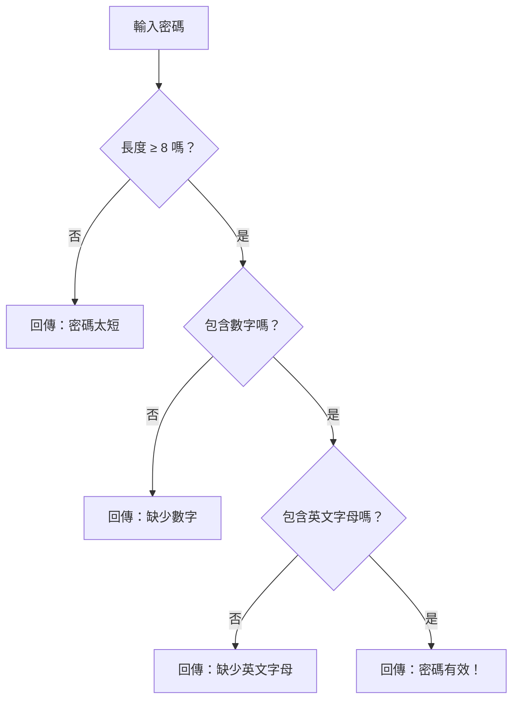

# [1-5] 從需求到程式碼的旅程

> **本章目標**：學會在動手寫程式碼之前，先用「需求 → 設計 → 實作 → 測試」四個步驟把問題想清楚。

## 你會學到

- 為什麼「直接開始打程式碼」通常是個壞主意
- 需求、設計、實作、測試各自代表什麼
- 用一個完整範例（密碼驗證器）走過全部四個步驟
- 如何讓 pseudo code 和程式碼「一一對應」

## 概念說明

### 先蓋房子，還是先畫設計圖？

如果你要蓋一棟房子，你會怎麼開始？

A. 直接叫工人開始敲牆、鋪磚  
B. 先讓建築師畫設計圖，確認沒問題後再動工

當然是 B。沒有人會在沒有設計圖的情況下蓋房子——那會造成大量浪費，甚至最後蓋出來根本不是你要的東西。

但是，很多剛學程式的人卻習慣直接跳進去打程式碼。

```
常見的糟糕流程：
看到題目 → 直接打程式碼 → 跑起來發現不對 → 改了又改 → 越改越亂 → 放棄或重來
```

有更好的做法：

```
正確的流程：
需求（弄清楚要做什麼）
  ↓
設計（想清楚怎麼做）
  ↓
實作（把設計翻譯成程式碼）
  ↓
測試（確認做對了沒有）
```

這四個步驟不只是大公司才用，個人小專案也一樣適用——只是有些步驟可以快一點。

---

### 四個步驟分別是什麼？

**需求（Requirement）**：用人話說清楚「這個程式要做什麼」。

> 不寫程式碼，只用文字描述。重點是讓你和未來的自己，都能清楚知道「完成」長什麼樣子。

**設計（Design）**：用 pseudo code 或流程圖，把解法的邏輯畫出來。

> 還不是真正的程式碼。這一步是在想清楚「怎麼做」，不是在想「程式語言怎麼寫」。

**實作（Implementation）**：把設計翻譯成真正的程式碼。

> 如果設計做得好，這一步其實相對機械——幾乎就是照著設計翻譯。

**測試（Testing）**：用真實的輸入試試看，確認程式的行為符合需求。

> 測試不是在「找 bug」，而是在「確認你真的做對了」。

---

### 完整範例：密碼驗證器

我們用一個真實的例子，一步一步走過這四個階段。

#### 步驟一：需求

```
密碼驗證器的需求：
- 密碼長度至少要有 8 個字元
- 密碼裡必須包含至少一個數字（0-9）
- 密碼裡必須包含至少一個英文字母（a-z 或 A-Z）
- 如果密碼合格，回傳「有效」
- 如果密碼不合格，回傳「無效」並說明原因
```

夠清楚了嗎？我覺得夠了。那就繼續。

---

#### 步驟二：設計（Pseudo Code + 流程圖）

先把邏輯用 pseudo code 寫出來：

```
// 輸入：一個密碼字串
// 輸出：驗證結果（有效或無效 + 原因）

檢查密碼長度是否大於等於 8
如果 長度不足：
    回傳 "無效：密碼太短，至少需要 8 個字元"

檢查密碼是否包含數字
如果 沒有數字：
    回傳 "無效：密碼必須包含至少一個數字"

檢查密碼是否包含英文字母
如果 沒有英文字母：
    回傳 "無效：密碼必須包含至少一個英文字母"

以上都通過：
    回傳 "有效：這是一個合格的密碼"
```

再用流程圖視覺化：



設計完成了。注意：這一步完全沒有寫程式碼。

---

#### 步驟三：實作

現在把 pseudo code 翻譯成真正的 JavaScript。每個步驟都和 pseudo code 一一對應。

```javascript
// 密碼驗證器
// 輸入：密碼字串
// 輸出：驗證結果物件 { isValid: true/false, message: "說明" }
function validatePassword(password) {
  // 對應 pseudo code：「檢查密碼長度是否大於等於 8」
  if (password.length < 8) {
    return {
      isValid: false,
      message: "無效：密碼太短，至少需要 8 個字元",
    };
  }

  // 對應 pseudo code：「檢查密碼是否包含數字」
  // hasDigit 用正規表達式（Regular Expression）檢查是否有數字
  // /[0-9]/ 的意思是「0 到 9 之間的任意一個字元」
  const hasDigit = /[0-9]/.test(password);
  if (!hasDigit) {
    return {
      isValid: false,
      message: "無效：密碼必須包含至少一個數字",
    };
  }

  // 對應 pseudo code：「檢查密碼是否包含英文字母」
  // /[a-zA-Z]/ 的意思是「任意大寫或小寫英文字母」
  const hasLetter = /[a-zA-Z]/.test(password);
  if (!hasLetter) {
    return {
      isValid: false,
      message: "無效：密碼必須包含至少一個英文字母",
    };
  }

  // 對應 pseudo code：「以上都通過」
  return {
    isValid: true,
    message: "有效：這是一個合格的密碼",
  };
}
```

看起來程式碼比 pseudo code 多了一些細節（像是 `/[0-9]/` 這個寫法），但**整體結構完全相同**。這就是「程式碼只是翻譯」的意思。

---

#### 步驟四：測試

用各種輸入測試，確認程式的行為符合需求。

```javascript
// 測試各種情況
const testCases = [
  "abc",            // 太短
  "abcdefgh",       // 沒有數字
  "12345678",       // 沒有英文字母
  "abc12345",       // 合格密碼
  "Password1",      // 合格密碼（有大寫）
];

for (const password of testCases) {
  const result = validatePassword(password);
  console.log(`密碼 "${password}"：${result.message}`);
}
```

執行結果：
```
密碼 "abc"：無效：密碼太短，至少需要 8 個字元
密碼 "abcdefgh"：無效：密碼必須包含至少一個數字
密碼 "12345678"：無效：密碼必須包含至少一個英文字母
密碼 "abc12345"：有效：這是一個合格的密碼
密碼 "Password1"：有效：這是一個合格的密碼
```

每一個測試案例的結果，都符合我們在「需求」裡定義的行為。

---

### 關鍵洞察：程式碼只是「翻譯」

這個過程裡，最難的部分其實不是打程式碼——是**把需求轉成清楚的設計**。

一旦你的 pseudo code 夠清楚、夠完整，程式碼幾乎是自動冒出來的。

很多人覺得程式難，是因為他們同時在做兩件事：**思考邏輯** 和 **應付語法**。把這兩件事分開，分別在不同的步驟做，會輕鬆很多。

## 小練習

### 練習 1：BMI 計算器（完整三步驟）

按照「需求 → 設計 → 實作」三步驟，完成一個 BMI 計算器。

**已知公式：** BMI = 體重（公斤）÷ 身高（公尺）的平方

**要求（你的需求）：**
- 輸入：體重（公斤）、身高（公分）
- 輸出：BMI 數值，以及對應的體重狀態
- 體重狀態的判斷：BMI < 18.5 是「過輕」、18.5-24.9 是「正常」、25-29.9 是「過重」、30 以上是「肥胖」

**步驟一：** 用文字寫出需求（確認你理解要做什麼）  
**步驟二：** 用 pseudo code 設計邏輯  
**步驟三：** 把 pseudo code 翻譯成 JavaScript

---

### 練習 2：成績等第判斷（完整三步驟）

按照三步驟，做一個「成績等第判斷」程式。

**需求：**
- 輸入：一個 0 到 100 的數字
- 輸出：對應的等第

| 分數範圍 | 等第 |
|---------|-----|
| 90 ~ 100 | A |
| 80 ~ 89 | B |
| 70 ~ 79 | C |
| 60 ~ 69 | D |
| 0 ~ 59 | F |

記得也要測試邊界值（例如剛好 90 分、剛好 60 分），確認程式行為正確。

## 課外讀物

> 這一章的密碼驗證器，函式 `validatePassword` 只做一件事。這個設計原則有個正式名稱 → **[課外讀物 E-7-2] S — Single Responsibility Principle**
