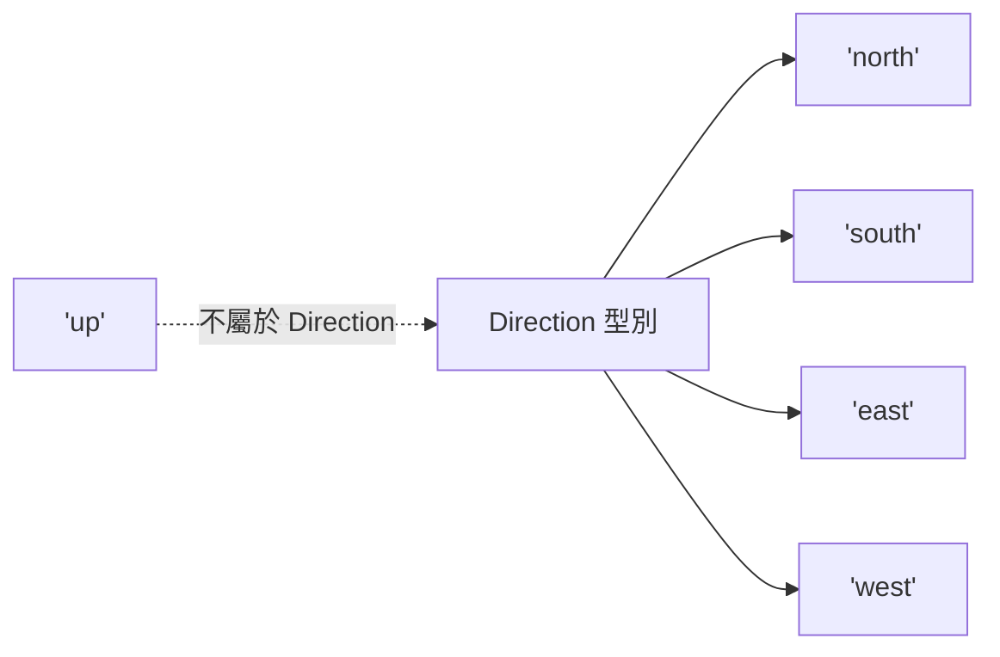

# [2-2] 基本型別：string、number、boolean、null、undefined

> **本章目標**：認識 TypeScript 五種基本型別，搞清楚 `null` 和 `undefined` 的差別，並且學會用 union type 和 literal type 描述更精確的資料。

---

## 你會學到

- TypeScript 五種基本型別（primitive types）各自代表什麼
- `null` 和 `undefined` 的差別，以及為什麼這個差別很重要
- 型別推斷（type inference）：什麼時候寫型別標注，什麼時候不用
- Union type：一個變數可以是多種型別的其中一種
- Literal type：把某個具體的值當作型別

---

## 概念說明

### 型別就是「這個格子只能放什麼」

想像你在整理倉庫，每個格子都貼了標籤：

```
[只能放文字的格子]   → string
[只能放數字的格子]   → number
[只能放是/否的格子] → boolean
[空格子，明確標示空] → null
[還沒標籤的格子]    → undefined
```

型別就是這個標籤系統。有了標籤，你（和 TypeScript）就知道每個格子裡能放什麼、不能放什麼。

---

### 五種基本型別

**string — 文字**

用來存任何文字資料，用單引號、雙引號或反引號（template literal）包起來：

```typescript
const firstName = "Alice"
const greeting = `Hello, ${firstName}!`
const emptyString = ""
```

**number — 數字**

TypeScript（和 JavaScript）裡只有一種數字型別，整數和小數都是 `number`——這和很多其他語言不一樣（Java 有 `int`、`float`、`double` 等分別）：

```typescript
const age = 25
const price = 99.9
const negativeTemperature = -10
```

**boolean — 是非題**

只有兩個值：`true` 或 `false`，非此即彼：

```typescript
const isLoggedIn = true
const hasError = false
```

布林值的命名慣例：用 `is`、`has`、`can` 開頭，讀起來像一個問句。`isLoggedIn` 一看就知道「已登入了嗎？」，比 `loggedIn` 或 `loginStatus` 更清楚。

**null 和 undefined — 兩種「沒有」**

這是 JavaScript / TypeScript 裡最容易搞混的地方。它們都代表「沒有值」，但意思不一樣：

```
null      = 「空的盒子」
            你知道那個盒子存在，你也知道它是空的
            這是主動設定的結果

undefined = 「還沒有盒子」
            這個變數根本還沒被賦值
            是預設的空、意外的空
```

用生活比喻：

```
你問服務生：「請問我的餐點呢？」

服務生 A 說：「您的餐點還沒好。」     → undefined（你的盤子還沒出現）
服務生 B 說：「您今天沒有點餐喔。」   → null（你的盤子是空的，因為你沒點）
```

---

## 程式碼範例

### 型別推斷：TypeScript 幫你猜

上一章說過，TypeScript 可以自己推斷型別。宣告變數的時候，如果同時給了值，通常不需要手動寫型別：

```typescript
// 這樣寫：明確標注型別（有點囉嗦）
const message: string = "Hello"
const count: number = 42
const isReady: boolean = false

// 這樣寫：讓 TypeScript 推斷（更乾淨，一樣安全）
const message = "Hello"     // TypeScript 推斷：string
const count = 42             // TypeScript 推斷：number
const isReady = false        // TypeScript 推斷：boolean
```

兩種寫法的型別保護效果是一樣的。第二種更常見，也更推薦。

### 什麼時候需要手動寫型別標注

有一個情況必須手動寫：**先宣告變數，之後才賦值**。

```typescript
// 這樣 TypeScript 不知道 username 是什麼型別
// 因為還沒有值可以推斷
let username: string

// 之後才賦值
username = "Bob"

// 如果不寫型別，TypeScript 會推斷成 any
// any 是危險的——等於關掉型別檢查，之後會學到為什麼要避免
```

函式參數也需要標注，因為呼叫時才傳值，TypeScript 沒辦法事先推斷：

```typescript
// 參數必須標注型別，回傳值可以讓 TypeScript 推斷
function double(value: number) {
  return value * 2   // TypeScript 推斷回傳值是 number
}
```

### null 和 undefined 的實際差別

`strict: true` 模式下，TypeScript 會認真區分這兩者，不讓你不小心混用：

```typescript
// 明確表示「這個使用者不存在」（主動的空）
let currentUser: null = null

// 宣告但還沒給值（預設的空）
let pendingResult: undefined = undefined
```

在實際程式裡，`null` 常用來表示「查詢後確認沒有結果」：

```typescript
// 從資料庫找使用者，找不到時回傳 null（不是 undefined）
// 因為「找了但沒有」不同於「根本沒找過」
function findUserById(id: number): { name: string } | null {
  if (id === 1) {
    return { name: "Alice" }
  }
  return null   // 主動說「找不到」
}
```

### Union Type — 可以是這個或那個

有時候一個變數確實可能是多種型別，這時候用 `|` 把它們連起來：

```typescript
// id 可能是字串（"user_123"）或數字（456）
let id: string | number

id = "user_123"  // OK
id = 456          // OK
id = true         // Error！boolean 不在允許的範圍內
```

Union type 在表達「可能有值，也可能沒有」時特別常用：

```typescript
// 搜尋結果：可能找到（string），也可能沒找到（null）
let searchResult: string | null = null

searchResult = "找到了！"   // OK
searchResult = null          // OK，表示沒找到
```

> **常見錯誤** — 很多人學到 union type 之後，一看到可能出現 `null` 就這樣寫：
>
> ```typescript
> let result: string | null | undefined
> ```
>
> 問題是：把 `null` 和 `undefined` 都放進來，反而讓「空」的語意變模糊——到底是主動設空，還是忘了賦值？選一種就好。通常用 `string | null`，表示「要嘛有值，要嘛明確是空的」。

### Literal Type — 把值本身當作型別

有時候不是「任何 string」，而是「只能是這幾個特定的字串」。這時候用 **literal type**：

```typescript
// Direction 只能是這四個值之一
type Direction = "north" | "south" | "east" | "west"

const move: Direction = "north"   // OK
const bad: Direction = "up"       // Error！"up" 不在允許的值裡
```

用 Mermaid 圖看清楚 literal type 的概念：



這張圖說明：Direction 型別就是四個具體字串值的聯集，任何不在這個集合裡的值都不被允許。

Literal type 在描述狀態（status）的時候特別好用：

```typescript
// 訂單狀態只能是這三種之一
type OrderStatus = "pending" | "shipped" | "delivered"

function updateOrder(orderId: number, status: OrderStatus) {
  console.log(`訂單 ${orderId} 狀態更新為：${status}`)
}

updateOrder(101, "shipped")      // OK
updateOrder(102, "cancelled")    // Error！"cancelled" 不是合法的 OrderStatus
```

這比用數字代碼（`status === 1`、`status === 2`）清楚多了，讀程式碼的人一眼就知道每個狀態代表什麼。

> 這裡用了有意義的字串值而不是數字，就是為了避免 Magic Number 這個反模式。→ **[課外讀物 E-6-6] 反模式大賞：那些讓後人崩潰的寫法**

---

## 小練習

**練習 1：型別推斷觀察**

在 VS Code 裡建立一個 `types.ts`，輸入以下內容，然後把滑鼠移到每個變數上，確認 TypeScript 推斷的型別是否正確：

```typescript
const productName = "TypeScript Handbook"
const price = 29.99
const inStock = true
const discount = null
```

`discount` 被推斷成什麼型別？和你預期的一樣嗎？

**練習 2：Union Type 練習**

寫一個函式 `formatId`，它接收一個 `id` 參數（可以是 `string` 或 `number`），統一回傳加上前綴的字串：

```typescript
// 期望行為：
// formatId("abc") → "ID-abc"
// formatId(123)   → "ID-123"
```

提示：回傳型別是 `string`，函式內可以用 template literal 把 `id` 直接放進去。

**練習 3：Literal Type 練習**

定義一個 `Season` 型別，只允許 `"spring"`、`"summer"`、`"autumn"`、`"winter"` 四個值。

然後寫一個函式 `getSeasonMessage`，接收 `Season` 型別的參數，根據季節回傳不同的字串訊息。確認傳入 `"rainy"` 時 TypeScript 會報錯。

---

## 課外讀物

> 想了解命名規則的完整指南，包含為什麼 `isLoggedIn` 比 `loginStatus` 好 → [課外讀物 E-6-2：命名的藝術：讓名字說話](../../../課外讀物/E-6-best-practices/E-6-2-naming.md)
