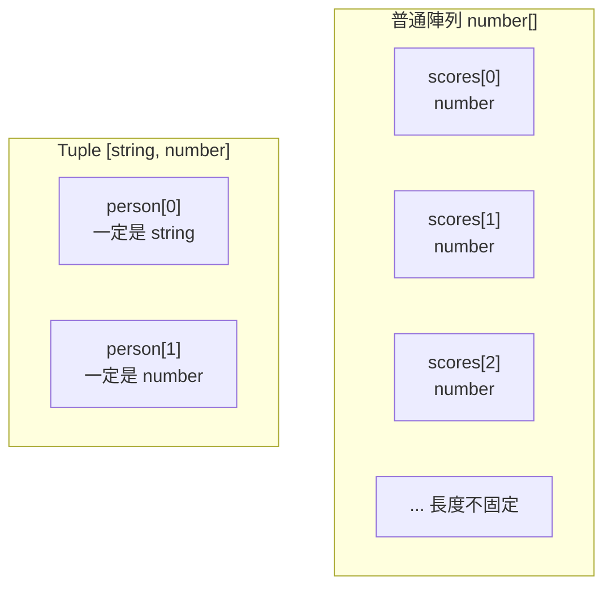

# [2-3] 複合型別：object、array、tuple

> **本章目標**：學會用 TypeScript 描述陣列、物件和 tuple 的型別，並且了解如何用 `readonly` 和 `as const` 保護資料不被意外修改。

---

## 你會學到

- 如何標注陣列（array）的型別
- 如何描述物件（object）的結構和型別
- 選用屬性（optional property）是什麼，什麼時候用
- Tuple：固定長度、固定順序的特殊陣列
- `readonly` 和 `as const`：讓資料無法被修改

---

## 概念說明

### 從基本型別到複合型別

上一章的五種基本型別（string、number、boolean、null、undefined）只能描述「一個值」。

但真實程式裡的資料幾乎不會只有一個值。你可能有「一串名字」、「一筆使用者資料」、或是「座標 (x, y)」。

```
基本型別描述：一個值
  "Alice"、25、true

複合型別描述：多個值的組合
  ["Alice", "Bob", "Charlie"]        → 陣列
  { name: "Alice", age: 25 }         → 物件
  [10, 20]                            → tuple（座標）
```

---

## 程式碼範例

### 陣列（Array）

陣列是「同一種型別的值，按順序排在一起」。TypeScript 用 `型別[]` 來標注陣列：

```typescript
// 一串名字，每個元素都是 string
const names: string[] = ["Alice", "Bob", "Charlie"]

// 分數列表，每個元素都是 number
const scores: number[] = [95, 87, 72]

// 布林值的陣列（比較少見，但合法）
const flags: boolean[] = [true, false, true]
```

你可能也會看到另一種寫法 `Array<型別>`，意思完全一樣，但大多數人比較喜歡 `型別[]` 這種更簡短的形式：

```typescript
// 這兩行是一樣的
const tags: string[] = ["typescript", "nodejs"]
const tags2: Array<string> = ["typescript", "nodejs"]
```

TypeScript 會確保陣列裡的元素型別正確。試著放錯型別，馬上就會報錯：

```typescript
const scores: number[] = [95, 87, "pass"]
//                                 ^^^^^^
// Error: Type 'string' is not assignable to type 'number'.
```

**陣列的常用方法**也都有型別保護。以 `.map()` 為例：

```typescript
const prices: number[] = [100, 200, 300]

// map 會根據 callback 的回傳值自動推斷新陣列的型別
const discounted = prices.map((price) => price * 0.9)
// TypeScript 推斷 discounted 是 number[]
```

`.filter()` 同理——回傳的陣列型別和原陣列一樣：

```typescript
const scores: number[] = [95, 60, 45, 87, 50]

// 只留下及格的分數（60 以上）
const passing = scores.filter((score) => score >= 60)
// TypeScript 推斷 passing 是 number[]
```

---

### 物件（Object）

物件是「有名字的屬性和值的集合」。可以把它想成一張表單，每個欄位有名字和對應的資料型別。

```
// 使用者表單（pseudo code）
使用者表單：
  姓名：文字
  年齡：數字
  是否為管理員：是/否
```

用 TypeScript 描述這個物件的型別：

```typescript
const user: { name: string; age: number; isAdmin: boolean } = {
  name: "Alice",
  age: 25,
  isAdmin: false,
}
```

這裡的 `{ name: string; age: number; isAdmin: boolean }` 就是物件的**型別結構**，用分號（`;`）分隔各個屬性。

> 你可能注意到這樣寫有點冗長——型別標注和值都要寫一次屬性名稱。這是因為我們還沒介紹 `interface`（下一章的主題）。Interface 就是用來給物件型別取名字的，有了名字就可以重複使用，不用每次都重寫一長串。

### 選用屬性（Optional Property）

有些屬性不是每次都必填。比如商品可能有描述，也可能沒有。這時候在屬性名稱後面加 `?`：

```typescript
const product: { name: string; description?: string } = {
  name: "TypeScript Handbook",
  // description 沒有填，OK！因為加了 ? 表示可選
}

const detailedProduct: { name: string; description?: string } = {
  name: "Clean Code",
  description: "關於如何寫出好程式的經典著作",
}
```

`description?` 的意思是：這個屬性的型別是 `string | undefined`——要嘛有字串值，要嘛根本不存在。加了 `?` 就不需要每次都填。

---

### Tuple

Tuple 是一種特殊的陣列：**固定長度、每個位置有固定的型別**。

和普通陣列不同的地方在於，普通陣列每個元素的型別都一樣，但 tuple 每個位置可以有不同的型別，而且長度是固定的。

```
普通陣列：不定長度，每個元素型別相同
  [1, 2, 3, 4, 5]         → number[]，長度不固定

Tuple：固定長度，每個位置型別可以不同
  [10, 20]                 → [number, number]，座標
  ["Alice", 25]            → [string, number]，姓名和年齡的配對
```

用 Mermaid 圖看清楚兩者的差異：



這張圖說明：普通陣列每個格子型別相同且長度不限；tuple 每個格子有各自固定的型別，且長度固定。

實際使用：

```typescript
// 座標點：固定是兩個數字，順序代表意義（x, y）
const point: [number, number] = [10, 20]

// 姓名年齡配對：第一個是 string，第二個是 number
const person: [string, number] = ["Alice", 25]

// 解構取值時，TypeScript 知道每個位置是什麼型別
const [x, y] = point      // x: number, y: number
const [name, age] = person  // name: string, age: number
```

Tuple 也可以作為函式的回傳型別，在你想同時回傳兩個有意義的值時很好用：

```typescript
// 把全名拆分成姓和名，固定回傳 [姓, 名]
function splitName(fullName: string): [string, string] {
  const parts = fullName.split(" ")
  return [parts[0], parts[1]]
}

const [firstName, lastName] = splitName("Alice Chen")
// firstName: "Alice"（string）
// lastName: "Chen"（string）
```

**什麼時候用 tuple，什麼時候用物件？**

```
用 tuple：
  - 長度固定（2~3 個元素）
  - 每個位置的意義靠順序來定義（座標、CSV 的一行）
  - 不需要屬性名稱也能清楚表達

用物件：
  - 有 3 個以上的屬性
  - 每個屬性需要有名字（才容易讀懂）
  - 屬性可能是選用的
```

---

### readonly — 保護陣列不被修改

預設情況下，就算是用 `const` 宣告的陣列，裡面的元素還是可以被修改：

```typescript
const colors = ["red", "green", "blue"]
colors.push("yellow")    // 這是合法的！const 只防止重新賦值，不防止修改內容
colors[0] = "pink"       // 這也是合法的
```

如果你想讓陣列完全不可修改，加上 `readonly`：

```typescript
const colors: readonly string[] = ["red", "green", "blue"]

colors.push("yellow")   // Error! Property 'push' does not exist on type 'readonly string[]'.
colors[0] = "pink"      // Error! Index signature in type 'readonly string[]' only permits reading.
```

`readonly` 的好處：明確表達「這個陣列建立之後就不應該被改動」，防止其他地方的程式碼不小心動到它。

---

### as const — 把整個物件或陣列凍結

`as const` 更進一步，它會讓 TypeScript 把每個值都視為 literal type（而不只是 `string` 或 `number`），而且整個物件或陣列都變成 readonly：

下面先看看如果不加 `as const` 是什麼情況：

```typescript
// 沒有 as const
const CONFIG = {
  maxRetries: 3,
  timeout: 5000,
}
// TypeScript 推斷：{ maxRetries: number; timeout: number }
// CONFIG.maxRetries 可以被重新賦值為任何 number
CONFIG.maxRetries = 99   // 合法，但你可能不想讓這件事發生
```

加了 `as const` 之後：

```typescript
// 加上 as const
const CONFIG = {
  maxRetries: 3,
  timeout: 5000,
} as const
// TypeScript 推斷：{ readonly maxRetries: 3; readonly timeout: 5000 }
// 注意：型別不是 number，而是具體的值 3 和 5000

CONFIG.maxRetries = 99   // Error! Cannot assign to 'maxRetries' because it is a read-only property.
```

`as const` 特別適合用在設定值（config）、常數表等不應該被改動的資料上。

---

## 小練習

**練習 1：陣列型別**

建立以下三個陣列，讓 TypeScript 推斷型別（不要手動標注），然後試著插入一個錯誤型別的元素，確認 TypeScript 會報錯：

```typescript
const cities = ["Taipei", "Tokyo", "Seoul"]
const temperatures = [-5, 0, 18, 35]
const availabilities = [true, false, true, true]
```

接著對 `temperatures` 用 `.filter()` 只留下 0 度以上的氣溫，確認回傳的陣列型別還是 `number[]`。

**練習 2：物件型別**

定義一個物件型別，描述一本書的資訊。這本書有：
- 書名（一定要有）
- 作者（一定要有）
- ISBN 編號（可選）
- 頁數（一定要有）

建立兩個符合這個型別的物件：一個有 ISBN、一個沒有。確認 TypeScript 兩個都接受。

**練習 3：Tuple 練習**

寫一個函式 `parseCoordinate`，接收一個格式為 `"10,20"` 的字串（逗號分隔 x 和 y），回傳型別為 `[number, number]` 的 tuple。

```typescript
// 期望行為：
// parseCoordinate("10,20")  → [10, 20]
// parseCoordinate("-5,100") → [-5, 100]
```

提示：用 `split(",")` 拆開字串，再用 `Number()` 轉換成數字。
