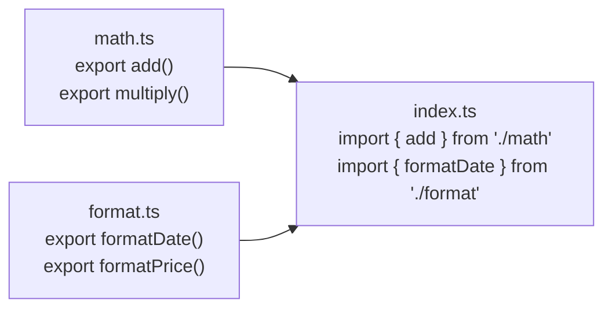
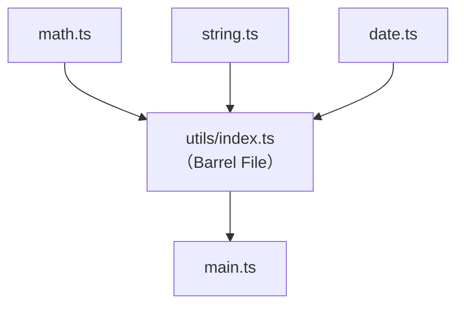

# [2-7] 模組化：為什麼要拆檔案？import / export

> **本章目標**：學會用 ES Modules 把程式碼拆進不同檔案，讓大型專案保持整潔可維護。

## 你會學到

- 為什麼要拆檔案（模組化的核心動機）
- `export` 和 `import` 的基本用法（named export）
- `default export` 是什麼，什麼時候用
- 如何匯出型別（`interface`、`type alias`）
- Barrel file（`index.ts`）是什麼，怎麼讓 import 更乾淨

## 概念說明

### 先想像這個場景

你正在讀一本 600 頁的書，但這本書**沒有章節、沒有目錄、沒有分頁**——所有內容就是一個巨大的 `.txt` 檔案。

想找「第三章的重點」？對不起，請用 Ctrl+F 慢慢搜。

程式碼也一樣。當一個專案只有一個 `index.ts`，所有函式、型別、邏輯全部擠在一起，幾百行之後你就會開始痛苦。

**模組化（Modularization）**就是替這本書加上章節：
- 每個檔案負責一件事
- 需要用到的時候，去那個檔案「借」

### 用 Pseudo Code 想像一下

```
// 沒有模組化的世界（一個檔案裝所有東西）
定義 User 型別
定義 Product 型別
計算折扣的函式
計算稅金的函式
格式化日期的函式
格式化貨幣的函式
處理登入的函式
處理登出的函式
... 再 500 行
```

```
// 模組化之後（每個檔案只管自己的事）
types.ts      ← 所有型別定義
math.ts       ← 數學計算相關
format.ts     ← 格式化相關
auth.ts       ← 登入登出相關
index.ts      ← 把需要的東西組合起來用
```

### ES Modules 是什麼？

ES Modules（ESM）是 JavaScript/TypeScript 標準的模組系統。

```
ES = ECMAScript，也就是 JavaScript 的正式規格名稱
Module = 模組，每個獨立的 .ts 檔案就是一個模組
```

規則很簡單：
- 想讓別的檔案用到的東西 → 加上 `export`
- 想使用其他檔案的東西 → 用 `import` 引入



這張圖說明：`index.ts` 從不同的模組借用它需要的東西，每個模組只專注在自己的職責。

## 程式碼範例

### Named Export — 匯出多個東西

「Named」的意思是：你匯出的每個東西都有自己的名字，import 的時候也要用一樣的名字。

先看 `math.ts`，這個檔案負責數學計算：

```typescript
// math.ts

export function add(a: number, b: number): number {
  return a + b
}

export function multiply(a: number, b: number): number {
  return a * b
}

export const PI = 3.14159
```

每個函式和常數前面都加了 `export`，這樣其他檔案才找得到它們。

現在在 `main.ts` 裡引入：

```typescript
// main.ts

import { add, multiply, PI } from "./math"

console.log(add(2, 3))       // 5
console.log(multiply(4, 5))  // 20
console.log(PI)              // 3.14159
```

用大括號 `{ }` 包住你想要的名字，路徑用 `"./math"` 指向同目錄的 `math.ts`（副檔名可以省略）。

> **常見錯誤** — 很多人會這樣寫：
>
> ```typescript
> import add from "./math"  // 沒有大括號
> ```
>
> 問題是：沒有大括號的語法是給 **default export** 用的（下一段會說）。Named export 一定要加大括號，否則會報錯。

### Default Export — 一個檔案一個主角

有時候一個檔案就是主打一個函式或一個 class。這種情況可以用 `default export`：

```typescript
// greet.ts

export default function greet(name: string): string {
  return `你好，${name}！`
}
```

一個檔案只能有一個 `default export`。

Import 的時候**不需要大括號**，而且可以隨便取名字：

```typescript
// main.ts

import greet from "./greet"
// 或是：
import sayHello from "./greet"  // 不同名字也行

console.log(greet("小明"))   // 你好，小明！
```

### Named vs Default — 什麼時候用哪個？

這是很多人會搞混的地方。先看一個對照表：

| | Named Export | Default Export |
|---|---|---|
| 語法 | `export function foo() {}` | `export default function foo() {}` |
| Import 語法 | `import { foo } from "./file"` | `import foo from "./file"` |
| 一個檔案幾個 | 想幾個就幾個 | 只能一個 |
| 適合場景 | 工具函式、常數、型別 | 一個檔案一個主要功能 |

```
一般建議：
- utils.ts 這類工具檔案 → 用 named export（裡面有很多函式）
- 元件或主要功能 → 用 default export（一個檔案一個主角）
```

### 匯出型別

型別（`interface`、`type`）也可以 export，讓多個檔案共用同一份型別定義：

```typescript
// types.ts

export interface User {
  id: number
  name: string
  email: string
}

export type Status = "active" | "inactive"
```

Import 型別有兩種寫法，推薦用 `import type`，可以讓 TypeScript 知道這只是型別，不是真的 JavaScript 值：

```typescript
// main.ts

import type { User, Status } from "./types"

function printUser(user: User): void {
  console.log(`${user.name} (${user.email})`)
}
```

### Barrel File — 讓 import 更乾淨

想像你的 `utils/` 資料夾裡有很多工具檔案：

```
utils/
  math.ts
  string.ts
  date.ts
```

如果每次都要這樣 import：

```typescript
import { add } from "./utils/math"
import { capitalize } from "./utils/string"
import { formatDate } from "./utils/date"
```

三行 import 只為了用三個函式，有點囉嗦。

**Barrel file** 是一個慣例：在資料夾裡放一個 `index.ts`，把該資料夾所有的 export 重新匯出：

```typescript
// utils/index.ts
// 這個檔案的工作就是「把所有東西集合在一起」

export * from "./math"
export * from "./string"
export * from "./date"
```

`export * from` 的意思是：「把那個檔案裡所有的 export，原封不動地再 export 出去」。

現在 import 可以這樣寫：

```typescript
// main.ts

import { add, capitalize, formatDate } from "./utils"
// TypeScript 看到 "./utils" 會自動找 utils/index.ts
```

一行搞定！而且以後新增工具函式，只要在 `index.ts` 加一行 `export * from "./newFile"` 就好。



這張圖說明：Barrel file 像一個集散中心，把分散的模組統一對外提供，使用者只需要認識一個入口。

### 推薦的專案結構

結合以上所學，一個整潔的 TypeScript 小專案長這樣：

```
my-project/
├── src/
│   ├── types/
│   │   ├── user.ts       # User 相關型別
│   │   ├── product.ts    # Product 相關型別
│   │   └── index.ts      # Barrel file
│   ├── utils/
│   │   ├── math.ts
│   │   ├── format.ts
│   │   └── index.ts      # Barrel file
│   └── index.ts          # 程式進入點
├── package.json
└── tsconfig.json
```

每個資料夾負責一種東西，`index.ts` 永遠是進入點或 barrel file。

## 小練習

**練習 1 — 拆開大檔案**

下面是一個什麼都塞在一起的 `index.ts`，你的任務是把它拆成 `utils.ts` 和 `types.ts` 兩個檔案，再用 import/export 連起來：

```typescript
// 現在的 index.ts（太擠了）

interface Product {
  id: number
  name: string
  price: number
}

type Currency = "TWD" | "USD"

function calculateDiscount(price: number, discountRate: number): number {
  return price * (1 - discountRate)
}

function formatPrice(price: number, currency: Currency): string {
  return `${currency} ${price.toFixed(2)}`
}

const product: Product = { id: 1, name: "鍵盤", price: 1500 }
const discounted = calculateDiscount(product.price, 0.1)
console.log(formatPrice(discounted, "TWD"))
```

目標：
- `types.ts` 放 `Product` 和 `Currency`
- `utils.ts` 放 `calculateDiscount` 和 `formatPrice`（記得 import 需要的型別）
- `index.ts` 只留最後三行邏輯，import 需要的東西

**練習 2 — 建立 Barrel File**

承上題，現在再多一個 `validation.ts`：

```typescript
// validation.ts
export function isValidPrice(price: number): boolean {
  return price >= 0
}

export function isValidProductName(name: string): boolean {
  return name.trim().length > 0
}
```

建立一個 `utils/index.ts`，讓 `index.ts` 可以這樣寫：

```typescript
import { calculateDiscount, formatPrice, isValidPrice, isValidProductName } from "./utils"
```

（提示：你需要把 `utils.ts` 和 `validation.ts` 移進 `utils/` 資料夾）
