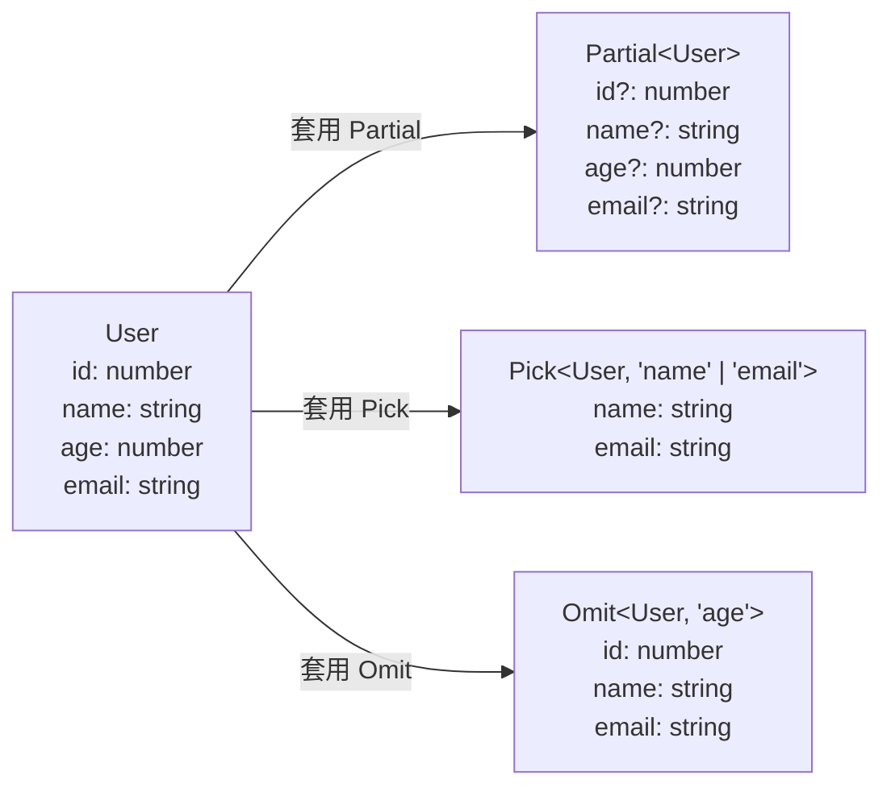
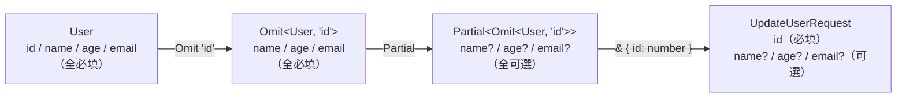

# [2-8] 進階型別工具：Partial、Pick、Omit、Record、ReturnType

> **本章目標**：學會用 TypeScript 內建的 Utility Types，從現有型別「衍生」出新型別，不重複定義、不寫死。

## 你會學到

- 什麼是 Utility Types，為什麼要用
- `Partial<T>` 和 `Required<T>`：讓所有欄位變可選或全必填
- `Readonly<T>`：禁止修改
- `Pick<T, K>` 和 `Omit<T, K>`：選出或排除特定欄位
- `Record<K, V>`：快速建立 key-value 型別
- `ReturnType<typeof fn>`：從函式反推回傳型別

## 概念說明

### 先想像：型別的「濾鏡」

你有一張原始照片（`User` 型別），但不同場合需要不同版本：
- 個人資料頁面：完整顯示所有欄位
- 公開名片：只顯示名字和 email，隱藏其他資料
- 更新 API：所有欄位都是可選的（你只送改了的那幾個）

如果每種情況都重新定義一個新 interface，你最後會有一堆長得很像的型別，改一個地方要改好幾個地方。

**Utility Types 就是型別的濾鏡**——你不動原始照片，只套用一個效果，得到你想要的新版本。



這張圖說明：同一個 `User` 型別，套上不同的 Utility Type，就得到用途各異的衍生型別。原始型別完全不需要動。

### 基礎型別（接下來的範例都用這個）

```typescript
// 這個 interface 是後面所有範例的起點
interface User {
  id: number
  name: string
  age: number
  email: string
}
```

## 程式碼範例

### Partial\<T\> — 讓所有欄位變可選

`Partial<T>` 把一個型別裡**所有**的必填欄位都變成可選（加上 `?`）。

**最典型的使用場景：「更新」操作**。更新使用者資料時，你不一定每次都把全部欄位都送，可能只改名字，也可能只改 email。這時候參數型別應該是 `Partial<User>`，而不是完整的 `User`：

```typescript
// 這段程式碼說明：updateUser 接收「部分使用者資料」，只更新你送進來的欄位

function updateUser(id: number, changes: Partial<User>): void {
  // changes 可以是 {}、{ name: "Bob" }，或 { name: "Bob", email: "b@b.com" }
  // 每個欄位都是可選的，TypeScript 不會抱怨
  console.log(`更新 ID ${id} 的資料:`, changes)
}

// 以下呼叫方式全部合法：
updateUser(1, { name: "Bob" })
updateUser(1, { email: "new@email.com", age: 30 })
updateUser(1, {})  // 雖然沒意義，但型別上是合法的
```

`Partial<User>` 展開後長這樣：

```typescript
// TypeScript 自動幫你把這個推斷出來
type PartialUser = {
  id?: number
  name?: string
  age?: number
  email?: string
}
```

---

### Required\<T\> — 讓所有欄位變必填（Partial 的反向）

`Required<T>` 做的事情剛好相反：把所有可選欄位（有 `?` 的）都變成必填。

```typescript
// 假設你有一個「草稿」型別，所有欄位都是可選的
interface DraftUser {
  id?: number
  name?: string
  email?: string
}

// 確認儲存時，要求所有欄位都填好
type ConfirmedUser = Required<DraftUser>
// 結果：{ id: number; name: string; email: string }

function saveUser(user: ConfirmedUser): void {
  // 這裡可以放心用 user.id，不用檢查 undefined
  console.log(`儲存使用者: ${user.name}`)
}
```

---

### Readonly\<T\> — 禁止修改

`Readonly<T>` 把所有欄位都加上唯讀保護，任何嘗試修改的動作都會在編譯時報錯。

```typescript
// 這段程式碼說明：系統設定載入後就不應該被修改
type AppConfig = Readonly<{
  apiUrl: string
  maxRetries: number
  debugMode: boolean
}>

const config: AppConfig = {
  apiUrl: "https://api.example.com",
  maxRetries: 3,
  debugMode: false,
}

config.debugMode = true  // Error: Cannot assign to 'debugMode' because it is a read-only property.
```

> 你在 2-3 章有看過 `as const` 和 `readonly` 關鍵字，`Readonly<T>` 做的事情類似，差別是它作用在整個型別上，不是在宣告變數時套用。

---

### Pick\<T, K\> — 只留下你要的欄位

`Pick<T, K>` 讓你從一個型別裡**挑出**特定欄位，組成一個新的精簡型別。`K` 是欄位名稱的聯合型別。

**使用場景：對外的 API 不想暴露所有欄位**。例如公開查詢 API 只回傳名字和 email，不回傳年齡：

```typescript
// 從 User 裡只挑 name 和 email 出來
type UserPreview = Pick<User, "name" | "email">

// 等同於自己寫：
// type UserPreview = {
//   name: string
//   email: string
// }

// 這個函式只回傳使用者的公開資訊
function getPublicProfile(user: User): UserPreview {
  return {
    name: user.name,
    email: user.email,
    // 如果你不小心加了 age，TypeScript 會報錯
  }
}
```

---

### Omit\<T, K\> — 排除你不要的欄位

`Omit<T, K>` 跟 `Pick` 相反：你指定**不要**的欄位，其他全部保留。

**使用場景：新增資料時不需要 `id`**（id 通常是資料庫自動產生的，你不用填）：

```typescript
// 建立新使用者時，不需要 id（資料庫會自己產生）
type NewUserData = Omit<User, "id">
// { name: string; age: number; email: string }

function createUser(data: NewUserData): User {
  return {
    id: Date.now(),  // 自動產生 id
    ...data,
  }
}

// 呼叫時不需要提供 id：
const newUser = createUser({ name: "Alice", age: 25, email: "alice@example.com" })
```

> **Pick vs Omit 怎麼選？**
>
> - 你「要」的欄位比「不要」的少 → 用 `Pick`（列出要的）
> - 你「不要」的欄位比「要」的少 → 用 `Omit`（列出不要的）
>
> 如果一個型別有 10 個欄位，你只想排除 1 個，用 `Omit` 比用 `Pick` 列 9 個欄位省事多了。

---

### Record\<K, V\> — 建立 key-value 對應型別

`Record<K, V>` 建立一個「所有 key 都是 K 型別，所有 value 都是 V 型別」的物件型別。

**使用場景 1：每個角色對應一組權限**

```typescript
// 這段程式碼說明：用 Record 定義每個角色擁有的權限清單
type Role = "admin" | "user" | "guest"
type Permission = "read" | "write" | "delete"

type RolePermissions = Record<Role, Permission[]>

const permissions: RolePermissions = {
  admin: ["read", "write", "delete"],
  user: ["read", "write"],
  guest: ["read"],
  // 如果漏掉任何一個 Role，TypeScript 會報錯
}
```

**使用場景 2：用來做快取或查找表**

```typescript
// 這段程式碼說明：用 Record 建立 id 到 User 的對應表，查詢更快
type UserCache = Record<number, User>

const cache: UserCache = {
  1: { id: 1, name: "Alice", age: 25, email: "alice@example.com" },
  2: { id: 2, name: "Bob", age: 30, email: "bob@example.com" },
}

// 查詢 id=1 的使用者，O(1) 效率
const alice = cache[1]
```

---

### ReturnType\<typeof fn\> — 從函式反推回傳型別

有時候你有一個函式，但你不知道它回傳什麼型別（可能是第三方 library，或者型別太複雜）。`ReturnType` 讓你直接「抽出」這個函式的回傳型別。

```typescript
// 這個函式回傳一個物件，沒有明確寫出型別
function getCurrentUser() {
  return {
    id: 1,
    name: "Alice",
    lastLogin: new Date(),
  }
}

// ReturnType 幫你推斷出回傳型別
type CurrentUser = ReturnType<typeof getCurrentUser>
// 等同於：{ id: number; name: string; lastLogin: Date }

// 現在你可以在別的地方用這個型別
function formatUser(user: CurrentUser): string {
  return `${user.name} (上次登入: ${user.lastLogin.toLocaleDateString()})`
}
```

> 注意語法：`ReturnType<typeof getCurrentUser>`，這裡要用 `typeof` 把函式名稱轉成型別，再傳給 `ReturnType`。

---

### 組合使用 Utility Types

Utility Types 可以疊在一起用，解決更複雜的情境。

**情境：更新使用者 API 的請求格式**——必須帶 `id`，其他欄位都可選：

```typescript
// 這段程式碼說明：
// 1. 先用 Omit 把 id 從 User 拿掉
// 2. 再用 Partial 讓剩下的欄位全部變可選
// 3. 最後用 & 把強制必填的 id 加回來

type UpdateUserRequest = Partial<Omit<User, "id">> & { id: number }

// 結果等同於：
// {
//   id: number         ← 必填
//   name?: string      ← 可選
//   age?: number       ← 可選
//   email?: string     ← 可選
// }

function updateUser(request: UpdateUserRequest): void {
  console.log(`更新使用者 ${request.id}`)
}

updateUser({ id: 1, name: "Bob" })       // 合法
updateUser({ id: 2 })                    // 合法（只帶 id）
updateUser({ name: "Bob" })              // Error：缺少 id
```



這張圖說明：透過兩層 Utility Types 的疊加，加上交叉型別 `&`，我們精確地表達了「id 必填，其他可選」的需求。

## 小練習

**練習 1 — 衍生出新型別**

從下面的 `Product` interface 出發，建立三個衍生型別：

```typescript
interface Product {
  id: number
  name: string
  price: number
  stock: number
  description: string
}
```

- `ProductPreview`：只包含 `name` 和 `price`（用在列表頁）
- `UpdateProduct`：所有欄位都是可選的（用在更新 API）
- `ReadonlyProduct`：禁止修改任何欄位（用在展示用途）

試著用 `Pick`、`Partial`、`Readonly` 分別建立，然後寫個函式，參數或回傳值使用這些型別。

---

**練習 2 — 用 Record 建立對應表**

台灣一週七天，每天可能是工作日或假日。

請用 `Record` 建立一個型別 `WeekSchedule`，鍵是星期名稱（`"Monday" | "Tuesday" | ... | "Sunday"`），值是 `boolean`（代表是否為工作日）。

然後建立一個符合這個型別的物件 `schedule`，並寫一個函式 `isWorkday(day: keyof WeekSchedule): boolean`。

---

**練習 3 — 用 ReturnType 連接型別**

你有這個函式：

```typescript
function fetchUserProfile() {
  return {
    displayName: "Alice Chen",
    avatarUrl: "https://example.com/avatar.jpg",
    joinedAt: new Date("2024-01-01"),
    followerCount: 128,
  }
}
```

1. 用 `ReturnType` 建立 `UserProfile` 型別
2. 寫一個函式 `renderProfile(profile: UserProfile): string`，回傳格式化的介紹字串
3. 思考：如果之後 `fetchUserProfile` 新增了一個 `isPremium: boolean` 欄位，`UserProfile` 和 `renderProfile` 需要手動更新嗎？
