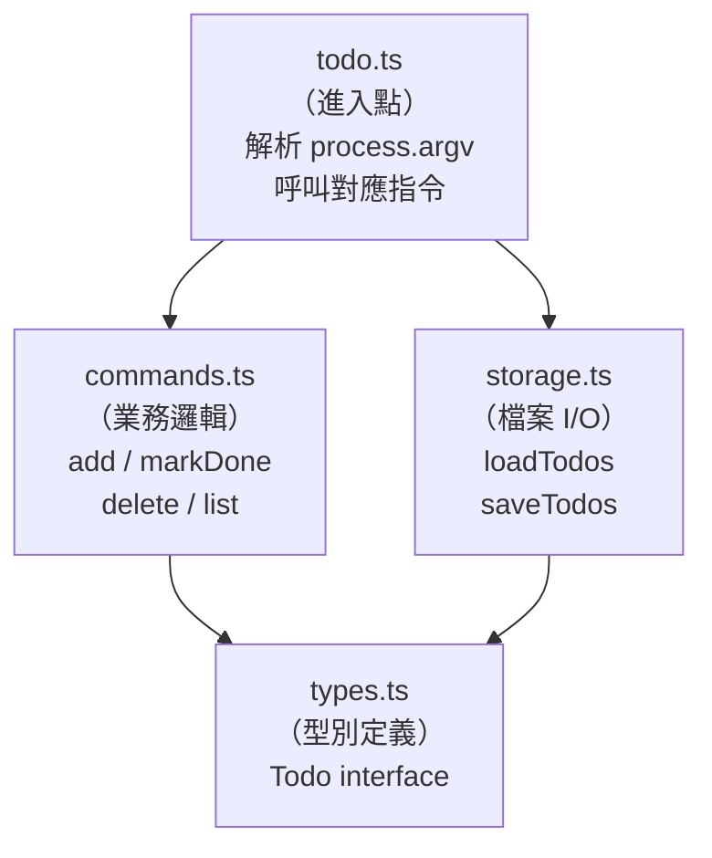
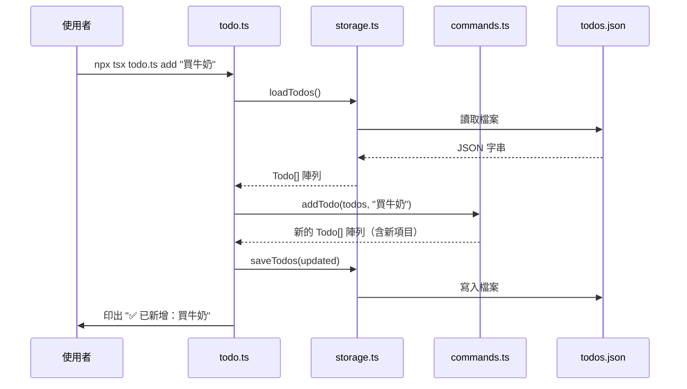

# [2-9] 實戰：CLI 任務清單工具

> **本章目標**：把 Part 2 學過的所有概念整合起來，從零建立一個有檔案儲存功能的命令列 Todo App。

## 你會學到

- 如何把一個完整專案拆成多個職責清楚的檔案
- 用 TypeScript 讀寫 JSON 檔案（資料持久化）
- 用 `process.argv` 解析命令列參數
- 把每個指令實作成純函式，方便測試和維護
- 回顧 Part 2 所有重要概念，看它們如何在真實專案裡配合

## 概念說明

### 我們要做什麼？

一個在終端機執行的 Todo App，用法長這樣：

```bash
$ npx tsx todo.ts add "買牛奶"
✅ 已新增：買牛奶

$ npx tsx todo.ts list
1. [ ] 買牛奶
2. [x] 寫作業

$ npx tsx todo.ts done 1
✅ 已完成 ID: 1

$ npx tsx todo.ts delete 2
🗑️  已刪除 ID: 2
```

資料存在 `todos.json` 裡，所以關掉終端機再開，資料還在。

### 為什麼要拆成多個檔案？

先用 pseudo code 想想：一個 Todo App 需要做哪些事？

```
1. 知道任務長什麼樣子（型別定義）
2. 從磁碟讀取任務、把任務寫回磁碟（儲存）
3. 新增、刪除、標示完成、列出任務（業務邏輯）
4. 看使用者輸入什麼指令、決定要做什麼（進入點）
```

這四件事的性質完全不同，如果全部塞進一個檔案，要修改「如何儲存」的時候你得在幾百行程式碼裡找；要加新指令的時候又要找另一段。

把它們拆開，每個檔案只做一件事：



這張圖說明：`todo.ts` 是指揮官，它叫 `commands.ts` 做邏輯運算，叫 `storage.ts` 負責存取，所有人都依賴 `types.ts` 提供的型別定義。

### 完整的專案結構

```
todo-app/
├── types.ts      ← 型別定義（Todo interface）
├── storage.ts    ← 讀寫 todos.json
├── commands.ts   ← 各個指令的邏輯（純函式）
├── todo.ts       ← 進入點，解析 argv，呼叫對應函式
└── todos.json    ← 資料儲存（執行後自動產生）
```

### 怎麼執行？

在開始前，先確認環境：

```bash
# 確認有安裝 tsx（TypeScript 直接執行工具）
npm install -g tsx

# 進入專案資料夾
cd todo-app

# 執行
npx tsx todo.ts add "買牛奶"
```

或者如果你的 `package.json` 裡有設定 `tsx`，可以用 `ts-node` 或其他方式。最簡單的是直接 `npx tsx`。

## 程式碼範例

### Step 1：`types.ts` — 定義資料長什麼樣

這個檔案的工作是：**定義整個 App 的核心資料型別**。其他所有檔案都從這裡 import 型別，所以這裡的定義要完整且清楚。

```typescript
// types.ts
// 這個檔案只做一件事：定義型別。不包含任何邏輯。

export interface Todo {
  id: number        // 唯一識別碼，用來指定「要完成哪一個」
  title: string     // 任務標題
  isDone: boolean   // 是否已完成
  createdAt: string // ISO 8601 格式的建立時間，例如 "2024-01-01T10:00:00.000Z"
}
```

這樣看起來很短，但這是刻意的——型別定義應該乾淨、單純，不摻雜邏輯。

> 這裡用 `interface` 而非 `type alias`，因為 `Todo` 是一個描述資料結構的物件型別，這正是 `interface` 最適合的場景。

---

### Step 2：`storage.ts` — 讀寫檔案

這個檔案的工作是：**負責所有「跟磁碟溝通」的事**。讀取 `todos.json`、把最新資料寫回去，都在這裡。呼叫方不需要知道資料是存在 JSON 還是資料庫，那是 `storage.ts` 自己的事。

```typescript
// storage.ts
// 這個檔案只做一件事：從磁碟讀取資料、把資料寫回磁碟。

import fs from "fs"
import type { Todo } from "./types"

const FILE_PATH = "./todos.json"
// 用常數而非直接寫字串，這樣以後要改路徑，只需改這一行

export function loadTodos(): Todo[] {
  // 如果檔案不存在（第一次執行），回傳空陣列，不要噴錯
  if (!fs.existsSync(FILE_PATH)) {
    return []
  }

  const rawContent = fs.readFileSync(FILE_PATH, "utf-8")
  return JSON.parse(rawContent) as Todo[]
  // JSON.parse 回傳的是 unknown，我們用 as Todo[] 告訴 TypeScript
  // 「相信我，這個格式是對的」
}

export function saveTodos(todos: Todo[]): void {
  // JSON.stringify 第三個參數 2 代表縮排 2 格，讓 todos.json 人類可讀
  fs.writeFileSync(FILE_PATH, JSON.stringify(todos, null, 2))
}
```

> **為什麼用 `as Todo[]` 而不是其他方式？**
>
> `JSON.parse` 在 TypeScript 裡回傳 `any`，因為編譯器沒辦法在執行前就知道 JSON 的內容。用 `as Todo[]` 是一個明確的「型別斷言」，告訴 TypeScript 我們保證這個格式是正確的。在真實的生產環境，你還會想加 schema 驗證（例如用 `zod`），但在教學階段用 `as` 是可以接受的折衷。

---

### Step 3：`commands.ts` — 每個指令的邏輯

這個檔案的工作是：**實作所有指令的業務邏輯**。重點是：每個函式都是**純函式**——接收現有的 todos 陣列，回傳新的陣列，不直接修改任何東西，也不負責儲存。

```typescript
// commands.ts
// 這個檔案只做一件事：定義每個指令要怎麼操作資料。
// 每個函式都是純函式：不修改輸入的陣列，回傳新陣列。

import type { Todo } from "./types"

export function addTodo(todos: Todo[], title: string): Todo[] {
  const newTodo: Todo = {
    id: Date.now(),                   // 用當前時間戳記作為唯一 id
    title,
    isDone: false,
    createdAt: new Date().toISOString(),
  }
  // 用展開運算子建立新陣列，不改動原始陣列
  return [...todos, newTodo]
}

export function markDone(todos: Todo[], id: number): Todo[] {
  // 遍歷所有 todo，找到對應 id 的那個，把 isDone 改成 true
  // 其他的維持原樣
  return todos.map((todo) =>
    todo.id === id ? { ...todo, isDone: true } : todo
  )
}

export function deleteTodo(todos: Todo[], id: number): Todo[] {
  // 過濾掉 id 符合的那一個，其他的都留下
  return todos.filter((todo) => todo.id !== id)
}

export function listTodos(todos: Todo[]): void {
  // 這個函式比較特別：它不回傳新的陣列，而是把清單印到終端機
  if (todos.length === 0) {
    console.log("目前沒有任何任務")
    return
  }

  todos.forEach((todo, index) => {
    const statusMark = todo.isDone ? "x" : " "
    console.log(`${index + 1}. [${statusMark}] ${todo.title}`)
  })
}
```

注意這些函式都是純函式：`addTodo` 不去寫檔案，`deleteTodo` 不去讀檔案，它們只處理「邏輯」這一層，讓各層責任清晰分開。

> 這裡用到了 Single Responsibility Principle 的概念 → **[課外讀物 E-7-2] S — Single Responsibility Principle**

---

### Step 4：`todo.ts` — 進入點，把所有東西串起來

這個檔案的工作是：**讀取命令列輸入、決定呼叫哪個指令、最後存檔**。它是整個 App 的「大腦」，但本身不包含業務邏輯——邏輯都在 `commands.ts`。

```typescript
// todo.ts
// 這個檔案只做一件事：解析使用者輸入，呼叫對應的指令函式。

import { loadTodos, saveTodos } from "./storage"
import { addTodo, markDone, deleteTodo, listTodos } from "./commands"

// process.argv 是 Node.js 提供的陣列，格式是：
// [0]: node 執行檔路徑
// [1]: 這個 .ts 檔案的路徑
// [2]: 使用者輸入的第一個參數（也就是 "add"、"list" 之類的）
// [3...]: 其餘參數
const [, , command, ...args] = process.argv

// 程式啟動時，先把所有資料從磁碟讀進來
const todos = loadTodos()

switch (command) {
  case "add": {
    // args 可能有多個單字，例如 "買牛奶 和 麵包"，用空格合併
    const title = args.join(" ")
    if (!title) {
      console.log("請提供任務名稱，例如：todo.ts add \"買牛奶\"")
      break
    }
    const updated = addTodo(todos, title)
    saveTodos(updated)
    console.log(`✅ 已新增：${title}`)
    break
  }

  case "list": {
    listTodos(todos)
    break
  }

  case "done": {
    const id = parseInt(args[0])
    if (isNaN(id)) {
      console.log("請提供有效的任務 ID，例如：todo.ts done 1")
      break
    }
    const updated = markDone(todos, id)
    saveTodos(updated)
    console.log(`✅ 已完成 ID: ${id}`)
    break
  }

  case "delete": {
    const id = parseInt(args[0])
    if (isNaN(id)) {
      console.log("請提供有效的任務 ID，例如：todo.ts delete 1")
      break
    }
    const updated = deleteTodo(todos, id)
    saveTodos(updated)
    console.log(`🗑️  已刪除 ID: ${id}`)
    break
  }

  default: {
    console.log("用法：")
    console.log("  npx tsx todo.ts add <任務名稱>")
    console.log("  npx tsx todo.ts list")
    console.log("  npx tsx todo.ts done <id>")
    console.log("  npx tsx todo.ts delete <id>")
  }
}
```

---

### 完整的執行流程

讓我們用一個 Mermaid 圖，追蹤「使用者輸入 `add "買牛奶"`」這個指令，從頭到尾發生了什麼事：



這張圖說明：資料的流向是線性的、可預測的——讀取、運算、寫入，每一步都由不同的模組負責。

---

### 實際執行看看

```bash
# 新增任務
$ npx tsx todo.ts add "買牛奶"
✅ 已新增：買牛奶

$ npx tsx todo.ts add "寫作業"
✅ 已新增：寫作業

# 列出所有任務
$ npx tsx todo.ts list
1. [ ] 買牛奶
2. [ ] 寫作業

# 標示 ID 為某個數字的任務完成（注意：id 是 Date.now() 產生的數字，要先 list 確認）
$ cat todos.json
# 會看到類似這樣的內容：
# [
#   {
#     "id": 1704067200000,
#     "title": "買牛奶",
#     ...
#   }
# ]

$ npx tsx todo.ts done 1704067200000
✅ 已完成 ID: 1704067200000

$ npx tsx todo.ts list
1. [x] 買牛奶
2. [ ] 寫作業
```

---

### 這個專案用到了哪些 Part 2 的概念

完成這個專案，你其實已經把 Part 2 全部的核心技術都用過一遍了：

| 檔案 | 用到的概念 | 對應章節 |
|------|-----------|---------|
| `types.ts` | `interface` 定義物件結構，`export` 讓其他檔案使用 | 2-4 介面與物件型別、2-7 模組化 |
| `storage.ts` | 函式回傳型別標注（`Todo[]`、`void`），`import type` | 2-5 函式型別、2-7 模組化 |
| `commands.ts` | 純函式、陣列 `.map()` / `.filter()` / `.forEach()`，物件展開 `{...todo}` | 2-3 陣列與元組、2-5 函式型別 |
| `todo.ts` | 解構賦值（`const [, , command, ...args]`），`import { ... } from` | 2-3 陣列與元組、2-7 模組化 |
| 整體架構 | 每個模組只做一件事，型別在多個檔案間流動 | 2-7 模組化、2-5 Single Responsibility |
| （延伸）更新指令若加上型別驗證 | `Partial<Todo>`，`Omit<Todo, "id">` | 2-8 Utility Types |
| （延伸）加泛型版的 storage | `loadData<T>(): T[]` | 2-6 泛型 |

## 小練習

**練習 1 — 新增 `clear` 指令**

在 `commands.ts` 裡新增一個函式：

```typescript
export function clearDone(todos: Todo[]): Todo[]
// 回傳：移除所有 isDone === true 的任務後的新陣列
```

然後在 `todo.ts` 的 `switch` 裡加上 `case "clear"` 的處理。

預期效果：
```bash
$ npx tsx todo.ts clear
🧹 已清除 2 個已完成的任務
```

（提示：先算好要清除幾個，再過濾，這樣才能印出數量）

---

**練習 2 — 新增 `search` 指令**

```bash
$ npx tsx todo.ts search "牛奶"
搜尋結果（1 筆）：
1. [ ] 買牛奶
```

在 `commands.ts` 新增：

```typescript
export function searchTodos(todos: Todo[], keyword: string): Todo[]
// 回傳：title 裡包含 keyword 的任務（不分大小寫）
```

提示：`String.prototype.includes()` 可以檢查是否包含子字串。如果要不分大小寫，可以把兩邊都轉 `.toLowerCase()` 再比較。

---

**練習 3（挑戰）— 把 `id` 改成流水號**

目前 `id` 是用 `Date.now()` 產生的時間戳記，用起來很不方便（要貼一個很長的數字）。

把 `id` 改成從 1 開始的流水號（1, 2, 3...），讓使用者可以這樣用：

```bash
$ npx tsx todo.ts done 1
$ npx tsx todo.ts delete 2
```

需要考慮的問題：
- 新增任務時，新的 `id` 應該是目前最大的 `id + 1`（如果沒有任何任務，從 1 開始）
- 刪除任務後，`id` **不要重新編號**（保留空缺，避免指到錯的任務）
- 修改 `addTodo` 函式的簽名，讓它能接收「目前所有 todos」以計算下一個 id

（提示：`Math.max(...todos.map(t => t.id))` 可以找出目前最大的 id，但要記得處理 `todos` 為空的情況）
