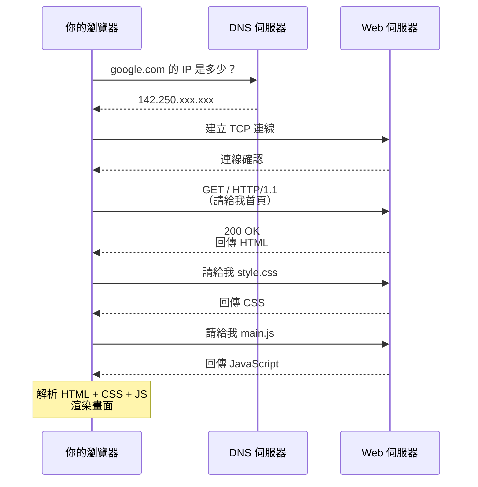
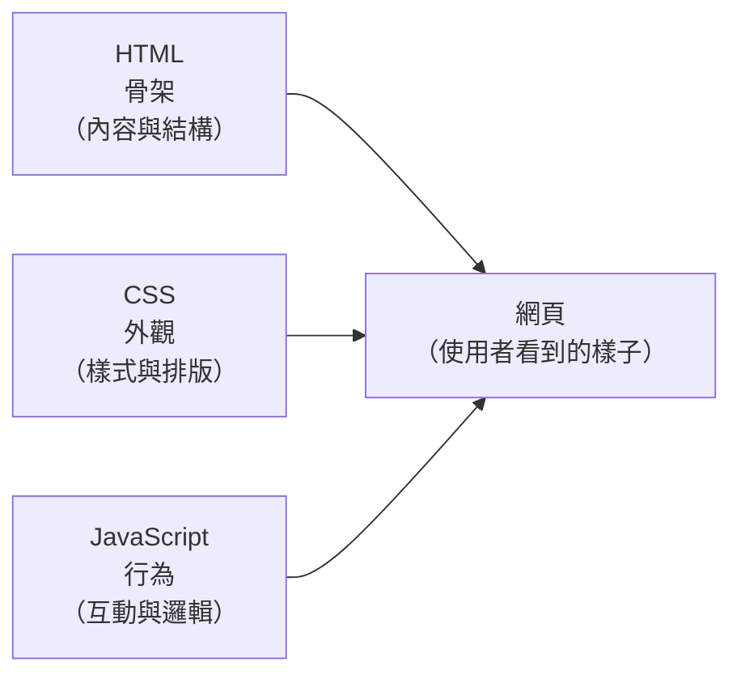

# [3-1] 瀏覽器是怎麼運作的？

> **本章目標**：理解從你在鍵盤上打下網址、按下 Enter，到畫面出現在你眼前，這段旅程裡發生了什麼事。

---

## 你會學到

- 瀏覽器不只是「看網頁的地方」，它是一個完整的程式執行環境
- 輸入網址後，背後經歷的五個關鍵步驟
- HTML、CSS、JavaScript 各自負責什麼角色
- 開發者工具（DevTools）是什麼，以及它能幫你做什麼

---

## 概念說明

### 瀏覽器是什麼？

你可能覺得瀏覽器就是「打開網頁用的」——但它做的事比你想的多很多。

瀏覽器其實是一個**程式執行環境**，它能夠：

- 發送網路請求（去跟伺服器要資料）
- 解析 HTML 和 CSS（把純文字轉換成你看到的畫面）
- 執行 JavaScript（讓網頁有互動性）
- 管理記憶體、處理使用者事件（滑鼠點擊、鍵盤輸入…）

換句話說，瀏覽器不只是一個閱讀器，它更像一個**小型作業系統**，專門用來跑網頁應用程式。

---

### 輸入網址後，發生了什麼？

先用生活語言走過一遍，再看圖：

```
你在瀏覽器打上「https://google.com」，按 Enter

步驟 1 — DNS 查詢（查電話簿）：
  瀏覽器不知道「google.com」在哪台電腦上
  → 去問 DNS 伺服器：「google.com 的 IP 地址是多少？」
  → DNS 回答：「142.250.xxx.xxx」
  （就像你手機通訊錄裡查「阿明」的電話號碼）

步驟 2 — TCP 連線（電話接通）：
  瀏覽器拿到 IP 之後，對那台伺服器「撥號」
  → 雙方確認：「喂？聽到嗎？」「聽到！」（三次握手）
  → 通道建立好，可以開始說話了

步驟 3 — HTTP 請求（點菜）：
  瀏覽器透過這條通道送出請求：
  「我要首頁，請給我 /index.html」
  （就像對服務生說「我要 A 套餐」）

步驟 4 — 伺服器回應（出菜）：
  伺服器收到請求後回傳資料：
  HTML 檔案、CSS 檔案、JavaScript 檔案、圖片…

步驟 5 — 瀏覽器渲染（端上桌）：
  瀏覽器拿到這些資料，解析並畫出你看到的畫面
```

用時序圖來看整個過程：



這張圖說明了：瀏覽器和伺服器之間是**多次往返**的對話，不是一次就拿到所有東西。

---

### HTML / CSS / JavaScript 各自是什麼？

把一個網頁想像成一棟房子：

```
HTML  → 骨架（牆壁、樓板、門窗的位置）
CSS   → 外觀（油漆顏色、窗簾款式、家具擺設）
JS    → 行為（電燈開關、自動門、電梯運作）
```

沒有 CSS 的網頁：有結構但醜，像毛胚屋。
沒有 JS 的網頁：漂亮但靜止，像樣品屋，不能住人。
三者結合：才是一個可以使用的網站。



這張圖說明了：三種技術各司其職，共同組成一個完整的網頁。

---

### 瀏覽器的三個主要工作

瀏覽器拿到伺服器回傳的資料之後，要做三件事：

```
工作 1 — 下載資源：
  解析 HTML，發現「這裡需要 style.css、那裡需要 main.js」
  → 繼續發請求把這些檔案下載回來

工作 2 — 解析與建構：
  把 HTML 文字解析成樹狀結構（DOM Tree）
  把 CSS 解析成樣式規則
  兩者合併，算出每個元素的位置和外觀（Layout + Paint）

工作 3 — 執行 JavaScript：
  下載完 JS 後，交給 JavaScript 引擎執行
  JS 可以修改畫面、處理點擊事件、發送更多網路請求
```

DOM Tree（文件物件模型）這個概念在下一章會深入講，這裡先知道它是「瀏覽器把 HTML 轉成的樹狀結構」就好。

---

### 開發者工具（DevTools）

按下 `F12`（或 `Cmd + Option + I`）就能打開瀏覽器的開發者工具。這是你做前端開發最重要的工具，沒有之一。

它可以讓你：

| 分頁 | 功能 |
|------|------|
| **Elements** | 看 HTML 結構，即時修改樣式 |
| **Console** | 看 JavaScript 的輸出和錯誤訊息 |
| **Network** | 看瀏覽器發出了哪些請求、每個請求花多久 |
| **Sources** | 看並 debug JavaScript 原始碼 |
| **Application** | 看 Cookie、localStorage 等儲存的資料 |

現在就打開你的瀏覽器，按 `F12`，切到 **Network** 分頁，然後重新整理這個頁面。你會看到一堆請求飛出去——那就是瀏覽器在替你工作。

---

## 程式碼範例

### 一個最陽春的 HTML 頁面

下面這段程式碼是一個完整（但非常簡單）的網頁。它展示了 HTML、CSS、JS 三種技術如何在同一個檔案裡共存：

```html
<!DOCTYPE html>
<html lang="zh-TW">
  <head>
    <meta charset="UTF-8" />
    <title>我的第一個網頁</title>
    <style>
      /* CSS：控制外觀 */
      h1 {
        color: steelblue;
      }
    </style>
  </head>
  <body>
    <!-- HTML：骨架 -->
    <h1>你好，世界！</h1>
    <button id="greet-btn">點我</button>

    <script>
      // JavaScript：行為
      // 找到 id 為 "greet-btn" 的按鈕，監聽點擊事件
      document.getElementById('greet-btn').addEventListener('click', () => {
        alert('嗨！你點到我了');
      });
    </script>
  </body>
</html>
```

這段程式碼做了三件事：
1. `<style>` 裡面的 CSS 把標題字改成鋼鐵藍
2. `<body>` 裡面的 HTML 放了一個標題和一個按鈕
3. `<script>` 裡面的 JavaScript 讓按鈕被點擊時跳出一個提示框

把這段存成 `index.html`，直接用瀏覽器打開，就能看到效果。

---

### 用 Network 分頁觀察請求

打開 DevTools → Network，然後在 Console 輸入以下程式碼並按 Enter，就能看到一個真實的 HTTP 請求被送出：

```javascript
// 這段程式碼在瀏覽器的 Console 輸入執行
// fetch 是瀏覽器內建的函式，用來發送 HTTP 請求
fetch('https://jsonplaceholder.typicode.com/todos/1')
  .then(response => response.json())
  .then(data => console.log(data));
```

執行後切到 Network 分頁，你會看到一筆新的請求出現，點進去可以看到請求的 Headers 和回傳的資料。這就是真實的前後端溝通過程。

---

## 小練習

**練習 1**：打開任何一個你常用的網站，按 F12 開啟 DevTools，切到 **Network** 分頁後重新整理頁面。

- 數一下，這個網站總共發出了幾個請求？
- 找一個 HTML 類型的請求，點進去看 **Response** 分頁，你看到了什麼？

**練習 2**：用文字（不用程式碼）回答：「當你在 Instagram 按下愛心，瀏覽器做了哪些事？」

用這個 pseudo code 格式來回答：

```
使用者點了愛心之後：
  1. ...
  2. ...
  3. ...
```

沒有標準答案，試著用這章學到的概念推理看看。

**練習 3**：建立一個 `index.html` 檔案，把上面的「最陽春的 HTML 頁面」範例貼進去，用瀏覽器打開。然後：

- 把 `steelblue` 改成 `tomato`，重新整理，看看標題顏色變了嗎？
- 把 `alert('嗨！你點到我了')` 改成 `console.log('你點到我了')`，點按鈕後去 Console 分頁，看看有沒有出現訊息？

---

## 課外讀物

> 好奇 DNS 查詢、TCP 連線的細節 → [課外讀物 E-3-1：網際網路是怎麼運作的？](../../../課外讀物/E-3-network/E-3-1-how-internet-works.md)
