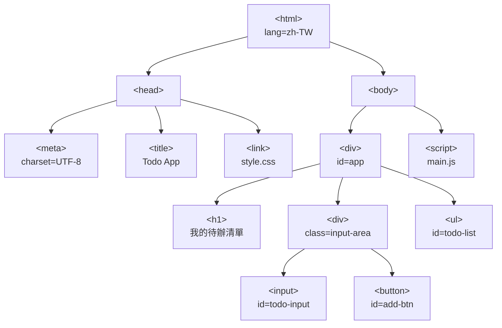

# [3-2] HTML 的本質：一棵樹

> **本章目標**：理解什麼是 DOM Tree，以及為什麼學會「看出樹狀結構」是寫前端的關鍵基本功。

---

## 你會學到

- HTML 不是普通的文字格式，它其實是一棵**樹**
- 用家族樹的概念理解父節點、子節點、兄弟節點
- 最常用的 HTML 標籤，各自負責什麼用途
- `id` 和 `class` 屬性的差別與使用時機
- 一個真實的 Todo App HTML 骨架長什麼樣子

---

## 概念說明

### HTML 不是文字格式，是一棵樹

你第一次看到 HTML 可能會覺得：「這不就是有一堆尖括號的文字嗎？」

表面上看是這樣，但瀏覽器讀到 HTML 的第一件事，不是把它當文字顯示，而是把它**解析成一棵樹**。這棵樹叫做 **DOM Tree**（Document Object Model，文件物件模型）。

為什麼是樹？因為 HTML 的標籤有**包含關係**：

```
比喻：想像一個家族族譜

老祖宗：<html>
  ├── 父輩：<head>（網頁的設定、meta 資訊）
  └── 父輩：<body>（所有看得到的內容）
        ├── 子輩：<div>
        │     ├── 孫輩：<h1>
        │     └── 孫輩：<p>
        └── 子輩：<footer>
```

每一個 HTML 標籤就是樹上的一個**節點**（Node）。節點與節點之間的關係：

- **父節點**（Parent）：包住你的那個標籤
- **子節點**（Child）：被你包住的標籤
- **兄弟節點**（Sibling）：跟你同一層、同一個父節點的標籤

這個概念很重要，因為之後用 JavaScript 操作畫面（例如「找到那個按鈕」「在清單裡新增一行」），你在找的就是這棵樹上的節點。

---

### 為什麼要用樹狀結構？

你可能會想：「為什麼不用清單就好？」

原因是網頁的內容有天然的層次關係：

```
一篇文章（article）
  ├── 標題（h1）
  ├── 第一段（p）
  ├── 一個區塊（div）
  │     ├── 小標題（h2）
  │     └── 第二段（p）
  └── 圖片（img）
```

這種「裡面還有裡面」的結構，用樹來表示最自然。樹狀結構還有一個好處：你可以用**遞迴**的方式遍歷所有節點——這是電腦科學裡非常優雅的解法，之後學到 JavaScript 的時候你會感受到它的威力。

---

### 常用 HTML 標籤速覽

不需要記住所有標籤，先掌握這幾類就夠用了。

**結構類**：用來劃分頁面區域

| 標籤 | 用途 |
|------|------|
| `<div>` | 通用容器，沒有特定語意，最常用 |
| `<section>` | 一個有主題的區塊（例如「關於我們」） |
| `<header>` | 頁首區域 |
| `<main>` | 頁面主要內容 |
| `<footer>` | 頁尾區域 |

**文字類**：用來顯示文字

| 標籤 | 用途 |
|------|------|
| `<h1>` ~ `<h3>` | 標題，數字越大字越小，`h1` 最重要 |
| `<p>` | 段落文字 |
| `<span>` | 行內的小區塊，用來對一段文字做樣式處理 |

**互動類**：用來讓使用者輸入或操作

| 標籤 | 用途 |
|------|------|
| `<button>` | 按鈕 |
| `<input>` | 輸入框（文字、密碼、勾選框…） |
| `<form>` | 表單容器，包住一組輸入欄位 |

**連結與媒體**：

| 標籤 | 用途 |
|------|------|
| `<a>` | 超連結，`href` 屬性放連結目標 |
| `` | 圖片，`src` 屬性放圖片路徑 |
| `<ul>` / `<li>` | 無序清單 / 清單項目 |

---

### HTML Attributes（屬性）

標籤可以有額外的資訊，寫在開頭標籤的角括號裡，這些叫做**屬性**（Attribute）：

```
pseudo code：

<標籤名稱  屬性名稱="屬性值">  內容  </標籤名稱>

例如：
<a  href="https://google.com">  點我去 Google  </a>

<input  type="text"  placeholder="請輸入名稱"  />
```

最重要的兩個屬性是 `id` 和 `class`：

```
id：唯一識別碼
  → 整個頁面裡，同一個 id 只能出現一次
  → 就像身分證字號，每個人唯一

class：分類標籤
  → 可以有多個元素共用同一個 class
  → 就像職業，「工程師」可以有很多人

用法比較：
  <div id="main-header">頁首</div>       → 整頁只有一個頁首
  <div class="card">卡片 A</div>         → 可以有很多張卡片
  <div class="card featured">卡片 B</div> → 一個元素可以有多個 class
```

`id` 通常用在 JavaScript 裡「找到這個特定元素」，`class` 則主要用在 CSS 裡「套用這個樣式給所有同類元素」。

---

## 程式碼範例

### Todo App 的 HTML 骨架

下面是一個 Todo App（待辦清單）的 HTML 骨架。先看程式碼，再看樹狀圖——把兩者對照著看，你就能真正「看見」那棵樹。

這段程式碼建立了一個待辦清單 App 的完整結構：一個輸入框加上「新增」按鈕，以及一個空的清單容器（清單項目之後用 JavaScript 動態加入）。

```html
<!DOCTYPE html>
<html lang="zh-TW">
  <head>
    <meta charset="UTF-8" />
    <title>Todo App</title>
    <link rel="stylesheet" href="style.css" />
  </head>
  <body>
    <div id="app">
      <h1>我的待辦清單</h1>
      <div class="input-area">
        <input type="text" id="todo-input" placeholder="新增待辦事項..." />
        <button id="add-btn">新增</button>
      </div>
      <ul id="todo-list"></ul>
    </div>
    <script type="module" src="main.js"></script>
  </body>
</html>
```

逐行說明重點：

- `<!DOCTYPE html>`：告訴瀏覽器「這是現代 HTML5 檔案」
- `<html lang="zh-TW">`：整棵樹的根，`lang` 屬性告訴瀏覽器這是繁體中文頁面（有助於無障礙輔助工具）
- `<meta charset="UTF-8">`：宣告使用 UTF-8 編碼，才能正確顯示中文
- `<link rel="stylesheet" href="style.css" />`：引入外部 CSS 檔案
- `<div id="app">`：整個應用程式的根容器，後面 JavaScript 會以它為起點操作 DOM
- `<ul id="todo-list"></ul>`：現在是空的，JavaScript 執行後會動態塞入 `<li>` 項目
- `<script type="module" src="main.js"></script>`：放在 `</body>` 前，確保 HTML 已經解析完才執行 JS；`type="module"` 開啟 ES Module 語法支援

---

### 這個 HTML 骨架對應的 DOM Tree



這張圖說明了：HTML 的每一個標籤都是樹上的一個節點，縮排的層次關係直接對應到樹的父子關係。

---

### 用 JavaScript 找到樹上的節點（預告）

現在只要先看、先有印象，之後章節會詳細說明：

```javascript
// 這段程式碼在瀏覽器執行，「進入」那棵樹，找到特定節點

// 用 id 找到唯一的節點
const addButton = document.getElementById('add-btn');

// 用 id 找到輸入框
const todoInput = document.getElementById('todo-input');

// 用 id 找到清單容器
const todoList = document.getElementById('todo-list');

// 點擊按鈕時，把輸入框的文字加進清單
addButton.addEventListener('click', () => {
  const newItem = document.createElement('li');
  // 從輸入框取值，用來建立新的清單項目
  newItem.textContent = todoInput.value;
  todoList.appendChild(newItem);
  todoInput.value = '';
});
```

注意 `getElementById`、`createElement`、`appendChild` 這些方法名稱——它們都在操作「元素」（Element），也就是 DOM Tree 上的節點。這不是巧合，這正是 DOM 這個概念存在的意義：讓 JavaScript 有辦法找到、修改、新增、刪除樹上的任何節點。

---

## 小練習

**練習 1**：看下面這段 HTML，在紙上（或任何地方）畫出它的 DOM Tree：

```html
<body>
  <header>
    <h1>我的部落格</h1>
    <nav>
      <a href="/">首頁</a>
      <a href="/about">關於我</a>
    </nav>
  </header>
  <main>
    <article>
      <h2>第一篇文章</h2>
      <p>文章內容在這裡。</p>
    </article>
  </main>
</body>
```

畫完後問自己：`<h2>` 的父節點是誰？`<a href="/">` 和 `<a href="/about">` 是什麼關係？

**練習 2**：建立一個 `index.html` 檔案，把 Todo App 的骨架貼進去，用瀏覽器打開。

然後按 `F12` 打開 DevTools，切到 **Elements** 分頁。用滑鼠展開各個節點，試著找到 `id="todo-input"` 和 `id="add-btn"` 這兩個元素。

> 小技巧：點 Elements 分頁左上角的箭頭圖示，再點頁面上的按鈕，DevTools 會自動定位到那個節點。

**練習 3**：在 Todo App 的骨架基礎上，新增一個「頁首」區塊，讓最終結構如下：

```
<div id="app">
  ├── <header>（包含 <h1> 和一段描述文字 <p>）
  ├── <div class="input-area">（原本的輸入區）
  └── <ul id="todo-list">（原本的清單）
```

不需要寫 CSS，只要讓 HTML 結構正確。完成後用 DevTools 的 Elements 分頁確認樹狀結構和你預期的一樣。
