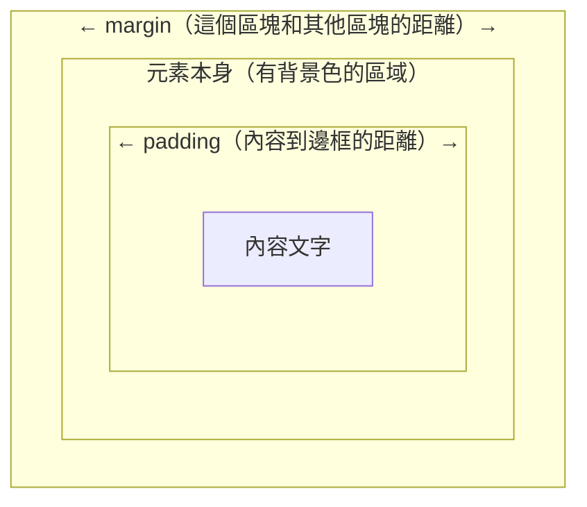
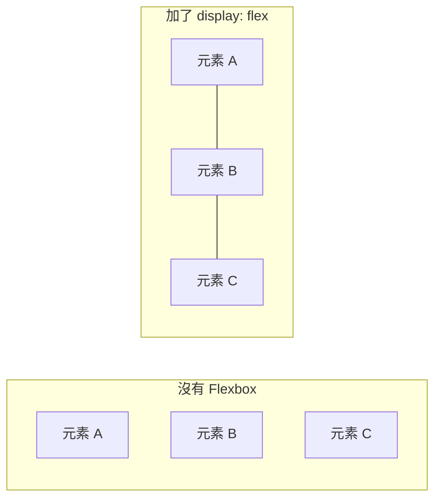

# [3-3] CSS 最低限度：讓東西看起來不那麼醜

> **本章目標**：學會用 CSS 控制基本樣式，讓頁面從「純文字加方框」變成乾淨、可讀的介面。

## 你會學到

- CSS 是什麼，以及它和 HTML 的分工關係
- CSS 的基本語法：選擇器、屬性、值
- 三種最常用的選擇器：標籤、class、id
- 最實用的 CSS 屬性：文字、間距、背景、邊框、寬高
- Flexbox 基礎排版：讓元素乖乖排好

---

## 概念說明

### CSS 是什麼？

HTML 決定「有什麼」，CSS 決定「長什麼樣子」。

用房子來比喻：

```
HTML = 房子的結構（牆壁、門、窗戶在哪裡）
CSS  = 房子的裝潢（牆壁要漆什麼顏色、窗戶要做多大）
```

如果你在 3-2 打開過純 HTML 的頁面，你會看到黑字白底、藍色連結、沒有任何間距——那就是沒有 CSS 的世界。CSS 的工作，就是告訴瀏覽器：「這個元素要長這樣。」

---

### CSS 的基本語法

CSS 的結構很固定，就三個部分：

```
選擇器 {
  屬性: 值;
  屬性: 值;
}
```

用中文解釋就是：

```
你要改哪個元素 {
  要改什麼: 改成什麼;
}
```

舉個最簡單的例子：

```
p {
  顏色: 紅色;
  字體大小: 16px;
}
```

翻譯：「所有的 `<p>` 元素，字體顏色設成紅色，大小設成 16px。」

---

### 三種選擇器

實際寫 CSS 的時候，你需要「瞄準」特定的元素。常用的選擇器有三種：

```
標籤選擇器  →  直接寫標籤名稱，影響所有同類標籤
class 選擇器 →  .類別名稱，影響所有加了這個 class 的元素
id 選擇器   →  #id名稱，只影響那一個特定元素
```

用視覺化方式對應到 HTML：

```html
<!-- HTML 長這樣 -->
<div id="app">
  <div class="container">
    <p>一段文字</p>
  </div>
</div>
```

```
CSS 怎麼選到它：

p            → 選到 <p>（所有 p 標籤）
.container   → 選到 class="container" 的 div
#app         → 選到 id="app" 的 div
```

**什麼時候用哪個？**

- **標籤選擇器**：想套用到所有同類元素（例如所有段落都用同樣的字體）
- **class 選擇器**：最常用。同一個 class 可以加在很多元素上，也可以組合多個 class
- **id 選擇器**：一個頁面裡 id 要唯一，通常留給 JavaScript 抓元素用，CSS 較少用

---

### 間距：padding 和 margin

這兩個是最容易搞混的 CSS 屬性，用房間比喻會清楚很多：

```
想像一個房間裡有一張桌子：

padding = 牆壁到桌子的距離（元素的「內部留白」）
margin  = 這個房間和隔壁房間之間的距離（元素和元素之間的「外部空隙」）
```

用圖示理解：



這張圖說明了 margin、padding、元素邊框、內容之間的層層包裹關係。

---

### Flexbox：現代排版的救星

Flexbox（彈性盒子排版）是目前最常用的 CSS 排版方式。在 Flexbox 出現之前，要讓東西「水平置中」是件非常痛苦的事。

核心概念：

```
在父元素加上 display: flex
  ↓
子元素就會自動從「一個疊一個」變成「一排並列」
  ↓
用 justify-content 控制水平方向的排列
用 align-items 控制垂直方向的排列
```



這張圖說明加上 `display: flex` 前後，子元素排列方向的差異。

最常用的三個 Flexbox 屬性：

```
justify-content: center        → 水平置中
justify-content: space-between → 兩端對齊，中間自動分配空間
align-items: center            → 垂直置中
```

---

## 程式碼範例

### 範例一：把 CSS 接上 HTML

在 HTML 的 `<head>` 裡用 `<link>` 引入外部 CSS 檔案：

```html
<!-- index.html -->
<head>
  <meta charset="UTF-8" />
  <title>Todo App</title>
  <link rel="stylesheet" href="style.css" />
</head>
```

`href="style.css"` 告訴瀏覽器：「去找同個目錄下的 `style.css`，把裡面的樣式套用進來。」

---

### 範例二：基本 CSS 屬性示範

這段 CSS 展示最常用的文字和間距屬性，每個屬性後面都附了說明：

```css
/* 重置瀏覽器預設樣式，讓不同瀏覽器的起點一致 */
* {
  box-sizing: border-box; /* padding 和 border 計入寬高，避免意外溢出 */
  margin: 0;
  padding: 0;
}

body {
  font-family: sans-serif; /* 使用系統無襯線字體，在各平台都好看 */
  font-size: 16px;         /* 基礎字體大小 */
  color: #333;             /* 深灰色比純黑色更柔和、更易讀 */
  background-color: #f5f5f5;
}

h1 {
  font-size: 24px;
  font-weight: bold;
  margin-bottom: 16px; /* 標題和下方內容之間留一點距離 */
}

p {
  line-height: 1.6; /* 行高設為字體的 1.6 倍，段落更好讀 */
  margin-bottom: 12px;
}
```

---

### 範例三：Todo App 的完整樣式

延續 3-2 的 HTML，這是讓 Todo App 從「原始」變「可用」的 CSS。

**Before（沒有 CSS 的樣子）**：黑字白底，輸入框和按鈕緊貼在一起，清單沒有間距，整體看起來像是 1995 年的網頁。

**After（加上下面的 CSS）**：頁面有最大寬度並水平置中，卡片有圓角和陰影，輸入區域排成一排，每個 Todo 項目之間有間距並有底線分隔。

```css
/* style.css */

* {
  box-sizing: border-box;
  margin: 0;
  padding: 0;
}

body {
  font-family: -apple-system, BlinkMacSystemFont, "Segoe UI", sans-serif;
  background-color: #f0f2f5;
  color: #333;
  padding: 40px 16px;
}

/* 主容器：置中 + 最大寬度 */
#app {
  max-width: 480px;
  margin: 0 auto; /* 上下 0，左右 auto → 水平置中 */
}

h1 {
  font-size: 28px;
  font-weight: 700;
  margin-bottom: 24px;
  color: #1a1a2e;
}

/* 白色卡片：圓角 + 陰影讓它「浮」起來 */
.card {
  background-color: #ffffff;
  border-radius: 12px;
  padding: 24px;
  box-shadow: 0 2px 8px rgba(0, 0, 0, 0.08);
}

/* 輸入區域：用 Flexbox 讓輸入框和按鈕排成一排 */
.input-area {
  display: flex;
  gap: 8px; /* 子元素之間的間距，比 margin 更方便 */
  margin-bottom: 20px;
}

.input-area input {
  flex: 1; /* 讓輸入框佔滿剩餘空間，按鈕維持固定寬度 */
  padding: 10px 14px;
  border: 1px solid #ddd;
  border-radius: 8px;
  font-size: 15px;
  outline: none; /* 移除預設的藍色外框 */
}

.input-area input:focus {
  border-color: #4a90d9; /* 輸入框被點擊時，邊框改成藍色，提示使用者 */
}

.input-area button {
  padding: 10px 20px;
  background-color: #4a90d9;
  color: #ffffff;
  border: none;
  border-radius: 8px;
  font-size: 15px;
  cursor: pointer; /* 滑鼠移過去會變成手指圖示 */
}

.input-area button:hover {
  background-color: #357abd; /* hover 時顏色稍微變深，給使用者反饋 */
}

/* Todo 清單 */
#todo-list {
  list-style: none; /* 移除圓點 */
}

#todo-list li {
  padding: 12px 0;
  border-bottom: 1px solid #f0f0f0; /* 每個項目之間用細線分隔 */
  font-size: 15px;
}

#todo-list li:last-child {
  border-bottom: none; /* 最後一項不需要底線 */
}
```

---

### 範例四：Flexbox 置中技巧

Flexbox 最常見的用途之一是「水平 + 垂直同時置中」，寫法固定：

```css
.centered-container {
  display: flex;
  justify-content: center; /* 水平置中 */
  align-items: center;     /* 垂直置中 */
  height: 100vh;           /* 讓容器佔滿整個視窗高度 */
}
```

```html
<div class="centered-container">
  <p>我會在頁面正中央</p>
</div>
```

這個組合在做「載入中」畫面或「登入頁」時非常常用，記住它。

---

## 小練習

**練習 1**：在你的 Todo App 裡加上一個「空狀態」提示。當清單是空的時，在 `<ul>` 裡面加一行 `<p class="empty-hint">還沒有任何待辦事項</p>`，然後用 CSS 讓這行字顯示為灰色（`color: #999`）、斜體（`font-style: italic`）、水平置中（`text-align: center`）。

**練習 2**：修改 `.input-area button` 的樣式，讓按鈕的背景色從藍色改成你喜歡的顏色。然後用 `border-radius: 999px` 把它改成膠囊形狀（完全圓角），觀察效果。

**練習 3**：在 `#todo-list li` 加上 `display: flex` 和 `justify-content: space-between`，然後在每個 `<li>` 裡加一個 `<span>刪除</span>`，讓「待辦文字」和「刪除」分別貼在左右兩端。（還不用讓按鈕真的能刪除——那是下一章的事。）
