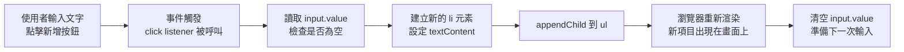

# [3-4] DOM 操作：用 TypeScript 改變畫面

> **本章目標**：學會用 TypeScript 選取 HTML 元素，並透過新增、修改、刪除元素讓畫面即時更新。

## 你會學到

- DOM 是什麼，以及 JavaScript/TypeScript 如何和它互動
- 四種選取元素的方法和各自的適用時機
- TypeScript 中如何處理 DOM 元素的型別問題
- 修改元素的常用操作：文字、樣式、class
- 動態新增和刪除元素

---

## 概念說明

### DOM 是什麼？

DOM（Document Object Model，文件物件模型）是瀏覽器把 HTML 解析完之後，在記憶體裡建立的一棵「樹」。每個 HTML 標籤都是樹上的一個節點。

用工人修樹來比喻：

```
HTML 就是一棵樹：
  <html>
    ├── <head>
    │     └── <title>
    └── <body>
          ├── <h1>
          ├── <div>
          │     ├── <input>
          │     └── <button>
          └── <ul>
                ├── <li>
                └── <li>

JavaScript/TypeScript 就是拿著工具箱的工人：
  可以在樹上找到任何節點（選取元素）
  可以修改節點（改文字、改樣式）
  可以長出新節點（新增元素）
  可以剪掉節點（刪除元素）
```

這棵樹是活的——只要 JavaScript 修改了它，瀏覽器就會立刻重新渲染，畫面馬上更新。這就是「動態網頁」的核心機制。

---

### 四種選取元素的方法

在動手修改任何元素之前，你要先「抓到」它。TypeScript 提供了幾種方式：

```
方法一：document.getElementById("todo-input")
  → 用 id 找，全頁唯一，最精確
  → 找不到回傳 null

方法二：document.querySelector(".container")
  → 用 CSS 選擇器找，回傳第一個符合的
  → 找不到回傳 null

方法三：document.querySelectorAll("li")
  → 用 CSS 選擇器找所有符合的
  → 回傳 NodeList（類似陣列，但不完全是）
  → 找不到回傳空的 NodeList（不是 null）

方法四：element.querySelector("span")
  → 在某個已知元素「裡面」找，縮小範圍
```

什麼時候用哪個？

```
有 id → 用 getElementById，語意最清楚
沒有 id，只找一個 → 用 querySelector
要找多個 → 用 querySelectorAll
已經有父元素，找裡面的 → 用 element.querySelector
```

---

### TypeScript 的型別問題

HTML 裡有很多種元素——`<input>`、`<button>`、`<ul>` 各自有不同的屬性。`getElementById` 不知道你要找的是哪種，所以它只能告訴你：「我回傳的是 `HTMLElement | null`。」

這就帶來兩個問題：

```
問題一：可能是 null
  → 如果 id 不存在，你拿到 null，然後對它呼叫 .value → 程式崩潰

問題二：型別太模糊
  → HTMLElement 沒有 .value 屬性
  → 只有 HTMLInputElement 才有 .value
  → TypeScript 不讓你直接讀，因為它不確定
```

解法：用**型別斷言**（Type Assertion）告訴 TypeScript 確切的型別：

```typescript
// 用 as 告訴 TypeScript：「相信我，這是 HTMLInputElement」
const input = document.getElementById("todo-input") as HTMLInputElement
```

另一個你會看到的寫法是「非空斷言」：

```typescript
// 用 ! 告訴 TypeScript：「相信我，這不是 null」
const input = document.getElementById("todo-input")!
```

**什麼時候用、什麼時候不用？**

```
用 as 和 ! 的前提：你非常確定這個元素存在
  → 例如：HTML 裡你親手寫了 id="todo-input"
  → 這個 id 不會在執行期間消失

不該用的情況：你不確定元素在不在
  → 例如：從 API 動態生成的 HTML，你不能保證某個 id 存在
  → 這種情況應該做 null 檢查
```

> **常見錯誤** — 很多人會這樣寫：
>
> ```typescript
> const input = document.getElementById("todo-input")
> input.value  // ❌ TypeScript 報錯：input 可能是 null
> ```
>
> 問題是：TypeScript 無法確定這行程式跑的時候 DOM 裡有沒有這個元素。直接存取 `.value` 可能在執行期間造成「Cannot read property of null」錯誤。
>
> 正確做法：
>
> ```typescript
> // 當你確定 HTML 裡有這個元素時，用 as 斷言
> const input = document.getElementById("todo-input") as HTMLInputElement
> input.value  // ✅ 現在 TypeScript 知道它是 HTMLInputElement，允許存取 .value
> ```

---

### 修改元素的常用操作

選取到元素之後，有幾種常見的修改方式：

```
改文字：
  element.textContent = "新的文字"
  → 最安全，只改純文字

改 HTML 內容：
  element.innerHTML = "<strong>粗體文字</strong>"
  → 可以插入 HTML 標籤
  → 危險！如果內容來自使用者輸入，要非常小心 XSS 攻擊

改樣式：
  element.style.color = "red"
  element.style.display = "none"

改 class（推薦的樣式切換方式）：
  element.classList.add("active")
  element.classList.remove("active")
  element.classList.toggle("active")  ← 有就移除，沒有就加上
```

**為什麼改樣式要用 classList 而不是 style？**

```
用 element.style 直接改是「內聯樣式」，權重很高，之後很難用 CSS 覆蓋
用 classList 是切換 CSS 裡已經定義好的 class，乾淨又好管理

例子：
  CSS 裡定義 .hidden { display: none; }
  TypeScript 裡用 element.classList.add("hidden") 來藏起來
  → 比 element.style.display = "none" 更容易維護
```

---

### 新增與刪除元素

```
新增流程：
  第一步：建立新元素
    const li = document.createElement("li")
  第二步：設定內容
    li.textContent = "買牛奶"
  第三步：加到父元素
    list.appendChild(li)

刪除流程：
  方法一：從父元素刪除（舊式寫法）
    parent.removeChild(child)
  方法二：直接刪除自己（現代寫法）
    child.remove()
```

---

### 完整流程圖：使用者按下新增按鈕



這張圖說明了從使用者操作到畫面更新的完整鏈路，每一步都對應到一段 TypeScript 程式碼。

---

## 程式碼範例

### 範例一：選取元素與型別斷言

這段程式碼示範如何抓到 Todo App 需要的三個元素，並賦予正確的型別：

```typescript
// 告訴 TypeScript 確切的型別，這樣才能存取各自專有的屬性
const input = document.getElementById("todo-input") as HTMLInputElement
const addBtn = document.getElementById("add-btn") as HTMLButtonElement
const list = document.getElementById("todo-list") as HTMLUListElement

// 現在 TypeScript 知道：
// input.value     → 合法（HTMLInputElement 有 .value）
// addBtn.disabled → 合法（HTMLButtonElement 有 .disabled）
// list.children   → 合法（HTMLUListElement 有 .children）
```

---

### 範例二：建立新元素的函式

這個函式負責「建立一個 Todo 項目的 `<li>` 元素」。注意它的回傳型別是 `HTMLLIElement`，讓呼叫者也知道拿回來的是什麼：

```typescript
// 這是一個純函式：給同樣的 text，永遠回傳同樣結構的 li 元素
function createTodoItem(text: string): HTMLLIElement {
  const li = document.createElement("li")
  li.textContent = text
  return li
}
```

把建立元素的邏輯拆成獨立函式，好處是：之後如果 Todo 項目要加「刪除按鈕」、「勾選框」，只需要修改這一個函式，其他地方不用動。

---

### 範例三：完整的新增 Todo 功能

把前面的所有片段組合起來，實作一個可以運作的 Todo 新增功能：

```typescript
const input = document.getElementById("todo-input") as HTMLInputElement
const addBtn = document.getElementById("add-btn") as HTMLButtonElement
const list = document.getElementById("todo-list") as HTMLUListElement

function createTodoItem(text: string): HTMLLIElement {
  const li = document.createElement("li")
  li.textContent = text
  return li
}

function addTodo(): void {
  // trim() 移除前後空白，避免使用者只按空白鍵就新增一個空項目
  const text = input.value.trim()

  // 如果輸入為空，直接返回，什麼都不做
  if (!text) return

  // 建立新元素並加到清單
  list.appendChild(createTodoItem(text))

  // 清空輸入框，讓使用者可以繼續輸入下一個
  input.value = ""

  // 新增後讓輸入框重新獲得焦點，不用再點一次才能輸入
  input.focus()
}

// 點擊按鈕時執行 addTodo
addBtn.addEventListener("click", addTodo)

// 在輸入框按 Enter 也可以新增（不用每次都移動手去點按鈕）
input.addEventListener("keydown", (event) => {
  if (event.key === "Enter") {
    addTodo()
  }
})
```

---

### 範例四：刪除 Todo 項目

這個範例在每個 Todo 項目上加一個刪除按鈕：

```typescript
function createTodoItem(text: string): HTMLLIElement {
  const li = document.createElement("li")

  // 文字部分
  const span = document.createElement("span")
  span.textContent = text

  // 刪除按鈕
  const deleteBtn = document.createElement("button")
  deleteBtn.textContent = "刪除"

  // 點擊刪除按鈕時，把這個 li 從它的父元素（ul）中移除
  deleteBtn.addEventListener("click", () => {
    li.remove() // 現代寫法，比 parent.removeChild(li) 簡潔
  })

  li.appendChild(span)
  li.appendChild(deleteBtn)

  return li
}
```

注意 `deleteBtn` 的 click 事件裡用了 `li.remove()`——這個箭頭函式在點擊的當下才執行，而那時 `li` 已經在 DOM 裡了，所以可以安全地呼叫 `.remove()`。

---

### 範例五：用 classList 切換完成狀態

點擊 Todo 項目本身，讓它切換「已完成」樣式：

```typescript
function createTodoItem(text: string): HTMLLIElement {
  const li = document.createElement("li")
  li.textContent = text

  // 點擊文字切換完成狀態
  li.addEventListener("click", () => {
    // toggle：有 "completed" class 就移除，沒有就加上
    li.classList.toggle("completed")
  })

  return li
}
```

搭配 CSS 定義 `.completed` 的樣式：

```css
#todo-list li.completed {
  text-decoration: line-through; /* 刪除線 */
  color: #aaa;                   /* 灰色，表示已完成 */
}
```

這樣 TypeScript 只負責「切換 class」，樣式的細節留給 CSS 管理，分工清楚。

---

## 小練習

**練習 1**：在現有的 Todo App 裡，用 `querySelectorAll("li")` 選取所有 `<li>` 元素，並用 `console.log` 印出每個項目的 `textContent`。（先手動在 HTML 裡加幾個 `<li>` 測試，或是新增幾個再跑。）

**練習 2**：加一個「全部清除」按鈕，點擊後清空整個 Todo 清單。提示：把 `list.innerHTML = ""` 就能清空所有子元素——想想這樣做有沒有潛在問題？（想想 `innerHTML` 和 `textContent` 的差別，以及這裡為什麼相對安全。）

**練習 3**：修改 `createTodoItem` 函式，在每個 Todo 項目的最前面加上一個 `<input type="checkbox">`。勾選 checkbox 時，用 `classList.toggle("completed")` 切換完成樣式。完成後，檢查看看：點擊文字區域和點擊 checkbox 各自的行為是否符合預期？
