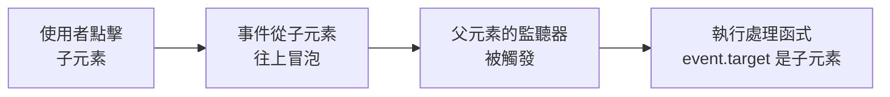

# [3-5] 事件驅動程式設計：「有事發生 → 執行動作」

> **本章目標**：理解事件驅動的思維，學會用 `addEventListener` 處理使用者的各種互動，並掌握「事件委派」這個讓程式碼更有效率的技巧。

## 你會學到

- 什麼是事件驅動（Event-Driven）的程式設計思維
- `addEventListener` 的語法和常用事件類型
- Event 物件是什麼，以及 `event.target`、`event.preventDefault()` 的用途
- 事件委派（Event Delegation）的概念與實作
- 用鍵盤和滑鼠事件延伸 Todo App 的功能

---

## 概念說明

### 程式不是從頭跑到尾

你可能已經習慣這樣想：「程式從第一行跑到最後一行，完成。」但網頁程式不是這樣運作的。

想像一個餐廳服務生：

```
// 不好的設計（同步輪詢）
每隔 1 秒：
    走到每一桌
    問：「請問您需要什麼嗎？」
    如果客人有需求：
        處理需求
```

這樣服務生會累死，而且很惱人。現實世界的設計是：

```
// 好的設計（事件驅動）
服務生待命中...

當 客人按下呼叫鈴：
    走過去
    問：「請問需要什麼？」
    處理需求
```

網頁的事件驅動就是這個模式：**程式平時什麼都不做，等「事件」發生再執行對應的動作**。

---

### addEventListener 的語法

告訴瀏覽器「這個元素發生某件事時，執行這個函式」：

```
目標元素.監聽事件(事件名稱, 要執行的函式)
```

對應到真正的 JavaScript/TypeScript：

```typescript
element.addEventListener(事件名稱, 處理函式)
```

---

### 常用事件類型

| 類別 | 事件名稱 | 觸發時機 |
|------|---------|---------|
| 滑鼠 | `click` | 點擊 |
| 滑鼠 | `dblclick` | 雙擊 |
| 滑鼠 | `mouseenter` | 滑鼠移入元素 |
| 滑鼠 | `mouseleave` | 滑鼠移出元素 |
| 鍵盤 | `keydown` | 按下按鍵（最常用） |
| 鍵盤 | `keyup` | 放開按鍵 |
| 表單 | `submit` | 表單送出 |
| 表單 | `input` | 輸入框內容改變（每打一個字就觸發） |
| 表單 | `change` | 輸入框失焦且內容改變時觸發 |
| 視窗 | `load` | 整個頁面（包含圖片）載入完成 |
| 視窗 | `resize` | 視窗大小改變 |

---

### Event 物件：事件發生時，瀏覽器給你的資訊包

每次事件觸發，瀏覽器都會把一個 `Event` 物件傳給你的處理函式。這個物件裡面裝了所有關於「這次事件」的細節：

```
事件物件 {
    target      → 哪個元素觸發了這個事件
    key         → 按了哪個鍵（鍵盤事件專用）
    preventDefault()  → 取消事件的預設行為
    stopPropagation() → 阻止事件繼續往上冒泡
    ... 還有很多其他屬性
}
```

最常用的三個：

- **`event.target`**：觸發事件的那個元素。你點了一個 `<li>`，`event.target` 就是那個 `<li>`
- **`event.key`**：按了哪個鍵，例如 `"Enter"`、`"Escape"`、`"a"`
- **`event.preventDefault()`**：阻止瀏覽器的預設行為。最常見的用途是阻止 `<form>` 送出後重新整理頁面

---

### 事件冒泡（Event Bubbling）與流程

事件從觸發點開始，會沿著 DOM 樹一路往上傳，就像氣泡從水底浮到水面。



這張圖說明：事件不只在被點擊的元素上觸發，它會一路向上傳遞給所有父元素。

---

### 事件委派（Event Delegation）

**問題：** 如果有一個 Todo 列表，裡面有 100 個 `<li>`，要對每個都加一個 `addEventListener` 嗎？

```
// 很痛苦的做法
對第 1 個 li 加監聽器
對第 2 個 li 加監聽器
對第 3 個 li 加監聽器
...
對第 100 個 li 加監聽器
// 而且之後新增的 li 怎麼辦？
```

**解法：事件委派**

與其在每間辦公室門口派一個警衛，不如在大樓入口統一管理，再根據訪客的識別證決定要不要放行。

```
// 聰明的做法
對 ul 父元素加一個監聽器
    當事件冒泡上來：
        看 event.target 是哪個 li
        根據那個 li 執行對應動作
```

這樣只需要一個監聽器，就能處理所有 `<li>`，包括之後動態新增的那些。

---

## 程式碼範例

### 範例一：基本 click 事件

這段程式碼讓一個按鈕被點擊時，在 `<p>` 裡顯示訊息。

```typescript
const button = document.querySelector<HTMLButtonElement>("#myButton")
const message = document.querySelector<HTMLParagraphElement>("#message")

if (button && message) {
  button.addEventListener("click", () => {
    message.textContent = "你點了按鈕！"
  })
}
```

`document.querySelector<HTMLButtonElement>` 這個寫法告訴 TypeScript：「我知道這個元素是 `<button>`」，讓型別推斷更精確。

---

### 範例二：鍵盤事件 — 用 Enter 送出

這段程式碼讓輸入框在按下 Enter 時觸發動作，而不需要額外的按鈕。注意用 `event.key` 來判斷按了哪個鍵。

```typescript
const input = document.querySelector<HTMLInputElement>("#todoInput")

if (input) {
  input.addEventListener("keydown", (event: KeyboardEvent) => {
    if (event.key === "Enter") {
      const text = input.value.trim()
      if (text !== "") {
        addTodo(text)        // 假設 addTodo 是 3-4 章寫好的函式
        input.value = ""    // 清空輸入框
      }
    }
  })
}
```

---

### 範例三：阻止表單預設行為

這段程式碼展示 `event.preventDefault()` 最經典的用途：阻止 `<form>` 送出後重新整理頁面。

```typescript
const form = document.querySelector<HTMLFormElement>("#todoForm")

if (form) {
  form.addEventListener("submit", (event: SubmitEvent) => {
    event.preventDefault()    // 沒有這行，頁面會重整，所有 JS 狀態都會消失

    const input = form.querySelector<HTMLInputElement>("input")
    if (input) {
      addTodo(input.value.trim())
      input.value = ""
    }
  })
}
```

> **常見錯誤** — 很多人會忘記 `event.preventDefault()`：
> 表單送出後頁面瞬間重新整理，所有 Todo 消失，以為是 bug。
> 原因是 `<form>` 的預設行為就是送出後重整頁面，必須明確阻止它。

---

### 範例四：事件委派刪除 Todo

這段程式碼用事件委派，讓整個列表只需要一個監聽器就能處理所有刪除按鈕。

每個 Todo 項目的 HTML 結構長這樣：
```html
<li data-id="1">
  買牛奶
  <button class="delete-btn">刪除</button>
</li>
```

TypeScript 處理邏輯：

```typescript
const todoList = document.querySelector<HTMLUListElement>("#todoList")

if (todoList) {
  todoList.addEventListener("click", (event: MouseEvent) => {
    const target = event.target as HTMLElement

    // 確認點的是刪除按鈕，而不是 li 上的其他地方
    if (target.classList.contains("delete-btn")) {
      const listItem = target.closest<HTMLLIElement>("li")
      const id = listItem?.dataset.id

      if (id) {
        removeTodo(Number(id))   // 假設 removeTodo 是 3-4 章寫好的函式
      }
    }
  })
}
```

`closest("li")` 會從 `target` 開始往上找，回傳最近的 `<li>` 祖先元素。這樣即使按鈕內部還有其他元素，也能正確找到對應的 `<li>`。

---

### 綜合範例：完整的 Todo 鍵盤 + 委派刪除

這段程式碼把上面幾個概念整合在一起，讓 Todo App 支援用 Enter 新增，點刪除按鈕刪除。

```typescript
interface TodoItem {
  id: number
  text: string
}

let todos: TodoItem[] = []
let nextId = 1

function renderTodos(): void {
  const todoList = document.querySelector<HTMLUListElement>("#todoList")
  if (!todoList) return

  todoList.innerHTML = todos
    .map(
      todo => `
        <li data-id="${todo.id}">
          ${todo.text}
          <button class="delete-btn">刪除</button>
        </li>
      `
    )
    .join("")
}

function addTodo(text: string): void {
  todos = [...todos, { id: nextId++, text }]
  renderTodos()
}

function removeTodo(id: number): void {
  todos = todos.filter(todo => todo.id !== id)
  renderTodos()
}

// 用 Enter 新增
const input = document.querySelector<HTMLInputElement>("#todoInput")
if (input) {
  input.addEventListener("keydown", (event: KeyboardEvent) => {
    if (event.key === "Enter") {
      const text = input.value.trim()
      if (text !== "") {
        addTodo(text)
        input.value = ""
      }
    }
  })
}

// 事件委派：點刪除按鈕
const todoList = document.querySelector<HTMLUListElement>("#todoList")
if (todoList) {
  todoList.addEventListener("click", (event: MouseEvent) => {
    const target = event.target as HTMLElement
    if (target.classList.contains("delete-btn")) {
      const listItem = target.closest<HTMLLIElement>("li")
      const id = listItem?.dataset.id
      if (id) {
        removeTodo(Number(id))
      }
    }
  })
}
```

> 這裡的 `addTodo` 和 `removeTodo` 各自只做一件事，這正是 Single Responsibility Principle 的概念 → **[課外讀物 E-7-2] S — Single Responsibility Principle**

---

## 小練習

**練習一**

在頁面上放一個 `<div>`，讓它在滑鼠移入時背景變成藍色，移出時恢復白色。（提示：`mouseenter` 和 `mouseleave`，用 `element.style.backgroundColor` 改顏色）

**練習二**

製作一個字數計算器：有一個 `<textarea>` 和一個 `<span>`，每次輸入內容時，`<span>` 即時顯示目前輸入了幾個字元。（提示：用 `input` 事件，`event.target` 的 `value.length`）

**練習三**

延伸本章的 Todo App 範例，加入以下功能：
- 按下 `Escape` 鍵時清空輸入框（提示：`event.key === "Escape"`）
- 雙擊（`dblclick`）某個 Todo 項目時，把它標記為完成（加上刪除線樣式）：用事件委派監聽整個列表，在 `li` 上切換 CSS class

## 課外讀物

> 這章介紹的函式拆分方式（`addTodo`、`removeTodo` 各做一件事），正是 SOLID 裡「S」原則的體現 → [課外讀物 E-7-2：S — Single Responsibility Principle](../../../課外讀物/E-7-solid/E-7-2-srp.md)

> 想讓函式命名更清楚、更有表達力 → [課外讀物 E-6-2：命名的藝術](../../../課外讀物/E-6-best-practices/E-6-2-naming.md)
