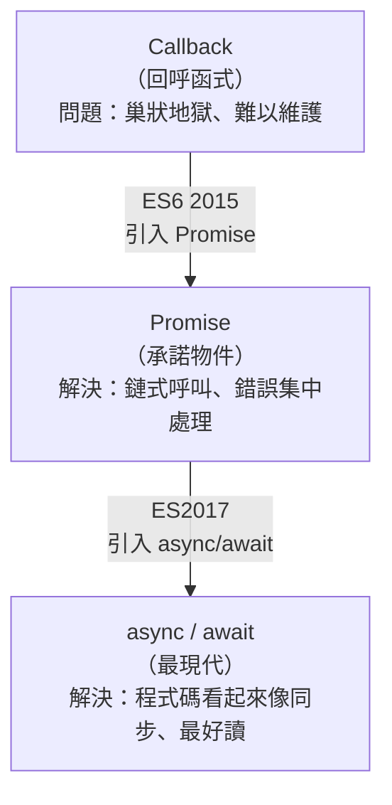
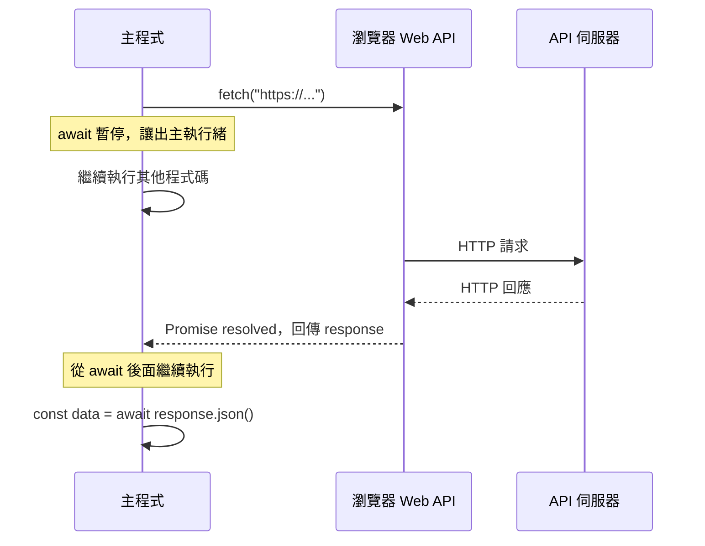

# [3-6] 非同步思維：`setTimeout` / `Promise` / `async-await`

> **本章目標**：理解為什麼 JavaScript 需要非同步，看懂三種寫法的演進歷史，並用 `async/await` 寫出乾淨的非同步程式碼。

## 你會學到

- 同步與非同步的本質差異，以及為什麼網頁需要非同步
- JavaScript 事件迴圈（Event Loop）的運作方式（用類比理解，不死記細節）
- 從 Callback → Promise → `async/await` 的演進，以及每一步解決了什麼問題
- 如何用 `async/await` 搭配 `try/catch` 處理錯誤
- 用 `setTimeout` 包成 Promise，模擬真實的 API 呼叫

---

## 概念說明

### 同步 vs 非同步

**同步（Synchronous）**：一件事做完才做下一件。

```
// 同步：泡咖啡
把水燒開（等 3 分鐘）
→ 水燒好了
→ 倒入咖啡杯
→ 喝咖啡
```

這 3 分鐘你什麼都不能做，只能站在爐子旁邊等。

**非同步（Asynchronous）**：把需要等待的工作交出去，繼續做其他事，等工作完成再回來處理。

```
// 非同步：餐廳點餐
走到櫃台點餐
→ 拿到號碼牌（工作交給廚房了）
→ 去找位子、滑手機、和朋友聊天（繼續做其他事）
→ 聽到叫號：XX 號取餐
→ 回去拿餐
```

**為什麼網頁需要非同步？**

想像你點擊一個按鈕，網頁要去跟伺服器拿資料，而伺服器在地球另一端，需要 500 毫秒才能回應。

```
// 如果是同步：
使用者點擊按鈕
→ 程式卡住，等待 500ms
→ 在這 500ms 內：頁面完全凍住
→ 滑鼠無法移動、按鈕沒反應、動畫停止
→ 使用者以為當機了
```

這就是為什麼 JavaScript 從一開始就是非同步的語言。

---

### 事件迴圈（Event Loop）的比喻

JavaScript 的主執行緒就像一個廚師，一次只能做一件事。

```
廚師（主執行緒）的工作桌：
┌─────────────────────┐
│  現在正在切菜        │  ← 主執行緒一次只做一件事
└─────────────────────┘

餐廳的其他人（瀏覽器 Web APIs）：
  - 服務生去等客人呼叫鈴（setTimeout）
  - 外送員去拿外送（fetch API）
  - 收銀台在結帳（其他非同步工作）

等候區（任務佇列）：
  - 服務生回來了，等廚師切完菜再處理
  - 外送員拿到了，排隊等廚師有空
```

重點：**廚師（主執行緒）一次只做一件事，非同步工作由別人代勞，完成後排隊等廚師有空再繼續**。這個「排隊機制」就是事件迴圈（Event Loop）。

---

### 三種非同步寫法的演進



這張圖說明三種寫法是依序演進的，每個都解決了上一個的主要痛點。

---

### 第一階段：`setTimeout` — 最基本的非同步

`setTimeout` 讓你在「指定毫秒後」執行某段程式碼。它是學習非同步最入門的起點。

先看這段程式碼的執行順序：

```javascript
console.log("開始")           // 第 1 行先執行

setTimeout(() => {
  console.log("1 秒後")       // 這行最後執行
}, 1000)

console.log("這行先印出來")   // 第 2 行執行，不等 setTimeout
```

執行結果：
```
開始
這行先印出來
1 秒後
```

這就是非同步的核心：`setTimeout` 把工作「丟出去」，主執行緒繼續往下走，不等它完成。

---

### 第二階段：Callback（回呼）— 早期的非同步模式

Callback 就是「把函式當作參數傳給另一個函式，等非同步工作完成後呼叫它」。

```
// 概念
做某件非同步的事（當完成時，呼叫這個函式）
```

早期的 AJAX 請求就是這樣寫的。問題是：當非同步工作有多個步驟時，Callback 會層層巢狀，形成「回呼地獄（Callback Hell）」：

```javascript
// 回呼地獄示範：取得使用者 → 取得訂單 → 取得商品
getData(function(user) {
  getOrders(user.id, function(orders) {
    getProducts(orders[0].id, function(products) {
      console.log(products)   // 縮排越來越深
      // 如果還有更多步驟，就繼續往右縮排下去...
    })
  })
})
```

> **常見錯誤** — 早期很多人都這樣寫：
> 程式碼像一個倒三角形，越縮越右，被稱為「末日金字塔（Pyramid of Doom）」。
> 問題不只是醜，而是：錯誤處理要在每一層分別寫、難以追蹤執行順序、幾乎無法重構。

---

### 第三階段：Promise — 解決回呼地獄

Promise（承諾）是一個物件，代表「一個還沒完成、但最終會完成的非同步操作」。

```
// Promise 的三種狀態
等待中（Pending）   → 非同步工作還在執行
已完成（Fulfilled） → 工作成功，有結果
已失敗（Rejected）  → 工作失敗，有錯誤原因
```

用 `.then()` 鏈式呼叫，把回呼地獄拍平：

```typescript
fetch("https://api.example.com/todos")
  .then(response => response.json())          // 第一步：把回應轉成 JSON
  .then(data => console.log(data))            // 第二步：印出資料
  .catch(error => console.error(error))       // 統一的錯誤處理
```

相比回呼地獄，這樣的鏈式呼叫好讀多了。但 `.then().then().then()` 多了之後，還是有點不直覺，需要理解「這個 `.then()` 拿到的是上一個 `.then()` 回傳的值」。

---

### 第四階段：async/await — 讓非同步程式碼看起來像同步

`async/await` 是 Promise 的語法糖（Syntactic Sugar）——底層還是 Promise，但寫起來像在寫同步程式碼。

規則：
- 在函式前加 `async`，這個函式就會回傳 `Promise`
- 在 Promise 前加 `await`，程式會「暫停等待」這個 Promise 完成，再繼續往下執行
- 用 `try/catch` 處理錯誤，和同步程式碼一模一樣

```typescript
async function fetchTodos(): Promise<Todo[]> {
  try {
    const response = await fetch("https://api.example.com/todos")  // 等 fetch 完成
    const data = await response.json()                              // 等轉 JSON 完成
    return data
  } catch (error) {
    console.error("取得失敗：", error)
    return []
  }
}
```

對比一下 Promise 版本：同樣的邏輯，`async/await` 版本更貼近「從上到下閱讀」的直覺。

---

### 非同步流程圖：瀏覽器如何處理 API 請求



這張圖說明：`await` 不是讓整個程式凍住，而是讓「這個函式」暫停，把主執行緒還給其他程式使用，等 Promise 完成後再繼續。

---

## 程式碼範例

### 範例一：用 setTimeout 模擬 API 延遲

在真正串接後端 API 之前，我們可以用這個技巧「假裝」有一個很慢的 API，用來測試 UI 的「載入中」狀態。

`delay` 函式把 `setTimeout` 包成一個 Promise，讓它可以被 `await`：

```typescript
function delay(ms: number): Promise<void> {
  return new Promise(resolve => setTimeout(resolve, ms))
}
```

然後就可以這樣用：

```typescript
async function loadTodos(): Promise<void> {
  console.log("載入中...")
  await delay(1000)              // 等 1 秒，模擬 API 回應時間
  console.log("載入完成！")
}

loadTodos()
```

執行後會先印出「載入中...」，過 1 秒再印出「載入完成！」。

---

### 範例二：模擬從 API 拿到 Todo 資料

這段程式碼用 `delay` 模擬一個真實 API，回傳假資料。這個模式在 Part 4 串接真實後端之前非常有用。

```typescript
interface Todo {
  id: number
  text: string
  isDone: boolean
}

// 假的 API 函式：模擬從伺服器取得 Todo 列表
async function fetchTodos(): Promise<Todo[]> {
  await delay(800)   // 模擬網路延遲 800ms

  // 假裝這是從伺服器回來的資料
  return [
    { id: 1, text: "買牛奶", isDone: false },
    { id: 2, text: "寫作業", isDone: true },
    { id: 3, text: "運動", isDone: false },
  ]
}

// 在初始化時呼叫
async function init(): Promise<void> {
  const loadingText = document.querySelector<HTMLParagraphElement>("#loading")
  const todoList = document.querySelector<HTMLUListElement>("#todoList")

  if (loadingText) loadingText.textContent = "載入中..."

  const todos = await fetchTodos()   // 等待假 API

  if (loadingText) loadingText.textContent = ""

  if (todoList) {
    todoList.innerHTML = todos
      .map(todo => `<li>${todo.text}</li>`)
      .join("")
  }
}

init()
```

---

### 範例三：async/await 的錯誤處理

非同步操作很可能失敗（網路斷線、伺服器錯誤等），所以一定要處理錯誤。這段程式碼展示標準的錯誤處理寫法。

```typescript
// 模擬有時會失敗的 API
async function fetchWithError(): Promise<Todo[]> {
  await delay(500)

  // 模擬 30% 的機率失敗
  if (Math.random() < 0.3) {
    throw new Error("伺服器暫時無法使用，請稍後再試")
  }

  return [{ id: 1, text: "買牛奶", isDone: false }]
}

async function loadWithErrorHandling(): Promise<void> {
  try {
    const todos = await fetchWithError()
    console.log("成功取得：", todos)
  } catch (error) {
    // error 的型別在 TypeScript 是 unknown，需要先判斷
    if (error instanceof Error) {
      console.error("載入失敗：", error.message)
    }
  }
}
```

> **常見錯誤** — 很多人寫 `async` 函式但沒有 `try/catch`：
> ```typescript
> // 危險的寫法
> async function loadTodos() {
>   const data = await fetch("...")   // 如果失敗，會產生未捕獲的 Promise rejection
>   return data.json()
> }
> ```
> 沒有捕獲的錯誤會在瀏覽器 console 顯示警告，在 Node.js 甚至可能讓程式崩潰。
> 凡是 `await` 的地方都可能出錯，一定要包在 `try/catch` 裡。

---

## 小練習

**練習一**

把下面的 Promise 鏈式寫法，改寫成 `async/await` 版本（答案應該只需要幾行）：

```typescript
function getUserName(): Promise<string> {
  return fetch("https://api.example.com/user")
    .then(res => res.json())
    .then(user => user.name)
    .catch(() => "匿名使用者")
}
```

**練習二**

寫一個 `simulateSave` 函式，模擬「儲存資料到伺服器」這個動作：
- 接受一個字串參數 `text`（要儲存的內容）
- 等待 1.2 秒（模擬網路延遲）
- 如果 `text` 是空字串，丟出一個錯誤 `"不能儲存空內容"`
- 否則印出 `"儲存成功：{text}"`

用 `async/await` 和 `try/catch` 實作，呼叫時也要有錯誤處理。

**練習三**

延伸練習二，在頁面上加入以下互動：
- 一個輸入框和一個「儲存」按鈕
- 點擊按鈕時，按鈕文字改成「儲存中...」，並停用按鈕（`button.disabled = true`）
- 呼叫 `simulateSave`，等待完成後把按鈕文字改回「儲存」並重新啟用
- 如果出錯（空字串），在頁面上顯示錯誤訊息

（提示：這個練習需要結合 3-5 章的 `addEventListener` 和本章的 `async/await`）
