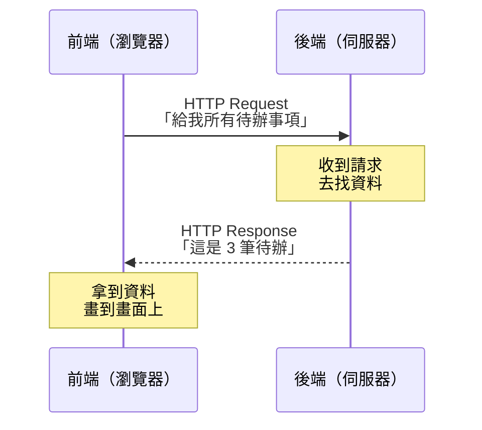
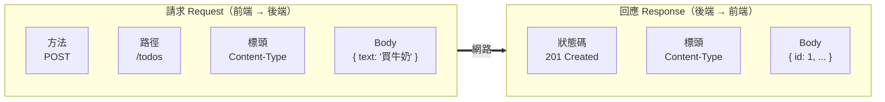

# [4-A-1] HTTP 是什麼？Request / Response 圖解

> **本章目標**：理解前端和後端之間「怎麼講話」——HTTP 請求與回應的結構，以及一次溝通到底傳了哪些東西。

## 你會學到

- 為什麼需要 HTTP（Hypertext Transfer Protocol，超文本傳輸協定）這個「共同語言」
- 一個 HTTP 請求（Request）由哪些部分組成
- 一個 HTTP 回應（Response）由哪些部分組成
- 「方法（Method）」和「狀態碼（Status Code）」是什麼，先有個整體印象
- 看懂瀏覽器 DevTools 裡的一筆網路請求

---

## 概念說明

### 先別管程式，先想「點餐」

在 V1，你的 Todo App 資料存在自己的瀏覽器裡，沒有人需要跟別人溝通。但只要資料要離開這台瀏覽器（存到一台伺服器上），前端和後端就得開始「對話」。

問題來了：前端在使用者的瀏覽器、後端在某台伺服器，兩邊是不同的程式、可能在地球兩端，它們要怎麼確保彼此聽得懂？

答案是：**先講好一套固定的對話格式**。這套格式就是 HTTP。

用餐廳點餐來類比：

```
你（前端）走進餐廳，跟服務生（後端）說話。
但你不能亂講，要照餐廳的規矩：

你說：「我要一份（動作）+ 牛肉麵（要什麼）」   ← 這是「請求 Request」
服務生回：「好的，這是你的牛肉麵」              ← 這是「回應 Response」
或服務生回：「抱歉，牛肉麵賣完了」              ← 也是一種「回應」
```

重點有三個，記住它們，HTTP 就懂一半了：

1. **一定是「你先開口」**：永遠是前端發出請求，後端才回應。後端不會主動跟你說話。
2. **一問一答**：一個請求，對應一個回應。
3. **講完這次就忘了你**：服務生送完餐，下一句話他不記得你剛剛點過什麼（這叫「無狀態 Stateless」，之後談認證時會再遇到）。

---

### 一次完整的對話流程



這張圖表達的是：前端開口要東西、後端找好東西回給它，一來一回就結束。這就是你的 Todo App 之後每次「載入清單」「新增一筆」背後發生的事。

---

### 請求（Request）長什麼樣子？

一個 HTTP 請求其實就是一段有固定格式的文字。先用 pseudo code 看它的骨架：

```
動作（Method） + 地址（URL）        ← 「我想對哪個資源做什麼」
一堆附註（Headers）               ← 「補充說明：我是誰、我能接受什麼格式」
（空一行）
夾帶的資料（Body）                ← 「我要送過去的內容」（不是每次都有）
```

對應到真實的請求，會像這樣：

```
POST /todos HTTP/1.1
Host: localhost:3000
Content-Type: application/json

{ "text": "買牛奶" }
```

逐行拆解：

- `POST` 是**方法**：表示「我要新增一筆資料」。
- `/todos` 是**路徑**：表示「對『待辦』這個資源動手」。
- `Content-Type: application/json` 是一個**標頭（Header）**：告訴後端「我夾帶的資料是 JSON 格式」。
- 最後那行 `{ "text": "買牛奶" }` 是 **Body**：真正要送過去的內容。

> 這裡只要先有「請求 = 方法 + 路徑 + 標頭 + Body」的印象就好。每個方法（GET/POST/PUT/DELETE）的完整意義，會在 Part 4-B 專門講。

---

### 回應（Response）長什麼樣子？

後端收到請求、處理完，回給前端的也是一段固定格式的文字：

```
狀態碼（Status Code）             ← 「成功了？還是出錯了？」
一堆附註（Headers）               ← 「補充說明：我回的是什麼格式」
（空一行）
回傳的資料（Body）                ← 「你要的東西在這」
```

對應到真實的回應：

```
HTTP/1.1 201 Created
Content-Type: application/json

{ "id": 1, "text": "買牛奶", "completed": false }
```

逐行拆解：

- `201 Created` 是**狀態碼**：`2` 開頭代表「成功」，`201` 特別指「成功而且建立了新東西」。
- `Content-Type: application/json` 同樣是標頭，這次是後端告訴前端「我回給你的是 JSON」。
- Body 就是後端真正回傳的資料。

狀態碼你大概聽過最有名的那個——`404 Not Found`（找不到頁面）。先記住開頭數字的意思：

```
2xx → 成功（例如 200 OK、201 Created）
4xx → 你（前端）搞錯了（例如 404 找不到、400 請求格式錯）
5xx → 我（後端）出包了（例如 500 伺服器內部錯誤）
```

> 完整的狀態碼意義一樣留到 Part 4-B 細講，這裡先有「數字開頭分類」的概念。

---

### 把請求和回應放在一起看



這張圖把一來一回的兩包東西並排：左邊是前端寄出的「請求」，右邊是後端寄回的「回應」。兩邊的結構很像（都有標頭、都有 Body），差別在開頭——請求開頭是「動作」，回應開頭是「結果」。

---

## 程式碼範例

這一章還沒有要你寫程式（伺服器下一章才建），但你現在就能「親眼看到」一個真實的 HTTP 請求。

### 範例一：用瀏覽器 DevTools 看請求

這段不是要你執行的程式碼，而是一個觀察任務——打開任何網站，看背後的 HTTP 對話：

```
第一步：打開任何一個網站（例如 github.com）
第二步：按 F12 打開 DevTools，切到 Network（網路）頁籤
第三步：重新整理頁面
第四步：點任意一筆請求，看右邊的面板
```

你會看到我們剛剛講的每一個東西：

```
Headers 頁籤：
  Request Method: GET          ← 方法
  Status Code: 200 OK          ← 狀態碼
  Request Headers / Response Headers   ← 兩邊的標頭

Response 頁籤：
  ← 後端回傳的 Body 內容
```

恭喜，你剛剛看到的就是這一章講的所有東西，只是它平常藏在瀏覽器背後默默運作。

---

### 範例二：用 pseudo code 描述前端之後要做的事

下一章建好伺服器後，前端「載入待辦清單」的邏輯會長這樣（先看懂流程，真正的 `fetch` 寫法在 4-A-3）：

```
當頁面載入：
    向後端發出請求（方法 GET，路徑 /todos）
    等後端回應
    如果 狀態碼是 2xx（成功）：
        拿出回應的 Body（一串待辦資料）
        把每一筆畫到畫面上
    否則：
        顯示「載入失敗」
```

注意這裡的「等後端回應」——網路有延遲，這正是你在 [3-6 非同步思維] 學的 `async/await` 要派上用場的地方。

---

## 小練習

**練習 1**：打開 DevTools 的 Network 頁籤，重新整理一個網站，找出一筆請求，回答：它的**方法**是什麼？**狀態碼**是多少？這個狀態碼開頭的數字代表成功還是失敗？

**練習 2**：在 Network 頁籤裡找找看，有沒有狀態碼**不是** `200` 的請求？（提示：`301`、`304`、`404` 都很常見。）挑一個，依照它開頭的數字，判斷它屬於「成功 / 前端錯 / 後端錯」哪一類。

**練習 3**：用自己的話，把「點一杯手搖飲」的過程寫成一組 Request / Response。想想看：你的「方法」是什麼？「路徑（要哪個資源）」是什麼？店員可能回你哪些「狀態碼」（成功、缺料、打烊）？

---

## 課外讀物

> 想搞清楚 HTTP 方法、標頭、狀態碼、Body 的完整含義 → [課外讀物 E-3-3：HTTP 協定詳解](../../../課外讀物/E-3-network/E-3-3-http-protocol.md)

> 好奇從你按下 Enter 到請求抵達伺服器，網路中間到底發生什麼事 → [課外讀物 E-3-1：網際網路是怎麼運作的？](../../../課外讀物/E-3-network/E-3-1-how-internet-works.md)
