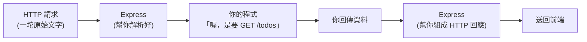

# [4-A-2] 建立第一個 Express 伺服器（10 行程式碼）

> **本章目標**：親手寫出一個會回應 HTTP 請求的後端伺服器，理解「伺服器」其實就是一支「一直在聽、有人問就答」的程式。

## 你會學到

- 「伺服器（Server）」到底是什麼，去除它的神秘感
- 為什麼用 Express 而不是從零開始
- 什麼是「埠號（Port）」，為什麼是 `localhost:3000`
- 用 Express 寫出第一個會回應的 API 端點（Endpoint）
- 怎麼把伺服器跑起來、怎麼測試它有沒有在工作

---

## 概念說明

### 「伺服器」沒有你想的那麼玄

「伺服器」這個詞聽起來像某種放在機房、會發光的神秘機器。但對寫程式的你來說，**伺服器就是一支程式**——一支「啟動後不會結束、一直在等別人來問問題、有人問就回答」的程式。

對比你之前寫的程式：

```
你之前寫的程式（例如 Part 2 的 CLI 工具）：
    開始 → 做事 → 做完 → 結束

伺服器程式：
    開始 → 在某個埠號「待命」
         → 有請求進來 → 處理、回應
         → 繼續待命...
         → 又有請求 → 處理、回應
         → （永遠不主動結束，一直聽）
```

用餐廳類比（延續上一章）：伺服器就是那位**站在櫃台、永遠不下班的服務生**。他不會主動找你，但只要你開口點餐（發請求），他就會回應你。

---

### 什麼是埠號（Port）？

你的電腦上可能同時跑很多支伺服器程式——一支管 Todo、一支管聊天、一支管音樂。它們都在同一台電腦上，請求進來時怎麼知道要交給誰？

答案是**埠號**。可以把它想成「同一棟大樓裡的不同房間號碼」：

```
你的電腦（localhost）就是一棟大樓
    :3000 → 3000 號房（我們的 Todo 伺服器）
    :5432 → 5432 號房（資料庫，之後 Part 5 會遇到）
    :8080 → 8080 號房（別的服務）

請求寫明「我要找 localhost:3000」
→ 作業系統就把它送到 3000 號房
```

`localhost` 是「這台電腦自己」的代稱。所以 `localhost:3000` 的意思就是：「我這台電腦上、3000 號房的那支程式」。開發階段前端和後端都跑在自己電腦上，所以你會一直看到這個位址。

---

### 為什麼用 Express？

HTTP 請求進到你的程式時，本質是一坨原始文字（還記得 4-A-1 那段 `POST /todos HTTP/1.1...` 嗎）。如果什麼工具都不用，你得自己一個字一個字去解析它——非常痛苦。

**Express** 是一個 Node.js 的套件，它幫你把這些苦工都做掉了。你只要用很直覺的方式說：

```
當有人用 GET 方法問 /todos 這個路徑時，
    執行這段程式，回他資料。
```

Express 就會在背後處理所有解析請求、組裝回應的細節。這就是「框架」存在的意義——把重複又繁瑣的底層工作包起來，讓你專注在「業務邏輯」上。



這張圖說明 Express 的角色：它站在「原始 HTTP」和「你的程式」中間，兩邊的翻譯與打包都它在做，你只需要寫中間那塊「拿到請求要回什麼」的邏輯。

---

## 程式碼範例

### 範例一：準備專案

先建立一個資料夾，初始化專案，裝好需要的套件：

```bash
mkdir todo-server
cd todo-server

# 初始化 package.json
npm init -y

# 安裝 Express，以及讓 Node 能跑 TypeScript 的工具
npm install express
npm install -D typescript @types/express @types/node tsx
```

這幾個套件各自的角色：

```
express          → 我們的後端框架
typescript       → 讓我們能用 TypeScript 寫後端
@types/express   → Express 的型別定義（讓 TypeScript 看得懂 Express）
@types/node      → Node.js 內建功能的型別定義
tsx              → 一個能「直接執行 .ts 檔」的工具，不用先手動編譯
```

> 好奇 `npm install` 到底做了什麼、`package.json` 怎麼運作 → [課外讀物 E-2-1：npm 是什麼？package.json 解析](../../../課外讀物/E-2-npm/E-2-1-npm-intro.md)

---

### 範例二：第一個伺服器（真的只要 10 行）

建立 `server.ts`，輸入以下內容。這就是一個完整、會動的後端：

```typescript
import express from "express"

// 建立一個 Express 應用程式實例
const app = express()

// 約定好伺服器要待命在哪個埠號
const PORT = 3000

// 當有人用 GET 方法問 "/" 這個路徑時，回他一句話
app.get("/", (request, response) => {
  response.send("哈囉，我是你的第一個後端伺服器！")
})

// 啟動伺服器，開始在 PORT 上「待命」
app.listen(PORT, () => {
  console.log(`伺服器已啟動，正在 http://localhost:${PORT} 待命`)
})
```

把這段拆開看，其實只有三個動作：

1. **`const app = express()`** — 開一間餐廳（建立伺服器）。
2. **`app.get("/", ...)`** — 訂一條規則：「有人問首頁，就回這句話」。這裡的 `(request, response) => {...}` 是「處理函式」，`request` 是進來的請求、`response` 是你要回出去的回應。
3. **`app.listen(PORT, ...)`** — 開門營業，站到 3000 號房開始接客。

---

### 範例三：跑起來

在 `package.json` 的 `"scripts"` 裡加一行，方便啟動：

```json
{
  "scripts": {
    "dev": "tsx watch server.ts"
  }
}
```

`tsx watch` 的意思是「直接執行 `server.ts`，而且只要我改檔案就自動重啟」。然後：

```bash
npm run dev
```

如果一切正常，終端機會印出：

```
伺服器已啟動，正在 http://localhost:3000 待命
```

注意這時**終端機不會回到你能打字的狀態**——因為伺服器正在「待命」，它沒有結束。這是對的！要停掉它，按 `Ctrl + C`。

---

### 範例四：測試它有沒有在工作

伺服器跑著的同時，有兩種方式可以「去問它問題」：

**方法一：用瀏覽器**

打開瀏覽器，在網址列輸入 `http://localhost:3000`，你就會看到那句「哈囉，我是你的第一個後端伺服器！」。

（在網址列輸入網址，瀏覽器預設就是發一個 `GET` 請求——這正好對上你寫的 `app.get`。）

**方法二：用 curl 指令**

開**另一個**終端機視窗（原本那個還在跑伺服器，不能用），輸入：

```bash
curl http://localhost:3000
```

你會看到伺服器回的那句話直接印在終端機上。`curl` 是一個用指令發 HTTP 請求的工具，之後測試 API 很常用。

> curl 是在終端機裡操作的，對指令還不熟可以看 → [課外讀物 E-1-1：Terminal 是什麼？](../../../課外讀物/E-1-terminal/E-1-1-what-is-terminal.md)

---

### 範例五：多加一個端點

一個伺服器可以有很多條規則（端點）。再加一個回傳 JSON 的端點，預習一下之後 Todo API 的樣子：

```typescript
import express from "express"

const app = express()
const PORT = 3000

app.get("/", (request, response) => {
  response.send("哈囉，我是你的第一個後端伺服器！")
})

// 新增一個端點：回傳 JSON 格式的假待辦資料
app.get("/todos", (request, response) => {
  // response.json() 會自動把物件轉成 JSON，並設好 Content-Type 標頭
  response.json([
    { id: 1, text: "學會 Express", completed: true },
    { id: 2, text: "把前後端串起來", completed: false },
  ])
})

app.listen(PORT, () => {
  console.log(`伺服器已啟動，正在 http://localhost:${PORT} 待命`)
})
```

存檔（`tsx watch` 會自動重啟），用瀏覽器開 `http://localhost:3000/todos`，你會看到一串 JSON。

**注意 `response.send` 和 `response.json` 的差別**：

```
response.send("文字")        → 回純文字
response.json([...])        → 回 JSON，並自動加上 Content-Type: application/json 標頭
```

還記得 4-A-1 說的標頭嗎？`response.json()` 幫你把「我回的是 JSON」這個標頭也設好了——又是框架替你省下的苦工。

---

## 小練習

**練習 1**：把伺服器跑起來，分別用「瀏覽器」和「curl」去訪問 `http://localhost:3000`，確認兩種方式都拿得到回應。

**練習 2**：新增一個端點 `GET /hello`，讓它回傳你的名字。重啟伺服器後，用瀏覽器訪問 `http://localhost:3000/hello` 驗證。

**練習 3**：故意把 `app.listen` 那行的 `PORT` 改成一個已經被佔用的埠號（例如把另一個伺服器也設成 3000），跑跑看會發生什麼錯誤訊息？讀讀那段錯誤，它在告訴你什麼？（提示：關鍵字 `EADDRINUSE`——address in use，位址已被使用。）

---

## 課外讀物

> 想知道為什麼一支程式可以「一直待命不結束」、背後的行程與埠號是怎麼回事 → [課外讀物 E-1-1：Terminal 是什麼？](../../../課外讀物/E-1-terminal/E-1-1-what-is-terminal.md)

> 想了解 `npm install` 之後那個巨大的 `node_modules` 是什麼 → [課外讀物 E-2-3：node_modules 為什麼那麼大？](../../../課外讀物/E-2-npm/E-2-3-node-modules-size.md)
