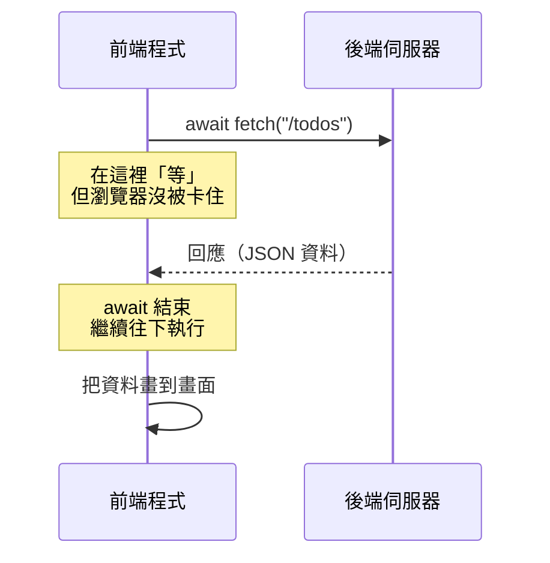

# [4-A-3] 用 `fetch` 從前端呼叫後端

> **本章目標**：讓前端真正「打電話」給後端——用 `fetch` 發出 HTTP 請求、拿回資料、畫到畫面上，完成你的第一次前後端串接。

## 你會學到

- `fetch` 是什麼，它怎麼幫你發出 HTTP 請求
- 用 `async/await` 處理「等後端回應」這段非同步過程
- 怎麼發 GET 請求拿資料、發 POST 請求送資料
- 前後端分開跑時會撞到的 CORS 問題（先有概念，知道怎麼繞過）
- 把前端、後端兜起來，完成 POC V2

---

## 概念說明

### `fetch` 就是前端的「打電話」按鈕

上一章你建好了後端，它在 `localhost:3000` 待命。但目前只有「你自己用瀏覽器網址列」或「curl」去問它。現在我們要讓**前端的 TypeScript 程式**主動去問——這個動作就是 `fetch`。

`fetch` 是瀏覽器內建的功能，你不用安裝任何東西。它做的事很單純：

```
fetch 就是前端對後端說：
    「喂，我要向 http://localhost:3000/todos 發一個請求」
    「（等一下下…網路要時間）」
    「好，後端回我了，我把回應接住」
```

還記得 4-A-1 強調的「一定是前端先開口、一問一答」嗎？`fetch` 就是「前端開口」的那個動作。

---

### 為什麼這裡一定要用 `async/await`？

網路有延遲。你 `fetch` 出去之後，後端的回應**不會立刻回來**——可能 50 毫秒、可能 2 秒。程式不能呆呆地卡在那裡等，這就是 [3-6 非同步思維] 講的「非同步」場景。

用 pseudo code 對比「如果能瞬間拿到」和「實際上要等」的差別：

```
理想中（但做不到，因為網路要時間）：
    結果 = fetch(網址)        ← 妄想一行就拿到
    用結果做事

實際上（用 await「等」它）：
    結果 = await fetch(網址)   ← await：在這裡等後端回應，回來了再往下走
    用結果做事
```

`await` 這個字的意思就是「等」。它讓你能用「看起來像同步」的順序寫程式，但實際上在等待時並不會卡住整個瀏覽器。而 `await` 只能用在標了 `async` 的函式裡——這是一組的。



這張圖說明 `await` 的角色：它是程式裡的一個「等待點」，請求送出後停在那裡，直到後端回應抵達才繼續。

---

## 程式碼範例

### 範例一：用 `fetch` 拿資料（GET）

最基本的用法——向後端要待辦清單。注意它分成「兩段等待」：

```typescript
// async 標記這是非同步函式，裡面才能用 await
async function loadTodos(): Promise<void> {
  // 第一段等待：等後端回應抵達
  const response = await fetch("http://localhost:3000/todos")

  // 第二段等待：把回應的 Body 解析成 JSON（這也需要一點時間）
  const todos = await response.json()

  console.log(todos) // 拿到後端回的待辦陣列了！
}
```

為什麼有**兩個 `await`**？這常讓初學者困惑：

```
第一個 await fetch(...)        → 等「請求送達、後端回應的標頭與狀態回來」
第二個 await response.json()   → 等「把回應的 Body 內容讀出來並轉成物件」

可以想成：
    第一個 await：等服務生「走到你桌邊」
    第二個 await：等他「把餐點從托盤放到你桌上」
```

---

### 範例二：加上錯誤處理

網路會失敗、後端可能回錯誤。不能假設每次都成功。用 `try/catch` 接住意外（還記得 CLAUDE.md 說的：**不要吃掉 error**）：

```typescript
async function loadTodos(): Promise<void> {
  try {
    const response = await fetch("http://localhost:3000/todos")

    // 注意：fetch 只有在「網路根本連不上」時才會 throw。
    // 像 404、500 這種「有回應但是是錯誤」的情況，要自己檢查 response.ok
    if (!response.ok) {
      throw new Error(`載入待辦失敗，伺服器回傳狀態碼 ${response.status}`)
    }

    const todos = await response.json()
    renderTodos(todos) // 把資料畫到畫面（沿用 V1 的渲染邏輯）
  } catch (error) {
    // 錯誤訊息要對人有意義，不要只 console.log("error")
    console.error("無法載入待辦清單：", error)
    alert("載入失敗，請確認後端伺服器有沒有啟動")
  }
}
```

這裡有個容易踩的雷，特別標出來：

> **常見錯誤** — 很多人以為 `fetch` 遇到 404 / 500 會自動進 `catch`：
>
> ```typescript
> try {
>   const response = await fetch("/todos") // 假設後端回 500
>   const data = await response.json()     // 程式還是會走到這裡！
> } catch (error) {
>   // ❌ 以為 500 會跳進來，其實不會
> }
> ```
>
> 問題是：`fetch` 只把「網路層級的失敗」（例如完全連不到伺服器）當成錯誤。後端「有回應、但回的是錯誤狀態碼」對 `fetch` 來說算「成功收到回應」。
>
> 正確做法：自己檢查 `response.ok`（它在狀態碼是 2xx 時為 `true`），不對就主動 `throw`：
>
> ```typescript
> if (!response.ok) {
>   throw new Error(`伺服器回傳 ${response.status}`)
> }
> ```

---

### 範例三：送資料給後端（POST）

新增一筆待辦，要把資料「送過去」。這時 `fetch` 要帶第二個參數，說明方法、標頭和 Body：

```typescript
async function addTodo(text: string): Promise<void> {
  try {
    const response = await fetch("http://localhost:3000/todos", {
      method: "POST", // 這次不是拿資料，是新增，所以用 POST
      headers: {
        // 告訴後端：我夾帶的 Body 是 JSON 格式
        "Content-Type": "application/json",
      },
      // Body 必須是字串，所以用 JSON.stringify 把物件轉成 JSON 字串
      body: JSON.stringify({ text }),
    })

    if (!response.ok) {
      throw new Error(`新增失敗，狀態碼 ${response.status}`)
    }

    const newTodo = await response.json() // 後端回傳「剛建立好、帶 id 的那筆」
    console.log("新增成功：", newTodo)
  } catch (error) {
    console.error("新增待辦失敗：", error)
  }
}
```

對照 4-A-1 講的請求結構，你會發現這個 `fetch` 的第二個參數，正好就是在組一個 HTTP 請求：

```
method: "POST"                    → 請求的「方法」
headers: { "Content-Type": ... }  → 請求的「標頭」
body: JSON.stringify({ text })    → 請求的「Body」
（網址 http://localhost:3000/todos → 請求的「路徑」）
```

`fetch` 把 4-A-1 那張「請求的四個部分」變成了你真的能寫的程式碼。

---

### 範例四：後端要先學會「讀 Body」

前端 POST 送了 JSON Body 過去，但上一章的 Express 伺服器**還不會讀 Body**。要加一行設定，並補上對應的 POST 端點：

```typescript
import express from "express"

const app = express()
const PORT = 3000

// 關鍵這行：讓 Express 自動把進來的 JSON Body 解析成物件
// 沒有這行，request.body 會是 undefined
app.use(express.json())

// 後端先用一個陣列「暫時」存待辦（資料在記憶體裡，重啟就消失——這正是 V2 的限制）
let todos = [{ id: 1, text: "學會 Express", completed: false }]
let nextId = 2

app.get("/todos", (request, response) => {
  response.json(todos)
})

app.post("/todos", (request, response) => {
  // 因為前面有 express.json()，這裡才讀得到前端送來的 { text: "..." }
  const text = request.body.text
  const newTodo = { id: nextId++, text, completed: false }
  todos.push(newTodo)

  // 回傳剛建立的那筆，狀態碼用 201（成功且建立了新東西）
  response.status(201).json(newTodo)
})

app.listen(PORT, () => {
  console.log(`伺服器已啟動，正在 http://localhost:${PORT} 待命`)
})
```

> **注意這版的資料存在一個陣列裡**——伺服器一重啟，待辦就全沒了。這是刻意的：V2 的重點是「前後端通了」，至於「資料怎麼永久保存」要等 Part 5 接上資料庫。

---

### 範例五：撞到 CORS 怎麼辦？

當你「前端用瀏覽器打開 HTML」、「後端跑在 `localhost:3000`」，兩邊算是**不同來源（Origin）**，瀏覽器基於安全考量，預設會擋下這種跨來源請求，丟出一個紅字錯誤，關鍵字是 **CORS**（Cross-Origin Resource Sharing，跨來源資源共享）。

現在先用最簡單的方式讓後端「允許」前端來訪問，把開發跑通：

```bash
npm install cors
npm install -D @types/cors
```

```typescript
import cors from "cors"

// 在所有路由之前加這行：允許跨來源請求（開發階段先全開）
app.use(cors())
```

> CORS 為什麼存在、它到底在防什麼、生產環境該怎麼正確設定，是 Part 4-C 的主題。這裡你只要知道「跨來源被擋時，加上 `app.use(cors())` 先讓開發通行」就好。
>
> 想先睹為快、搞懂 CORS 的來龍去脈 → [課外讀物 E-3-4：瀏覽器安全策略與 CORS](../../../課外讀物/E-3-network/E-3-4-cors.md)

---

## POC V2 — 前後端通了！

> **你現在要做的事**：把 V1 那個「資料只存在自己瀏覽器」的 Todo App，改成「資料存在後端」。
> 程式碼在 `poc/v2/`，先把它跑起來看效果，再回頭對照說明。

這是一個里程碑：你的 Todo App 第一次有了「後端」。雖然資料還只是暫存在後端的一個陣列裡（重啟就消失），但**架構上已經是前後端分離了**。

```
V2 架構（3 個核心檔案）：
┌──────────────┐    HTTP 請求     ┌──────────────────┐
│  前端         │ ───────────────> │  後端             │
│  index.html  │                  │  server.ts        │
│  main.ts     │ <─────────────── │  (資料在記憶體陣列) │
└──────────────┘     JSON 回應     └──────────────────┘
```

**和 V1 的關鍵差異**：資料不再寫進 `localStorage`，而是透過 `fetch` 存到後端。意義是——理論上現在換一台電腦連到同一個後端，就能看到同一份待辦了（V1 做不到這件事）。

---

## 小練習

**練習 1**：把上面範例四的後端跑起來，先用 `curl` 測試 POST：
```bash
curl -X POST http://localhost:3000/todos \
  -H "Content-Type: application/json" \
  -d '{"text":"用 curl 新增的待辦"}'
```
再用瀏覽器訪問 `http://localhost:3000/todos`，確認剛剛那筆有沒有真的進去。

**練習 2**：故意**不要**啟動後端，直接讓前端 `fetch`。打開 DevTools 的 Console，看看 `catch` 接到的錯誤訊息長什麼樣子。這就是「網路層級失敗」會進 `catch` 的情況。

**練習 3**：把後端範例四裡的 `app.use(express.json())` 那行**註解掉**，重啟後再 POST 一筆。觀察 `request.body` 變成什麼？（提示：會是 `undefined`，於是 `request.body.text` 就爆炸了。）這驗證了「為什麼那行不能少」。

---

## 課外讀物

> 想完整理解 HTTP 的方法、狀態碼、Body 在這次串接裡各自扮演的角色 → [課外讀物 E-3-3：HTTP 協定詳解](../../../課外讀物/E-3-network/E-3-3-http-protocol.md)

> 想搞懂這章一直在繞過的 CORS 到底是什麼、為什麼瀏覽器要擋 → [課外讀物 E-3-4：瀏覽器安全策略與 CORS](../../../課外讀物/E-3-network/E-3-4-cors.md)
