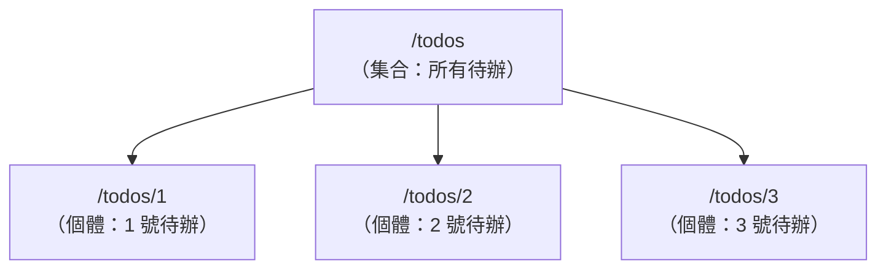

# [4-B-1] 什麼是 REST？用資源（Resource）思考 API

> **本章目標**：理解 REST 不是某種技術，而是一套「怎麼設計 API 網址」的約定——核心是把你的資料想成一個個「資源」。

## 你會學到

- REST 是什麼，以及它解決了什麼混亂
- 什麼是「資源（Resource）」，為什麼用名詞而不是動詞來設計網址
- 一組 RESTful 網址長什麼樣子
- 怎麼判斷一個 API 設計得「RESTful」還是「不 RESTful」

---

## 概念說明

### 先看一個沒有約定的世界有多亂

在 V2，我們隨手設計了 `/todos` 這個網址。但如果沒有任何約定，每個工程師都自己發明網址，會變成什麼樣子？

```
工程師 A 設計的待辦 API：
    /getAllTodos
    /addNewTodo
    /removeTodoById
    /updateTodoStatus

工程師 B 設計的待辦 API：
    /todo/fetch
    /todo/create
    /todo/delete
    /todo/edit

工程師 C 設計的待辦 API：
    /list-todos
    /new-todo
    /kill-todo      ← ？？？
```

三個人做一樣的事，卻是三套完全不同的命名。新人接手要重新猜一遍、前端工程師每接一個 API 都要查文件。**這就是沒有約定的代價。**

REST 就是業界為了終結這種混亂，講好的一套「網址該怎麼取名」的約定。

---

### REST 的核心：把資料想成「資源」

REST（REpresentational State Transfer）聽起來很學術，但它的核心思想用一句話講完：

> **把你系統裡的每一種資料，都看成一個「資源」，給它一個固定的網址（名詞），然後用 HTTP 方法去操作它。**

關鍵在「**名詞，不是動詞**」。網址只負責指出「哪個東西」，至於「要對它做什麼」，交給 HTTP 方法（下一章詳談）。

用圖書館類比：

```
圖書館裡，每本書都有固定的位置（書架編號）。
你不會說「我要執行借書這個動作於某處」，
你會說：「我要對『B區3排第5本』這本書，做『借閱』。」

    書的位置（名詞）  → 對應 REST 的「資源網址」
    借閱 / 歸還（動作）→ 對應 HTTP 方法（GET/POST/...）
```

對應到我們的 Todo App：

```
資源：待辦事項（todos）
    所有待辦         → /todos
    某一筆特定待辦    → /todos/5   （第 5 號待辦）

「要對它做什麼」不寫在網址裡，而是用方法表達：
    想看 /todos      → 用 GET
    想新增到 /todos   → 用 POST
    想改 /todos/5    → 用 PUT
    想刪 /todos/5    → 用 DELETE
```

---

### RESTful 網址的長相

一個資源通常會有兩種網址：「集合」和「單一個體」。



這張圖表達 REST 網址的層級：`/todos` 代表「全部待辦」這個集合，後面加上 id（`/todos/1`）就縮小到「某一筆」。這個結構非常直覺，看到網址就知道在指哪個東西。

如果資源之間有從屬關係，網址可以往下疊。例如「某使用者的所有待辦」：

```
/users/8/todos        → 8 號使用者的所有待辦
/users/8/todos/3      → 8 號使用者的第 3 筆待辦
```

---

### 怎麼判斷「夠不夠 RESTful」？

一個簡單的檢查法：**看網址裡有沒有動詞**。RESTful 的網址應該只有名詞。

> **常見錯誤** — 很多人會把動作塞進網址：
>
> ```
> ❌ POST /createTodo
> ❌ POST /todos/5/delete
> ❌ GET  /getTodoById/5
> ```
>
> 問題是：這等於把「動作」同時寫在「網址」和「方法」兩個地方，重複又混亂。而且 `GET /getTodoById/5` 裡的 `get` 跟 HTTP 方法 `GET` 意思撞在一起，很冗餘。
>
> 正確做法：網址只放名詞，動作交給 HTTP 方法：
>
> ```
> ✅ POST   /todos        （新增一筆待辦）
> ✅ DELETE /todos/5      （刪除 5 號待辦）
> ✅ GET    /todos/5      （取得 5 號待辦）
> ```

---

## 程式碼範例

### 範例一：一組完整的 RESTful 待辦 API 設計

這還不是程式碼，而是一張「API 設計表」。在動手寫後端之前，先把要提供哪些端點規劃清楚，是很好的習慣：

```
方法     網址            意義
─────────────────────────────────────────
GET     /todos          取得所有待辦
POST    /todos          新增一筆待辦
GET     /todos/:id      取得某一筆待辦
PUT     /todos/:id      更新某一筆待辦（例如切換完成）
DELETE  /todos/:id      刪除某一筆待辦
```

注意整張表只有兩個網址（`/todos` 和 `/todos/:id`），靠不同方法就表達了五種操作。這就是 REST 的優雅之處——**網址少、好記，操作清楚**。

（`:id` 是一個「佔位符」，代表這裡會填入實際的 id，例如 `/todos/5`。下一章會看到 Express 怎麼接住這個值。）

---

### 範例二：在 Express 裡，路由就是這張表的翻版

預習一下——上面那張設計表，幾乎可以一行一行對應成 Express 程式碼：

```typescript
// 這段先看結構就好，每個方法的細節在 4-B-2 展開

app.get("/todos", ...)          // 取得所有待辦
app.post("/todos", ...)         // 新增一筆待辦
app.get("/todos/:id", ...)      // 取得某一筆
app.put("/todos/:id", ...)      // 更新某一筆
app.delete("/todos/:id", ...)   // 刪除某一筆
```

你會發現「設計 API」和「寫 API」之間的距離非常短——只要前面的資源規劃清楚，程式碼幾乎是照抄。**好的設計讓實作變簡單**，這是貫穿整個課程的觀念。

---

## 小練習

**練習 1**：幫一個「部落格文章（posts）」資源，設計一組 RESTful 的 API。列出「取得所有文章、新增文章、取得單篇、更新單篇、刪除單篇」各自的方法與網址。

**練習 2**：下面這些網址都不太 RESTful，把它們改成 RESTful 的寫法：
```
GET  /fetchAllUsers
POST /user/create
GET  /deleteUser/3
```

**練習 3**：「一篇文章底下的所有留言」這個資源，網址該怎麼設計？（提示：留言從屬於文章，用巢狀的方式。）那「文章 7 的第 2 則留言」呢？

---

## 課外讀物

> 想完整了解 HTTP 方法與這套設計背後的協定細節 → [課外讀物 E-3-3：HTTP 協定詳解](../../../課外讀物/E-3-network/E-3-3-http-protocol.md)

> 這套「網址用名詞、職責清楚」的設計，呼應了「一個東西只負責一件事」的原則 → [課外讀物 E-7-2：S — Single Responsibility Principle](../../../課外讀物/E-7-solid/E-7-2-srp.md)
