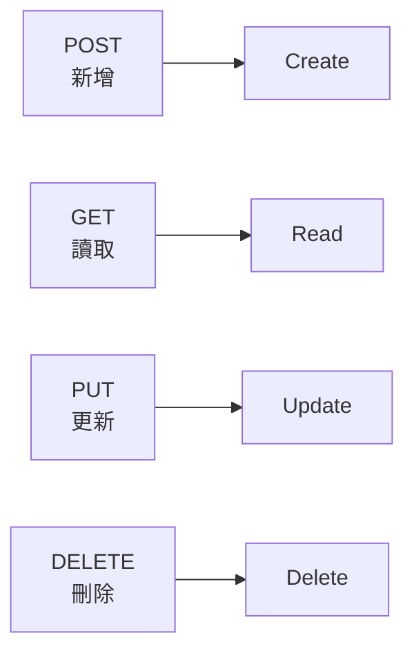

# [4-B-2] HTTP 動詞：GET / POST / PUT / DELETE 對應 CRUD

> **本章目標**：搞懂四個最常用的 HTTP 方法各自代表什麼動作，以及它們如何對應到資料的「增刪改查」。

## 你會學到

- CRUD 是什麼，為什麼幾乎所有 App 都在做這四件事
- 四個 HTTP 方法（GET / POST / PUT / DELETE）各自的語意
- 怎麼用 Express 接住網址裡的參數（`:id`）
- 把 V2 的後端補齊成支援完整 CRUD 的版本

---

## 概念說明

### 幾乎所有 App，骨子裡都在做 CRUD

待辦清單、社群貼文、購物車、銀行帳戶……再複雜的應用程式，拆到最底層，對資料做的事不外乎四種：

```
C — Create（新增）：寫一筆新資料   例如：新增一筆待辦
R — Read  （讀取）：把資料拿出來   例如：看待辦清單
U — Update（更新）：改一筆資料     例如：把待辦標成完成
D — Delete（刪除）：刪掉一筆資料   例如：刪除待辦
```

這四個動作合稱 **CRUD**。一旦你會做一種資源的 CRUD，做任何資源都是同一套路。

---

### HTTP 方法就是 CRUD 的「動作詞」

上一章說「網址只放名詞，動作交給 HTTP 方法」。這四個方法剛好對上 CRUD：



這張圖表達四個 HTTP 方法和 CRUD 的一對一對應。記住這張對應表，REST API 的操作就掌握一大半了。

完整對照（以待辦為例）：

```
動作    方法     網址          白話
────────────────────────────────────────────
Read   GET     /todos        給我所有待辦
Read   GET     /todos/5      給我第 5 筆待辦
Create POST    /todos        新增一筆待辦
Update PUT     /todos/5      更新第 5 筆待辦
Delete DELETE  /todos/5      刪除第 5 筆待辦
```

---

### 每個方法的「個性」

這四個方法不只是名字不同，它們有各自的「約定俗成」的個性，照著用別人才看得懂你的 API：

```
GET    → 只是「看」，不應該改變任何資料
         （點一個 GET 一百次，結果都一樣，什麼都不會被改）

POST   → 「新增」，每呼叫一次就多一筆
         （點兩次 POST，就會新增兩筆——所以重複送出要小心）

PUT    → 「更新（整筆替換）」，重複呼叫結果一樣
         （把第 5 筆改成「完成」，點幾次它都是「完成」）

DELETE → 「刪除」，刪掉就沒了，重複刪同一筆不會更糟
```

> **小提醒**：你可能也會聽到 `PATCH`。`PUT` 是「整筆替換」，`PATCH` 是「只改部分欄位」。入門先掌握 `PUT` 就夠，兩者的細微差別之後遇到再分。

---

### 怎麼從網址抓出 `:id`？

`GET /todos/5` 裡的 `5` 是怎麼被後端拿到的？Express 用 `:id` 這種「佔位符」來接：

```
你在 Express 寫：app.get("/todos/:id", ...)
                              ↑ 冒號開頭，代表這是個變數

實際請求進來：GET /todos/5
              → Express 把 5 對應到 :id
              → 你用 request.params.id 就能拿到 "5"
```

注意拿到的是**字串** `"5"`，不是數字 `5`（網址本質都是文字）。要拿來跟數字比較時，記得先轉成數字。

---

## 程式碼範例

### 範例一：讀取單一筆（GET /todos/:id）

接住網址參數、找出對應那筆資料回傳：

```typescript
app.get("/todos/:id", (request, response) => {
  // request.params.id 拿到的是字串，用 Number() 轉成數字才能跟 todo.id 比對
  const id = Number(request.params.id)

  const todo = todos.find((item) => item.id === id)

  // 找不到就回 404（這個狀態碼的意義下一章詳談，先照著用）
  if (!todo) {
    response.status(404).json({ error: `找不到 id 為 ${id} 的待辦` })
    return
  }

  response.json(todo)
})
```

注意這裡的錯誤訊息寫 `找不到 id 為 ${id} 的待辦`，而不是只回一個 `error`——**錯誤訊息要對人有意義**，這是 CLAUDE.md 的要求，也是體貼未來除錯的自己。

---

### 範例二：更新（PUT /todos/:id）

切換待辦的完成狀態。找到那筆、改掉、回傳更新後的結果：

```typescript
app.put("/todos/:id", (request, response) => {
  const id = Number(request.params.id)
  const todo = todos.find((item) => item.id === id)

  if (!todo) {
    response.status(404).json({ error: `找不到 id 為 ${id} 的待辦` })
    return
  }

  // 用前端送來的 completed 更新這筆待辦
  todo.completed = request.body.completed

  response.json(todo) // 回傳更新後的狀態，讓前端確認
})
```

---

### 範例三：刪除（DELETE /todos/:id）

把那筆從陣列裡移除：

```typescript
app.delete("/todos/:id", (request, response) => {
  const id = Number(request.params.id)
  const index = todos.findIndex((item) => item.id === id)

  if (index === -1) {
    response.status(404).json({ error: `找不到 id 為 ${id} 的待辦` })
    return
  }

  todos.splice(index, 1) // 從陣列移除這一筆

  // 刪除成功通常回 204（成功，但沒有內容要回傳），下一章詳談
  response.status(204).send()
})
```

---

### 範例四：把五個方法組裝成一個完整後端

把範例 1~3 的 `GET /todos/:id`、`PUT`、`DELETE`，加上 V2 既有的 `GET /todos`、`POST /todos`，就是一個支援完整 CRUD 的後端。它的「骨架」長這樣——五條路由，剛好對應 CRUD：

```typescript
app.use(cors())
app.use(express.json())

app.get("/todos", ...)          // READ   所有待辦      → 200
app.get("/todos/:id", ...)      // READ   單一筆        → 200 / 404
app.post("/todos", ...)         // CREATE 新增          → 201 / 400
app.put("/todos/:id", ...)      // UPDATE 切換完成      → 200 / 404
app.delete("/todos/:id", ...)   // DELETE 刪除          → 204 / 404
```

每條路由的內容，就是前面範例逐一示範過的那些。**完整、可直接執行的版本，放在 `poc/v3/backend/src/server.ts`**——下一節 POC V3 會帶你把它跑起來，這裡先看清楚「五個方法拼起來就是一個 CRUD 後端」這個結構。

你可能也注意到一件事：範例 2、3 裡每個處理函式都重複了「找待辦、找不到回 404」的邏輯。這是個壞味道（程式碼重複），但先別急著優化——等 Part 4-D 學分層架構時，會看到怎麼把它整理乾淨。現在先讓它能跑、看清楚每個方法做什麼。

> 這種「重複邏輯該不該現在就抽出來」的判斷，跟「過早最佳化」有關 → [課外讀物 E-6-3：函式設計](../../../課外讀物/E-6-best-practices/E-6-3-function-design.md)

---

## 小練習

**練習 1**：把完整的 CRUD 後端（`poc/v3/backend`，或自己把範例 1~3 拼起來）跑起來，用 `curl` 完整測一輪 CRUD：
```bash
curl -X POST http://localhost:3000/todos -H "Content-Type: application/json" -d '{"text":"測試"}'
curl http://localhost:3000/todos
curl -X PUT http://localhost:3000/todos/1 -H "Content-Type: application/json" -d '{"completed":true}'
curl -X DELETE http://localhost:3000/todos/1
curl http://localhost:3000/todos
```
觀察每一步的回應。

**練習 2**：故意去 `GET` 一個不存在的 id（例如 `curl http://localhost:3000/todos/999`），確認它回的是 404 和你寫的錯誤訊息。

**練習 3**：想一想——如果 `PUT /todos/:id` 的 `request.body` 裡沒有 `completed` 這個欄位（前端忘了傳），目前的程式會發生什麼事？這算不算一個該防的錯誤？（這正是下一章「錯誤處理」要談的。）

---

## 課外讀物

> 想完整了解每個 HTTP 方法、以及 PATCH 與 PUT 的差別 → [課外讀物 E-3-3：HTTP 協定詳解](../../../課外讀物/E-3-network/E-3-3-http-protocol.md)

> 想知道為什麼「重複的邏輯」是壞味道、什麼時候該把它抽成函式 → [課外讀物 E-6-3：函式設計](../../../課外讀物/E-6-best-practices/E-6-3-function-design.md)
