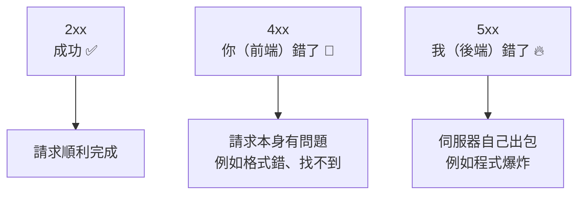

# [4-B-3] 狀態碼：200 / 201 / 400 / 404 / 500 的意義

> **本章目標**：學會用對的狀態碼回應前端，讓「成功」「你錯了」「我錯了」這三種結果一眼就能分辨。

## 你會學到

- 狀態碼是什麼，為什麼不能每次都回 200
- 開頭數字 2 / 4 / 5 各自代表什麼大方向
- 五個最常用狀態碼（200 / 201 / 400 / 404 / 500）分別用在什麼情境
- 在 Express 裡怎麼設定狀態碼

---

## 概念說明

### 狀態碼是後端的「臉色」

每個 HTTP 回應都附帶一個三位數的**狀態碼**。它是後端在「回傳資料之前」先給前端的一個訊號，告訴前端：這次請求到底是成功、還是出事了。

為什麼需要它？想像沒有狀態碼的世界：

```
前端問：給我 5 號待辦
後端回：{ "error": "找不到" }

前端傻了：
    這個 { error: "找不到" } 是「資料本身」
    還是「出錯的訊息」？
    我要把它畫到畫面上，還是要顯示錯誤？
```

有了狀態碼，前端**先看狀態碼就知道該怎麼反應**，不用去猜 Body 的內容：

```
後端回：狀態碼 404 +  { "error": "找不到 id 為 5 的待辦" }
              ↑
        前端一看 404 就懂：「喔，這是錯誤，顯示提示就好」
```

還記得 4-A-3 教的 `response.ok` 嗎？它就是靠狀態碼是不是 2xx 來判斷的。

---

### 開頭數字決定大方向

不用背幾百個狀態碼，先記住**開頭數字的意思**，九成情況都夠用：



這張圖是狀態碼最重要的心智模型：**4xx 是「怪請求方」，5xx 是「怪伺服器」**。光是分清這兩者，除錯時就能少走很多冤枉路——看到 4xx 先檢查前端送的東西對不對，看到 5xx 去翻後端的錯誤日誌。

---

### 五個你天天會用到的狀態碼

```
200 OK
    → 最常見的「成功」。GET 拿到資料、PUT 更新成功，都用它。

201 Created
    → 「成功，而且建立了一個新東西」。專門給 POST 新增成功用。
    → 為什麼不直接用 200？因為 201 多帶了「有新資源誕生」的資訊，更精確。

400 Bad Request
    → 「你送來的請求有問題」。例如該填的欄位沒填、格式錯誤。
    → 這是「前端的錯」，叫前端檢查送出的內容。

404 Not Found
    → 「你要找的東西不存在」。例如去拿一個不存在的 id。
    → 也是 4xx，因為前端要了一個不該要的東西。

500 Internal Server Error
    → 「後端自己爆炸了」。例如程式拋出未預期的例外。
    → 這是「後端的錯」，使用者通常無能為力，該去修後端。
```

把它對應到我們的 CRUD：

```
操作              成功時      失敗時的可能狀態碼
──────────────────────────────────────────────
GET /todos        200        （幾乎不會失敗）
GET /todos/:id    200        404（id 不存在）
POST /todos       201        400（text 空白）
PUT /todos/:id    200        404（id 不存在）/ 400（資料格式錯）
DELETE /todos/:id 204        404（id 不存在）
```

（`204 No Content` 是 2xx 家族的：「成功，但我沒有內容要回給你」，很適合刪除——東西都刪了，也沒什麼好回傳的。）

---

## 程式碼範例

### 範例一：在 Express 裡設定狀態碼

`response.status(數字)` 設定狀態碼，後面接 `.json()` 或 `.send()` 回傳內容。不寫的話 Express 預設是 200。

```typescript
// 成功取得 → 200（不寫 status 的話預設就是 200）
response.json(todos)

// 成功新增 → 明確設成 201
response.status(201).json(newTodo)

// 找不到 → 404
response.status(404).json({ error: `找不到 id 為 ${id} 的待辦` })

// 前端送的資料有問題 → 400
response.status(400).json({ error: "text 不可為空" })

// 成功刪除、沒內容要回 → 204
response.status(204).send()
```

---

### 範例二：同一個端點，根據情況回不同狀態碼

一個寫得好的端點，會依「發生什麼事」回對應的狀態碼。看這個新增待辦的例子，它在三條路徑上回了三種狀態碼：

```typescript
app.post("/todos", (request, response) => {
  const text: string = request.body.text

  // 路徑一：前端沒給 text → 這是前端的錯 → 400
  if (!text || text.trim() === "") {
    response.status(400).json({ error: "text 不可為空" })
    return
  }

  const newTodo: Todo = { id: nextId++, text: text.trim(), completed: false }
  todos.push(newTodo)

  // 路徑二：順利新增 → 201
  response.status(201).json(newTodo)
})
```

> **常見錯誤** — 很多初學者不管成功失敗，全部回 200：
>
> ```typescript
> // ❌ 找不到也回 200
> if (!todo) {
>   response.status(200).json({ error: "找不到" })
>   return
> }
> ```
>
> 問題是：前端的 `response.ok` 會是 `true`（因為 200 算成功），於是前端**以為成功了**，繼續往下處理那個其實是錯誤的 Body，畫面就會出現奇怪的結果。狀態碼是前後端之間的「共同語言」，亂回等於說謊。
>
> 正確做法：找不到就誠實回 404，前端的 `response.ok` 才會是 `false`，正確地進入錯誤處理。

---

### 範例三：5xx 通常不是你「手動回」的

400、404 是你主動判斷後回的。但 500 多半是「程式意外爆炸」時，由錯誤處理機制自動回的——這正是下一章 4-B-4 的主題。先看一眼概念：

```
正常情況：你判斷狀況，回 200 / 201 / 400 / 404
意外情況：程式裡某行突然 throw（例如存取了 undefined 的屬性）
         → 如果沒接住，伺服器就會回 500
         → 所以我們需要「統一的錯誤處理」來接住這些意外
```

---

## 小練習

**練習 1**：對照「五個常用狀態碼」那段，替以下情境各選一個最適合的狀態碼：
1. 使用者成功登入，回傳使用者資料
2. 使用者註冊時沒填 email
3. 使用者要查一個不存在的訂單編號
4. 後端連資料庫時程式崩潰
5. 使用者成功建立了一篇新文章

**練習 2**：用 `curl` 加上 `-i` 參數（會印出回應的狀態碼），測試你的 CRUD 後端：
```bash
curl -i http://localhost:3000/todos/999
```
確認你看到的狀態碼是 `404`，而不是 `200`。

**練習 3**：找一個你常用的網站，打開 DevTools 的 Network 頁籤操作幾下，蒐集看看你能遇到哪些狀態碼。每遇到一個，判斷它屬於 2xx / 4xx / 5xx 哪一類，代表發生了什麼事。

---

## 課外讀物

> 想看完整的狀態碼列表與每個的精確定義 → [課外讀物 E-3-3：HTTP 協定詳解](../../../課外讀物/E-3-network/E-3-3-http-protocol.md)

> 趣味：有一個狀態碼叫「418 我是茶壺」，背後是個工程師的玩笑 → [課外讀物 E-3-3：HTTP 協定詳解](../../../課外讀物/E-3-network/E-3-3-http-protocol.md)
