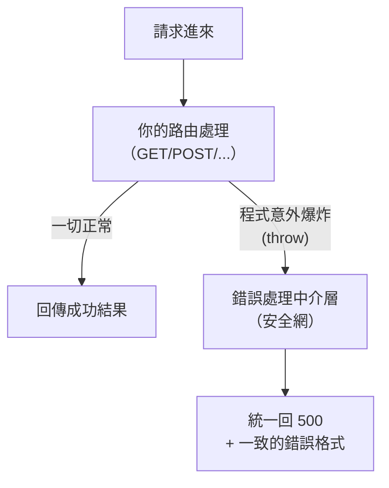

# [4-B-4] 錯誤處理：前後端如何溝通「出錯了」

> **本章目標**：建立一套「出錯時，後端怎麼說、前端怎麼聽」的一致做法，讓錯誤訊息清楚、可預期，而不是讓使用者看到莫名其妙的崩潰。

## 你會學到

- 為什麼「一致的錯誤格式」比「能跑」更重要
- 設計一個統一的錯誤回應格式
- 用 Express 的錯誤處理中介層（error handler）統一接住意外
- 前端如何根據狀態碼與錯誤訊息給使用者好的回饋
- 完成 POC V3：一個有完整 CRUD 和像樣錯誤處理的 Todo App

---

## 概念說明

### 錯誤不是「例外狀況」，而是「正常的一部分」

初學者常把錯誤當成「不該發生的事」，於是不處理它。但實際上，錯誤天天發生：使用者亂填、網路斷掉、要找的東西被刪了。一個成熟的 API，**處理錯誤的程式碼往往跟處理成功的一樣多**。

關鍵問題是：當錯誤發生時，後端要怎麼跟前端「講清楚」？

回顧前幾章我們已經在做的事：

```
找不到 → 回 404 + { error: "找不到 id 為 5 的待辦" }
格式錯 → 回 400 + { error: "text 不可為空" }
```

我們已經有雛形了。這一章要把它變成**一致、可預期**的一套規則。

---

### 為什麼「一致的格式」這麼重要？

假設後端每個錯誤都長得不一樣：

```
有的回：{ "error": "找不到" }
有的回：{ "message": "格式錯誤" }
有的回：{ "msg": "失敗", "code": 123 }
有的回：直接一串文字 "Something went wrong"
```

前端工程師會崩潰——他每接一個 API，都要重新搞清楚「這次錯誤訊息藏在哪個欄位」。

> **常見錯誤** — 每個端點各自發明錯誤格式：
> 上面那種「四個端點四種格式」，會讓前端的錯誤處理寫得到處都是特例。
>
> 正確做法：**全站講好一種錯誤格式**，前端只要學一次，所有 API 都適用。

我們約定一個簡單一致的格式：

```
所有錯誤都長這樣：
{
  "error": "對人類有意義的錯誤說明"
}
```

簡單、好預測。前端永遠去 `error` 欄位拿訊息就對了。

> 想深入「後端 API 該怎麼設計錯誤處理」的完整原則 → [課外讀物 E-6-8：後端 Clean Code — API 設計與錯誤處理](../../../課外讀物/E-6-best-practices/E-6-8-backend-clean-code.md)

---

### 統一接住「意外」：錯誤處理中介層

400、404 是我們**主動判斷後回的**。但有些錯誤是「沒預料到」的——例如程式某行突然爆炸。如果不接住，使用者會收到一坨難看的伺服器預設錯誤，甚至洩漏程式內部細節。

Express 提供一個機制：**錯誤處理中介層（error-handling middleware）**。可以把它想成「整個伺服器的安全網」，所有沒被接住的意外都會掉進這張網裡，由它統一回一個乾淨的 500。



這張圖說明錯誤處理中介層的角色：它站在所有路由的「下游」，專門接住那些漏網的意外，確保使用者永遠收到格式一致的回應，而不是伺服器的崩潰畫面。

---

## 程式碼範例

### 範例一：定義錯誤處理中介層

Express 的錯誤中介層長得跟一般中介層很像，差別是它有**四個參數**（第一個是 `error`）。Express 看到四個參數就知道「這是錯誤處理器」：

```typescript
import express from "express"
import type { Request, Response, NextFunction } from "express"

// 注意：錯誤處理中介層一定要有「四個」參數，Express 才認得它
function errorHandler(
  error: Error,
  request: Request,
  response: Response,
  next: NextFunction,
): void {
  // 在伺服器端記錄完整錯誤，方便工程師除錯
  console.error("未預期的錯誤：", error)

  // 但回給前端的只給乾淨、一致的訊息，不洩漏內部細節
  response.status(500).json({ error: "伺服器發生未預期的錯誤，請稍後再試" })
}
```

為什麼回給前端的訊息要「模糊」？因為把 `error.stack`（程式碼細節、檔案路徑）回給使用者，既沒幫助又可能洩漏資安資訊。**內部詳情記在伺服器日誌，對外只給友善的一句話。**

---

### 範例二：把中介層掛上去

錯誤處理中介層要掛在**所有路由的最後面**，這樣它才能接住前面所有路由漏出來的錯誤：

```typescript
const app = express()

app.use(cors())
app.use(express.json())

// ... 這裡是你所有的路由（GET /todos、POST /todos ...）...

// 最後才掛錯誤處理器——順序很重要，它必須在所有路由之後
app.use(errorHandler)

app.listen(PORT, () => {
  console.log(`後端已啟動，正在 http://localhost:${PORT} 待命`)
})
```

---

### 範例三：前端如何「聽懂」錯誤

有了一致的格式，前端的錯誤處理就能寫得乾淨。回顧 4-A-3 學的，加上「讀後端的 error 訊息」：

```typescript
async function addTodo(text: string): Promise<void> {
  try {
    const response = await fetch(`${API_BASE}/todos`, {
      method: "POST",
      headers: { "Content-Type": "application/json" },
      body: JSON.stringify({ text }),
    })

    if (!response.ok) {
      // 後端的錯誤一律放在 error 欄位，前端只要學這一種格式
      const errorData = await response.json()
      throw new Error(errorData.error)
    }

    await loadTodos()
  } catch (error) {
    // 把後端給的、對人有意義的訊息顯示給使用者
    const message = error instanceof Error ? error.message : "未知的錯誤"
    alert(`新增失敗：${message}`)
  }
}
```

看出「一致格式」的好處了嗎？前端永遠 `errorData.error`，不用為每個 API 寫不同的解析邏輯。**後端的一致，換來前端的簡單。**

---

## POC V3 — 完整 REST CRUD

> **你現在要做的事**：把 V2 那個「只能列出和新增」的 Todo App，升級成支援完整 CRUD、而且錯誤處理像樣的版本。
> 程式碼在 `poc/v3/`，先跑起來體驗完整功能，再回來對照說明。

這一版你的 Todo App 終於「功能完整」了：

```
相較於 V2，新增了：
    ✅ 勾選 / 取消完成（PUT /todos/:id）
    ✅ 刪除待辦（DELETE /todos/:id）
    ✅ 一致的錯誤格式 + 錯誤處理中介層
    ✅ 每個操作回傳語意正確的狀態碼（200 / 201 / 204 / 400 / 404 / 500）
```

```
V3 架構（和 V2 相同，但 API 完整了）：
┌──────────┐   GET / POST / PUT / DELETE   ┌──────────────┐
│  前端     │ ───────────────────────────> │  後端         │
│ (fetch)  │ <─────────────────────────── │  完整 CRUD API │
└──────────┘     一致的 JSON 與狀態碼        │ (記憶體陣列)   │
                                           └──────────────┘
```

**和 V2 的本質差異**：V2 證明「前後端能通」，V3 證明「這個 API 設計得專業」——它遵守 REST 慣例、回對狀態碼、用一致的方式處理錯誤。資料依然在記憶體（永久保存留給 Part 5）。

---

## 小練習

**練習 1**：在你的後端故意製造一個會「爆炸」的端點來測試安全網：
```typescript
app.get("/boom", (request, response) => {
  throw new Error("我故意炸的")
})
```
（記得要讓錯誤能傳到中介層；在同步處理函式裡 `throw`，Express 4 會自動轉給錯誤中介層。）用瀏覽器訪問 `/boom`，確認你收到的是「乾淨的 500 + 一致格式」，而不是一坨程式碼細節。

**練習 2**：把後端的錯誤格式從 `{ error: "..." }` 改成 `{ message: "..." }`，然後**不要改前端**。觀察前端的錯誤提示變成什麼？這驗證了「格式一旦不一致，前端就壞掉」——也說明了為什麼一致這麼重要。

**練習 3**：替 `PUT /todos/:id` 加一個檢查：如果前端送來的 `completed` 不是布林值（例如送了字串 `"yes"`），回 400 並附上有意義的錯誤訊息。

---

## 課外讀物

> 想完整理解後端 API 與錯誤處理的整潔設計原則 → [課外讀物 E-6-8：後端 Clean Code — API 設計與錯誤處理](../../../課外讀物/E-6-best-practices/E-6-8-backend-clean-code.md)

> 想看更基礎的函式設計（純函式、單一職責怎麼讓錯誤處理更乾淨）→ [課外讀物 E-6-3：函式設計](../../../課外讀物/E-6-best-practices/E-6-3-function-design.md)

> 想知道每個狀態碼在錯誤回應裡的精確用法 → [課外讀物 E-3-3：HTTP 協定詳解](../../../課外讀物/E-3-network/E-3-3-http-protocol.md)
