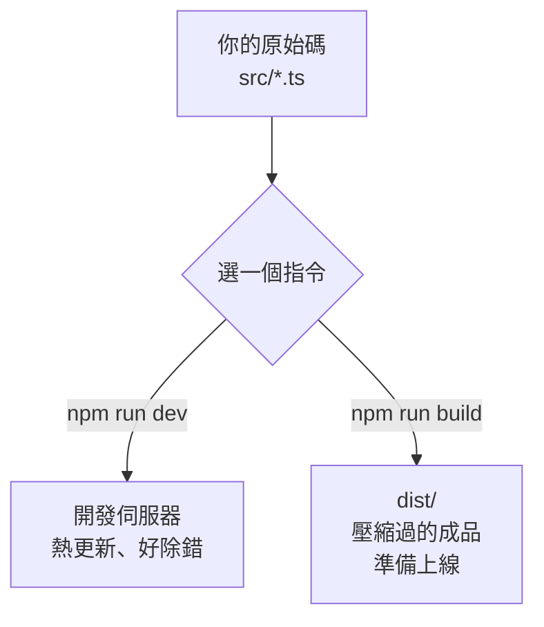

# [4-C-2] Vite 設定：開發環境 vs 生產環境

> **本章目標**：實際把前端從「手動 tsc」搬到 Vite，理解 `dev` 和 `build` 兩個指令分別在做什麼。

## 你會學到

- 怎麼建立一個 Vite 專案
- Vite 專案的目錄結構長什麼樣
- `npm run dev`（開發）和 `npm run build`（生產）的差別
- 「共用型別」是什麼，怎麼讓前後端共用同一份 `Todo` 定義

---

## 概念說明

### Vite 的兩種模式：開發 vs 生產

上一章說過，開發版和上線版需求不同。Vite 用兩個指令對應這兩種模式：

```
npm run dev
    → 啟動「開發伺服器」
    → 秒開、熱更新（改了馬上看到）
    → 給「正在寫程式的你」用

npm run build
    → 產出「生產版本」
    → 編譯、打包、壓縮成最小的成品
    → 把產出的檔案（通常在 dist/）放上線給「使用者」用
```

用做菜類比：

```
npm run dev   像「試菜」：邊煮邊嚐，隨時調整，速度優先
npm run build 像「出餐」：擺盤完成、份量精準，給客人的成品
```



這張圖說明同一份原始碼，經過不同指令，會走向兩條不同的路：一條給開發、一條給上線。

---

### Vite 專案長什麼樣

Vite 專案的結構和我們手刻的差不多，但有幾個關鍵差異：

```
frontend/
├── index.html          ← 注意：現在放在「最外層」，是 Vite 的入口
├── package.json
├── tsconfig.json
├── vite.config.ts      ← Vite 的設定檔
└── src/
    └── main.ts         ← 你的程式
```

最大的差別在 **`index.html` 怎麼載入程式**。以前我們寫死「載入編譯好的 `dist/main.js`」；Vite 裡你直接載入 `.ts`，Vite 會在背後即時幫你編譯：

```html
<!-- V1~V3：手動載入編譯後的 JS -->
<script src="dist/main.js"></script>

<!-- Vite：直接指向 .ts 原始碼，type="module" 讓它支援 import/export -->
<script type="module" src="/src/main.ts"></script>
```

你不用再自己跑 `tsc`、不用管 `dist/`——Vite 全包了。

---

### 共用型別：讓前後端講好同一套資料形狀

還記得 V2、V3 嗎？我們在**前端和後端各定義了一次** `interface Todo`：

```
前端 main.ts：   interface Todo { id; text; completed }
後端 server.ts： interface Todo { id; text; completed }
```

這是個隱患——如果哪天後端多加一個欄位，但忘了改前端，兩邊就「對資料的認知不一致」了，而且 TypeScript 抓不到（因為是兩份各自獨立的定義）。

> **常見錯誤** — 同一個概念的型別定義散落多份：
> 前後端各維護一份 `Todo`，改了一邊忘了另一邊，型別就「貌合神離」。編譯時兩邊都不報錯，但實際資料對不起來，bug 很難找。
>
> 正確做法：**抽出一份「共用型別」，前後端都 import 它**。改一次，兩邊同步。只有一個事實來源（single source of truth）。

V4 的做法是開一個共用資料夾：

```
poc/v4/
├── shared/
│   └── types.ts        ← interface Todo 只定義在這裡
├── frontend/
│   └── src/main.ts     ← import { Todo } from "...shared/types"
└── backend/
    └── src/server.ts   ← import { Todo } from "...shared/types"
```

> 這正是「介面要被妥善定義、單一來源」的精神 → [課外讀物 E-7-5：I — Interface Segregation Principle](../../../課外讀物/E-7-solid/E-7-5-isp.md)

---

## 程式碼範例

### 範例一：建立一個 Vite 專案

Vite 提供一個指令幫你把骨架建好。在前端資料夾的位置執行：

```bash
# 用 Vite 的官方範本建立一個 vanilla（純 TypeScript，不含框架）專案
npm create vite@latest frontend -- --template vanilla-ts

cd frontend
npm install
```

`vanilla-ts` 的意思是「純 TypeScript，沒有 React/Vue 等框架」——很適合我們現在的階段（框架要到 Part 6 才登場）。

---

### 範例二：認識產生出來的 `package.json`

Vite 範本會幫你寫好指令，重點是這三個：

```json
{
  "scripts": {
    "dev": "vite",              // 啟動開發伺服器
    "build": "tsc && vite build", // 先型別檢查，再打包成生產版
    "preview": "vite preview"   // 預覽 build 出來的成品
  }
}
```

注意 `build` 是 `tsc && vite build`——先用 `tsc` 做一次完整的型別檢查（確保沒有型別錯誤），通過了才讓 Vite 打包。**型別安全和打包是兩件事，這裡把它們串起來。**

---

### 範例三：跑起來感受熱更新

```bash
npm run dev
```

Vite 會印出一個網址（通常是 `http://localhost:5173`），用瀏覽器打開它。然後試試看：**改一下 `src/main.ts` 存檔**——瀏覽器會自動更新，你完全不用手動重整。這就是上一章說的 HMR。

> **注意埠號**：Vite 開發伺服器預設在 `5173`，而我們的後端在 `3000`。兩個不同的埠號 = 兩個不同的「來源」，這會牽涉到 CORS——4-C-4 會專門講。

---

### 範例四：build 出生產版本

當你要上線時：

```bash
npm run build
```

Vite 會在 `dist/` 產出壓縮好的成品。打開 `dist/` 看一眼，你會發現裡面的 JS 被壓得又小又難讀（變數名變短、空白被刪掉）——這對機器沒差，但對「載入速度」差很多。

可以用 `npm run preview` 在本機預覽這個生產版本，確認 build 出來的東西真的能跑。

---

## 小練習

**練習 1**：用 `npm create vite@latest` 建立一個 `vanilla-ts` 專案，跑起 `npm run dev`，試著改 `src/main.ts` 裡的文字，觀察瀏覽器是不是自動更新了。

**練習 2**：對同一個專案跑 `npm run build`，打開 `dist/` 裡的 `.js` 檔看看。跟你寫的原始碼比，它變成什麼樣子？為什麼上線版要這樣壓縮？

**練習 3**：把一個 `interface Todo` 抽到一個獨立檔案 `types.ts`，然後在另一個檔案用 `import { Todo } from "./types"` 引入。確認 TypeScript 沒有報錯——這就是「共用型別」最小的練習。

---

## 課外讀物

> 想了解 `npm create`、`devDependencies` 這些套件管理的細節 → [課外讀物 E-2-1：npm 是什麼？package.json 解析](../../../課外讀物/E-2-npm/E-2-1-npm-intro.md)

> 想知道為什麼「型別定義要單一來源、介面要設計得好」 → [課外讀物 E-7-5：I — Interface Segregation Principle](../../../課外讀物/E-7-solid/E-7-5-isp.md)
