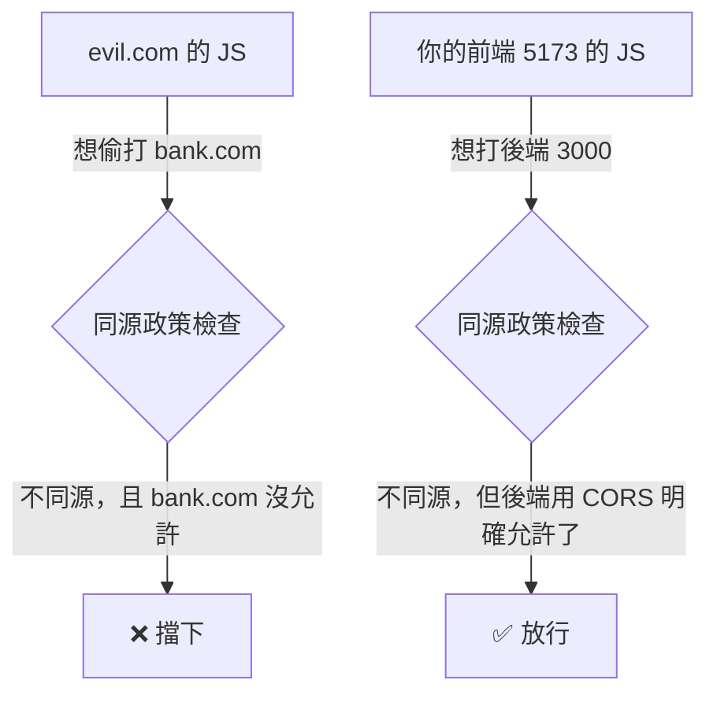

# [4-C-4] CORS 是什麼？為什麼前後端分開跑會報錯

> **本章目標**：搞懂前三版一直「先加 `app.use(cors())` 繞過去」的那個 CORS 到底是什麼、為什麼存在，以及怎麼正確設定它。

## 你會學到

- 「來源（Origin）」是什麼，為什麼前端 5173 + 後端 3000 算「不同來源」
- 瀏覽器的「同源政策」在防什麼
- CORS 是怎麼「開後門」讓合法的跨來源請求通過的
- 怎麼在後端正確設定 CORS（而不是無腦全開）

---

## 概念說明

### 先還原案發現場

到了 V4，前端用 Vite 跑在 `http://localhost:5173`，後端跑在 `http://localhost:3000`。當前端 `fetch` 後端時，瀏覽器 Console 可能跳出一行紅字：

```
Access to fetch at 'http://localhost:3000/todos' from origin
'http://localhost:5173' has been blocked by CORS policy
```

翻譯成白話：「`5173` 想去拿 `3000` 的東西，被 CORS 政策擋下了。」這不是你的程式有 bug，而是**瀏覽器的安全機制在運作**。

---

### 什麼是「來源（Origin）」？

「來源」由三個東西組成，三個全都一樣才算「同源」：

```
來源 = 協定 + 網域 + 埠號

http://localhost:5173
  ↑         ↑        ↑
 協定      網域      埠號

只要這三個有任何一個不同，就是「不同來源」。
```

所以：

```
http://localhost:5173  vs  http://localhost:3000
                                            ↑ 埠號不同
→ 不同來源！（即使都是 localhost）
```

這就是為什麼前端 5173、後端 3000 會撞到 CORS——它們在瀏覽器眼裡是兩個不同的來源。

---

### 同源政策在防什麼？

瀏覽器有一條預設規則叫**同源政策（Same-Origin Policy）**：「一個網頁的 JavaScript，預設只能向『自己的來源』發請求；想跨來源，要先得到對方的允許。」

為什麼要這麼嚴？用一個攻擊情境就懂了：

```
假設沒有同源政策：

1. 你登入了銀行網站 bank.com（瀏覽器存著你的登入憑證）
2. 你又不小心點開一個惡意網站 evil.com
3. evil.com 的 JavaScript 偷偷向 bank.com 發請求：「把這個人的錢轉給我」
4. 因為你的瀏覽器還帶著 bank.com 的登入憑證，這個請求看起來「像是你本人發的」
5. 錢就沒了 💸
```

同源政策就是來擋這種事的：`evil.com`（一個來源）預設**不能**隨意向 `bank.com`（另一個來源）發請求。這是瀏覽器保護使用者的重要防線。



這張圖點出關鍵差異：同樣是跨來源，惡意的被擋、你自己的被放行——差別在於「**被請求的那一方有沒有明確說『我允許這個來源』**」。而「明確說允許」的機制，就是 CORS。

---

### CORS：被請求方主動「開門」

CORS（Cross-Origin Resource Sharing，跨來源資源共享）不是「攻擊」也不是「破解」，它是一套**讓後端主動聲明「我允許哪些來源來訪問我」**的正規機制。

```
重點：CORS 的設定在「後端」，不在前端。
     是「被訪問的一方」決定要不要開門，而不是「想訪問的一方」自己破門。

後端在回應裡加一個標頭：
    Access-Control-Allow-Origin: http://localhost:5173
意思是：「我允許來自 5173 的請求。」

瀏覽器看到這個標頭，就放行；沒看到，就擋下。
```

所以前三版我們寫的 `app.use(cors())`，做的就是「讓後端在回應裡自動加上允許的標頭」。

---

## 程式碼範例

### 範例一：回顧「無腦全開」的寫法

前三版為了快速開發，我們這樣寫：

```typescript
import cors from "cors"

// 允許「任何來源」訪問——開發時方便，但上線不該這樣
app.use(cors())
```

不帶任何參數的 `cors()` 等於「允許全世界任何來源」。開發階段沒問題，但這就像「為了方便，把家裡大門一直開著」——上線後該收斂。

---

### 範例二：正確的做法——只允許你信任的來源

上線時，應該明確指定「只允許我自己的前端」：

```typescript
import cors from "cors"

// 只允許指定的來源；其他來源一律擋下
app.use(
  cors({
    origin: "http://localhost:5173", // 只允許我們的前端
  }),
)
```

> **常見錯誤** — 把「開發時的全開」直接帶上線：
>
> ```typescript
> app.use(cors()) // 上線後仍然「允許任何來源」
> ```
>
> 問題是：這等於允許「任何網站」都能呼叫你的 API。雖然同源政策仍擋著「帶憑證的跨站攻擊」，但全開仍放寬了你本不需要開放的面，是沒必要的風險。
>
> 正確做法：用環境變數管理「允許的來源」，開發和上線各指向不同的值——這正好接上 4-C-3 學的環境變數：
>
> ```typescript
> app.use(cors({ origin: process.env.FRONTEND_ORIGIN }))
> ```

---

### 範例三：把 CORS 來源也變成環境變數

結合上一章的觀念，後端的 CORS 來源不該寫死。後端讀自己的環境變數（注意後端不需要 `VITE_` 前綴，那是 Vite 前端的規則）：

```typescript
import cors from "cors"

// 後端用 process.env 讀環境變數（Node.js 的方式）
const FRONTEND_ORIGIN = process.env.FRONTEND_ORIGIN ?? "http://localhost:5173"

app.use(cors({ origin: FRONTEND_ORIGIN }))
```

這樣開發時用預設的 `5173`，上線時在伺服器設一個 `FRONTEND_ORIGIN=https://my-todo.com`，程式碼不用改。

---

## POC V4 — 工具鏈升級

> **你現在要做的事**：把 V3 升級——前端改用 Vite、前後端共用同一份型別、設定改用環境變數、CORS 改成正確設定。
> 程式碼在 `poc/v4/`，先跑起來感受開發體驗的提升，再回來對照說明。

這一版功能跟 V3 一樣（還是那個 CRUD Todo App），但**開發體驗和工程品質大幅升級**：

```
相較於 V3，升級了：
    ✅ 前端用 Vite：秒開、熱更新，不用再手動 npm run build
    ✅ 前後端共用型別：interface Todo 只定義一次（shared/types.ts）
    ✅ 環境變數：API 網址、CORS 來源不再寫死
    ✅ CORS 正確設定：只允許指定來源，而非無腦全開
```

```
V4 架構：
┌──────────────────┐         ┌──────────────────┐
│  前端 (Vite)      │  HTTP   │  後端 (Express)   │
│  :5173           │ ──────> │  :3000           │
│  讀 VITE_API_BASE │ <────── │  讀 FRONTEND_ORIGIN│
└──────────────────┘         └──────────────────┘
          └──── 共用同一份型別 ────┘
               shared/types.ts
```

**和 V3 的本質差異**：V3 是「功能正確」，V4 是「工程成熟」——同樣的功能，但用了專業的工具鏈、消除了型別重複、把設定和機密管理好了。這些都是真實專案的標準配備。

---

## 小練習

**練習 1**：把 V4 跑起來（前端 `npm run dev`、後端 `npm run dev`），確認在 `5173` 的前端能正常打 `3000` 的後端。打開 DevTools 的 Network 頁籤，找到 `/todos` 請求，看看 Response Headers 裡有沒有 `Access-Control-Allow-Origin`。

**練習 2**：把後端的 `cors({ origin: ... })` 改成一個**錯誤**的來源（例如 `http://localhost:9999`），重啟後端，重新整理前端。觀察 Console 跳出的 CORS 錯誤，讀懂它在說什麼。

**練習 3**：用自己的話解釋：為什麼 CORS 要設定在「後端」而不是「前端」？如果前端能自己決定「我要跨來源」，同源政策還有意義嗎？

---

## 課外讀物

> 想完整理解 CORS 的預檢請求（preflight）、各種標頭的細節 → [課外讀物 E-3-4：瀏覽器安全策略與 CORS](../../../課外讀物/E-3-network/E-3-4-cors.md)

> 想了解 CORS 想防範的那類攻擊、以及其他 Web 安全威脅的全貌 → [課外讀物 E-3-3：HTTP 協定詳解](../../../課外讀物/E-3-network/E-3-3-http-protocol.md)
