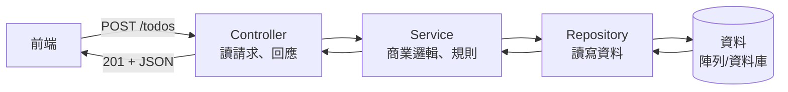

# [4-D-1] 後端分層架構：Controller / Service / Repository 各自的職責

> **本章目標**：理解為什麼真實後端不會把所有邏輯塞在一個檔案，學會用「分層」把職責切開，讓程式碼好讀、好改、好測試。

## 你會學到

- V2~V4 那種「全部擠在 server.ts」的寫法，規模一大會出什麼問題
- 三層架構 Controller / Service / Repository 各自負責什麼
- 為什麼「分層」能讓改一個地方不影響其他地方
- 一個請求在三層之間怎麼流動

---

## 概念說明

### 先看「全部擠一起」的問題

到 V4 為止，我們的 `server.ts` 裡每個端點都同時做了好幾件事。以新增待辦為例：

```
app.post("/todos", ...) 這一個函式同時做了：
    1. 讀取、檢查前端送來的資料（HTTP 的事）
    2. 決定「怎樣才算合法的一筆待辦」（商業規則的事）
    3. 把資料存進陣列（資料儲存的事）
    4. 決定回什麼狀態碼（HTTP 的事）
```

四件不同性質的事，全擠在一個函式裡。現在只有 Todo 還好，但想像一個真實系統有「使用者、訂單、付款、通知」幾十種資源，每個都這樣寫——會變成一團無法維護的泥球。

> **常見錯誤** — 一個函式包山包海（上帝函式）：
> 把「處理 HTTP」「商業邏輯」「存取資料」全寫在同一個函式裡。問題是：想換資料庫，得動到一堆跟資料庫無關的 HTTP 程式碼；想測試商業邏輯，得連 HTTP 一起測。任何一個小改動都牽一髮動全身。
>
> 正確做法：**把不同性質的職責切到不同層**，每一層只做一件事。

> 這正是「一個模組只做一件事」的體現 → [課外讀物 E-7-2：S — Single Responsibility Principle](../../../課外讀物/E-7-solid/E-7-2-srp.md)

---

### 用餐廳分工來理解三層

延續我們的餐廳世界觀。一間運作良好的餐廳，不會讓同一個人「接待客人、煮菜、又跑去倉庫搬食材」——而是分工：

```
服務生（Controller）：
    只面對客人。接點單、把餐點端出去。
    不負責煮，也不知道食材放在哪。

廚師（Service）：
    只負責「怎麼把這道菜做出來」——真正的商業邏輯。
    不直接接觸客人，也不親自去倉庫，需要食材就跟倉管要。

倉管（Repository）：
    只負責「東西放哪、怎麼拿」——資料的存取。
    不管這食材要拿去做什麼菜。
```

對應到後端：

```
Controller（控制器）：處理 HTTP —— 讀請求、回應、狀態碼
Service   （服務層）：處理商業邏輯 —— 規則、流程、驗證
Repository（資料層）：處理資料存取 —— 怎麼讀寫資料庫/陣列
```

每一層只專心做自己的事，而且**只跟相鄰的下一層說話**。

---

### 一個請求怎麼在三層之間流動



這張圖表達請求像「一條往下再往上」的路徑：從 Controller 進來，一層層往下傳到 Repository 碰到資料，再一層層回傳到 Controller 回應前端。**每一層只認識它下面那一層**，不會越級。

---

### 分層帶來的三個好處

```
1. 好讀：想找「商業規則」就去 Service，想找「資料怎麼存」就去 Repository。
        各司其職，一眼知道該看哪。

2. 好改：想把「記憶體陣列」換成「真資料庫」（V6 就要做這件事）？
        只要改 Repository 一層，Controller 和 Service 完全不用動。

3. 好測：想測商業邏輯，只測 Service 就好，不用真的開一個 HTTP 伺服器。
```

第 2 點特別重要，先記住它——這就是為什麼 V6 要從「陣列」換成「資料庫」時，會輕鬆得不可思議。

---

## 程式碼範例

### 範例一：Repository —— 只管資料怎麼存取

Repository 把「資料實際存在哪、怎麼讀寫」這件事包起來。外層只看到「新增、查詢」這些動作，不知道底下是陣列還是資料庫：

```typescript
// todo.repository.ts —— 只負責資料存取，不含任何商業規則
import type { Todo } from "../../shared/types"

let todos: Todo[] = []
let nextId = 1

export const todoRepository = {
  findAll(): Todo[] {
    return todos
  },

  create(text: string): Todo {
    const newTodo: Todo = { id: nextId++, text, completed: false }
    todos.push(newTodo)
    return newTodo
  },
}
```

注意這裡完全沒有 HTTP、沒有狀態碼——它不在乎誰來呼叫它。

---

### 範例二：Service —— 只管商業邏輯

Service 決定「規則」。例如「待辦文字不能是空的」這條規則，屬於商業邏輯，放這裡：

```typescript
// todo.service.ts —— 只負責商業邏輯，需要存取資料時「請 Repository 幫忙」
import { todoRepository } from "./todo.repository"
import type { Todo } from "../../shared/types"

export const todoService = {
  getAllTodos(): Todo[] {
    return todoRepository.findAll()
  },

  createTodo(text: string): Todo {
    // 商業規則：文字去掉空白後不能是空的
    const trimmed = text.trim()
    if (trimmed === "") {
      // 用 throw 把「規則沒過」往上拋，由上層決定怎麼回應前端
      throw new Error("text 不可為空")
    }
    return todoRepository.create(trimmed)
  },
}
```

Service 需要資料時，是「**請 Repository 幫忙**」，自己不直接碰陣列。它也不知道 HTTP——它只懂規則。

---

### 範例三：Controller —— 只管 HTTP

Controller 是唯一碰 `request` / `response` 的地方。它把 HTTP 的東西翻譯給 Service，再把 Service 的結果翻譯回 HTTP：

```typescript
// todo.controller.ts —— 只負責 HTTP，商業邏輯交給 Service
import type { Request, Response } from "express"
import { todoService } from "./todo.service"

export const todoController = {
  getAll(request: Request, response: Response): void {
    const todos = todoService.getAllTodos()
    response.json(todos)
  },

  create(request: Request, response: Response): void {
    try {
      const newTodo = todoService.createTodo(request.body.text)
      response.status(201).json(newTodo)
    } catch (error) {
      // Service 拋出的「規則沒過」，在這裡翻譯成 HTTP 400
      const message = error instanceof Error ? error.message : "建立失敗"
      response.status(400).json({ error: message })
    }
  },
}
```

看出三層怎麼接力了嗎？**Controller 只懂 HTTP、Service 只懂規則、Repository 只懂資料**——每一層都很單純，組合起來卻是完整的功能。

---

### 範例四：把路由接上 Controller

最後 `server.ts` 只剩「把網址對應到 Controller」這件事，乾淨許多：

```typescript
app.get("/todos", todoController.getAll)
app.post("/todos", todoController.create)
```

對比 V4 那個「每個端點塞滿邏輯」的 `server.ts`，現在它只是一張「網址對應表」。完整版會在 POC V5 呈現。

---

## 小練習

**練習 1**：照範例的分層，自己補出 `deleteTodo` 的三層：Repository 的 `remove(id)`、Service 的 `deleteTodo(id)`、Controller 的 `remove(request, response)`。想清楚每一層各該做什麼、不該做什麼。

**練習 2**：「待辦文字不能超過 100 字」這條規則，應該寫在哪一層？「找不到時回 404」又該寫在哪一層？說說你的理由。

**練習 3**：假設老闆說「我們要把資料從陣列換成真的資料庫」。在分層架構下，你需要改哪一層？哪些層完全不用動？（這題答對了，你就懂分層的精髓了。）

---

## 課外讀物

> 這章的分層方式，正是「一個模組只做一件事」的體現 → [課外讀物 E-7-2：S — Single Responsibility Principle](../../../課外讀物/E-7-solid/E-7-2-srp.md)

> 「Service 只依賴 Repository 介面、不在乎底層是陣列還是資料庫」正是依賴反轉原則 → [課外讀物 E-7-6：D — Dependency Inversion Principle](../../../課外讀物/E-7-solid/E-7-6-dip.md)

> 想看 SOLID 五原則如何一起支撐「好維護的架構」 → [課外讀物 E-7-1：SOLID 總覽](../../../課外讀物/E-7-solid/E-7-1-solid-overview.md)

> 分層之所以「好測」，是因為可以單獨測 Service。想學怎麼寫測試 → [課外讀物 E-9-3：單元測試入門](../../../課外讀物/E-9-testing/E-9-3-unit-testing.md)
