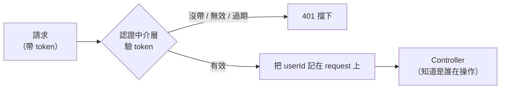

# [4-D-5] Middleware 認證：用一行程式碼保護所有需要登入的 API

> **本章目標**：理解 Express middleware（中介層）的概念，學會寫一個「驗證 token」的中介層，用它優雅地保護任何需要登入的端點。

## 你會學到

- Middleware（中介層）是什麼，它在請求流程中的位置
- 怎麼從請求裡取出前端帶來的 token
- 寫一個驗證 token 的認證中介層
- 怎麼用一行就把某個端點「上鎖」
- 怎麼把「目前登入的是誰」傳給後面的處理函式

---

## 概念說明

### Middleware：請求路上的「關卡」

還記得 4-B-4 寫過的「錯誤處理中介層」嗎？Middleware 其實是個很通用的概念：**它是請求在抵達最終處理函式之前，會先經過的一道道關卡。**

```
請求進來 ──> [關卡1] ──> [關卡2] ──> [最終處理函式] ──> 回應
              中介層      中介層      你的 Controller
```

每個關卡可以：看一眼請求、做點檢查、決定「放行（往下一關走）」還是「擋下（直接回應）」。

我們其實一直在用 middleware：

```
app.use(cors())          ← 一道關卡：處理跨來源
app.use(express.json())  ← 一道關卡：解析 JSON body
```

現在我們要自己寫一道關卡：**「驗證 token」**。它擋在需要登入的端點前面，沒有有效 token 的請求，根本進不到 Controller。

---

### 認證中介層要做的事

用 pseudo code 描述這道關卡的邏輯：

```
這道「驗證 token」的關卡：
    從請求裡找出前端帶來的 token
    如果 沒帶 token：
        回 401，擋下（連門都沒進）
    驗證 token 的簽章和有效期
    如果 token 無效或過期：
        回 401，擋下
    否則：
        把「token 裡的使用者是誰」記在請求上
        放行 → 讓請求繼續往 Controller 走
```



這張圖說明認證中介層作為「守門員」的角色：通過的請求才會帶著「我是誰」的資訊進到 Controller。

---

### token 放在請求的哪裡？

慣例是放在一個叫 `Authorization` 的標頭（Header）裡，格式是 `Bearer <token>`：

```
請求的標頭：
    Authorization: Bearer xxxxx.yyyyy.zzzzz

「Bearer」是「持有者」的意思，表示「持有這張 token 的人」。
後端要把 "Bearer " 這段前綴去掉，才拿到真正的 token。
```

---

## 程式碼範例

### 範例一：先從標頭取出 token

中介層第一步，是把前端放在 `Authorization: Bearer xxx` 裡的 token 取出來。沒帶就直接擋下：

```typescript
import type { Request, Response, NextFunction } from "express"
import jwt from "jsonwebtoken"

const JWT_SECRET = process.env.JWT_SECRET ?? "dev-secret"

export function requireAuth(
  request: Request,
  response: Response,
  next: NextFunction,
): void {
  // 從 Authorization 標頭取出 token，格式是 "Bearer xxx"
  const authHeader = request.headers.authorization
  const token = authHeader?.startsWith("Bearer ")
    ? authHeader.slice("Bearer ".length)
    : null

  if (!token) {
    response.status(401).json({ error: "請先登入" })
    return // 直接擋下，不呼叫 next()
  }
  // ...接下一段：驗證這個 token...
```

### 範例二：驗證 token，通過才放行

拿到 token 後，驗證它的簽章與有效期。通過就把「是誰」記到 request 上並 `next()` 放行；不通過回 401：

```typescript
  try {
    // 驗證簽章與有效期；不合法會 throw
    const payload = jwt.verify(token, JWT_SECRET) as { userId: number }

    // 把「目前登入的是誰」記在 request 上，讓後面的 Controller 拿得到
    request.userId = payload.userId

    next() // 放行，去下一關（Controller）
  } catch {
    response.status(401).json({ error: "登入已失效，請重新登入" })
  }
}
```

---

### 範例三：用一行把端點上鎖

中介層寫好後，要保護哪個端點，就把它「插」在那個端點的處理函式前面：

```typescript
// 不需要登入的端點：照常
app.post("/auth/login", authController.login)

// 需要登入的端點：在 Controller 前面加上 requireAuth
app.get("/todos", requireAuth, todoController.getAll)
app.post("/todos", requireAuth, todoController.create)
app.delete("/todos/:id", requireAuth, todoController.remove)
```

請求會**先經過 `requireAuth`**，通過了才會到 `todoController`。沒通過的，在中介層就被擋下回 401，根本碰不到你的業務邏輯。這就是「一行上鎖」——乾淨、好讀，而且想保護新端點時不用重複寫驗證邏輯。

> 這正是「把重複的邏輯抽出來、單一職責」的好例子——驗證邏輯只寫一次，到處重用 → [課外讀物 E-7-2：S — Single Responsibility Principle](../../../課外讀物/E-7-solid/E-7-2-srp.md)

---

### 範例四：讓 TypeScript 認得 request.userId

範例二在 `request` 上加了 `userId`，但 Express 原本的 `Request` 型別沒有這個屬性，TypeScript 會報錯。我們用「型別擴充」告訴 TypeScript 它的存在：

```typescript
// types/express.d.ts
// 擴充 Express 內建的 Request 型別，加上我們自己掛上去的 userId
declare global {
  namespace Express {
    interface Request {
      userId?: number
    }
  }
}

export {}
```

這樣 `request.userId` 在整個專案裡就有型別了。注意我們用 `?:`（可選），因為只有「通過 requireAuth 的請求」才會有這個值。

---

### 範例五：Controller 怎麼用「目前是誰」

有了 `request.userId`，Controller 就能做「只操作自己的資料」這種事：

```typescript
create(request: Request, response: Response): void {
  // requireAuth 已經把登入者的 id 放進 request.userId
  const userId = request.userId!
  const newTodo = todoService.createTodo(userId, request.body.text)
  response.status(201).json(newTodo)
}
```

現在每筆待辦都能跟「是誰建立的」綁在一起。授權（例如「只能刪自己的待辦」）就是建立在這個基礎上。

---

## 小練習

**練習 1**：把 `requireAuth` 加到一個端點上，然後用 `curl` **不帶 token** 去打它，確認回的是 401。再想想：要怎麼用 curl 帶上 `Authorization: Bearer xxx` 標頭？

**練習 2**：故意傳一個亂打的、格式不對的 token（例如 `Bearer abc123`），觀察 `jwt.verify` 會發生什麼，以及中介層怎麼把它變成 401。

**練習 3**：如果把 `requireAuth` 中介層裡的 `next()` 拿掉（驗證通過卻不呼叫 next），請求會發生什麼事？（提示：想想「放行」這個動作是誰觸發的。）

---

## 課外讀物

> 認證中介層把驗證邏輯抽成單一可重用的關卡，呼應單一職責原則 → [課外讀物 E-7-2：S — Single Responsibility Principle](../../../課外讀物/E-7-solid/E-7-2-srp.md)
