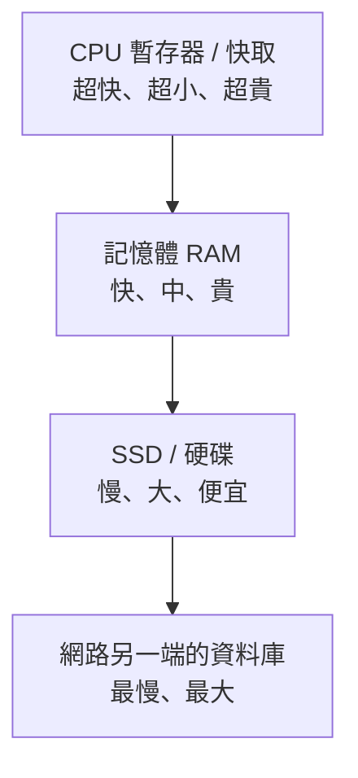

# [cache-1-1] 快取是什麼？為什麼它無所不在

> **本章目標**：理解快取最核心的概念——「把常用的東西，暫存在拿取更快的地方」，並體會它為什麼存在於電腦世界的每一層。

## 你會學到

- 快取（Cache）一句話的定義
- 用「便條紙 vs 翻通訊錄」建立直覺
- 為什麼快取無所不在（從 CPU 到瀏覽器）
- 快取的本質：拿空間/新鮮度換速度

## 概念說明

### 一個生活中的例子

想像你常打電話給媽媽。你有兩個選擇：

1. **每次都翻通訊錄**：找到「媽媽」那一頁、看號碼、再撥。慢，但保證是最新的。
2. **把號碼寫在便條紙貼在電話旁**：要打時瞄一眼就好。快，但如果媽媽換號碼，你的便條紙就過時了。

那張便條紙，就是**快取（Cache）**。它的精神是：

> **把「常用、且拿起來慢」的東西，複製一份放在「拿起來快」的地方，下次就不用再大老遠去拿。**

---

### 快取的定義

正式一點說：

> **快取是「一份資料的副本，存放在比原始來源更快、更近的地方」，目的是加速之後對同一份資料的存取。**

關鍵字：

- **副本**：快取裡的是「複製品」，真正的資料還在原始來源（通訊錄、資料庫…）。
- **更快、更近**：快取所在的位置，拿取速度比原始來源快得多。
- **加速重複存取**：第一次還是得去原始來源拿（順便存進快取），但**第二次之後就快了**。

---

### 為什麼快取無所不在

電腦的世界有一個殘酷的事實：**越快的儲存越貴、越小；越大的儲存越便宜、越慢。**



於是工程師到處都在做同一件事：**把「下層（慢）的常用資料」，暫存到「上層（快）的地方」**。這就是快取——而且它在每一層都發生：

| 哪一層 | 把什麼快取到哪 |
|--------|--------------|
| CPU | 把記憶體的資料快取到 CPU 快取 |
| 作業系統 | 把硬碟的資料快取到記憶體 |
| 瀏覽器 | 把網站的圖片/檔案快取到你電腦 |
| CDN | 把伺服器的內容快取到離你近的節點 |
| 應用程式 | 把資料庫的結果快取到 Redis |
| 資料庫 | 把硬碟的資料快取到自己的記憶體 |

看出來了嗎？**快取不是一個「東西」，而是一個「無所不在的模式」。** 這整本書，就是帶你看懂這每一層（Part 2 的全景）、學會用好它、避開它的坑。

---

### 快取的本質：一筆交易

快取不是免費的魔法，它是一筆**交易（trade-off）**：

> **你用「額外的空間」和「資料可能不新鮮的風險」，換取「速度」。**

- 你多花了空間存副本。
- 你冒了「副本可能過時」的風險（媽媽換號碼，便條紙沒更新）。
- 換來的是「下次拿取快很多」。

這筆交易划不划算，要看情況——這就是下一章「核心取捨」要深入的。而「副本過時」這個風險，正是快取所有坑的根源（Part 6 的主題）。

## 程式碼範例

用 pseudo code 看「有沒有快取」的差別。假設要取得一個使用者的資料（從很慢的資料庫）：

**沒有快取——每次都去資料庫（慢）：**

```
function 取得使用者(id):
    return 查詢資料庫(id)      // 每次都慢
```

**有快取——先看便條紙（快取）：**

```
function 取得使用者(id):
    如果 快取裡有(id)：
        return 快取.取出(id)          // 命中！很快
    否則：
        資料 = 查詢資料庫(id)         // 沒有才去慢的來源
        快取.存入(id, 資料)           // 順手存進快取
        return 資料
```

第二段就是快取最基本的流程——**先問快取、沒有才問來源、拿到順手存起來**。這個模式叫 **Cache-Aside（旁路快取）**，是最常見的快取用法（cache-1-3、cache-5-3 會深入）。

注意：第一次呼叫還是慢的（要去資料庫），但**第二次、第三次……同一個 id 就都快了**——這就是快取的價值：加速「重複的存取」。

## 小練習

### 練習 1：找出生活中的快取

想三個你生活中「把常用東西放近一點以求快」的例子（不限電腦）。例如：把常用的調味料放在爐子旁邊。它們都體現了快取的精神。

---

### 練習 2：理解那筆交易

回答：

1. 快取「用什麼換什麼」？
2. 「便條紙上媽媽的號碼過時了」對應到快取的什麼風險？

---

### 練習 3：讀懂 Cache-Aside

看上面第二段 pseudo code，回答：

1. 第一次呼叫 `取得使用者(5)` 是快還是慢？為什麼？
2. 第二次呼叫 `取得使用者(5)` 呢？
3. 哪一行讓「第二次變快」成為可能？

## 課外讀物

> 這本書是快取的完整版；想先看「效能脈絡下」的快取簡介 → [課外讀物 E-11-8：多層次快取全景](../../../課外讀物/E-11-performance/E-11-8-cache-layers.md)
