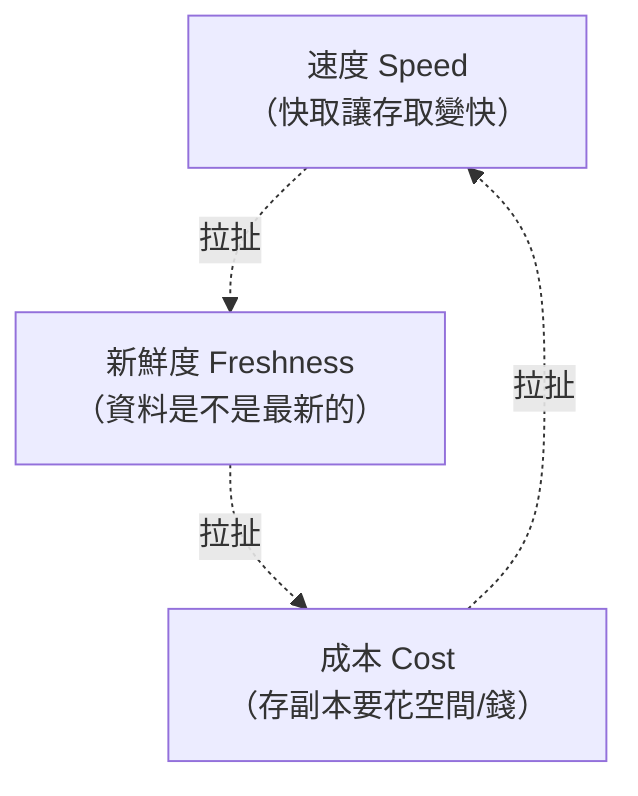
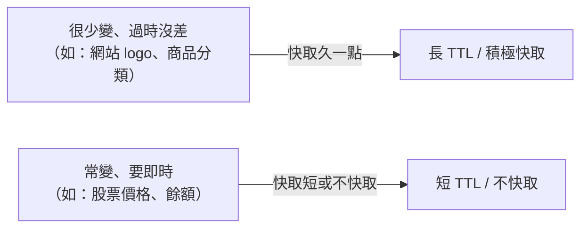

# [cache-1-2] 快取的核心取捨：速度 vs 新鮮度 vs 成本

> **本章目標**：理解快取不是免費的——它在「速度、新鮮度、成本」之間做取捨，看懂這個三角，你才知道「什麼該快取、快取多久」。

## 你會學到

- 快取的三個拉扯：速度、新鮮度、成本
- 為什麼「快取越久越快，但越不新鮮」
- 什麼資料適合快取、什麼不適合
- 「快取多久（TTL）」怎麼決定

## 概念說明

### 上一章的伏筆：快取是一筆交易

cache-1-1 說快取是「用空間和新鮮度的風險，換速度」。這一章把這筆交易拆清楚——它其實是**三個東西在互相拉扯**：



你沒辦法三個都要滿——**改善一個，常常犧牲另一個**。理解這個取捨，是用好快取的關鍵。

---

### 速度 vs 新鮮度：最核心的拉扯

這是快取最根本的矛盾：

> **快取存越久 → 越多請求命中快取 → 越快、越省；但也代表資料越可能「過時、不新鮮」。**

用便條紙的例子（cache-1-1）：

- 便條紙**永遠不更新** → 每次打電話都超快（不用翻通訊錄），但媽媽一換號碼你就一直打錯。
- 便條紙**每次打前都重抄一次** → 永遠正確，但等於沒有快取（一樣慢）。
- 折衷：**每週重抄一次** → 大部分時候快、又能容忍「最多過時一週」。

「每週重抄一次」這個「快取的有效期限」，在技術上叫 **TTL（Time To Live，存活時間）**——它就是你在「速度」和「新鮮度」之間選的那個平衡點。

---

### 用「資料變動頻率」決定快取策略

那要怎麼選平衡點？關鍵看：**這份資料多常變、過時的後果多嚴重。**



| 資料類型 | 變動頻率 | 過時的後果 | 快取策略 |
|---------|---------|-----------|---------|
| 網站 logo、CSS、JS（有版本號的）| 幾乎不變 | 無 | **積極快取很久**（甚至「永久」）|
| 商品分類、設定 | 很少變 | 小 | 快取數小時/天 |
| 文章內容、商品詳情 | 偶爾變 | 中 | 快取數分鐘 |
| 庫存數量、價格 | 常變 | 大（賣超、價格錯）| 短 TTL 或不快取 |
| 帳戶餘額、即時交易 | 隨時變 | 嚴重 | **通常不快取** |

核心判斷：**「過時一下子」能不能接受？** 能 → 大膽快取；不能 → 短 TTL 或別快取。

---

### 成本那一角

第三個角是成本——存快取要花資源：

- **空間/錢**：快取存在記憶體（Redis）這種「快但貴」的地方。快取越多東西，花的記憶體越多。
- **複雜度**：加了快取，系統就多了一層要維護、要除錯的東西（Part 6 的坑都是這來的）。

所以不是「什麼都快取」——而是**快取「真的常被重複存取、且值得」的東西**。一份一天只被讀一次的資料，快取它幾乎沒意義（命中率太低，cache-1-3）——白花成本。

---

### 把三角串起來：什麼該快取

綜合三個取捨，「值得快取」的資料通常符合：

```
✅ 常被「重複讀取」（命中率高 → 速度效益大）
✅ 「過時一下子」可以接受（新鮮度風險可控）
✅ 原始來源「拿起來慢」（快取的加速才明顯）

❌ 反之：很少重複讀、必須即時、本來就很快拿到 → 不值得快取
```

舉例：

- **商品詳情頁**：很多人重複看、過時幾分鐘沒差、查資料庫慢 → ✅ 完美的快取對象。
- **使用者的即時帳戶餘額**：必須準、過時會出事 → ❌ 別快取（或極短）。

學會用這個三角判斷，你就掌握了快取最重要的「要不要、快取多久」的決策。

## 程式碼範例

快取的「平衡點」具體就是設定一個 **TTL**。用 pseudo code 看：

```
// 快取商品詳情，TTL 設 5 分鐘
快取.存入("product:123", 商品資料, TTL = 5分鐘)

// 5 分鐘內的請求 → 命中快取（快、但可能過時最多 5 分鐘）
// 5 分鐘後 → 快取自動失效 → 下次請求重新從資料庫拿、再存 5 分鐘
```

這個 `TTL = 5分鐘` 就是你的決策：**「我接受商品資料最多過時 5 分鐘，換取這 5 分鐘內所有請求都超快、且不煩資料庫。」**

如果是庫存數量，你可能設 `TTL = 10秒`（甚至不快取）——因為「過時」的後果嚴重得多。同樣的機制，不同的取捨。

## 小練習

### 練習 1：解釋三角

用自己的話說明「速度、新鮮度、成本」這三者怎麼互相拉扯。為什麼「快取越久越快，但越不新鮮」？

---

### 練習 2：判斷該不該快取

下面的資料，你會「積極快取 / 短快取 / 不快取」？說明理由（用「變動頻率 + 過時後果」判斷）：

1. 一篇部落格文章的內容
2. 使用者的銀行帳戶餘額
3. 網站的導覽列選單
4. 電商商品的「即時剩餘庫存」

---

### 練習 3：設 TTL

你要快取「今日天氣預報」。你會設多長的 TTL？為什麼？如果改成「即時氣溫」呢？

## 課外讀物

> 想了解快取在整體效能優化裡的角色 → [課外讀物 E-11-3：Redis 與快取策略](../../../課外讀物/E-11-performance/E-11-3-redis-cache.md)
