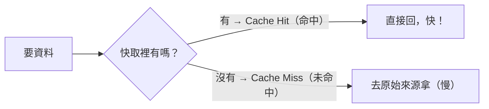
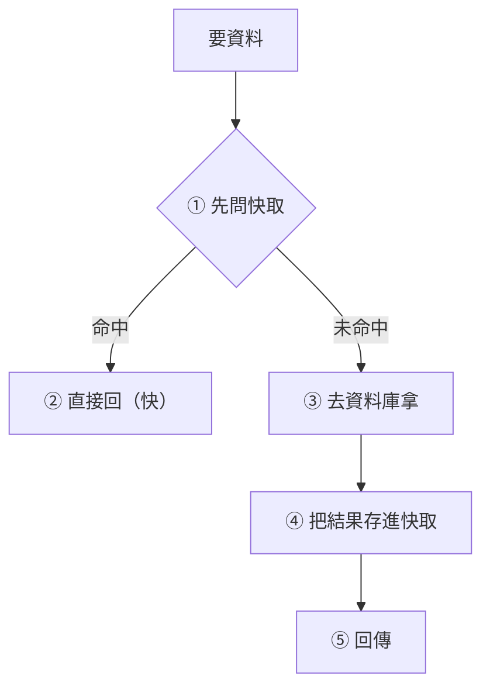

# [cache-1-3] 命中與未命中：hit rate 與 Cache-Aside 流程

> **本章目標**：搞懂快取最基本的運作術語——命中（hit）、未命中（miss）、命中率（hit rate），以及最常見的快取模式 Cache-Aside 的完整流程。

## 你會學到

- cache hit（命中）與 cache miss（未命中）是什麼
- 命中率（hit rate）為什麼是衡量快取好壞的關鍵指標
- Cache-Aside（旁路快取）的完整流程
- 為什麼「第一次一定 miss」（冷啟動）

## 概念說明

### 命中與未命中

每次你向快取要資料，只有兩種結果：



- **Cache Hit（命中）**：要的資料快取裡**有** → 直接拿，超快。
- **Cache Miss（未命中）**：快取裡**沒有** → 得去原始來源（資料庫等）拿，慢。

快取的目標很簡單：**讓 hit 越多越好、miss 越少越好。** 因為 hit 才快、才省。

---

### 命中率（Hit Rate）：快取的成績單

**命中率（hit rate）** 是衡量快取「有沒有用」的關鍵指標：

```
命中率 = 命中次數 ÷ 總請求次數 × 100%
```

例如 1000 次請求，900 次命中、100 次未命中 → 命中率 90%。

為什麼命中率這麼重要？

- **命中率高** → 大部分請求都走「快」的路 → 快取真的有在加速、有在減輕原始來源負擔。
- **命中率低** → 大部分請求還是去慢的來源 → 快取幾乎沒用，還白花了空間（呼應 cache-1-2 的成本）。

> 如果你加了快取，命中率卻很低（例如 20%），代表你快取錯了東西——可能快取了「很少被重複讀」的資料，或 TTL 太短（東西還沒被重複讀就過期了）。命中率是檢查「快取設計對不對」的第一個數字。

---

### Cache-Aside：最常見的快取模式

cache-1-1 你看過這個流程，這裡正式介紹它的名字——**Cache-Aside（旁路快取，也叫 Lazy Loading）**。它是最常見的快取用法：



四個步驟：

1. **先問快取**：要資料時，先看快取有沒有。
2. **命中** → 直接回（結束，快）。
3. **未命中** → 去原始來源（資料庫）拿。
4. **拿到後，順手存進快取** → 這樣**下次**同樣的請求就會命中。

「Lazy（懶惰）載入」這個別名很傳神——它**不會主動預先載入**，而是「等有人要了、發現沒有，才懶懶地去拿並存起來」。資料是「被需要時」才進快取的。

---

### 冷啟動：第一次一定 miss

Cache-Aside 有個必然的特性——**「第一次」一定是 miss**。

因為快取一開始是空的（剛啟動、剛清空），第一個來要資料的人，快取裡什麼都沒有 → 必然 miss → 走慢的路、順手填快取。之後的人才開始命中。

這個「快取剛開始是空的、命中率低」的階段，叫 **冷啟動（cold start）/ 暖機（warm-up）**。系統剛上線或剛重啟快取時，命中率會低、原始來源壓力大，要過一陣子「暖起來」（熱門資料都被填進快取後）才穩定。

> 這也埋下一個坑——如果快取「同時大量失效」（例如一堆 key 同時過期、或快取重啟），瞬間全部變 miss，大量請求湧向資料庫，可能把它打垮。這就是 **快取雪崩**（cache-1-4 預告、cache-6-2 詳解）。

## 程式碼範例

完整的 Cache-Aside 實作（pseudo code，加上命中率的概念）：

```
function 取得商品(id):
    key = "product:" + id

    // ① 先問快取
    快取結果 = 快取.取出(key)

    如果 快取結果 存在：
        記錄("命中")                    // hit
        return 快取結果                  // ② 直接回，快

    記錄("未命中")                       // miss
    // ③ 未命中 → 去資料庫
    商品 = 查詢資料庫(id)

    // ④ 順手存進快取（設個 TTL，cache-1-2）
    快取.存入(key, 商品, TTL = 5分鐘)

    // ⑤ 回傳
    return 商品
```

你可以從「記錄(命中/未命中)」算出命中率，藉此判斷快取設計好不好。

跑一遍感受：

- 第 1 次 `取得商品(7)` → 快取空 → **miss** → 查 DB、填快取。
- 第 2、3、4... 次 `取得商品(7)`（5 分鐘內）→ **hit** → 超快、不碰 DB。
- 5 分鐘後 → 快取過期 → 下次又 **miss** → 重新填。

## 小練習

### 練習 1：算命中率

某快取一小時內收到 5000 次請求，其中 4500 次命中。

1. 命中率是多少？
2. 這個命中率算好嗎？剩下的 500 次發生了什麼（走哪條路）？

---

### 練習 2：診斷低命中率

你加了快取，但命中率只有 15%。列出兩個可能的原因。（提示：快取了什麼？TTL 多長？）

---

### 練習 3：理解冷啟動

回答：

1. 為什麼 Cache-Aside「第一次一定 miss」？
2. 系統剛重啟、快取全空時，為什麼資料庫壓力會特別大？這跟「快取雪崩」有什麼關係？

## 課外讀物

> Cache-Aside 是應用層快取最常見的模式，更多策略（Read-Through / Write-Through…）見本書 Part 5；雪崩等坑見 Part 6。
