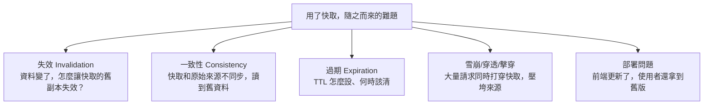

# [cache-1-4] 快取的共同難題總覽：本書地圖

> **本章目標**：先綜覽快取會遇到的幾大難題（失效、一致性、過期、雪崩…），建立一張「本書要解決什麼」的地圖，之後各章深入時就有了脈絡。

## 你會學到

- 快取「加速」的代價：隨之而來的幾大難題
- 失效（invalidation）、一致性（consistency）、過期、雪崩等概念的初步認識
- 這些難題各在本書哪個 Part 深入
- 一句名言：快取的兩大難題

## 概念說明

### 加速的代價

前三章你學到快取能加速。但 cache-1-2 也說了——**快取是一筆交易，副本會帶來「不新鮮」的風險**。這個風險，會具體變成一連串你必須面對的難題。

有句工程界的名言（半開玩笑）很傳神：

> **「電腦科學只有兩件難事：快取失效（cache invalidation）、命名、以及差一錯誤（off-by-one error）。」**

（這句話本身就是個差一錯誤的玩笑——它說「兩件」卻列了三件。）重點是：**快取失效被公認為最難的問題之一**。為什麼難？這一章先綜覽，後面各章逐一破解。

---

### 快取的幾大難題（本書地圖）



逐一初步認識（細節各有專章）：

**① 失效（Invalidation）——最難的那個**

原始資料變了，快取裡的舊副本怎麼辦？你得「讓它失效」（刪掉或更新）。難在哪？因為快取可能散落很多層（瀏覽器、CDN、Redis…），要全部正確失效、又不能失效錯，非常棘手。
→ 貫穿全書，尤其 cache-6-5（更新模式）。

**② 一致性（Consistency）**

失效沒做好，就會「不一致」——快取說 A、資料庫說 B，使用者讀到過時的 A。你能容忍多不一致？
→ cache-6-1 專章。

**③ 過期（Expiration）**

用 TTL 讓快取「自動過期」是最簡單的失效方式（cache-1-2）。但 TTL 設多長、過期後怎麼處理，是門學問。
→ cache-5-4（過期與淘汰）。

**④ 雪崩 / 穿透 / 擊穿**

當大量請求「同時打穿快取」湧向原始來源，可能把它壓垮。這有好幾種情境（cache-1-3 提過的冷啟動是其一）。
→ cache-6-2 ~ 6-4 專章。

**⑤ 前端部署問題**

最常見、最實際的坑——你更新了前端程式碼，但使用者的瀏覽器/CDN 還快取著舊版，看到的還是舊網站。
→ cache-3-5、cache-4-4 專章。

---

### 為什麼這些難題值得一整本書

你可能想：「不就是個快取，有這麼難嗎？」是的，因為——

- 快取**橫跨太多層**（Part 2 的全景），每層的失效機制都不同。
- 快取的坑**很隱蔽**：系統「看起來正常」，但使用者拿到舊資料、或某天突然雪崩掛掉。
- 這些坑**很常見**：幾乎每個工程師都踩過「改了東西使用者卻看到舊的」。

所以這本書不只教你「怎麼設快取」（那很簡單），而是教你**怎麼面對快取帶來的這些難題**——這才是真本事。

---

### 本書地圖回顧

把整本書的脈絡對應到這些難題：

| Part | 解決什麼 |
|------|---------|
| Part 1（你在這）| 建立概念、認識難題 |
| Part 2 | 各層快取全景——知道難題會發生在哪些層 |
| Part 3 瀏覽器快取 | 含「前端部署」坑（cache-3-5）|
| Part 4 CDN 快取 | 含「雙層快取部署」坑（cache-4-4）|
| Part 5 應用層快取 | 過期、淘汰、策略 |
| Part 6 坑與一致性 | 失效、一致性、雪崩/穿透/擊穿——難題大全 + 總整理 |

帶著這張地圖，接下來每一章你都會知道「我現在在解決哪個難題」。

## 程式碼範例

這一章是綜覽，沒有新指令。但用一個「失效」的小例子，讓你先感受「為什麼失效難」：

```
情境：使用者改了暱稱

// 資料庫更新了
更新資料庫(使用者id, 新暱稱)

// 但快取裡還是舊暱稱！要記得讓它失效
// 問題來了——這個使用者的資料，被快取在哪些地方？
快取.刪除("user:123")              // ← Redis 裡的，記得刪
// 那 CDN 上呢？瀏覽器裡呢？其他服務的本地快取呢？
// 每一層都要正確處理，漏一個 → 使用者就看到舊暱稱
```

看到了嗎？「更新資料」很簡單，但「**確保所有層的快取副本都正確失效**」很難——這就是 cache invalidation 被稱為難題的原因。整本書就是在教你系統化地處理它。

## 小練習

### 練習 1：列出難題

不看上面，憑印象列出「用了快取會遇到的難題」至少三個。

---

### 練習 2：對應你的經驗

你自己有沒有遇過「改了東西，但（瀏覽器/網頁）還顯示舊的」？那是上面哪個難題？

---

### 練習 3：為什麼失效難

用「使用者改暱稱」的例子，解釋為什麼「讓快取失效」比「更新資料庫」難。（提示：副本可能在幾層？）

## 課外讀物

> 想先看快取在多層架構裡的全景 → [課外讀物 E-11-8：多層次快取全景](../../../課外讀物/E-11-performance/E-11-8-cache-layers.md)
