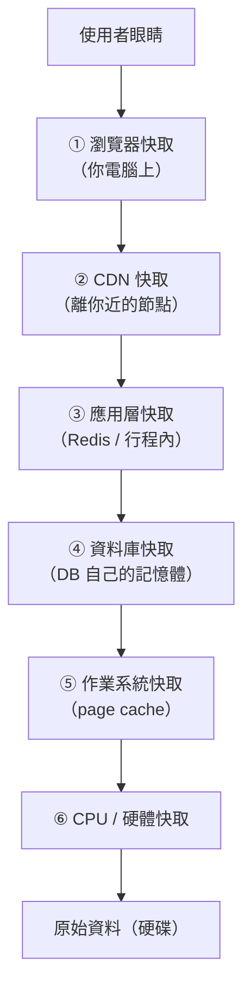

# [cache-2-1] 快取的全景圖：從 CPU 到瀏覽器

> **本章目標**：建立「快取無所不在、橫跨整個系統」的全景，知道從硬體到瀏覽器有哪幾層快取、每層在哪、負責什麼。

## 你會學到

- 一個請求/一筆資料，會經過哪些快取層
- 每一層快取的定位
- 「越上層越快越小、越下層越大越慢」的規律
- 為什麼理解全景，比鑽研單一層更重要

## 概念說明

### 快取不是一個點，是一整條鏈

cache-1-1 說快取無所不在。這一章把「無所不在」具體畫出來——當一筆資料從「最底層的儲存」送到「使用者眼前」，沿途會經過**好幾層快取**，每一層都可能把它「暫存」起來。



這就是快取的全景。一筆資料要從硬碟到使用者眼前，**每一層都有機會說「我這有快取，不用往下要了」**——越早命中，越快。

---

### 兩個方向看這張圖

**由上往下（離使用者越來越遠）**：

| 層 | 在哪 | 快取什麼 | 本書專章 |
|----|------|---------|---------|
| ① 瀏覽器快取 | 你的電腦/手機 | 網站的圖片、CSS、JS、API 回應 | Part 3 |
| ② CDN 快取 | 全球各地的邊緣節點 | 靜態資源、有時動態內容 | Part 4 |
| ③ 應用層快取 | 你的後端伺服器旁（Redis）| 資料庫查詢結果、運算結果 | Part 5 |
| ④ 資料庫快取 | 資料庫伺服器內 | 常用的查詢、資料頁 | cache-2-5 |
| ⑤ 作業系統快取 | 伺服器的記憶體 | 硬碟讀過的檔案 | cache-2-3 |
| ⑥ CPU/硬體快取 | CPU 內 | 記憶體裡的熱資料 | cache-2-2 |

**核心規律（呼應 cache-1-1）**：越上層（離使用者近）的快取，命中時越快、也越能「擋掉」往下的請求；但每一層都有它的容量與失效難題。

---

### 「命中越早越好」

這張圖的關鍵啟示：**請求在越上層的快取命中，效益越大。**

```
使用者要一張圖片：
  在「瀏覽器快取」命中 → 根本不發出網路請求，瞬間顯示（最快！）
  瀏覽器沒有 → 在「CDN」命中 → 就近拿，不用連到遠方伺服器
  CDN 沒有 → 到伺服器「應用層快取(Redis)」命中 → 不用查資料庫
  Redis 沒有 → 查資料庫（可能 DB 自己也有快取）
  全都沒有 → 最終讀硬碟（最慢）
```

所以好的系統會**層層設防**——讓盡可能多的請求在「越上層」就命中，越往下的層（資料庫、硬碟）壓力越小。這就是「多層快取」的精神（cache-6-6 總整理會設計這整套）。

---

### 為什麼先看全景

你可能急著想學「Redis 怎麼用」「Cache-Control 怎麼設」。但先看全景很重要，因為：

1. **同一個問題可能要在多層解決**：例如「前端更新使用者卻看到舊版」，其實是「瀏覽器快取 + CDN 快取」兩層一起搞的鬼（cache-4-4）——只懂一層解不了。
2. **失效要層層考慮**：cache-1-4 那個「改暱稱要讓哪幾層失效」的難題，正是因為快取有這麼多層。
3. **避免重複或衝突**：理解每層的定位，才不會在錯的層做錯的快取（例如把「個人化內容」快取到 CDN，cache-4-5 的坑）。

接下來幾章（cache-2-2 ~ 2-5）會逐層快速認識「離使用者較遠」的幾層（硬體、OS、DB、應用層），後面的 Part 3~5 再深入「你最常直接操作」的瀏覽器、CDN、Redis 三層。

## 程式碼範例

這一章是全景概念，沒有指令。但用一個「圖片請求」的真實旅程，把全景串起來：

```
你第二次打開某個網頁，要載入 logo.png：

1. 瀏覽器快取：有！（上次來過，存著呢）
   → 直接顯示，連網路都沒用到。結束。耗時 ~0ms

──── 如果瀏覽器快取沒有（例如第一次來）────

2. 請求送出 → 最近的 CDN 節點：有！
   → 從幾十公里外的節點拿，~20ms。順便存回你的瀏覽器快取。

──── 如果 CDN 也沒有 ────

3. CDN 回源到你的伺服器 → 伺服器的 Nginx/應用：
   → 從 S3 或硬碟拿 logo.png，回給 CDN（CDN 順便快取），CDN 再給你。~200ms

下次再來 → 多半在第 1 步（瀏覽器）就命中，瞬間完成。
```

看出「層層快取」怎麼讓「重複的請求越來越快、且越來越不打擾下層」了嗎？這就是全景的威力。

## 小練習

### 練習 1：畫出全景

不看上面，憑印象畫出「從硬碟到使用者眼前」的快取層，至少列出 4 層。

---

### 練習 2：命中越早越好

回答：一張圖片在「瀏覽器快取」命中，和在「資料庫快取」命中，哪個對使用者更快、對系統更省？為什麼？

---

### 練習 3：對應專章

「前端更新後使用者看到舊版」這個問題，主要牽涉全景圖的哪兩層？（提示：離使用者最近的兩層）

## 課外讀物

> 這張全景圖的精簡版 → [課外讀物 E-11-8：多層次快取全景：瀏覽器到資料庫](../../../課外讀物/E-11-performance/E-11-8-cache-layers.md)
