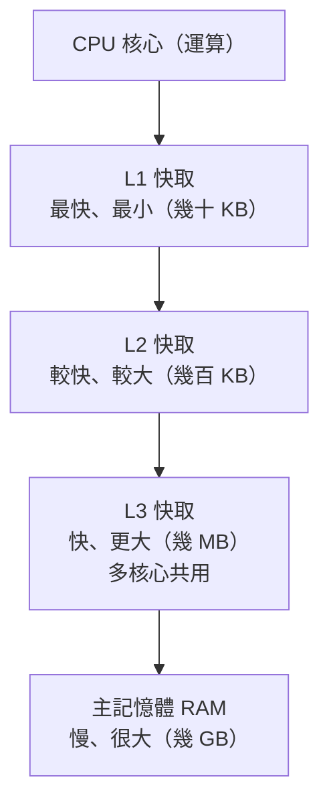

# [cache-2-2] 硬體層快取：CPU 與記憶體

> **本章目標**：建立「硬體也在快取」的直覺——CPU 的 L1/L2/L3 快取、記憶體階層，理解「越近越快越小越貴」這個貫穿整個快取世界的規律。

## 你會學到

- 為什麼 CPU 需要快取（CPU 比記憶體快太多）
- L1 / L2 / L3 快取是什麼
- 「記憶體階層（memory hierarchy）」與「越近越快越小越貴」
- 這個硬體規律怎麼類比到上層的所有快取

## 概念說明

### 這層你不用「操作」，但要懂它的規律

硬體快取（CPU 快取）是工程師**平常不會直接操作**的一層——它由 CPU 自動管理。那為什麼要學？因為——

> **整個快取世界的核心規律「越近越快、越小越貴」，最早就是在硬體這層體現的。懂了這層，你就懂了所有快取層的底層邏輯。**

### 為什麼 CPU 需要快取

CPU 運算超快，但它要算東西，得先從**記憶體（RAM）**拿資料。問題是——**CPU 比記憶體快太多了**。

打個比方：如果 CPU 做一次運算像「眨一下眼」，那去記憶體拿一次資料，像是「走出門買杯咖啡再回來」。CPU 算完一筆，就要乾等記憶體老半天——太浪費了。

解法就是快取：在 **CPU 內部**放一小塊「超快的記憶體」，把「常用的資料」放在這，CPU 就不用每次都跑去（相對慢的）主記憶體拿。

---

### L1 / L2 / L3：階層式的 CPU 快取

CPU 快取本身又分好幾層（這正是「分層快取」的鼻祖）：



| 層 | 速度 | 大小 | 位置 |
|----|------|------|------|
| **L1** | 最快 | 最小（~32-64 KB）| 緊貼每個核心 |
| **L2** | 快 | 中（~256KB-1MB）| 每個核心旁 |
| **L3** | 較快 | 大（~幾十 MB）| 多核心共用 |
| **RAM** | 相對慢 | 很大（~幾十 GB）| CPU 外 |

CPU 要資料時，**先找 L1 → 沒有找 L2 → 沒有找 L3 → 都沒有才去 RAM**——這不就是 cache-1-3 的「先問快取、沒有才往下」、cache-2-1 的「層層快取」嗎？沒錯，**這個模式在硬體層就奠定了**。

---

### 核心規律：越近越快、越小越貴

從 L1 到 RAM，你會看到一個清楚的規律：


> **越快的儲存，越貴、所以做得越小；越大的儲存，越便宜、所以做得越慢。**

這就是 cache-1-1 提過的那個「殘酷事實」的根源。正因為「又快又大又便宜」做不到，工程師才到處用快取——**把少量「最常用的」放進「快但小」的地方，大量資料留在「慢但大」的地方**。

而這個規律**一路往上複製**到每一層快取：

| 硬體層 | 對應到上層快取 |
|--------|--------------|
| L1（最近最快最小）| 瀏覽器快取（離使用者最近，瞬間，但只存這使用者用過的） |
| RAM（較遠較慢較大）| 資料庫（離使用者遠，但存全部資料）|

所以你懂了 CPU 快取的「越近越快越小越貴」，就懂了為什麼瀏覽器快取小而快、資料庫大而慢——**同一個規律，不同的尺度**。

---

### 一個對工程師的實際啟示

雖然你不直接操作 CPU 快取，但它有個實際影響——**「資料的排列方式」會影響程式效能**。

因為 CPU 快取是「一塊一塊」載入的（一次載入一段連續記憶體，叫 cache line）。所以**存取「連續、相鄰」的資料比「跳來跳去」快**——因為相鄰的資料很可能已經被一起載進快取了（命中），跳著存取則常常 miss、要重新去 RAM 拿。

這就是為什麼「遍歷陣列」通常比「遍歷鏈結串列」快——陣列在記憶體裡連續，對 CPU 快取友善。你不用深究，但知道「**資料局部性（locality）影響效能**」這個概念，對寫高效程式有幫助。

## 程式碼範例

這層由硬體自動管理，沒有「設定快取」的程式碼。但你可以感受「資料局部性」的影響（概念示意）：

```
// 對 CPU 快取友善：連續存取陣列
// 相鄰元素很可能一起被載進快取 → 多數命中 → 快
for (i = 0; i < n; i++):
    sum += array[i]

// 對 CPU 快取不友善：跳躍存取
// 每次跳很遠 → 常常 miss、要重新去 RAM 拿 → 慢
for (i = 0; i < n; i += 大步長):
    sum += array[i]
```

同樣的迴圈次數，第一種通常快得多——差別不在你的程式邏輯，而在「**有沒有善用 CPU 快取**」。這是硬體快取對日常寫程式的隱形影響。

## 小練習

### 練習 1：解釋核心規律

用自己的話說明「越近越快、越小越貴」。為什麼工程師不能直接做一個「又快又大又便宜」的儲存，一勞永逸？

---

### 練習 2：對應上層

CPU 的「先找 L1 → L2 → L3 → RAM」，對應到 cache-2-1 全景圖的什麼模式？「L1 之於 RAM」和「瀏覽器快取之於資料庫」有什麼相似？

---

### 練習 3：資料局部性

為什麼「遍歷連續的陣列」通常比「跳躍存取」快？這跟 CPU 快取有什麼關係？

## 課外讀物

> 想了解這個規律在更大尺度（瀏覽器→CDN→Redis→DB）的展現 → [課外讀物 E-11-8：多層次快取全景](../../../課外讀物/E-11-performance/E-11-8-cache-layers.md)
