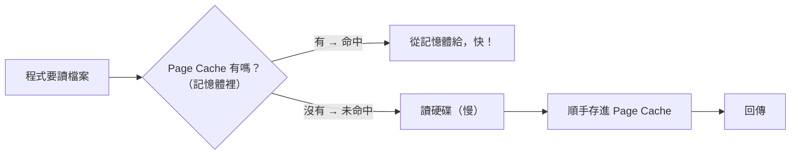

# [cache-2-3] 作業系統與磁碟快取：page cache

> **本章目標**：理解作業系統會自動把「讀過的檔案」快取在記憶體（page cache），這也是一層你看不見卻一直在運作的快取。

## 你會學到

- 為什麼作業系統要快取磁碟資料
- Page Cache（頁快取）是什麼
- 「為什麼第二次讀同一個檔案快很多」
- 這層對你的實際影響

## 概念說明

### 又一層「自動」的快取

cache-2-2 是 CPU 自動管理的硬體快取。這一章的**作業系統快取**也是「自動、你看不見、但一直在運作」的一層——它夾在「記憶體」和「硬碟」之間。

核心問題還是 cache-2-2 的老規律：**記憶體（RAM）快，硬碟（SSD/HDD）慢得多**。讀硬碟相對昂貴，所以作業系統想：「**讀過的檔案，我先在記憶體留一份，下次有人再要，直接從記憶體給，不用再讀硬碟。**」

這份「在記憶體裡的硬碟資料副本」，就是 **Page Cache（頁快取）**。

---

### Page Cache 怎麼運作


```mermaid
graph LR
    APP["程式要讀檔案"]
    APP --> PC{"Page Cache 有嗎？<br/>（記憶體裡）"}
    PC -->|"有 → 命中"| FAST["從記憶體給，快！"]
    PC -->|"沒有 → 未命中"| DISK["讀硬碟（慢）"]
    DISK --> STORE["順手存進 Page Cache"]
    STORE --> FAST2["回傳"]
```

是不是又是 cache-1-3 的 Cache-Aside 模式？沒錯——**「先看記憶體有沒有、沒有才讀硬碟、讀了順手存記憶體」**。整個快取世界都是同一套邏輯，只是在不同層。

作業系統會用「**沒被用到的記憶體**」來做 page cache——所以你會發現伺服器的記憶體「看起來用很滿」，其實很大一塊是 page cache（隨時可釋放）。這是好事，不是記憶體不足（infra Part 2-3 看 `free` 時，那個 buff/cache 欄位就是它）。

---

### 你一定體驗過它

這層快取你天天遇到，只是沒意識到：

> **「為什麼同一個程式/檔案，第二次打開比第一次快很多？」**

- **第一次**：檔案還沒被讀過，page cache 沒有 → 真的去讀硬碟（慢）→ 順手存進 page cache。
- **第二次**：page cache 有了 → 直接從記憶體給（快）。

例如第一次開一個大型應用程式很慢，關掉再開就快很多——就是因為它的檔案還在 page cache 裡。這就是作業系統快取在替你加速。

---

### 對工程師的實際影響

雖然你不直接操作 page cache，但它有幾個實際影響值得知道：

**① 「冷」與「熱」的效能差異**

剛重開機、或檔案第一次被讀（「冷」）時，沒有 page cache，效能較差；跑一陣子、常用檔案都進了 page cache（「熱」）後，效能才穩定。這呼應 cache-1-3 的「冷啟動」——**幾乎每層快取都有冷/熱之分**。

**② 資料庫也倚賴它**

資料庫（cache-2-5）的效能很大一部分靠「資料頁在記憶體裡」。如果常用的資料都在 page cache（或 DB 自己的 buffer pool）裡，查詢就快；如果記憶體不夠、常常要去讀硬碟，就慢。這是為什麼「給資料庫夠多記憶體」對效能很重要。

**③ 測效能時要小心「假快」**

你測一個「讀檔案」的程式，第二次測通常比第一次快——因為第二次命中了 page cache。所以做效能測試時，要意識到「**你測到的可能是快取後的速度，不是真實的冷啟動速度**」。這跟 SRE Part 7-2 負載測試要注意的事相通。

---

### 它在全景中的位置

回到 cache-2-1 的全景，page cache 是相當底層的一環：

```
應用層快取（Redis）── 命中就不往下
   ↓ 沒命中
資料庫 ── DB 自己的 buffer pool（記憶體）── 命中就不讀硬碟
   ↓ 沒命中
作業系統 page cache ── 命中就不讀硬碟  ← 這章
   ↓ 沒命中
真正讀硬碟（最慢）
```

它和「資料庫快取」「硬碟」一起，構成快取全景「最下面」那幾層——**最後的防線**。上層（瀏覽器、CDN、Redis）擋掉越多請求，這幾層的壓力就越小。

## 程式碼範例

這層自動運作，沒有「設定」程式碼。但你可以「觀察」它（在 Linux/WSL 上）：

```bash
# 看記憶體，buff/cache 那欄就是 page cache 等（infra Part 2-3）
free -h
```

輸出裡的 `buff/cache` 通常不小——那是作業系統拿空閒記憶體做的快取，是好事。

感受「第二次比較快」（概念示意）：

```bash
# 第一次讀一個大檔案（冷，要讀硬碟）—— 較慢
time cat 大檔案 > /dev/null

# 立刻再讀一次（熱，命中 page cache）—— 快很多
time cat 大檔案 > /dev/null
```

第二次的 `time` 通常明顯更短——你親眼看到 page cache 在加速。

## 小練習

### 練習 1：解釋 page cache

用自己的話說明：作業系統為什麼要把讀過的檔案存在記憶體？這對應快取的哪個基本模式（cache-1-3）？

<details>
<summary>參考解答</summary>

**為什麼要存在記憶體？** 因為老規律又出現了：**記憶體（RAM）快，硬碟（SSD/HDD）慢得多，而讀硬碟相對昂貴**。所以作業系統想：「讀過的檔案，我先在記憶體留一份副本（這份副本就叫 page cache），下次有人再要同一份，直接從記憶體給，不用再去讀慢速的硬碟。」這樣重複讀取就會越來越快，也省下硬碟 I/O。而且它是用「**目前沒被程式用到的空閒記憶體**」來做的，隨時可以釋放，不浪費。

**對應的基本模式**：就是 cache-1-3 的 **Cache-Aside（旁路快取）**——「先看記憶體（page cache）有沒有 → 有就直接給（命中）→ 沒有才真的去讀硬碟（未命中）→ 讀完順手存進 page cache，下次就快了」。跟應用層用 Redis、CPU 用 L1/L2、資料庫用 buffer pool 是**同一套邏輯**，只是這層由作業系統自動幫你做，你看不見也不用管。

</details>

---

### 練習 2：你的親身經驗

回想：有沒有「同一個程式/檔案，第二次打開快很多」的經驗？用 page cache 解釋它。

<details>
<summary>參考解答</summary>

（這題是要你連結生活經驗，示範一個答案並說明理由。）

**常見例子**：剛開機後第一次打開一個大型程式（例如 Photoshop、IDE、或某個很大的遊戲）通常很慢；但把它關掉、馬上再打開一次，就快很多。

**用 page cache 解釋**：

- **第一次打開**：這個程式的檔案還沒被讀過，page cache 裡沒有 → 作業系統只好真的去**讀硬碟**（慢）→ 讀的同時，順手把這些檔案內容存進 page cache。
- **第二次打開**（而且你還沒關機、記憶體也還沒被別的東西擠掉）：檔案內容還躺在 page cache 裡 → 直接**從記憶體**拿（快）→ 所以明顯變快。

這就是「第一次冷、第二次熱」的由來——**不是程式本身變快了，是作業系統的 page cache 在背後替你加速**。反過來說，如果你重開機（page cache 被清空）再打開，它又會變回第一次的慢速度。

> 這題答案因人而異，只要抓到「第一次讀硬碟並存進 page cache、第二次直接命中記憶體」的邏輯就對了。

</details>

---

### 練習 3：效能測試的陷阱

你要測「讀取一個檔案要多久」，跑了兩次，第二次快很多。為什麼？做效能測試時該注意什麼？（提示：你可能測到的是「熱」快取的速度）

<details>
<summary>參考解答</summary>

**為什麼第二次快很多？** 因為第一次讀的時候，檔案內容被順手存進了 **page cache**。第二次讀時直接命中 page cache、從記憶體拿，不用再碰硬碟，所以快很多。你第二次量到的其實是「**熱**（快取已就緒）」的速度，不是「**冷**（要真的讀硬碟）」的速度。

**做效能測試時該注意什麼？**

1. **意識到「你可能測到的是快取後的速度」**：同一個測試連跑幾次，後面幾次多半被 page cache（或其他層快取）加速，數字會偏樂觀，不代表真實的冷啟動表現。
2. **想清楚你要測「冷」還是「熱」**：
   - 要測**冷啟動 / 最差情況**：每次測之前設法清掉快取（例如 Linux 上 `echo 3 > /proc/sys/vm/drop_caches`，或用夠大、快取裝不下的資料集），確保真的在讀硬碟。
   - 要測**穩定運行 / 一般情況**：那就先「暖機（warm-up）」跑幾次讓快取就緒，再開始正式量測，並且多次取平均。
3. **一致的環境**：每輪測試的快取狀態要一致，數字才可比較。

> 這跟 SRE 做負載測試要避免「假快」是同一個道理——沒搞清楚快取狀態，測出來的數字會騙你。這題屬於觀念題，若你想親自驗證，可在 Linux/WSL 上用 `time cat 大檔案 > /dev/null` 連跑兩次感受差異，需自行實機驗證。

</details>

## 課外讀物

> 想了解這層快取在整體多層架構裡的位置 → [課外讀物 E-11-8：多層次快取全景](../../../課外讀物/E-11-performance/E-11-8-cache-layers.md)
