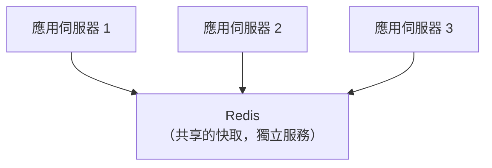

# [cache-2-4] 應用層快取：行程內 vs 分散式

> **本章目標**：理解「應用層快取」是你最常「主動寫程式去用」的一層，並分清兩種形態——行程內快取（in-process）與分散式快取（如 Redis）。

## 你會學到

- 應用層快取是什麼、為什麼你最常碰它
- 行程內快取（in-process）：放在應用自己的記憶體
- 分散式快取（如 Redis）：獨立的共享快取
- 兩者的差別與何時用哪個

## 概念說明

### 你最常「親手」操作的一層

前面幾層（CPU、OS、DB 快取）都是「自動」的——你看不見、不用管。**應用層快取不一樣——它是你「親手寫程式去用」的一層**，也是這本書 Part 5 會深入、面試最常問的一層。

應用層快取就是：**在你的後端應用裡，把「查資料庫/算出來的結果」暫存起來**，下次同樣的請求直接從快取拿，不用再查資料庫或重算（cache-1-3 的 Cache-Aside）。

但「暫存在哪」有兩種選擇，這是這章的重點——**行程內** vs **分散式**。

---

### 形態一：行程內快取（In-Process Cache）

把快取**直接存在應用程式自己的記憶體裡**（一個變數、一個 Map/Dictionary）。


- **優點**：**最快**（就在自己記憶體裡，沒有網路往返）、最簡單（一個變數就行）。
- **缺點**：
  - **不共享**：如果你有多台伺服器（水平擴展，infra Part 9），每台各有各的快取，互不相通——同一份資料被各自快取、各自過期，浪費又可能不一致。
  - **隨應用重啟消失**：應用一重啟，快取全沒了（冷啟動）。
  - **吃應用的記憶體**：存太多會排擠應用本身的記憶體。

適合：**單台、或「每台各自算也沒差」的資料**（如一些唯讀的設定、計算結果）。

---

### 形態二：分散式快取（Distributed Cache，如 Redis）

把快取放在一個**獨立的、所有應用伺服器共享的快取服務**（最常見的是 **Redis**）。



- **優點**：
  - **共享**：所有伺服器連同一個 Redis，快取一份、大家共用——一致、不浪費（這正是水平擴展架構需要的，呼應 SRE Part 7-3 無狀態設計）。
  - **獨立於應用**：應用重啟，快取還在（Redis 沒重啟的話）。
  - **容量大、功能多**：Redis 專門做這個，容量、淘汰策略、資料結構都更強。
- **缺點**：
  - **比行程內慢一點**：要透過網路連 Redis（雖然還是比查資料庫快非常多）。
  - **多一個要維運的服務**：Redis 本身要部署、要顧（雲端可用 aws ElastiCache 託管，aws Part 6-3）。

適合：**多台伺服器的正式環境**（絕大多數情況）——這是業界主流。

---

### 兩者對照

| | 行程內快取 | 分散式快取（Redis）|
|---|-----------|-------------------|
| 存在哪 | 應用自己的記憶體 | 獨立的 Redis 服務 |
| 速度 | 最快（無網路）| 很快（有網路往返）|
| 多台共享 | ❌ 各自為政 | ✅ 共享一份 |
| 應用重啟 | 快取消失 | 快取還在 |
| 適合 | 單台 / 各自算無妨 | 多台正式環境（主流）|

**實務心法**：

- **多台伺服器** → 用 **Redis**（分散式），這是正式環境的標準（呼應 cache-2-4 → Part 5 會深入 Redis）。
- **可以兩層併用**：行程內當「第一層」（最快）、Redis 當「第二層」（共享）——又是多層快取的精神。例如「先看自己記憶體 → 沒有看 Redis → 沒有才查 DB」。

---

### 在全景中的位置

回到 cache-2-1 全景，應用層快取夾在「CDN」和「資料庫」之間，是後端**擋掉資料庫請求**的關鍵防線：

```
CDN ──（動態請求穿過）── 你的應用
                            ↓
                   應用層快取（Redis）← 命中就不查 DB（這章）
                            ↓ 沒命中
                          資料庫
```

它的價值：**把大量「重複的資料庫查詢」擋在 Redis 這層**，讓資料庫不被打爆（呼應 SRE 容量、cache-6-2 雪崩）。這是後端效能優化最常用的招。Part 5 會完整深入 Redis 的策略與細節。

## 程式碼範例

對比兩種應用層快取（pseudo code）：

**行程內快取**（存在應用自己的變數）：

```
本地快取 = new Map()    // 就是應用記憶體裡的一個 Map

function 取得商品(id):
    如果 本地快取.有(id): return 本地快取.取(id)   // 命中，超快
    商品 = 查資料庫(id)
    本地快取.設(id, 商品)                          // 存進自己記憶體
    return 商品
```
→ 問題：如果有 3 台伺服器，這個 Map 每台一份、互不相通。

**分散式快取**（存在共享的 Redis）：

```
function 取得商品(id):
    如果 redis.有("product:" + id):
        return redis.取("product:" + id)          // 命中，從共享 Redis 拿
    商品 = 查資料庫(id)
    redis.設("product:" + id, 商品, TTL=5分鐘)     // 存進共享 Redis
    return 商品
```
→ 3 台伺服器連同一個 Redis，快取共享、一致。這就是正式環境的做法。

## 小練習

### 練習 1：兩種形態

用自己的話說明行程內快取和分散式快取的差別。為什麼「多台伺服器」時行程內快取會有問題？

---

### 練習 2：選形態

下面情況該用哪種？

1. 一個只有單台伺服器的小服務
2. 一個有 10 台伺服器、做了水平擴展的正式服務
3. 想要「又快又共享」——可以怎麼結合兩者？

---

### 練習 3：理解價值

應用層快取（Redis）主要「擋掉」對哪一層的請求？這對資料庫有什麼好處？（提示：呼應 SRE 容量、雪崩）

## 課外讀物

> Redis 與快取策略的概念 → [課外讀物 E-11-3：Redis 與快取策略](../../../課外讀物/E-11-performance/E-11-3-redis-cache.md)；雲端託管的 Redis → 參見 **aws 課程** Part 6-3 ElastiCache
