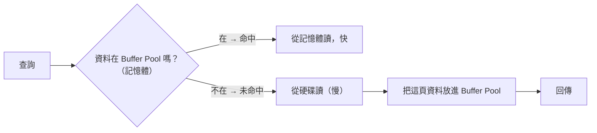

# [cache-2-5] 資料庫快取：buffer pool 與查詢快取

> **本章目標**：理解「資料庫自己也在快取」——它把常用的資料頁放在記憶體（buffer pool），這是全景中「最後一道快取防線」。

## 你會學到

- 為什麼資料庫自己也需要快取
- Buffer Pool（緩衝池）是什麼
- 查詢快取的概念與它的爭議
- 「給資料庫足夠記憶體」為什麼這麼重要

## 概念說明

### 連資料庫都在快取

cache-2-1 全景的最底層附近，是「資料庫」。你可能以為資料庫就是「去硬碟拿資料」——但其實**資料庫自己內部也有一層快取**。

為什麼？還是那個老規律（cache-2-2）：**資料庫的資料存在硬碟（大、慢），但讀硬碟很貴**。所以資料庫會把「常用的資料」放在自己的**記憶體**裡，下次查同樣的東西，直接從記憶體拿，不用讀硬碟。

這層快取你通常不直接寫程式操作，但**它的好壞極大影響資料庫效能**——也影響你前面所有上層快取「沒命中、最終落到 DB」時的速度。

---

### Buffer Pool：資料庫的記憶體快取

最重要的資料庫快取叫 **Buffer Pool（緩衝池）**（MySQL/InnoDB 的叫法；PostgreSQL 叫 shared buffers，概念一樣）。

它的運作（又是熟悉的模式）：



資料庫以「**頁（page）**」為單位管理資料（一頁通常幾 KB）。Buffer Pool 就是「在記憶體裡快取一堆常用的資料頁」。查詢要某筆資料：

- 那一頁**在 Buffer Pool** → 直接從記憶體讀（快）。
- **不在** → 從硬碟讀那一頁、放進 Buffer Pool（之後就快了）。

是不是又是 Cache-Aside（cache-1-3）+ 「越近越快」（cache-2-2）？整個快取世界真的就這幾招，反覆出現在每一層。

---

### 為什麼「給資料庫足夠記憶體」這麼重要

Buffer Pool 用的是資料庫伺服器的**記憶體**。記憶體越大 → Buffer Pool 能快取越多資料頁 → 越多查詢命中記憶體、不用讀硬碟 → 越快。

```
記憶體充足、熱資料都在 Buffer Pool：
  大部分查詢命中記憶體 → 飛快

記憶體不足、Buffer Pool 裝不下熱資料：
  常常 miss、要去讀硬碟 → 慢，且硬碟 I/O 成為瓶頸
```

這就是為什麼——

> **資料庫調效能，最重要的事之一就是「給它足夠的記憶體」**，讓 Buffer Pool 能裝下「常被查的資料」（工作集 working set）。

這也呼應 cache-2-3：DB 的記憶體快取（Buffer Pool）+ 作業系統的 page cache，一起決定了「資料庫最終要不要真的去碰慢速硬碟」。

---

### 查詢快取（Query Cache）：一個有爭議的概念

除了 Buffer Pool（快取「資料頁」），有些資料庫還有過 **查詢快取（Query Cache）**——快取「**整個查詢的結果**」：同樣的 SQL 再來一次，直接回上次的結果。

聽起來很美，但它**爭議很大、已被淘汰**（MySQL 8.0 直接移除了查詢快取）。為什麼？

- **失效太頻繁**：只要那張表有**任何**更新，所有跟它相關的查詢快取就得全部失效——寫入頻繁時，查詢快取一直被清，幾乎沒用還拖累效能（這正是 cache-1-4 的「失效難題」的極端例子）。
- **鎖競爭**：維護查詢快取需要加鎖，高併發下反而變慢。

教訓很有啟發性：**快取不是「加了就好」——如果失效成本太高（資料常變），快取反而有害**（呼應 cache-1-2「常變的資料不適合快取」）。所以「快取查詢結果」這件事，現在多半移到**應用層（Redis，cache-2-4）**自己控制，而不是靠資料庫內建。

---

### 在全景中的位置：最後防線

回到 cache-2-1 全景，資料庫快取是「最下面」那層之一：

```
瀏覽器快取 → CDN → 應用層快取(Redis) ──擋掉大部分──
   ↓ 都沒命中，落到資料庫
資料庫 Buffer Pool（記憶體）← 命中就不讀硬碟（這章）
   ↓ 沒命中
作業系統 page cache（cache-2-3）
   ↓
真的讀硬碟（最慢，最後手段）
```

它是「最後一道快取防線」——上層擋掉越多，落到這裡的越少；但一旦落到這裡，Buffer Pool 命不命中，就決定了「是讀記憶體還是讀硬碟」。所以**上層快取（減少請求量）+ 資料庫有足夠記憶體（讓落下來的請求也快）**，兩者要一起做，效能才好。

## 程式碼範例

這層你通常用「設定」而非「程式碼」操作。例如 MySQL/InnoDB 的 Buffer Pool 大小：

```
# MySQL 設定（概念示意）：把 Buffer Pool 設大一點
# 通常設成伺服器記憶體的 50%~70%（讓熱資料裝得下）
innodb_buffer_pool_size = 4G
```

觀察 Buffer Pool 命中率（概念）：

```sql
-- 看 Buffer Pool 的讀取命中情況（命中率越高越好）
SHOW STATUS LIKE 'Innodb_buffer_pool_read%';
```

如果命中率低，代表記憶體不夠、太多查詢在讀硬碟——該加記憶體或調大 Buffer Pool。這跟 cache-1-3 看「應用層快取命中率」是同一個道理，只是在資料庫這層。

## 小練習

### 練習 1：Buffer Pool 是什麼

用自己的話說明：資料庫為什麼要有 Buffer Pool？它對應快取的哪個基本模式？

---

### 練習 2：記憶體的重要

回答：為什麼「給資料庫足夠記憶體」對效能這麼關鍵？記憶體不足時會發生什麼？

---

### 練習 3：查詢快取的教訓

回答：

1. 為什麼「查詢快取」（快取整個 SQL 結果）在寫入頻繁的表上幾乎沒用、甚至有害？
2. 這個教訓呼應了 cache-1-2 的什麼原則？

## 課外讀物

> 想了解資料庫查詢為什麼快或慢（索引）→ 課外讀物 E-4 資料庫系列；想看快取的整體取捨 → [課外讀物 E-11-8：多層次快取全景](../../../課外讀物/E-11-performance/E-11-8-cache-layers.md)
