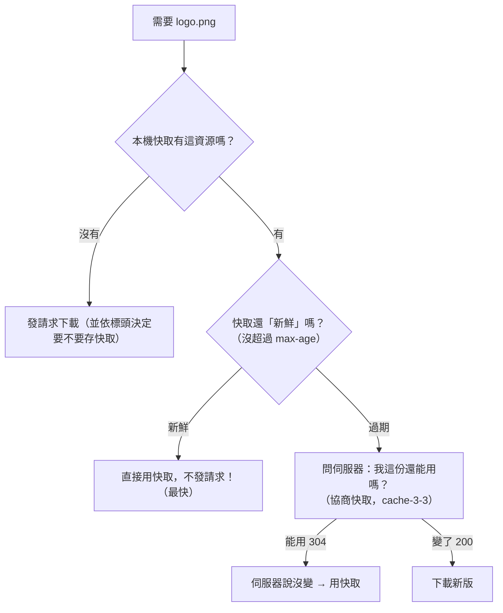

# [cache-3-1] 瀏覽器快取怎麼運作：HTTP 快取模型

> **本章目標**：理解瀏覽器怎麼快取網站資源、HTTP 快取的基本模型，這是前端工程師最該搞懂、也最常踩坑的一層。

## 你會學到

- 瀏覽器為什麼要快取
- 瀏覽器快取的是什麼（圖片、CSS、JS…）
- HTTP 快取模型的核心：伺服器用「標頭」告訴瀏覽器怎麼快取
- 快取存在哪、什麼時候用

## 概念說明

### 為什麼瀏覽器要快取

你第二次打開同一個網站，通常比第一次快很多。為什麼？因為**瀏覽器把上次下載過的資源（圖片、CSS、JS、字型…）存在你的電腦裡了**，第二次不用再從網路下載，直接從本機拿。

這就是**瀏覽器快取**——cache-2-1 全景中**離使用者最近的一層**，命中時最快（根本不用發網路請求）。

它帶來的好處：

- **使用者更快**：資源從本機拿，秒開。
- **省流量**：不用重複下載（對使用者的網路、對伺服器都省）。
- **減輕伺服器**：少了大量重複請求。

但它也是**最常踩坑的一層**——「我明明更新網站了，使用者怎麼還看到舊版？」就是這層搞的鬼（cache-3-5）。

---

### 關鍵：誰決定「能不能快取、快取多久」？

這是瀏覽器快取最核心的觀念：

> **是「伺服器」透過 HTTP 回應的「標頭（header）」，告訴瀏覽器「這個資源能不能快取、快取多久、怎麼驗證」。瀏覽器照著做。**

也就是說——快取的規則**寫在伺服器回應裡**，不是瀏覽器自己亂決定的。當伺服器回傳一個檔案，它會附上像這樣的標頭：

```
Cache-Control: max-age=3600
```

意思是「這個資源你可以快取 3600 秒（1 小時）」。瀏覽器收到後就把它存起來，1 小時內再要這個資源，直接用快取、不發請求。

所以——**控制瀏覽器快取，本質是「在伺服器設定對的 HTTP 標頭」**。這就是為什麼前端/後端工程師都要懂這些標頭（cache-3-2、3-3 詳解）。

---

### HTTP 快取模型總覽

當瀏覽器要一個資源（例如 `logo.png`），它的決策大致是：



這張圖是瀏覽器快取的完整邏輯，分成兩個關鍵概念（cache-3-4 會深入）：

- **「還新鮮」直接用** → 這叫**強快取**（連問都不問伺服器，最快）。
- **「過期了」去問伺服器「還能用嗎」** → 這叫**協商快取**（問一下，但若沒變，省下重新下載）。

---

### 快取存在哪、有哪些

瀏覽器快取其實有幾種儲存（你大致知道即可）：

| 種類 | 說明 |
|------|------|
| **Memory Cache** | 存在記憶體，超快，但關掉分頁就沒了 |
| **Disk Cache** | 存在硬碟，下次開瀏覽器還在（最主要的）|
| （其他如 Service Worker Cache 等，進階主題）| 可程式化控制的快取 |

你不太需要區分它們——重點是理解「瀏覽器會依伺服器的標頭，把資源存起來重複用」這個模型。

---

### 這層為什麼坑這麼多

瀏覽器快取的坑特別多，根源是：

1. **它在「使用者的電腦」上**——你無法直接清除使用者的快取（不像 Redis 你能 `del`）。一旦使用者快取了舊版，你很難主動讓它失效。
2. **標頭設錯後果嚴重**：設太久 → 使用者一直看到舊版（cache-3-5）；設太短或不快取 → 失去快取的好處、伺服器壓力大。

所以接下來幾章會把標頭（cache-3-2、3-3）和決策邏輯（cache-3-4）講清楚，最後 cache-3-5 專門破解「前端更新後看到舊版」這個經典坑。

## 程式碼範例

看一個真實的 HTTP 回應標頭（瀏覽器收到 `logo.png` 時）：

```
HTTP/1.1 200 OK
Content-Type: image/png
Cache-Control: max-age=86400        ← 伺服器說：可快取 1 天
ETag: "abc123"                       ← 一個「版本指紋」（cache-3-3 用）
...（圖片內容）
```

瀏覽器收到後：

```
1. 把 logo.png 存進快取，記住「可用到 1 天後」、ETag 是 "abc123"
2. 1 天內再要 logo.png → 直接用快取，不發請求（強快取，最快）
3. 1 天後再要 → 過期了 → 問伺服器「我這份 ETag abc123 還能用嗎？」
   → 伺服器若回 304（沒變）→ 繼續用快取
   → 若回 200 + 新內容 → 用新版
```

整個瀏覽器快取，就是圍繞這些**標頭**運作的。學會設這些標頭，你就掌控了這一層。

## 小練習

### 練習 1：誰決定快取規則

回答：瀏覽器快取的「能不能快取、快取多久」，是誰決定的、寫在哪裡？

---

### 練習 2：兩種命中

用自己的話說明「強快取」和「協商快取」的差別。哪個更快、哪個會問伺服器？

---

### 練習 3：為什麼這層坑多

回答：為什麼「瀏覽器快取」比「Redis 快取」更難主動失效？這跟它「存在哪」有關。

## 課外讀物

> 想複習 HTTP 標頭、狀態碼的基礎 → [課外讀物 E-3-3：HTTP 協定詳解](../../../課外讀物/E-3-network/E-3-3-http-protocol.md)
