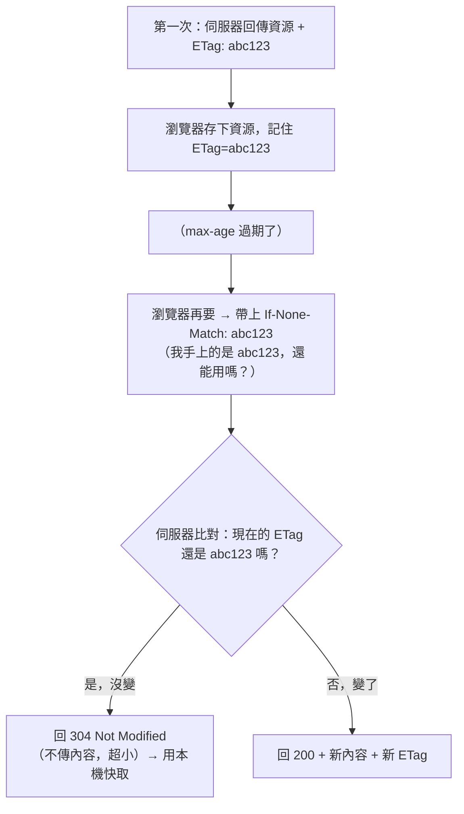

# [cache-3-3] 驗證式快取：ETag、Last-Modified、304

> **本章目標**：理解「協商快取」怎麼運作——當快取過期了，瀏覽器用 ETag / Last-Modified 問伺服器「還能用嗎」，沒變就回 304 省下重新下載。

## 你會學到

- 為什麼需要「驗證式（協商）快取」
- `ETag` 與 `If-None-Match`
- `Last-Modified` 與 `If-Modified-Since`
- `304 Not Modified` 怎麼省流量

## 概念說明

### 強快取過期之後呢？

cache-3-2 的 `max-age` 是「強快取」——在期限內直接用、不問伺服器。但**過期之後**呢？

最笨的做法是「過期了就重新下載整個檔案」。但這常常浪費——**也許檔案根本沒變**，重新下載一模一樣的內容很冤。

聰明的做法是**協商快取（驗證式快取）**：

> 快取過期後，瀏覽器**先問伺服器「我手上這份還能用嗎？」**。如果伺服器說「沒變」，瀏覽器就繼續用本機那份（只傳一個很小的「沒變」訊息，不用重傳整個檔案）。只有「真的變了」才下載新版。

這就省下了「重新下載沒變的檔案」的流量。怎麼「問」？靠 ETag 或 Last-Modified。

---

### ETag：內容的「指紋」

**ETag** 是伺服器給資源的一個「**版本指紋**」——通常是根據內容算出的一段字串。內容變了，ETag 就變。

運作流程：



步驟：

1. 第一次：伺服器回資源，附 `ETag: "abc123"`。
2. 瀏覽器存下，記住這個 ETag。
3. 快取過期後再要：瀏覽器在請求帶上 `If-None-Match: "abc123"`（意思是「我的版本是 abc123」）。
4. 伺服器比對：
   - **沒變**（還是 abc123）→ 回 **`304 Not Modified`**——**不傳內容**，只傳一個小小的「304」。瀏覽器就用本機那份。**省下整個檔案的流量！**
   - **變了** → 回 `200` + 新內容 + 新 ETag。

關鍵價值：**`304` 幾乎不傳資料**，所以「過期但沒變」的情況下，只花極小的代價就確認「能繼續用」，不用重傳整個檔案。

---

### Last-Modified：用「修改時間」驗證

**`Last-Modified`** 是另一種驗證方式，用「資源的最後修改時間」當依據（比 ETag 粗一點）：

1. 第一次：伺服器回 `Last-Modified: <某時間>`。
2. 瀏覽器記住這個時間。
3. 再要時：帶上 `If-Modified-Since: <那個時間>`（「我的版本是這個時間的，之後有改過嗎？」）。
4. 伺服器：
   - 那之後**沒改** → 回 `304`，用本機快取。
   - **改過** → 回 `200` + 新內容。

**ETag vs Last-Modified**：

| | ETag | Last-Modified |
|---|------|--------------|
| 依據 | 內容指紋（精確）| 修改時間（較粗）|
| 精確度 | 高（內容變才算變）| 較低（時間精度到秒；內容沒變但被「碰過」也可能誤判變了）|
| 常用度 | 較主流 | 較舊、較簡單 |

兩者可以並存，ETag 優先。一般你用框架/伺服器（Nginx）時，它們會自動處理這些，你主要要懂「**304 = 沒變、用快取、省流量**」這個機制。

---

### 強快取 vs 協商快取的配合

把 cache-3-2 和這章串起來（cache-3-4 會完整整合）：

```
請求資源：
  1. 本機有快取 + 還在 max-age 內（強快取）
     → 直接用，連請求都不發。最快。
  2. 本機有快取 + 過期了（協商快取，這章）
     → 帶 ETag 問伺服器
        → 304 沒變 → 用本機快取（省下載）
        → 200 變了 → 下載新版
  3. 本機沒快取
     → 直接下載
```

**強快取最快（不發請求），協商快取次之（發請求但可能省下載）。** 兩者配合，達成「盡量快、又不會拿到舊版」。

---

### 協商快取也有它的坑

協商快取雖好，但要注意：**它「每次過期後都會發一個請求」去驗證**（即使結果是 304）。如果資源其實「永遠不會變」（如帶 hash 的檔案），那連這個驗證請求都是多餘的——這時該用 cache-3-2 的 `immutable` + 超長 `max-age`，連問都不問。

所以：

- **會變的資源** → 短 max-age + 協商快取（ETag）：過期後問一下，沒變就省下載。
- **永不變的資源（hash 檔名）** → 超長 max-age + immutable：根本不問，最省（cache-3-5）。

## 程式碼範例

看一次完整的協商快取對話（HTTP 訊息）：

**第一次請求：**
```
GET /style.css
←
HTTP/1.1 200 OK
Cache-Control: max-age=60
ETag: "v1-abc"
（完整的 CSS 內容，假設 50KB）
```

**60 秒後，快取過期，再次請求：**
```
GET /style.css
If-None-Match: "v1-abc"          ← 瀏覽器：我的是 v1-abc
←
HTTP/1.1 304 Not Modified         ← 伺服器：沒變！（沒有內容，可能幾百 bytes）
```
→ 瀏覽器繼續用本機那份 50KB。**只花了一個小小的 304 來回，省下重傳 50KB。**

**如果 CSS 改過了：**
```
GET /style.css
If-None-Match: "v1-abc"
←
HTTP/1.1 200 OK
ETag: "v2-xyz"                     ← 新指紋
（新的 CSS 內容）
```
→ 下載新版。

## 小練習

### 練習 1：協商快取的價值

回答：「協商快取」相比「過期就重新下載整個檔案」，省下了什麼？關鍵的 `304` 代表什麼？

---

### 練習 2：ETag vs Last-Modified

用一句話說明兩者的差別（依據什麼判斷「變了沒」）。哪個比較精確？

---

### 練習 3：什麼時候不需要協商快取

回答：對「帶 hash 檔名、內容永不變」的資源，為什麼用 `immutable` + 超長 max-age 比「短 max-age + ETag 協商」更好？（提示：省下那個驗證請求）

## 課外讀物

> HTTP 狀態碼（含 304）的完整說明 → [課外讀物 E-3-3：HTTP 協定詳解](../../../課外讀物/E-3-network/E-3-3-http-protocol.md)
