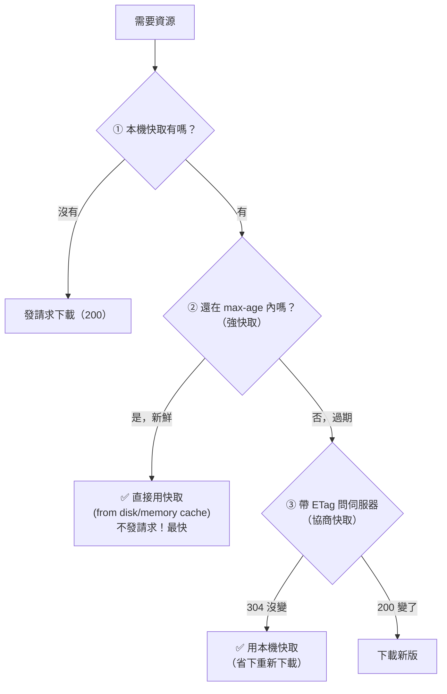

# [cache-3-4] 強快取 vs 協商快取：完整決策流程

> **本章目標**：把 cache-3-2（Cache-Control）和 cache-3-3（ETag/304）整合成一張完整的決策流程圖，徹底搞懂「瀏覽器拿到一個資源請求時，到底會不會、怎麼用快取」。

## 你會學到

- 強快取（strong cache）與協商快取（negotiated cache）的完整關係
- 瀏覽器決定「用快取 vs 重新下載」的完整流程
- 三種結果：直接用快取 / 304 用快取 / 200 下載新版
- 怎麼在開發者工具看出是哪一種

## 概念說明

### 把兩章整合起來

前兩章你學了：

- **cache-3-2 強快取**：`max-age` 內直接用快取，**不問伺服器**（最快）。
- **cache-3-3 協商快取**：過期後帶 ETag **問伺服器**，沒變回 304 用快取、變了下載。

這一章把它們拼成**一張完整的決策流程**——這是瀏覽器快取的全貌，搞懂這張圖，你就真正掌握了這一層。

---

### 完整決策流程圖

當瀏覽器需要一個資源：



順著走一遍：

1. **本機有快取嗎？** 沒有 → 直接下載（一般的 200）。
2. **有 → 還新鮮嗎（max-age 內）？**
   - **新鮮** → **直接用快取，連請求都不發**（強快取，最快）。開發者工具會顯示 `(from disk cache)` 或 `(from memory cache)`。
   - **過期** → 進入協商。
3. **過期 → 帶 ETag 問伺服器：**
   - **304 沒變** → 用本機快取（協商命中，省下重新下載整個檔案）。
   - **200 變了** → 下載新版。

---

### 三種結果，三種速度

這張圖最後會落到三種結果，速度差很多：

| 結果 | 發生什麼 | 速度 | 開發者工具顯示 |
|------|---------|------|--------------|
| **強快取命中** | 沒發任何請求，直接用本機 | ⚡ 最快 | `200 (from disk/memory cache)` |
| **協商快取命中** | 發了請求，但伺服器回 304，用本機 | 🚀 快（省下載，但有一次來回）| `304 Not Modified` |
| **未命中 / 變了** | 重新下載整個資源 | 🐢 最慢 | `200 OK`（有完整下載）|

理想狀態：**讓盡可能多的請求落在「強快取命中」**——因為它連網路請求都省了。這就是為什麼「永不變的資源用超長 max-age + immutable」這麼重要（cache-3-2、cache-3-5）。

---

### 一個常見的誤解

很多人以為「有設快取 = 不會發請求」。但看上面的圖你會發現——**協商快取還是會發請求**（去問 304），只是省下「重新下載內容」。

所以：

- 想要「**連請求都不發**」→ 要落在**強快取**（max-age 內）。
- 只設了 ETag 但 max-age 很短/沒設 → 每次都會發協商請求（雖然多半 304，省了下載，但還是有網路來回的延遲）。

對「永不變」的資源，這個協商請求是浪費——所以才要用 `immutable` + 超長 max-age 讓它停在強快取（cache-3-3 結尾講過）。

---

### 怎麼觀察

打開瀏覽器的**開發者工具 → Network（網路）分頁**，重新整理頁面，看每個資源的 Status 欄：

- `200`（Size 顯示實際大小）→ 真的下載了。
- `200 (from disk cache)` / `(from memory cache)` → 強快取命中，沒下載。
- `304` → 協商快取命中，沒下載內容（只有小小的來回）。

這是除錯快取問題的第一招——**看 Network 分頁，就知道資源是「真下載、強快取、還是 304」**。cache-3-5 那個「使用者看到舊版」的坑，就常靠這個來診斷。

## 程式碼範例

把整個流程對應到實際的標頭與行為：

```
情境 A：app.a1b2c3.js（設了 max-age=31536000, immutable）
  第一次：200，下載
  之後一年內：強快取命中 → (from disk cache)，完全不發請求 ⚡
  （因為內容變的話檔名就變成 app.新hash.js，所以這個檔名永遠不用更新）

情境 B：logo.png（設了 max-age=3600, ETag: "v1"）
  第一次：200，下載
  1 小時內：強快取命中，不發請求 ⚡
  1 小時後：協商 → If-None-Match: "v1"
     沒變 → 304，用快取 🚀
     換了新 logo → 200，下載新版

情境 C：index.html（設了 no-cache）
  每次：都協商（no-cache = 用前必驗證）
     沒變 → 304 🚀
     變了 → 200 下載新版
  → 確保使用者「總是」拿到最新的 index.html（cache-3-5 的關鍵）
```

三種設定、三種行為——你能依資源特性，精準控制它落在流程圖的哪個結果。

## 小練習

### 練習 1：走一遍流程

不看圖，描述「瀏覽器需要一個資源」時的決策流程（本機有沒有 → 新不新鮮 → 協商）。三種可能結果是什麼？

---

### 練習 2：破解誤解

回答：「有設快取就不會發請求」對嗎？強快取和協商快取，哪個會發請求？

---

### 練習 3：看開發者工具

如果你在 Network 分頁看到一個資源是 `200 (from disk cache)`，另一個是 `304`，第三個是 `200`（有完整大小）——它們分別代表什麼？哪個最快？

## 課外讀物

> HTTP 狀態碼與協定細節 → [課外讀物 E-3-3：HTTP 協定詳解](../../../課外讀物/E-3-network/E-3-3-http-protocol.md)
