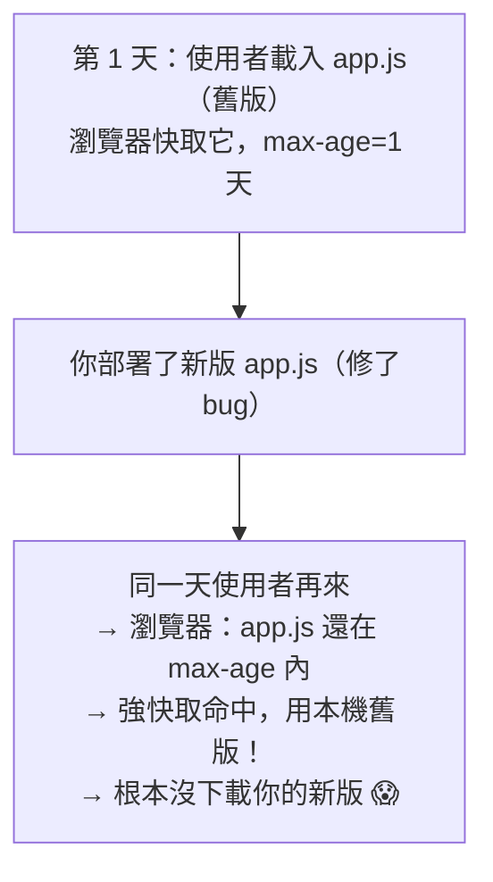
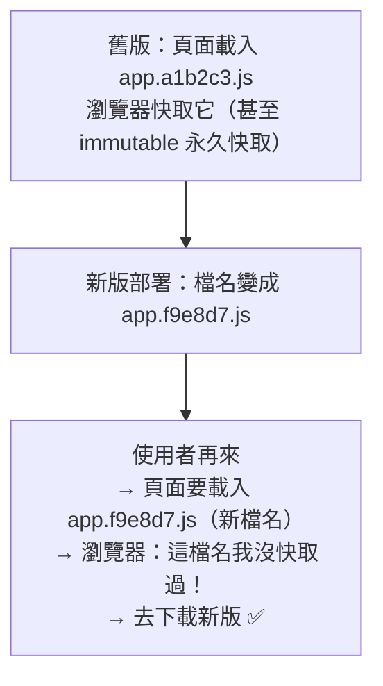

# [cache-3-5] 🕳️ 經典坑：前端更新後，使用者還拿到舊版

> **本章目標**：徹底搞懂並解決「我明明更新了前端，使用者卻還看到舊版」這個最常見、最讓人抓狂的快取坑。

## 你會學到

- 這個坑為什麼會發生（快取的副作用）
- 為什麼「叫使用者清快取」是爛解法
- 正解：cache busting + 檔名 hash
- 為什麼 `index.html` 要特別處理

## 概念說明

### 一個讓所有前端工程師抓狂的場景

```
你：修好了一個 bug，部署上線了！
使用者：我還是看到舊的、有 bug 的版本啊？
你：你清一下快取？
使用者：……（不會清，也不該叫他清）
```

這就是這章要解決的坑。它的根源你前面已經學過了——**瀏覽器快取（cache-3-1）**：使用者的瀏覽器把舊版的 JS/CSS 快取了，你雖然部署了新版，但他的瀏覽器「還在用本機快取的舊檔案」（強快取命中，cache-3-4），根本沒去下載你的新版。

---

### 為什麼會發生

假設你的網站載入 `app.js`，而你給它設了快取（cache-3-2 的 `max-age`）：



問題核心：**檔名沒變（還是 `app.js`），但內容變了**。瀏覽器只認檔名——它看到「`app.js` 我快取過、還沒過期」，就直接用舊的，不知道伺服器上的 `app.js` 內容已經換了。

---

### 爛解法 vs 好解法

**❌ 爛解法一：叫使用者清快取**

你不能要求每個使用者手動清快取——他們不會、不該、也不會照做。這不是解法。

**❌ 爛解法二：乾脆不快取（no-store）**

那每次都重新下載所有資源，網站變超慢、伺服器壓力大——失去快取的所有好處（cache-1-2 的取捨）。也不對。

**✅ 好解法：讓「內容變時，檔名也跟著變」**

核心洞察：

> 既然「瀏覽器只認檔名」是問題根源，那就**讓檔名跟著內容變**——內容一改，檔名就不同，瀏覽器看到「新檔名」自然會去下載（因為它從沒快取過這個新檔名）。

這個技巧叫 **cache busting（快取破壞）**，最常見的做法是**在檔名裡加「內容指紋（hash）」**。

---

### 正解：檔名加 hash（content hash）

現代前端打包工具（Vite、webpack 等）都會自動做這件事——**把檔案內容算成一段 hash，放進檔名**：

```
舊版打包出： app.a1b2c3.js
改了程式碼後打包： app.f9e8d7.js   ← 內容變了 → hash 變了 → 檔名變了！
```

於是：



妙處：

- **新檔名 → 瀏覽器一定會下載**（它沒快取過這個名字）→ 使用者拿到新版。
- **舊檔名的快取放著也無所謂**（沒人會再要 `app.a1b2c3.js` 了）→ 而且因為「這個檔名的內容永遠不變」，可以放心設 **`max-age` 超長 + `immutable`**（cache-3-2）→ 沒改的資源繼續享受永久強快取，超快。

**這就是「既要快取的好處、又不會拿到舊版」的完美解法**——cache busting 化解了 cache-1-2 的「速度 vs 新鮮度」矛盾。

---

### 關鍵問題：那「誰」告訴瀏覽器要載新檔名？

等等——如果 `app.js` 變成 `app.f9e8d7.js`，那是「誰」知道要去載這個新檔名？答案是 **`index.html`**：

```html
<!-- index.html 裡引用打包後的檔名 -->
<script src="/app.f9e8d7.js"></script>
```

打包工具會自動更新 `index.html` 裡的引用，指向新的 hash 檔名。所以——

> **`index.html` 是「指路牌」**：它告訴瀏覽器「現在要載哪些（帶 hash 的）檔案」。只要瀏覽器拿到「最新的 index.html」，它就會去載「最新的 hash 檔」。

問題來了——**那 `index.html` 自己會不會被快取成舊版？** 如果 index.html 被強快取了舊版，那它指的還是舊的 hash 檔，整套就破功了！這就是為什麼 index.html 要特別處理。

---

### 為什麼 index.html 要特別處理

把整個機制串起來，正確的快取設定是「**兩種資源、兩種策略**」：

| 資源 | 策略 | 為什麼 |
|------|------|--------|
| **帶 hash 的 JS/CSS**（`app.f9e8d7.js`）| `max-age` 超長 + `immutable`（永久強快取）| 內容變檔名就變，這個檔名的內容永不變，可永久快取 |
| **`index.html`（指路牌）** | `no-cache`（或很短 max-age）| 必須「總是拿到最新版」，才能指向最新的 hash 檔 |

運作邏輯：

```
使用者來訪：
  1. 載 index.html → 因為 no-cache，會去問伺服器拿「最新的」
     （沒變 → 304，省流量；變了 → 拿到新版指路牌）
  2. 新的 index.html 指向 app.f9e8d7.js（新 hash）
  3. 瀏覽器載 app.f9e8d7.js → 沒快取過 → 下載新版 ✅
  4. 那些沒改的檔案（hash 沒變）→ 永久強快取命中，超快 ⚡
```

**這就是現代前端部署的標準快取策略**——hash 檔永久快取、index.html 不快取。它同時做到：使用者一定拿到新版、沒改的資源依然飛快、伺服器壓力小。

好消息：**hash 檔名是打包工具自動做的**，你主要要做的是「**在伺服器/CDN 把這兩種資源的 Cache-Control 設對**」（cache-3-2 的 Nginx 範例就是）。

## 程式碼範例

完整的解法配置（Nginx，呼應 cache-3-2）：

```nginx
# 帶 hash 的靜態資源 → 永久強快取（內容變檔名就變，安全）
location ~* \.[0-9a-f]+\.(js|css)$ {
    add_header Cache-Control "max-age=31536000, immutable";
}

# index.html → 不強快取，每次驗證（確保拿到最新指路牌）
location = /index.html {
    add_header Cache-Control "no-cache";
}
```

打包工具（如 Vite）自動產生 hash 檔名 + 更新 index.html 引用：

```
# Vite build 後的 dist/ 目錄（示意）
dist/
├── index.html                  ← 引用下面的 hash 檔，本身設 no-cache
├── assets/
│   ├── app.f9e8d7.js           ← hash 檔，永久快取
│   └── style.a1b2c3.css        ← hash 檔，永久快取
```

你只要確保部署時 Cache-Control 設對，整個「使用者一定拿到新版」就自動成立。

## 小練習

### 練習 1：解釋坑的根源

用自己的話說明：為什麼「部署了新版，使用者還看到舊版」？根源是瀏覽器的什麼行為？（提示：只認檔名 + 強快取）

---

### 練習 2：為什麼 hash 檔名有效

回答：「在檔名加 content hash」為什麼能解決這個坑？為什麼這樣還能「放心地永久快取」hash 檔？

---

### 練習 3：index.html 的角色

回答：

1. 為什麼 `index.html` 不能設成永久快取（要 `no-cache`）？
2. 如果 index.html 被快取成舊版，整套 hash 機制為什麼會破功？

> 提示：這個坑在「CDN 也快取」時會更複雜（變成瀏覽器 + CDN 雙層），cache-4-4 會處理完整版。

## 課外讀物

> 想複習 Cache-Control 各指令（max-age / no-cache / immutable）→ 見本書 cache-3-2；前端打包工具的概念 → 參見 **basic 課程** Part 4-C（Vite / bundler）
