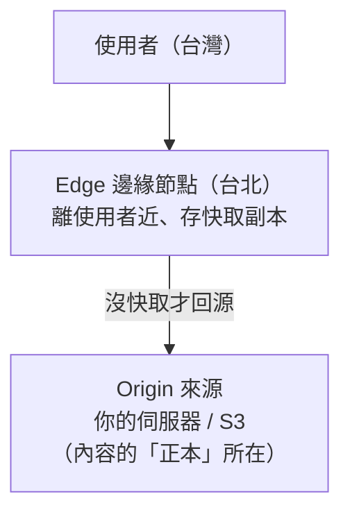
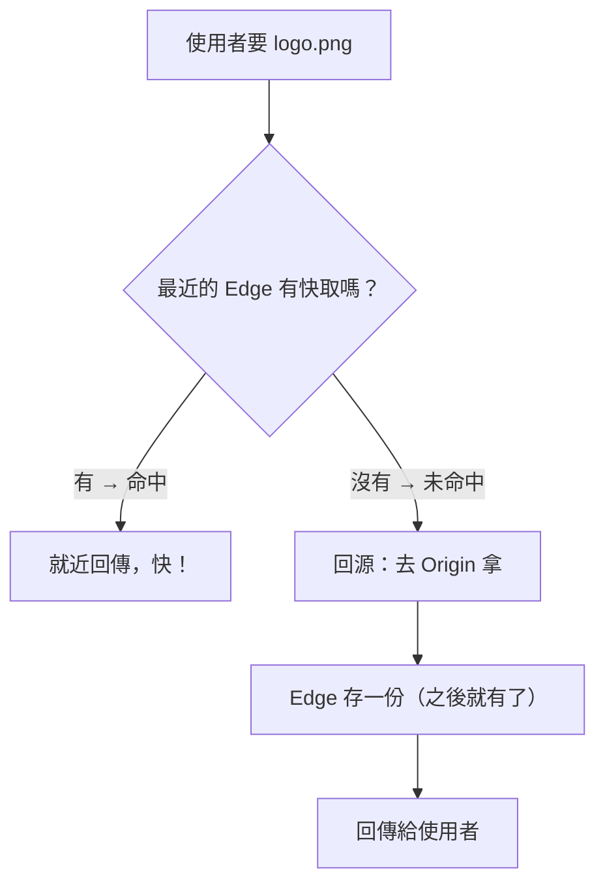

# [cache-4-1] CDN 快取怎麼運作：Edge 與回源

> **本章目標**：理解 CDN 這一層快取怎麼運作——把內容快取到離使用者近的 Edge 節點，沒命中才「回源」拿。

## 你會學到

- CDN 是什麼、為什麼能加速（複習 + 深入）
- Edge（邊緣節點）與 Origin（來源）
- 「回源（origin pull）」流程
- CDN 快取和瀏覽器快取的關係

## 概念說明

### 複習：CDN 為什麼快

你在課外讀物 E-11-5、aws Part 6-5 碰過 CDN。快速複習：

> **CDN（Content Delivery Network，內容傳遞網路）把你的內容快取到「全球各地、離使用者很近」的節點，讓使用者就近拿，不用大老遠連到你的伺服器。**

它是 cache-2-1 全景中**第二近使用者的一層**（僅次於瀏覽器快取）。當瀏覽器快取沒命中、請求出門時，CDN 是第一個攔截它的快取層。

用類比（呼應 aws Part 6-5）：你的伺服器是「總倉庫」，CDN 節點是「遍布各地的便利商店」——買常見的東西去最近的便利商店就好。

---

### 兩個核心角色：Edge 與 Origin

CDN 的世界有兩個關鍵角色：



- **Edge（邊緣節點）**：CDN 散布在全球的節點。它**快取內容的副本**，就近服務使用者。
- **Origin（來源）**：你的內容「正本」所在——你的伺服器、或 S3（aws Part 5）。Edge 沒有的東西，要回這裡拿。

---

### 回源（Origin Pull）流程

CDN 怎麼運作？又是熟悉的 Cache-Aside（cache-1-3），只是在地理尺度上：



1. 使用者要資源 → 連到**最近的 Edge**。
2. Edge **有快取**（cache hit）→ 就近回傳，快。
3. Edge **沒有**（cache miss）→ **回源（origin pull）**：Edge 去 Origin（你的伺服器/S3）拿，**順手在 Edge 存一份**。
4. 之後**同一區的其他使用者**要同樣資源 → Edge 就有了，直接命中。

關鍵價值：**第一個台灣使用者觸發回源後，後續所有台灣使用者都從台北 Edge 命中**——大量請求被擋在 Edge，不用回到你的伺服器。這大幅減輕 Origin 負擔（呼應 SRE 容量、cache-6-2 雪崩防護）。

---

### CDN 也聽 Cache-Control

關鍵：**CDN 要不要快取、快取多久，也是看你 Origin 回傳的 `Cache-Control`**（跟瀏覽器快取一樣，cache-3-2）！

```
你的 Origin 回傳 logo.png 時附上：
Cache-Control: public, max-age=86400

→ 瀏覽器：我快取 1 天
→ CDN Edge：我也快取 1 天（因為是 public，cache-3-2）
```

注意那個 **`public`**（cache-3-2）——它代表「中間的 CDN/代理也可以快取」。如果設 `private`，CDN 就不該快取（這對「個人化內容」很重要，cache-4-5 的坑）。

所以同一個 `Cache-Control`，**同時控制了瀏覽器快取和 CDN 快取兩層**——這也是為什麼這兩層會「一起」造成前端部署的坑（cache-4-4）。

---

### CDN 快取 + 瀏覽器快取 = 雙層

把這層接回 cache-2-1 全景，現在你有「離使用者最近的兩層快取」：

```
使用者
  ↓
① 瀏覽器快取（在使用者電腦，cache-3）── 命中就不出門
  ↓ 沒命中，請求出門
② CDN Edge 快取（離使用者近，這章）── 命中就不回源
  ↓ 沒命中，回源
③ 你的 Origin（伺服器 / S3）
```

這「雙層」是好事（層層擋掉請求），但也讓**失效變複雜**——你更新內容，要讓「瀏覽器」和「CDN」兩層都正確失效，否則使用者還是看到舊版。這就是 cache-4-4 要解決的「雙層快取部署問題」，比 cache-3-5 的單層版更棘手。

## 程式碼範例

看 CDN 快取的實際行為（以 AWS CloudFront 為例，概念示意）：

```
你的 Origin（S3）上有 logo.png，回傳標頭：
  Cache-Control: public, max-age=86400

第一個台灣使用者要 logo.png：
  → 連到台北 Edge → Edge 沒有 → 回源到 S3 拿 → Edge 存 1 天 → 回給使用者

接下來 1 天內，所有台灣使用者要 logo.png：
  → 台北 Edge 直接命中 → 就近回傳（快）→ 完全沒打擾 S3 ⚡

日本使用者要 logo.png：
  → 連到東京 Edge → 東京 Edge 沒有 → 回源拿 → 東京 Edge 也存一份
  （每個地區的 Edge 各自快取）
```

效果：你的 Origin（S3）只在「每個地區第一次、每天一次」被請求，其餘海量請求都被各地 Edge 擋掉了——這就是 CDN 的威力。

## 小練習

### 練習 1：Edge vs Origin

用「便利商店 vs 總倉庫」的類比，說明 Edge 和 Origin 的角色。「回源」是什麼意思？

---

### 練習 2：誰控制 CDN 快取

回答：CDN 要不要快取、快取多久，是看什麼決定的？這跟控制瀏覽器快取的東西一樣嗎？

---

### 練習 3：雙層的含義

回答：現在使用者和你的伺服器之間有「瀏覽器 + CDN」兩層快取。這對「擋請求」是好事，但對「更新內容」帶來什麼麻煩？（提示：cache-4-4）

## 課外讀物

> CDN 的概念入門 → [課外讀物 E-11-5：CDN 是什麼？](../../../課外讀物/E-11-performance/E-11-5-cdn.md)；雲端 CDN 的實作 → 參見 **aws 課程** Part 6-5 CloudFront
