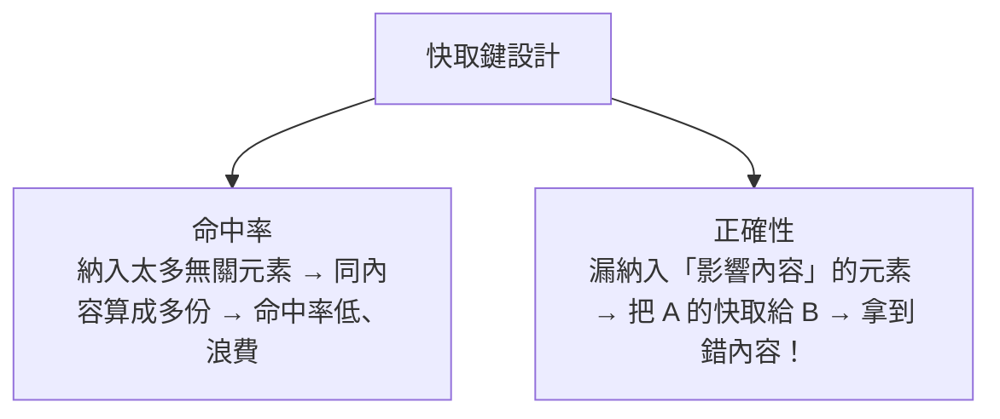

# [cache-4-2] CDN 的快取鍵與快取規則

> **本章目標**：理解 CDN 用「快取鍵（cache key）」決定「什麼算同一份內容」，以及這個機制怎麼影響命中率與正確性。

## 你會學到

- 快取鍵（cache key）是什麼
- 預設快取鍵包含什麼、不包含什麼
- 為什麼快取鍵設計會影響命中率
- 快取鍵設錯的後果（埋下 cache-4-5 的坑）

## 概念說明

### CDN 怎麼判斷「這兩個請求要同一份東西」？

CDN 快取一份內容後，下次有請求來，它要判斷「**這個請求要的，和我快取的，是同一份嗎？**」——是的話命中，回快取；不是的話 miss，回源。

這個「判斷是不是同一份」的依據，就是 **快取鍵（cache key）**：

> **快取鍵是 CDN 用來「識別一份快取內容」的標識。兩個請求如果算出「同一個快取鍵」，CDN 就認為它們要同一份東西。**

理解快取鍵，是理解「CDN 命中率」和「CDN 常見坑」的關鍵。

---

### 預設快取鍵包含什麼

CDN 預設通常用「**請求的網址路徑**」當快取鍵的主體：

```
GET /images/logo.png   → 快取鍵大致是 "/images/logo.png"
```

所以所有人要 `/images/logo.png`，都算同一個鍵 → 共用同一份快取 → 命中率高。這對「對所有人都一樣的靜態資源」很完美。

但「網址路徑」之外，還有些東西**可能**該納入快取鍵，也**可能**不該——這就是設計的學問。

---

### 該不該納入快取鍵：查詢參數的例子

考慮帶查詢參數的網址：

```
/product?id=123
/product?id=456
```

這兩個顯然是**不同內容**（不同商品），所以 `id` 參數**應該**納入快取鍵——否則 CDN 會把 id=123 的快取錯給 id=456 的請求（拿到錯的商品！）。

但另一些參數**不該**納入，例如追蹤用的：

```
/article?id=10&utm_source=facebook
/article?id=10&utm_source=google
```

這兩個是**同一篇文章**（`utm_source` 只是行銷追蹤，不影響內容）。如果把 `utm_source` 納入快取鍵，CDN 會把它們當成兩份不同內容、各自回源、各自快取——**命中率大降、浪費**。理想是「忽略 utm_source」，讓它們算同一個鍵、共用快取。

所以快取鍵設計的核心問題：

> **哪些東西「影響內容」要納入快取鍵（保證正確）、哪些「不影響內容」要排除（提高命中率）？**

---

### 快取鍵可以納入的東西

除了路徑和查詢參數，CDN 通常還能設定快取鍵要不要納入：

| 元素 | 範例 | 何時該納入 |
|------|------|-----------|
| **路徑** | `/logo.png` | 一定納入（基本）|
| **查詢參數** | `?id=123` | 影響內容的（id）納入；不影響的（utm）排除 |
| **某些標頭** | `Accept-Language` | 若依語言回不同內容（中/英版），就納入 |
| **Cookie** | | ⚠️ 通常**不該**納入（見下）|

`Vary` 標頭（cache-4-5 會深入）就是 Origin 告訴 CDN「這份內容會因為某個標頭而不同」，請把那個標頭納入快取鍵。

---

### 快取鍵設計影響兩件事

快取鍵設計直接決定兩個結果：



- **命中率**：納入太多「不影響內容」的元素（如 utm 參數、隨機參數）→ 同一份內容被切成很多份、各自快取 → 命中率低、CDN 形同虛設。
- **正確性**：漏掉「會影響內容」的元素 → CDN 把不同內容當成同一份 → **使用者拿到錯的內容**（這是 cache-4-5 的大坑，例如把某使用者的個人化內容快取給所有人）。

好的快取鍵設計，要在這兩者間取得平衡——**剛好納入「影響內容」的、排除「不影響」的**。

---

### 一個常見的命中率陷阱

新手常忽略：**很多 CDN 預設「把所有查詢參數納入快取鍵」**。如果你的網址常帶各種追蹤參數（utm、fbclid、時間戳…），那同一個頁面會因為參數不同被切成無數份，**CDN 命中率慘不忍睹**。

解法：設定 CDN「**只納入會影響內容的參數，忽略追蹤類參數**」。這能大幅提升命中率。這是 CDN 調優最常見的一招。

## 程式碼範例

快取鍵設計的決策（概念示意，CDN 設定）：

```
CDN 快取鍵設定：
  路徑：納入（基本）
  查詢參數：
    - id, page, sort  → 納入（影響內容）
    - utm_*, fbclid, _t → 忽略（不影響內容，只是追蹤）
  標頭：
    - Accept-Language → 納入（網站有多語言版本）
  Cookie：不納入

效果：
  /article?id=10&utm_source=fb   ┐
  /article?id=10&utm_source=ig   ┼→ 算同一個快取鍵 → 共用快取，命中率高 ✅
  /article?id=10                 ┘
  /article?id=11                 → 不同鍵（id 不同）→ 各自快取 ✅ 正確
```

這個設定同時顧到了「正確（id 區分）」和「高命中率（忽略 utm）」。

## 小練習

### 練習 1：快取鍵是什麼

用自己的話說明快取鍵的作用。CDN 怎麼用它判斷「命中還是 miss」？

---

### 練習 2：該不該納入

下面的查詢參數，該不該納入快取鍵？為什麼？

1. `?id=123`（商品 id）
2. `?utm_source=facebook`（行銷追蹤）
3. `?page=2`（分頁）
4. `?_timestamp=1699999`（每次都不同的時間戳）

---

### 練習 3：兩種後果

回答：

1. 快取鍵納入太多「無關」元素，會造成什麼問題？
2. 快取鍵漏掉「影響內容」的元素，會造成什麼更嚴重的問題？

## 課外讀物

> CDN 的整體運作 → [課外讀物 E-11-5：CDN 是什麼？](../../../課外讀物/E-11-performance/E-11-5-cdn.md)
