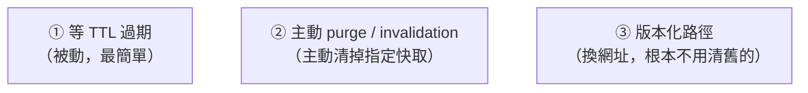

# [cache-4-3] CDN 快取失效：TTL、purge、版本化

> **本章目標**：學會三種讓 CDN 快取失效的方法——等 TTL 過期、主動 purge、用版本化路徑，知道各自的時機與取捨。

## 你會學到

- 為什麼 CDN 失效比瀏覽器失效「容易一點」
- 三種失效方式：TTL 過期、主動 purge/invalidation、版本化
- 各自的優缺點與適用場景
- 為什麼「版本化」是最推薦的做法

## 概念說明

### CDN 失效：比瀏覽器好處理一點

cache-3-1 說瀏覽器快取難失效，因為它在「使用者的電腦」上，你碰不到。**CDN 快取好一點**——因為 Edge 節點是「**你（透過 CDN 服務商）能控制的**」，你可以主動叫它「清掉某個快取」。

但即使如此，CDN 失效還是有學問。有三種方式，從被動到主動：



---

### 方式一：等 TTL 過期（被動）

最簡單——你設了 `max-age`（cache-3-2），CDN 快取到期就自動失效、下次回源拿新的。

- **優點**：零操作，自動。
- **缺點**：**有延遲**——你更新了內容，但 Edge 上的舊副本要等 TTL 到期才換。如果 TTL 設 1 天，使用者最多看到舊版 1 天。
- **適合**：「過時一下子沒差」的內容（cache-1-2 的取捨）。

這是 cache-1-2 的 TTL 在 CDN 層的應用。設短 TTL → 更新快但回源多；設長 TTL → 省回源但更新慢。

---

### 方式二：主動 purge / invalidation

當你「**現在就要**讓某個內容失效」（不想等 TTL），可以主動叫 CDN「**清除（purge / invalidate）**」指定的快取：

```
你更新了 logo.png，想立刻生效：
  → 呼叫 CDN 的 invalidation API：「清除 /images/logo.png 的快取」
  → CDN 把各 Edge 上的這份快取標記失效
  → 下次有人要 → Edge 回源拿新版
```

- **優點**：能「立即」失效指定內容，不用等 TTL。
- **缺點**：
  - **要花時間生效**（清除指令傳到全球各 Edge 需要時間，可能幾秒到幾分鐘）。
  - **常常要錢**：很多 CDN（如 CloudFront）的 invalidation 超過一定次數會**收費**——大量、頻繁的 purge 成本高。
  - **不適合高頻**：如果你需要「每次更新都 purge」，代表設計有問題（該用版本化）。

- **適合**：偶爾的、緊急的失效（例如「上線了一個錯誤內容，要立刻撤下」）。

---

### 方式三：版本化路徑（最推薦）

這是最優雅的方法——其實就是 cache-3-5 的「檔名加 hash」延伸到 CDN：

> **內容變了，就換一個「新網址」。舊網址的快取放著不管（反正沒人要了），新網址自然會回源拿新內容。根本不需要「清除」。**

```
舊版：/assets/app.a1b2c3.js  （CDN 永久快取它）
新版：/assets/app.f9e8d7.js  （新網址，CDN 沒快取過 → 回源拿新版）
```

- **優點**：
  - **不用 purge**（省錢、省事、無延遲問題）。
  - 可以對 hash 資源設**超長 TTL + immutable**（永久快取，超省回源）。
  - 新版「立即」對所有人生效（因為是新網址）。
- **缺點**：需要建置流程支援（打包工具自動產生 hash 檔名——但這本來就有，cache-3-5）。
- **適合**：**幾乎所有靜態資源**（JS/CSS/圖片）——這是業界主流做法。

核心理念（呼應 cache-3-5）：

> **「失效」最好的方法，是「根本不需要失效」——換個網址，讓舊的自然被淘汰。**

---

### 三種方式對照

| 方式 | 即時性 | 成本 | 適合 |
|------|-------|------|------|
| TTL 過期 | 慢（等到期）| 免費 | 過時沒差的內容 |
| purge/invalidation | 中（要時間生效）| 常要錢 | 偶爾、緊急的失效 |
| **版本化路徑** | **快（新網址立即生效）** | **免費（不用 purge）** | **靜態資源（主流）** |

**實務心法**：

- **靜態資源（JS/CSS/圖片）** → **版本化**（hash 檔名）+ 永久快取。最省、最快、最乾淨。
- **無法版本化的（如固定網址的 `index.html`、某些動態內容）** → 短 TTL + 必要時 purge。
- **少用 purge**：頻繁 purge 是「設計沒做好」的訊號——能版本化就版本化。

## 程式碼範例

三種方式的實際操作（概念示意）：

```
# 方式一：TTL（在 Origin 設 Cache-Control）
Cache-Control: public, max-age=3600
# → CDN 快取 1 小時後自動失效

# 方式二：主動 purge（呼叫 CDN API，以 CloudFront 為例）
aws cloudfront create-invalidation \
  --distribution-id ABC123 \
  --paths "/images/logo.png"
# → 清除指定路徑的快取（要時間生效、可能收費）

# 方式三：版本化（打包工具自動產生，最推薦）
# 舊：/assets/app.a1b2c3.js  → Cache-Control: max-age=31536000, immutable
# 新：/assets/app.f9e8d7.js  → 新網址，CDN 自動回源拿，無需任何失效操作
```

對比一下：方式三（版本化）部署新版時，**你什麼失效操作都不用做**——新檔名自然生效。這就是為什麼它是主流。

## 小練習

### 練習 1：三種失效

不看表，說出 CDN 三種失效方式，以及各自的即時性與成本。

---

### 練習 2：為什麼版本化最好

回答：為什麼「版本化路徑」比「主動 purge」更受推薦？（提示：成本、即時性、要不要操作）

---

### 練習 3：選方式

下面情況用哪種失效方式？

1. 你的 JS/CSS 打包檔（有 hash 機制）
2. 你不小心上線了一張錯誤的橫幅圖（固定網址），要立刻撤下
3. 一個「每小時更新、過時一下沒差」的排行榜資料

## 課外讀物

> 版本化失效的根源（檔名 hash）見本書 cache-3-5；CDN 整體概念 → [課外讀物 E-11-5：CDN 是什麼？](../../../課外讀物/E-11-performance/E-11-5-cdn.md)
