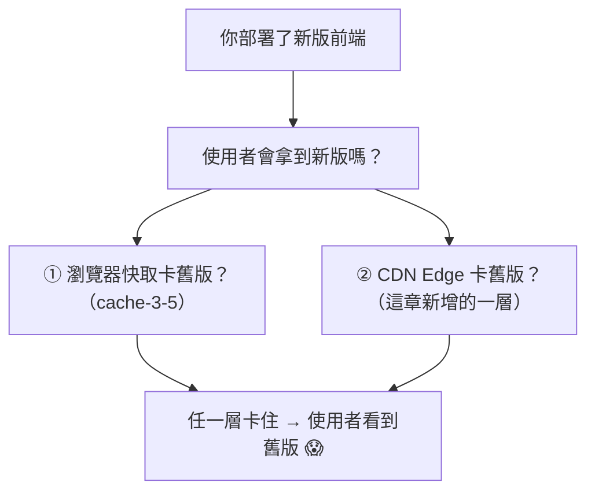

# [cache-4-4] 🕳️ 經典坑：瀏覽器 + CDN 雙層快取下的前端部署

> **本章目標**：解決 cache-3-5 的進階版——當「瀏覽器快取」和「CDN 快取」兩層疊在一起時，前端部署的完整正確解法。

## 你會學到

- 為什麼「雙層快取」讓前端部署更複雜
- 兩層各自會卡在哪
- 完整解法：hash 檔名 + index.html 短快取 + CDN 失效的組合
- 一份「部署後使用者一定拿到新版」的檢查清單

## 概念說明

### cache-3-5 的進階版

cache-3-5 解決了「瀏覽器快取」單層的前端部署坑。但真實線上通常還有 **CDN（cache-4-1）**——於是變成**瀏覽器 + CDN 雙層快取**。這讓問題更棘手，因為**兩層都可能卡著舊版**。



只要任何一層還快取著舊版，使用者就可能看到舊網站。所以兩層都要正確處理。

---

### 兩層各自怎麼解（複習 + 延伸）

好消息是，cache-3-5 的核心解法「**hash 檔名 + index.html 不強快取**」，搭配 cache-4-3 的 CDN 失效，就能同時搞定兩層。逐一看：

**帶 hash 的 JS/CSS（`app.f9e8d7.js`）**——兩層都好處理：

- 內容變 → 檔名變 → 新網址。
- **瀏覽器**：沒快取過新檔名 → 下載新版 ✅（cache-3-5）。
- **CDN**：沒快取過新檔名 → 回源拿新版 ✅（cache-4-3 的版本化）。
- 兩層都可以對 hash 檔設**永久快取 + immutable**（內容永不變，安全）。

→ **hash 檔名一招同時解決兩層**，這就是它這麼強的原因。

**`index.html`（指路牌）**——這是雙層下最需要小心的：

- 它必須「總是最新」（才能指向最新的 hash 檔，cache-3-5）。
- **瀏覽器層**：設 `no-cache`（用前必驗證，cache-3-2）。
- **CDN 層**：也要確保 CDN 不會卡著舊的 index.html——設短 TTL 或 `no-cache`，**部署時順手 purge index.html**（cache-4-3）。

→ index.html 兩層都要「不強快取 + 必要時主動失效」。

---

### 完整解法組合

把雙層的正確設定整理成一張表（這是現代前端部署的標準）：

| 資源 | 瀏覽器快取 | CDN 快取 | 部署時要做 |
|------|-----------|---------|-----------|
| **hash 檔**（`app.f9e8d7.js`）| `max-age=31536000, immutable` | 永久快取 | 什麼都不用（新檔名自動生效）|
| **`index.html`** | `no-cache` | 短 TTL 或 `no-cache` | **purge CDN 的 index.html**（保險）|

部署流程：

```
1. 打包（產生新 hash 檔名 + 更新 index.html 引用）
2. 上傳所有檔案到 Origin（S3 / 伺服器）
   → 新的 hash 檔是「新增」，舊的 hash 檔留著（給還沒更新的人用，不影響）
3. purge CDN 上的 index.html（確保 CDN 立刻拿到新的指路牌）
4. 完成——使用者下次來：
   - 拿到最新 index.html（因為 no-cache + 已 purge）
   - index.html 指向新 hash 檔 → 瀏覽器/CDN 都沒快取過 → 下載/回源新版
   - 沒改的 hash 檔 → 兩層都永久快取命中，超快
```

---

### 為什麼這個組合是「對的」

這個組合同時滿足了所有需求（化解 cache-1-2 的取捨）：

- ✅ **使用者一定拿到新版**：index.html 總是最新、指向新 hash 檔。
- ✅ **沒改的資源依然飛快**：hash 檔兩層永久快取。
- ✅ **不用大量 purge**：只需 purge 一個 index.html（cache-4-3 的版本化精神）。
- ✅ **不會「半新半舊」**：因為舊 hash 檔還在，正在用舊 index.html 的使用者不會「載到一半找不到檔案」。

最後這點很重要——**部署時「舊檔案要留著」**。如果你部署時把舊的 hash 檔刪掉，那「剛好在部署瞬間、還拿著舊 index.html」的使用者，會去要「已被刪除的舊 hash 檔」→ 壞掉。所以要「新增新檔、保留舊檔」，讓新舊版能短暫共存。

---

### 常見錯誤

| 錯誤 | 後果 |
|------|------|
| index.html 設了長 max-age | 使用者卡著舊指路牌，一直載舊 hash 檔 |
| 部署時刪掉舊 hash 檔 | 用著舊 index.html 的使用者載不到檔案、頁面壞掉 |
| 忘了 purge CDN 的 index.html | CDN 卡著舊 index.html，使用者拿到舊版 |
| 對 index.html 也用 hash 檔名 | 沒有「固定入口」，瀏覽器不知道要載哪個 |

把這些避開，你的前端部署就穩了。

## 程式碼範例

完整的雙層配置 + 部署腳本（概念示意）：

```nginx
# Origin（Nginx）的 Cache-Control 設定
location ~* \.[0-9a-f]+\.(js|css)$ {
    add_header Cache-Control "max-age=31536000, immutable";   # hash 檔永久
}
location = /index.html {
    add_header Cache-Control "no-cache";                       # 指路牌不強快取
}
```

```bash
# 部署腳本（概念）
# 1. 上傳新檔案（新增 hash 檔，保留舊的）
aws s3 sync ./dist s3://my-site/ --cache-control ...
# 2. purge CDN 的 index.html（確保 CDN 拿最新指路牌）
aws cloudfront create-invalidation --distribution-id ABC --paths "/index.html"
# （hash 檔不用 purge——新檔名自動生效）
```

注意第 2 步只 purge `/index.html` 一個檔——這就是 cache-4-3「少用 purge、靠版本化」的實踐：hash 檔靠版本化自動生效，只有固定網址的 index.html 需要主動失效。

## 小練習

### 練習 1：雙層的難處

回答：為什麼「瀏覽器 + CDN 雙層快取」比單層（只有瀏覽器）的前端部署更難？

---

### 練習 2：為什麼 hash 檔一招解兩層

回答：「帶 hash 的檔名」為什麼能同時解決瀏覽器層和 CDN 層的問題？

---

### 練習 3：為什麼不能刪舊檔

回答：部署時如果「刪掉舊的 hash 檔」，對「剛好在部署瞬間拿著舊 index.html」的使用者會發生什麼？正確做法是什麼？

## 課外讀物

> 單層（瀏覽器）版的解法 → 見本書 cache-3-5；CDN 失效方式 → 見本書 cache-4-3
