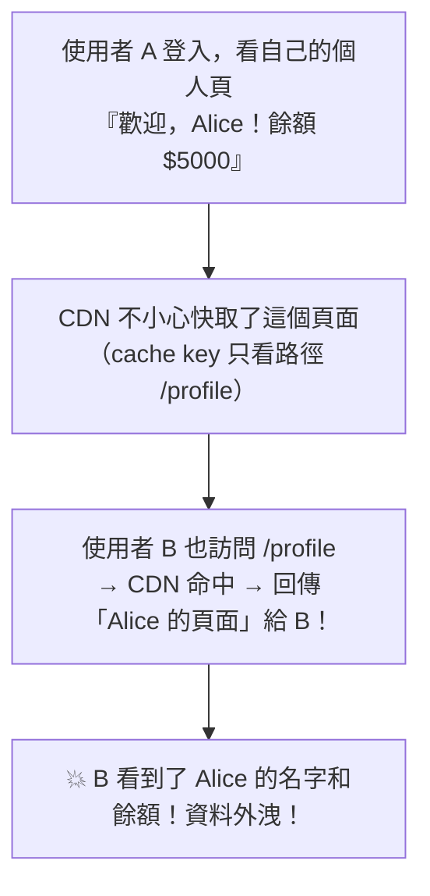

# [cache-4-5] 🕳️ 經典坑：快取了不該快取的東西

> **本章目標**：認識 CDN 快取最危險的坑——把「個人化內容、私密資料、API 回應」錯誤地快取並共享給所有人，以及怎麼用 private、Vary 避免。

## 你會學到

- 為什麼「快取錯東西」比「沒快取」嚴重得多
- 個人化內容被共享快取的災難
- `Cache-Control: private` 怎麼防
- `Vary` 標頭：依不同條件回不同快取

## 概念說明

### 最危險的快取坑：洩漏別人的資料

cache-4-4 的坑（看到舊版）很煩，但這章的坑**更危險**——因為它會**洩漏使用者的私密資料**。

想像這個災難：



問題核心：**CDN 是「共享」快取（cache-4-1 的 Edge 服務所有人）**。如果它快取了「某個使用者專屬」的內容，就會把這份內容**錯給其他使用者**——這不只是「看到舊版」，而是**隱私外洩、安全事故**。

---

### 為什麼會發生

回到 cache-4-2 的快取鍵——如果 CDN 的快取鍵**只看網址路徑**（`/profile`），那它會認為「所有人要 `/profile` 都是同一份」→ 把 Alice 的快取給所有人。

但 `/profile` 對每個人**內容不同**（各看各的）！這就是漏掉了「影響內容的因素」（cache-4-2 的正確性問題）——這裡影響內容的是「**登入的是誰**」，但快取鍵沒考慮它。

根本原因：**「個人化／私密內容」本來就不該被「共享快取（CDN）」快取。** 它頂多只能被「使用者自己的瀏覽器」快取（那是私人的，不會給別人）。

---

### 防法一：Cache-Control: private（最重要）

cache-3-2 學過的 `private` 就是為此而生：

```
Cache-Control: private, no-cache
```

- **`private`**：「**只有使用者自己的瀏覽器**可以快取，中間的 CDN/代理**不准**快取」（cache-3-2）。
- 加上 `no-cache`：瀏覽器存了也要每次驗證（確保最新）。

所以——**所有「個人化、私密」的回應，一定要設 `private`**（甚至 `no-store` 完全不快取，看敏感程度）。這樣 CDN 就不會碰它，不會發生「Alice 的頁面給了 Bob」。

**判斷原則（呼應 cache-3-2）**：

> **這個回應對每個人都一樣嗎？**
> - 是（公開內容、logo、公開文章）→ `public`，可以給 CDN 快取。
> - 否（個人頁、購物車、含登入狀態的內容）→ **`private`**（或 `no-store`），CDN 不准碰。

---

### 防法二：Vary 標頭

有時內容「不是完全個人化，但會依某個條件不同」——例如同一個網址，依「語言」回中文或英文版。這時用 **`Vary`** 告訴快取「這份內容會因為某個標頭而不同」：

```
Vary: Accept-Language
```

意思是「這個資源的內容**會隨 `Accept-Language` 標頭變化**，請快取時把這個標頭納入快取鍵」（cache-4-2）。於是 CDN 會：

- 對「要中文（`Accept-Language: zh`）」的人 → 快取/回傳中文版。
- 對「要英文」的人 → 另一份英文版。

不會把中文版錯給要英文的人。

⚠️ 但 `Vary` 要小心用——**`Vary` 的東西越多、變化越多，等於把內容切成越多份，命中率越低**（cache-4-2 的取捨）。最惡名昭彰的是 `Vary: Cookie`——因為每個人 Cookie 都不同，等於「每個人一份」，CDN 命中率歸零、形同沒快取。所以**通常不該 `Vary: Cookie`**，個人化內容直接用 `private` 才對。

---

### 特別注意：API 回應與 Set-Cookie

兩個容易踩的具體情況：

**① API 回應**：很多 API 回的是「使用者專屬」或「即時」資料。這些通常該設 `no-store` 或 `private`——別讓 CDN 快取 API 回應，否則拿到別人的或過時的資料。

**② 帶 `Set-Cookie` 的回應**：如果一個回應帶了 `Set-Cookie`（例如設定 session），它**絕對不能被共享快取**——否則 CDN 會把「Alice 的 session cookie」快取後發給 Bob，Bob 就變成 Alice 了！這是嚴重的安全漏洞。好的 CDN 預設會避免快取帶 Set-Cookie 的回應，但你也要確保這類回應設了 `private` / `no-store`。

---

### 快取「該公開 vs 該私密」對照

| 內容 | 設定 | CDN 能快取嗎 |
|------|------|:---:|
| logo、公開圖片、公開文章 | `public, max-age=...` | ✅ 可以（共享）|
| 多語言頁面（依語言不同）| `public` + `Vary: Accept-Language` | ✅ 但依語言分版 |
| 個人頁、購物車、登入後內容 | **`private`** | ❌ 只有自己瀏覽器 |
| 含 `Set-Cookie`、session | **`private` / `no-store`** | ❌ 絕對不行 |
| 敏感 API（餘額、個資）| **`no-store`** | ❌ 完全不快取 |

把這張表記牢，就能避開「快取錯東西」這個最危險的坑。

## 程式碼範例

正確區分公開與私密（Nginx 概念示意）：

```nginx
# 公開靜態資源 → 可給 CDN 共享快取
location /static/ {
    add_header Cache-Control "public, max-age=86400";
}

# 個人化頁面 / 登入後內容 → 只給自己瀏覽器，CDN 不准碰
location /profile {
    add_header Cache-Control "private, no-cache";
}

# 敏感 API → 完全不快取
location /api/account/ {
    add_header Cache-Control "no-store";
}
```

對比 cache-4-4 的坑（看到舊版，惱人但無害）和這章的坑（洩漏別人資料，安全事故）——後者嚴重得多，務必小心區分 `public` 和 `private`。

## 小練習

### 練習 1：為什麼這坑更危險

回答：「快取了個人化內容並共享給別人」為什麼比「使用者看到舊版」嚴重得多？會造成什麼後果？

---

### 練習 2：private 的作用

回答：`Cache-Control: private` 怎麼防止「Alice 的個人頁被 CDN 快取後給了 Bob」？哪些內容一定要設 private？

---

### 練習 3：判斷設定

為下面的回應各選設定（`public` / `private` / `no-store`）：

1. 網站的公開 logo
2. 使用者登入後的「我的訂單」頁
3. 一個帶 `Set-Cookie`（設定 session）的登入回應
4. 回傳「使用者信用卡末四碼」的 API

## 課外讀物

> Cache-Control 的 private/public 細節 → 見本書 cache-3-2；快取相關的安全議題 → [課外讀物 E-10-1：Web 安全總覽](../../../課外讀物/E-10-security/E-10-1-web-security-overview.md)
