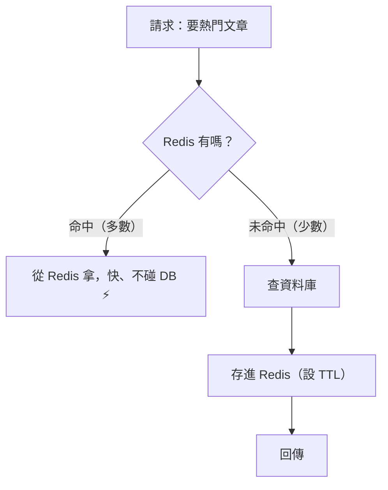

# [cache-5-1] 為什麼需要應用層快取

> **本章目標**：理解應用層快取（Redis）解決的核心問題——擋掉重複的資料庫查詢、加速回應，這是後端效能優化最常用的一招。

## 你會學到

- 應用層快取解決什麼問題（複習 cache-2-4）
- 它怎麼「擋掉」資料庫查詢
- 什麼操作值得快取
- 加上快取前後的效能對比

## 概念說明

### 問題：資料庫是常見的瓶頸

cache-2-4 介紹過應用層快取的「形態」（行程內 vs 分散式 Redis）。這個 Part 深入「怎麼用好它」，先從「為什麼需要」說起。

後端最常見的效能瓶頸是**資料庫**（SRE Part 7-2 的負載測試常證實這點）。為什麼？

- 資料庫查詢相對慢（要解析 SQL、查索引、可能讀硬碟）。
- 大量使用者 → 大量查詢 → 資料庫被打爆（SRE Part 7 的容量問題）。
- 很多查詢是**重複的**——例如 1000 個人同時看同一篇熱門文章，就查了 1000 次同樣的東西。

「重複查同樣的東西」正是快取的完美場景（cache-1-2）——**查一次、快取起來、後續都從快取拿**。

---

### 應用層快取怎麼擋掉資料庫查詢

用 Cache-Aside（cache-1-3）+ Redis（cache-2-4）：



效果：1000 個看熱門文章的請求，**只有第 1 個查資料庫**（順手存 Redis），後續 999 個都從 Redis 命中——**資料庫負擔從 1000 次降到 1 次**。這就是應用層快取的威力：

> **把大量「重複的資料庫查詢」擋在 Redis 這層，讓資料庫只處理「真正需要的、不重複的」查詢。**

這同時達成兩件事：**使用者更快**（從記憶體拿）+ **資料庫減壓**（少了大量重複查詢，呼應 SRE 容量、cache-6-2 雪崩防護）。

---

### 什麼值得快取

回到 cache-1-2 的判斷（值得快取的三條件），在應用層具體化：

| 值得快取 ✅ | 不值得 / 要小心 ❌ |
|-----------|------------------|
| 熱門文章、商品詳情（很多人重複看）| 很少被重複讀的資料（命中率低）|
| 複雜的查詢/運算結果（算一次很貴）| 必須即時準確的（餘額、即時庫存）|
| 排行榜、熱門列表 | 變動超頻繁的（一直要失效）|
| 設定、字典資料（很少變）| |

特別值得快取的兩類：

1. **「讀多、且重複」的資料**：命中率高，效益大。
2. **「算起來很貴」的結果**：例如一個要 join 五張表、跑 2 秒的複雜查詢——快取它，後續都省下那 2 秒。

---

### 不只快取「資料庫查詢」

應用層快取能快取的，不只是 DB 查詢結果，還包括：

- **複雜運算的結果**：例如「計算某使用者的推薦清單」很耗 CPU，算一次快取起來。
- **外部 API 的回應**：呼叫第三方 API 慢又可能要錢，快取它的結果（在合理時間內）。
- **組裝好的頁面片段**：把渲染好的內容快取，省去重複組裝。

核心精神都一樣（cache-1-1）：**任何「拿起來慢、又會重複要」的東西，都可以考慮快取。**

---

### 效能對比

```
情境：熱門商品頁，每秒 500 個請求，查詢要 50ms

沒有應用層快取：
  每個請求都查 DB → DB 每秒扛 500 次查詢
  → DB 壓力大、可能成為瓶頸、回應變慢

加上 Redis（TTL 60 秒）：
  每 60 秒只有「第一個」請求查 DB，其餘從 Redis 拿（~1ms）
  → DB 每 60 秒才被查 1 次（負擔幾乎歸零）
  → 使用者回應從 50ms 降到 ~1ms
  → 代價：商品資料最多過時 60 秒（cache-1-2 的取捨，可接受）
```

這就是為什麼「在資料庫前加一層 Redis」是後端效能優化最常見、最有效的招數之一。

## 程式碼範例

應用層快取一個「熱門文章」（Cache-Aside + Redis，呼應 cache-2-4）：

```
function 取得熱門文章():
    // 先問 Redis
    快取 = redis.取("hot_articles")
    如果 快取 存在:
        return 快取                          // 命中，~1ms，不碰 DB

    // 未命中 → 查資料庫（假設是個複雜、慢的查詢）
    文章 = 資料庫.複雜查詢_找出熱門文章()      // 慢，~50ms

    // 存進 Redis，TTL 60 秒
    redis.設("hot_articles", 文章, TTL=60秒)

    return 文章
```

跑起來：第一個請求慢（查 DB），接下來 60 秒所有請求都從 Redis 飛快回應、完全不碰 DB。60 秒後過期，再重新查一次。

## 小練習

### 練習 1：擋掉重複查詢

回答：1000 個人同時看同一篇熱門文章，「有 Redis」和「沒 Redis」分別查資料庫幾次？這對資料庫有什麼差別？

---

### 練習 2：什麼值得快取

下面的東西該不該用應用層快取？為什麼？

1. 首頁的熱門商品列表
2. 使用者的即時帳戶餘額
3. 一個要 join 多張表、算 2 秒的報表結果
4. 每個請求都不同的隨機推薦

---

### 練習 3：不只 DB 查詢

回答：除了「資料庫查詢結果」，應用層快取還能快取哪些東西？它們的共同特徵是什麼？

## 課外讀物

> Redis 與快取策略的概念 → [課外讀物 E-11-3：Redis 與快取策略](../../../課外讀物/E-11-performance/E-11-3-redis-cache.md)；容量與效能 → 參見 **sre 課程** Part 7
