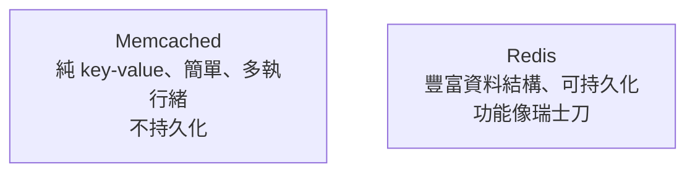

# [cache-5-2] Redis vs Memcached：怎麼選

> **本章目標**：認識兩個最主流的分散式快取——Redis 與 Memcached，知道它們的差別與如何選擇。

## 你會學到

- Redis 與 Memcached 是什麼
- 兩者的核心差別（資料結構、持久化、功能）
- 為什麼 Redis 現在更主流
- 怎麼依需求選擇

## 概念說明

### 兩個主流選擇

cache-2-4 說分散式快取最常見的是 Redis。其實有兩個老牌選擇：**Redis** 和 **Memcached**。它們都是「放在記憶體、超快、給多台應用共享」的快取服務（cache-2-4 的分散式快取），但設計哲學不同。

---

### Memcached：簡單、純粹

**Memcached** 的設計哲學是「**簡單就是美**」——它就是一個超快的「**key-value 記憶體儲存**」：你給它一個 key 和一個 value（字串/位元組），它幫你存、幫你取。沒了。

- **優點**：極簡、極快、多執行緒（能吃滿多核 CPU）。
- **限制**：
  - value 只能是「簡單的字串/位元組」——沒有複雜資料結構。
  - **不持久化**——重啟資料全失（純快取）。
  - 功能少。

適合：「**就是要一個單純、超快的 key-value 快取**」、不需要花俏功能的場景。

---

### Redis：功能豐富的瑞士刀

**Redis** 雖然也是記憶體 key-value，但它**功能強大太多**——它不只存「字串」，還支援豐富的**資料結構**：

| Redis 資料結構 | 能做什麼 |
|--------------|---------|
| String（字串）| 基本的快取值、計數器 |
| Hash（雜湊）| 存物件（如使用者的多個欄位）|
| List（列表）| 佇列、最新消息列表 |
| Set（集合）| 去重、標籤、共同好友 |
| Sorted Set（有序集合）| **排行榜**（按分數排序）|
| 還有更多… | 地理位置、bitmap、stream… |

這讓 Redis 不只是「快取」，還能當：

- **排行榜**（Sorted Set，cache-2-4 提過）。
- **計數器 / 限流器**（SRE Part 8-2 的 rate limiting 常用 Redis）。
- **session 儲存**、**訊息佇列**、**分散式鎖**等。

而且 Redis 可以**選擇持久化**（把資料存到硬碟，重啟能恢復）——雖然當快取用時通常不需要，但它有這個能力。

- **優點**：功能豐富、資料結構多、可持久化、生態龐大。
- **代價**：比 Memcached 稍複雜一點點。

---

### 對照



| | Memcached | Redis |
|---|-----------|-------|
| 資料結構 | 只有簡單字串 | 豐富（String/Hash/List/Set/ZSet…）|
| 持久化 | ❌ 不行 | ✅ 可選 |
| 功能 | 純快取 | 快取 + 排行榜 + 限流 + 鎖 + 佇列… |
| 複雜度 | 極簡 | 稍多但仍簡單 |
| 多執行緒 | ✅ | 主要單執行緒（但夠快）|

---

### 怎麼選

**實務上，Redis 是現在的主流選擇**，因為：

- 它能做 Memcached 能做的一切（純 key-value 快取），**還多了一堆功能**。
- 「先用 Redis，需要進階功能時直接有」比「用 Memcached、之後發現不夠用要換」省事。
- 雲端都有託管的 Redis（aws ElastiCache，aws Part 6-3），維運方便。

什麼時候考慮 Memcached？

- 你「**真的只要**單純的 key-value 快取」、且追求極致的多核心吞吐量、value 很大量很簡單。
- 但這種純粹場景越來越少——**多數情況直接選 Redis**。

簡單結論：

> **不確定就用 Redis。** 它是功能更全、生態更大的選擇，也是業界預設。

## 程式碼範例

兩者基本用法對比（概念示意）：

**Memcached（純 key-value）：**
```
memcached.set("user:123", "Alice", expire=300)
value = memcached.get("user:123")    // "Alice"
// 就這樣，沒有複雜結構
```

**Redis（豐富結構）：**
```
// 一樣能做基本 key-value
redis.set("user:123", "Alice", EX=300)

// 但還能做更多——例如排行榜（Sorted Set）
redis.zadd("leaderboard", {Alice: 100, Bob: 85})
redis.zrevrange("leaderboard", 0, 9)   // 取前 10 名！

// 計數器（限流用，SRE Part 8-2）
redis.incr("api_calls:user123")

// 存物件（Hash）
redis.hset("user:123", {name: "Alice", age: 30})
```

看出 Redis 的多功能了嗎？同一個快取服務，能順便當排行榜、限流器、計數器——這是它比 Memcached 受歡迎的原因。

## 小練習

### 練習 1：核心差別

用自己的話說明 Redis 和 Memcached 最大的差別（資料結構、功能）。

---

### 練習 2：選哪個

下面情況選 Redis 還是 Memcached？

1. 想做一個「遊戲排行榜」
2. 只要一個超單純的 key-value 快取
3. 不確定未來需求，想保留彈性

---

### 練習 3：Redis 不只是快取

回答：除了當快取，Redis 還能當哪些東西？（至少兩個，提示：排行榜、限流、session…）

## 課外讀物

> Redis 與快取策略 → [課外讀物 E-11-3：Redis 與快取策略](../../../課外讀物/E-11-performance/E-11-3-redis-cache.md)；雲端託管 Redis → 參見 **aws 課程** Part 6-3 ElastiCache
