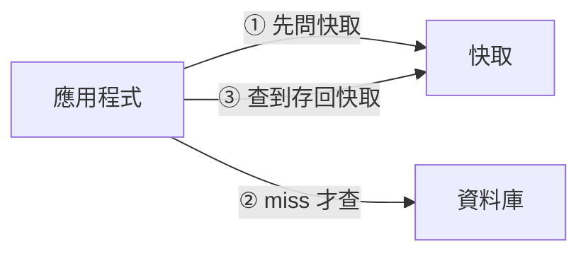
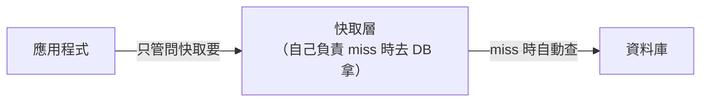
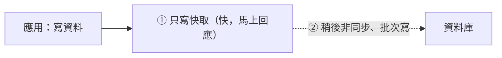
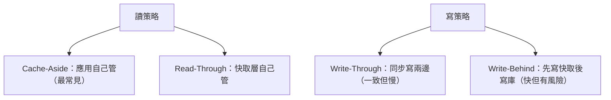

# [cache-5-3] 四大快取策略：Cache-Aside / Read-Through / Write-Through / Write-Behind

> **本章目標**：搞懂應用層快取的四種經典策略，知道「讀」和「寫」各有不同的快取模式，以及它們的取捨。

## 你會學到

- 為什麼快取策略分「讀」和「寫」兩類
- 讀策略：Cache-Aside vs Read-Through
- 寫策略：Write-Through vs Write-Behind
- 各自的優缺點與適用場景

## 概念說明

### 快取策略：讀與寫

前面一直用的 Cache-Aside（cache-1-3）是「讀」的策略。但「**寫資料時，快取怎麼辦**」也是個問題——資料更新了，快取裡的舊副本怎麼處理？

所以快取策略分兩類：

- **讀策略**：要資料時，快取和資料庫怎麼配合。（Cache-Aside、Read-Through）
- **寫策略**：寫資料時，快取和資料庫怎麼配合。（Write-Through、Write-Behind）

理解這四種，你就能依場景選對策略。

---

### 讀策略一：Cache-Aside（旁路快取）

你已經很熟了（cache-1-3）——**應用程式自己管快取**：



- **應用負責**：先問快取 → miss 就查 DB → 把結果存回快取。
- **特點**：快取「旁路」於主流程，應用自己控制。最常見、最靈活。
- **缺點**：快取邏輯散在應用程式碼裡（每個查詢都要寫一遍）。

---

### 讀策略二：Read-Through（讀穿透）

把「管快取」這件事，從應用**移到快取層自己**：



- **快取層負責**：應用只管「跟快取要資料」，**快取自己**在 miss 時去資料庫拿、存起來、回給應用。
- **特點**：應用程式碼乾淨（不用每次寫 cache-aside 邏輯），快取邏輯集中。
- **代價**：需要快取層支援這種模式（通常透過函式庫/框架封裝）。

**Cache-Aside vs Read-Through 的差別**：本質一樣（都是 miss 才查 DB），差在「**誰負責那段邏輯**」——Cache-Aside 是應用負責，Read-Through 是快取層負責。實務上 Cache-Aside 更常見（更直接），Read-Through 常是用框架封裝出來的。

---

### 寫策略一：Write-Through（寫穿透）

寫資料時，**同時寫快取和資料庫**（一起更新）：


- **做法**：寫的時候，快取和資料庫**同步**一起更新。
- **優點**：**快取永遠和資料庫一致**（剛寫完快取就是最新的）→ 之後讀一定命中且正確。
- **缺點**：**寫變慢**——每次寫都要等「快取 + 資料庫」兩個都完成。

適合：「**寫完馬上會被讀、且要求一致**」的資料。

---

### 寫策略二：Write-Behind（寫回 / Write-Back）

寫資料時，**先只寫快取（快），之後再非同步批次寫資料庫**：



- **做法**：寫只到快取就「算完成」（超快），快取「稍後」再非同步地、批次地把資料寫進資料庫。
- **優點**：**寫超快**（不用等資料庫）、能合併大量寫入（批次，減輕 DB）。
- **缺點**：**有資料遺失風險**——如果快取在「還沒寫進資料庫」前就掛了，那些資料就沒了（呼應 cache-2-4「快取是可丟的」、SRE Part 8 為失敗而設計）。一致性也較弱。

適合：「**寫入量極大、能容忍極小機率遺失**」的場景（如計數、日誌、點擊統計）。一般業務資料要小心用。

---

### 四種策略對照



| 策略 | 類型 | 特點 | 適合 |
|------|------|------|------|
| **Cache-Aside** | 讀 | 應用管、最靈活 | 大多數情況（預設）|
| **Read-Through** | 讀 | 快取層管、程式碼乾淨 | 用框架封裝時 |
| **Write-Through** | 寫 | 一致但寫慢 | 寫完馬上讀、要一致 |
| **Write-Behind** | 寫 | 寫快但有遺失風險 | 海量寫入、可容忍遺失 |

**實務最常見的組合**：**Cache-Aside（讀）+ 寫時「刪除快取」**——也就是「寫資料庫時，順手把快取刪掉，讓下次讀時重新載入」。這個「刪除而非更新」的做法為什麼是主流，cache-6-5 會深入。

## 程式碼範例

對比寫策略（pseudo code）：

**Write-Through（同步寫兩邊，一致）：**
```
function 更新商品(id, 資料):
    redis.set("product:" + id, 資料)      // ① 寫快取
    資料庫.更新(id, 資料)                  // ② 同步寫資料庫
    // 兩個都完成才回應 → 慢，但快取永遠正確
```

**Write-Behind（先寫快取，後非同步寫庫，快）：**
```
function 記錄點擊(id):
    redis.incr("clicks:" + id)            // 只寫快取，馬上回應（快）
    // 背景任務每隔 10 秒，把快取的計數批次寫進資料庫
    // → 寫超快、能合併；但快取掛了可能丟掉幾秒的點擊
```

**最常見：Cache-Aside 讀 + 寫時刪快取（cache-6-5）：**
```
function 更新商品(id, 資料):
    資料庫.更新(id, 資料)                  // 寫資料庫
    redis.del("product:" + id)            // 刪掉快取（不是更新它）
    // 下次讀 → miss → 重新從 DB 載入最新的（Cache-Aside）
```

## 小練習

### 練習 1：讀 vs 寫策略

回答：為什麼快取策略要分「讀」和「寫」兩類？各舉一個讀策略和一個寫策略。

---

### 練習 2：Write-Through vs Write-Behind

回答：

1. 這兩個寫策略，哪個「寫得快」、哪個「保證一致」？
2. Write-Behind 的「資料遺失風險」是怎麼來的？

---

### 練習 3：選策略

下面情況選什麼策略？

1. 一般的商品資料讀取（最常見的需求）
2. 記錄「文章被點擊幾次」（海量、丟一點沒差）
3. 銀行轉帳後的餘額（寫完馬上要讀、絕不能錯）

## 課外讀物

> 「寫時刪快取」與雙寫一致性的深入 → 見本書 cache-6-5；快取策略概念 → [課外讀物 E-11-3：Redis 與快取策略](../../../課外讀物/E-11-performance/E-11-3-redis-cache.md)
